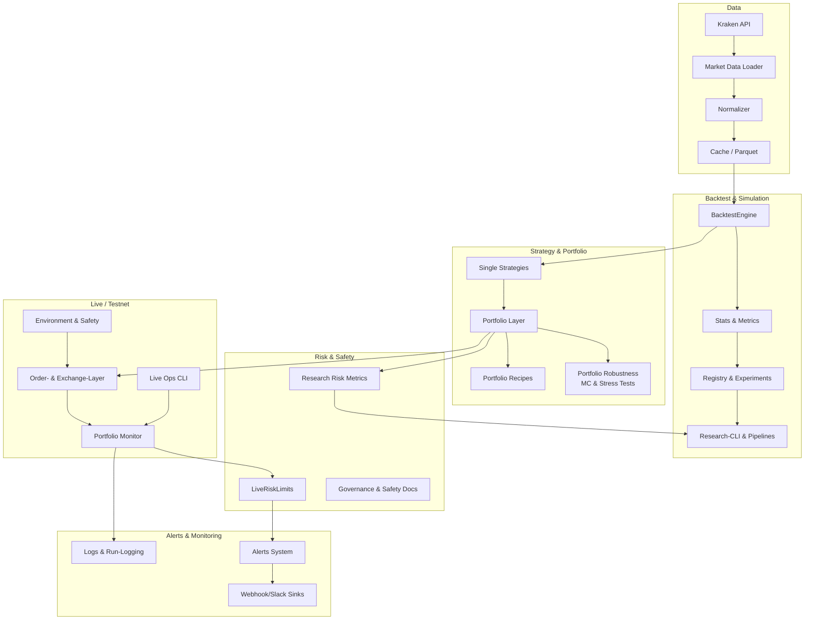

# Peak_Trade – Architecture Overview

## Einleitung

**Peak_Trade** ist eine **Forschungs-/Backtest-Plattform** mit integriertem **Live-/Testnet-Stack** und starkem **Safety-Fokus**.

Das Framework ermöglicht:
- **Research & Backtesting**: Strategien entwickeln, testen und optimieren
- **Portfolio-Management**: Multi-Strategie-Portfolios mit Robustness-Tests
- **Live-Trading**: Sichere Live-/Testnet-Umgebung mit Risk-Limits und Alerts
- **Governance & Safety**: Klare Trennung zwischen Research und Live, umfassende Safety-Mechanismen

> **Für einen schnellen Einstieg siehe:** [`GETTING_STARTED.md`](GETTING_STARTED.md) und das Haupt-[`README.md`](../README.md).

> **Für Developer-Guides zu typischen Erweiterungen siehe:**
> - `DEV_GUIDE_ADD_STRATEGY.md` – Neue Strategie hinzufügen
> - `DEV_GUIDE_ADD_EXCHANGE.md` – Neuen Exchange-Adapter hinzufügen
> - `DEV_GUIDE_ADD_LIVE_RISK_LIMIT.md` – Neues Live-Risk-Limit hinzufügen
> - `DEV_GUIDE_ADD_PORTFOLIO_RECIPE.md` – Neues Portfolio-Rezept hinzufügen

---

## High-Level Architektur

**Datenfluss:**
1. **Market Data** → Loader/Normalizer → Cache → Backtest/Research
2. **Strategien** → Portfolio-Layer → Risk-Checks → Backtest/Research
3. **Research-Output** → Portfolio-Rezepte → Live-Layer → Risk-Limits → Alerts

---

## Layer-Beschreibung

### 1. Data & Market Access

**Ziel:** Konsistente, normalisierte Marktdaten für Research und Live

**Wichtige Module:**
- `src/data/loader.py` – Zentraler Data-Loader
- `src/data/normalizer.py` – Daten-Normalisierung (OHLCV-Format)
- `src/data/cache.py` – Parquet-basierter Cache
- `src/data/kraken.py` – Kraken-API-Integration
- `src/data/kraken_pipeline.py` – Kraken-Daten-Pipeline

**Integration:**
- Backtest-Engine nutzt Data-Loader für historische Daten
- Research-CLI nutzt Data-Loader für Sweeps und Experimente
- Live-Layer kann Data-Loader für aktuelle Preise nutzen

**Siehe auch:** "docs\/Peak_Trade_Data_Layer_Doku.md" (future)

---

### 2. Backtest & Simulation

**Ziel:** Realistische Backtests mit Portfolio-Fähigkeiten

**Wichtige Module:**
- `src/backtest/engine.py` – Zentrale BacktestEngine
- `src/backtest/stats.py` – Metriken (Returns, Drawdown, Sharpe, etc.)
- `src/backtest/registry_engine.py` – Registry-Integration
- `src/backtest/walkforward.py` – Walk-Forward-Analyse

**Integration:**
- Registry speichert Backtest-Ergebnisse als Experiments
- Research-CLI nutzt BacktestEngine für Sweeps
- Reporting-Layer visualisiert Backtest-Ergebnisse

**Siehe auch:** `docs/PHASE_30_REPORTING_AND_VISUALIZATION.md`

---

### 3. Strategy & Portfolio

**Ziel:** Strategien entwickeln und in Portfolios kombinieren

**Wichtige Module:**
- `src&#47;strategies&#47;*` – Strategiemodule (MA, Momentum, RSI, etc.)
- `src&#47;strategies&#47;base.py` – BaseStrategy-Klasse
- `src&#47;strategies&#47;registry.py` – Strategy-Registry
- `src/portfolio/manager.py` – Portfolio-Manager
- `src/experiments/portfolio_robustness.py` – Monte-Carlo & Stress-Tests
- `src/experiments/portfolio_recipes.py` – Portfolio-Rezepte
- `config/portfolio_recipes.toml` – Rezept-Definitionen
- `config/config.toml` – Strategy-Presets (`[strategy.*]`)

**Phase 53 – Strategy & Portfolio Library Push:**
- Strategy-Presets werden über `config/config.toml` (`[strategy.*]`) definiert
- Naming-Konvention: `<family>_<market>_<profile>` (z.B. `rsi_reversion_btc_conservative`)
- Risk-Profile: `conservative`, `moderate`, `aggressive`
- Portfolio-Recipes mit direkten Strategienamen (statt Sweep-basiert)
- Siehe `PORTFOLIO_RECIPES_AND_PRESETS.md` für Details

**Integration:**
- Strategien werden in Registry registriert (`src/strategies/__init__.py`)
- Portfolio-Layer kombiniert mehrere Strategien
- Portfolio-Robustness testet Portfolios unter verschiedenen Szenarien
- Portfolio-Rezepte definieren vorkonfigurierte Portfolios

**Siehe auch:**
- `DEV_GUIDE_ADD_STRATEGY.md`
- `DEV_GUIDE_ADD_PORTFOLIO_RECIPE.md`
- `docs/PORTFOLIO_RECIPES_AND_PRESETS.md`
- `docs&#47;PHASE_47_*.md`

---

### 4. Research & Experiments

**Ziel:** Systematische Strategie- und Portfolio-Forschung

**Wichtige Module:**
- `src/core/experiments.py` – Experiment-Registry
- `src/experiments/strategy_sweeps.py` – Strategie-Parameter-Sweeps
- `src/experiments/regime_sweeps.py` – Regime-basierte Sweeps
- `src/experiments/portfolio_robustness.py` – Portfolio-Robustness
- `src/experiments/topn_promotion.py` – Top-N-Promotion
- `scripts/research_cli.py` – Research-CLI

**Integration:**
- Sweeps nutzen BacktestEngine für Parameter-Optimierung
- Ergebnisse werden in Registry gespeichert
- Research-CLI ermöglicht interaktive Forschung

**Siehe auch:** "docs\/Peak_Trade_Registry_Engine_Overview.md" (future)

---

### 5. Risk & Safety

**Ziel:** Risk-Management auf Research- und Live-Ebene

**Wichtige Module:**
- `src/core/risk.py` – Research-Risk-Metriken
- `src/live/risk_limits.py` – Live-Risk-Limits
- `src/live/safety.py` – Safety-Layer (Kill-Switch, Guards)
- `config/config.toml` – `[live_risk]` Konfiguration

**Integration:**
- Research-Risk-Metriken werden in Backtest-Stats berechnet
- Live-Risk-Limits prüfen Orders und Portfolios vor Ausführung
- Safety-Layer verhindert unsichere Konfigurationen

**Siehe auch:**
- `DEV_GUIDE_ADD_LIVE_RISK_LIMIT.md`
- `docs/GOVERNANCE_AND_SAFETY_OVERVIEW.md`
- `docs/SAFETY_POLICY_TESTNET_AND_LIVE.md`
- `docs/PHASE_25_GOVERNANCE_SAFETY_IMPLEMENTATION.md`

---

### 6. Live & Testnet

**Ziel:** Sichere Live-/Testnet-Umgebung für Trading

**Wichtige Module:**
- `src/core/environment.py` – Environment-/Mode-Handling
- `src/live/safety.py` – Safety-Layer
- `src/orders/exchange.py` – Exchange-Client
- `src/live/portfolio_monitor.py` – Live-Portfolio-Monitor
- `src/live/workflows.py` – Live-Workflows
- `scripts/live_ops.py` – Live-Ops-CLI

**Integration:**
- Environment-Layer trennt Shadow/Testnet/Live
- Order-Layer führt Orders über Exchange-Client aus
- Portfolio-Monitor überwacht Live-Portfolio
- Live-Ops-CLI bündelt wichtige Live-Operationen

**Siehe auch:**
- `DEV_GUIDE_ADD_EXCHANGE.md`
- `docs/LIVE_TESTNET_TRACK_STATUS.md`
- `docs/PHASE_51_LIVE_OPS_CLI.md`
- `docs/LIVE_TESTNET_PREPARATION.md`

---

### 7. Alerts & Notifications

**Ziel:** Automatische Benachrichtigungen bei Risk-Violations

**Wichtige Module:**
- `src/live/alerts.py` – Alert-System
- `config/config.toml` – `[live_alerts]` Konfiguration

**Integration:**
- LiveRiskLimits erzeugt Alerts bei Violations
- Alert-System sendet an Logging/stderr/Webhook/Slack
- Live-Ops-CLI triggert Alerts indirekt über Risk-Checks

**Siehe auch:**
- `docs/PHASE_49_LIVE_ALERTS_AND_NOTIFICATIONS.md`
- `docs/PHASE_50_LIVE_ALERT_WEBHOOKS_AND_SLACK.md`

---

### 8. Reporting & Monitoring

**Ziel:** Visualisierung und Analyse von Backtests und Live-Runs

**Wichtige Module:**
- `src/reporting/backtest_report.py` – Backtest-Reports
- `src/reporting/experiment_report.py` – Experiment-Reports
- `src/reporting/plots.py` – Plots und Visualisierungen
- `src/reporting/portfolio_robustness_report.py` – Portfolio-Robustness-Reports
- `scripts&#47;generate_*_report.py` – Report-Generierung

**Integration:**
- Reports nutzen Backtest-Stats und Registry-Daten
- Research-CLI kann Reports generieren
- Live-Run-Logging speichert Live-Runs für spätere Analyse

**Siehe auch:** `docs/PHASE_30_REPORTING_AND_VISUALIZATION.md`

---

### 9. AI-/Dev-Workflow

**Ziel:** Entwickler-Workflow mit AI-Assistenz

**Wichtige Module:**
- `docs/ai/CLAUDE_GUIDE.md` – AI-Assistenz-Guide

**Integration:**
- Developer-Guides (`DEV_GUIDE_*.md`) können als Kontext für AI-Tools verwendet werden
- Architektur-Overview hilft AI-Tools, Code-Struktur zu verstehen

**Siehe auch:** `docs/ai/CLAUDE_GUIDE.md`

---

## Verzeichnis-/Modulübersicht

| Pfad               | Inhalt / Verantwortung                               |
| ------------------ | ---------------------------------------------------- |
| `src/data/`        | Daten-Layer (Loader, Normalizer, Cache, Kraken)      |
| `src/backtest/`    | BacktestEngine, Stats, Walk-Forward                  |
| `src/strategies/`  | Strategiemodule (MA, Momentum, RSI, etc.)           |
| `src/portfolio/`   | Portfolio-Manager, Allocation-Methoden               |
| `src/experiments/` | Registry, Portfolio-Robustness, Recipes, Sweeps      |
| `src/live/`        | Live-Umgebung, RiskLimits, Alerts, Portfolio-Monitor |
| `src/orders/`      | Order-/Execution-Layer                               |
| `src/reporting/`   | Reports, Plots, Visualisierungen                    |
| `src/core/`        | Core-Komponenten (Config, Environment, Risk)         |
| `scripts/`         | CLI-Skripte für Research, Live, Ops                   |
| `config/`          | TOML-Konfigurationen                                 |
| `docs/`            | Doku (Phasen, Governance, Status, Guides, AI)        |
| `docs/ai/`         | AI-/Assistenz-bezogene Guides                        |

---

## Beziehungen zwischen Research- und Live-Track

### Research → Live Flow

1. **Strategie-Entwicklung** (Research)
   - Strategien werden in `src/strategies/` entwickelt
   - Backtests mit `BacktestEngine` durchgeführt
   - Parameter-Optimierung via Sweeps

2. **Portfolio-Bildung** (Research)
   - Portfolios werden in `src/portfolio/` kombiniert
   - Portfolio-Robustness testet Portfolios unter verschiedenen Szenarien
   - Portfolio-Rezepte definieren vorkonfigurierte Portfolios

3. **Promotion zu Live** (Governance)
   - Nur robuste Strategien/Portfolios werden für Live freigegeben
   - Governance-Doku definiert Kriterien für Live-Promotion
   - Safety-Layer verhindert unsichere Konfigurationen

4. **Live-Operation** (Live)
   - Live-Risk-Limits prüfen Orders und Portfolios
   - Portfolio-Monitor überwacht Live-Portfolio
   - Alerts benachrichtigen bei Risk-Violations

### Safety-Trennung

- **Research**: Keine echten Orders, nur Simulation
- **Testnet**: Echte Orders, aber auf Testnet-Exchange
- **Live**: Echte Orders auf Live-Exchange, mit umfassenden Safety-Checks

**Siehe auch:** `docs/GOVERNANCE_AND_SAFETY_OVERVIEW.md`

---

## Links auf wichtige Detail-Dokumente

### Status & Overview
- `PEAK_TRADE_STATUS_OVERVIEW.md` – Gesamtstatus des Projekts
- `LIVE_TESTNET_TRACK_STATUS.md` – Live-/Testnet-Track-Status

### Reporting & Visualization
- `PHASE_30_REPORTING_AND_VISUALIZATION.md` – Reporting-System

### Portfolio & Robustness
- `PHASE_47_*.md` – Portfolio-Robustness
- `PORTFOLIO_RECIPES_AND_PRESETS.md` – Portfolio-Rezepte

### Live-Monitoring & Alerts
- `PHASE_48_LIVE_PORTFOLIO_MONITORING_AND_RISK_BRIDGE.md` – Portfolio-Monitoring
- `PHASE_49_LIVE_ALERTS_AND_NOTIFICATIONS.md` – Alert-System
- `PHASE_50_LIVE_ALERT_WEBHOOKS_AND_SLACK.md` – Webhook/Slack-Sinks
- `PHASE_51_LIVE_OPS_CLI.md` – Live-Ops-CLI

### Governance & Safety
- `PHASE_25_GOVERNANCE_SAFETY_IMPLEMENTATION.md` – Governance-Implementierung
- `GOVERNANCE_AND_SAFETY_OVERVIEW.md` – Governance-Übersicht
- `SAFETY_POLICY_TESTNET_AND_LIVE.md` – Safety-Policy
- `RUNBOOKS_AND_INCIDENT_HANDLING.md` – Runbooks

### Developer-Guides
- `DEV_GUIDE_ADD_STRATEGY.md` – Neue Strategie hinzufügen
- `DEV_GUIDE_ADD_EXCHANGE.md` – Neuen Exchange-Adapter hinzufügen
- `DEV_GUIDE_ADD_LIVE_RISK_LIMIT.md` – Neues Live-Risk-Limit hinzufügen
- `DEV_GUIDE_ADD_PORTFOLIO_RECIPE.md` – Neues Portfolio-Rezept hinzufügen

### CLI & Tools
- `CLI_CHEATSHEET.md` – CLI-Referenz

### AI-Assistenz
- `docs/ai/CLAUDE_GUIDE.md` – AI-Assistenz-Guide

---

**Built with ❤️ and safety-first architecture**
