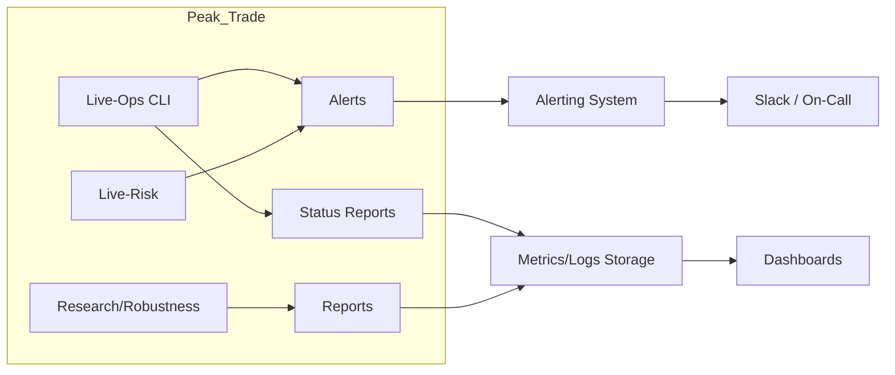

# Peak_Trade – Observability & Monitoring Plan (Phase 62)

> **Status:** Phase 62 – Observability & Monitoring Plan  
> **Scope:** Rein dokumentarisch, keine Code-Änderungen  
> **Ziel:** Klarer Plan für zukünftiges Monitoring & Observability im Live-/Testnet-Betrieb

---

## 1. Einleitung & Scope

Peak_Trade v1.0 ist technisch & dokumentarisch fertig (Research, Portfolios, Live-/Testnet, Drills, Status-Reports). Der nächste logische Schritt in Richtung echtes Live-Trading ist eine saubere **Observability-Story**.

**Frage:** *Wie weiß ich jederzeit, wie es meinem System geht?*

Dieses Dokument beschreibt einen **Plan**, keine vollständige Implementierung. Es definiert:

- **Was** wir für echtes Live-/Testnet-Monitoring beobachten wollen
- **Wo** die sinnvollsten Integrationspunkte im bestehenden System liegen
- **Wie** Live-Ops CLI, Live-Status-Reports, Alerts & Drills zusammenspielen
- **Welche** Tools (Prometheus, Grafana, Logs, etc.) sich später anbieten würden

**Ohne** jetzt schon Prometheus-Clients, Dashboards oder komplexe Infra zu implementieren.

### Verwandte Dokumente

- [`docs/PEAK_TRADE_V1_RELEASE_NOTES.md`](PEAK_TRADE_V1_RELEASE_NOTES.md) – Scope v1.0
- [`docs/LIVE_TESTNET_TRACK_STATUS.md`](LIVE_TESTNET_TRACK_STATUS.md) – Aktueller Status Live-/Testnet-Track
- [`docs/PERFORMANCE_NOTES.md`](PERFORMANCE_NOTES.md) – Performance als Teil der Beobachtung
- [`docs/GOVERNANCE_AND_SAFETY_OVERVIEW.md`](GOVERNANCE_AND_SAFETY_OVERVIEW.md) – Governance-Kontext

---

## 2. Observability-Ziele für Peak_Trade

### 2.1 Gesundheit des Systems

**Ziel:** Innerhalb von 1 Minute erkennen, wenn kritische Komponenten nicht mehr korrekt arbeiten.

- Läuft alles wie erwartet?
- Sind kritische Komponenten verfügbar (Exchange, Data, Alerts, Risk)?
- Gibt es Konfigurationsfehler oder Inkonsistenzen?

**Beispiel-Metriken:**
- `system.health.status` (OK/DEGRADED/FAIL)
- `system.health.exchange_available` (bool)
- `system.health.alerts_config_ok` (bool)
- `system.health.live_risk_config_ok` (bool)

### 2.2 Risikostatus

**Ziel:** Jederzeit wissen, ob das System innerhalb der definierten Risk-Limits operiert.

- Ist das System innerhalb der definierten Risk-Limits?
- Gibt es Überlastung (Exposure, Drawdown, Order-Volumen)?
- Werden Orders korrekt durch Risk-Checks gefiltert?

**Beispiel-Metriken:**
- `risk.limit_violations.count` (pro Tag/Stunde)
- `risk.limit_margin_to_max_total_exposure` (Abstand zum Limit)
- `risk.daily_pnl_vs_limit` (Abstand zu max_daily_loss)

### 2.3 Leistungsfähigkeit

**Ziel:** Verstehen, wie schnell das System auf Marktveränderungen reagiert und wie effizient Research-Runs sind.

- Wie schnell reagieren Orders?
- Wie lange brauchen Backtests/Research-Runs bei bestimmten Datenmengen?
- Gibt es Performance-Degradation über die Zeit?

**Beispiel-Metriken:**
- `live_ops.health.duration_ms`
- `research.run.duration_seconds` (pro Typ)
- `status_report.generate.duration_seconds`

### 2.4 Fehler & Incidents

**Ziel:** Jeder Incident (Data-Gap, PnL-Divergenz, Risk-Limit-Verletzung) ist im Nachhinein anhand Logs und Drills nachvollziehbar.

- Was ist wann schiefgelaufen?
- Wie schnell wurde reagiert?
- Werden Drills und Runbooks effektiv umgesetzt?

**Beispiel-Metriken:**
- `alerts.count.critical` (pro Stunde/Tag)
- `incidents.real_incidents_per_month`
- `incidents.mean_time_to_detect` (MTTD, Long-Term-Ziel)
- `incidents.mean_time_to_recover` (MTTR, Long-Term-Ziel)

---

## 3. Monitoring-Dimensionen (Metrics, Logs, Events, Traces)

### 3.1 Logs

**Was passiert wann?** (Events, Errors, Warnungen)

**Ideal für:**
- Debugging
- Incident-Analysen
- Drills & Post-Mortems

**Aktueller Stand (v1.0):**
- Python-Logging (LoggingAlertSink)
- stderr-Output (StderrAlertSink)
- Strukturierte Events in `src/live/run_logging.py`

**Zukünftige Erweiterung:**
- Standardisiertes Logging-Format (JSON-Logs)
- Zentraler Log-Collector (z.B. ELK, Loki) – optional, Zukunft

### 3.2 Metrics

**Zeitreihen von Kennzahlen:** Latenzen, Durchsatz, PnL, Exposure, Anzahl Alerts, etc.

**Ideal für:**
- Dashboards
- Alerts mit Schwellenwerten
- Trendanalyse

**Aktueller Stand (v1.0):**
- Indirekt über Logs/Reports abgebildet
- Live-Status-Reports als periodische Snapshots

**Zukünftige Erweiterung:**
- Metriken aus Live-Ops, Live-Risk, Alerts, Status-Reports, Research/Backtests
- Aggregation z.B. in Prometheus (oder vergleichbarem System)
- Visualisierung in z.B. Grafana

### 3.3 Events/Alerts

**"Signale mit Bedeutung"**, z.B.:
- Risk-Limit verletzt
- Exchange unreachable
- Data-Gap erkannt
- PnL-Divergenz-Check fehlgeschlagen

**Aktueller Stand (v1.0):**
- `src/live/alerts.py` mit AlertLevel (INFO, WARNING, CRITICAL)
- AlertSink-Implementierungen: Logging, Stderr, Webhook, Slack
- Automatische Alert-Emission bei Risk-Violations

**Zukünftige Erweiterung:**
- Integration mit Alertmanager / Slack-Channels / On-Call-Konzept
- Alert-Deduplizierung und Throttling
- Persistente Alert-Historie

### 3.4 Traces (optional/später)

**End-to-End-Request-Flows**, z.B. "Order-Request → Risk → Exchange → Response"

**Für Peak_Trade erstmal eher "Nice-to-have"**, aber erwähnbar für spätere Phasen.

---

## 4. Wichtige Metriken & Signale (Katalog)

> **Hinweis:** Diese Metriken werden heute teilweise schon indirekt über Logs/Reports abgebildet. Langfristig können sie als Prometheus-Metriken oder in einem anderen Telemetrie-System implementiert werden.

### 4.1 System-Health & Infrastruktur

| Metrik | Beschreibung | Typ | Beispiel-Wert |
|--------|--------------|-----|---------------|
| `system.health.status` | Gesamt-Status (OK/DEGRADED/FAIL) | Gauge | `OK` |
| `system.health.exchange_available` | Exchange erreichbar? | Gauge | `true` |
| `system.health.alerts_config_ok` | Alert-Konfiguration gültig? | Gauge | `true` |
| `system.health.live_risk_config_ok` | Live-Risk-Konfiguration gültig? | Gauge | `true` |
| `system.health.data_pipeline_ok` | Data-Pipeline funktioniert? | Gauge | `true` |

### 4.2 Trading- & Portfolio-Metriken

| Metrik | Beschreibung | Typ | Beispiel-Wert |
|--------|--------------|-----|---------------|
| `portfolio.equity` | Aktuelles Portfolio-Equity (pro Portfolio) | Gauge | `10500.50` |
| `portfolio.total_exposure` | Gesamt-Exposure (Notional) | Gauge | `5000.00` |
| `portfolio.free_cash` | Verfügbares Cash | Gauge | `5500.50` |
| `portfolio.positions_open_count` | Anzahl offener Positionen | Gauge | `3` |
| `portfolio.max_symbol_exposure` | Maximaler Exposure pro Symbol | Gauge | `2000.00` |
| `portfolio.unrealized_pnl` | Unrealisiertes PnL | Gauge | `150.25` |

### 4.3 Risk & Policy

| Metrik | Beschreibung | Typ | Beispiel-Wert |
|--------|--------------|-----|---------------|
| `risk.limit_violations.count` | Anzahl Limit-Verletzungen (z.B. pro Tag) | Counter | `2` |
| `risk.limit_violations.blocked_orders` | Anzahl blockierter Orders | Counter | `5` |
| `risk.limit_margin_to_max_total_exposure` | Abstand zum Total-Exposure-Limit (in %) | Gauge | `50.0` |
| `risk.limit_margin_to_max_drawdown` | Abstand zum Drawdown-Limit (in %) | Gauge | `75.0` |
| `risk.daily_pnl_vs_limit` | Abstand zu max_daily_loss (absolut oder %) | Gauge | `-200.00` |

### 4.4 Alerts & Incidents

| Metrik | Beschreibung | Typ | Beispiel-Wert |
|--------|--------------|-----|---------------|
| `alerts.count.info` | Anzahl INFO-Alerts (pro Stunde/Tag) | Counter | `10` |
| `alerts.count.warning` | Anzahl WARNING-Alerts (pro Stunde/Tag) | Counter | `3` |
| `alerts.count.critical` | Anzahl CRITICAL-Alerts (pro Stunde/Tag) | Counter | `1` |
| `alerts.count.by_source` | Alerts nach Quelle (risk, data, exchange) | Counter | `risk: 2, data: 1` |
| `incidents.drills_performed_per_month` | Anzahl durchgeführter Drills | Counter | `4` |
| `incidents.real_incidents_per_month` | Anzahl echter Incidents | Counter | `1` |
| `incidents.mean_time_to_detect` | Mittlere Zeit bis Erkennung (MTTD, in Minuten) | Gauge | `5.0` |
| `incidents.mean_time_to_recover` | Mittlere Zeit bis Wiederherstellung (MTTR, in Minuten) | Gauge | `15.0` |

### 4.5 Performance & Throughput

| Metrik | Beschreibung | Typ | Beispiel-Wert |
|--------|--------------|-----|---------------|
| `research.run.duration_seconds` | Dauer Research-Run (pro Typ: pipeline, portfolio, robustness) | Histogram | `120.5` |
| `research.run.count_per_day` | Anzahl Research-Runs pro Tag | Counter | `5` |
| `live_ops.health.duration_ms` | Dauer Health-Check | Histogram | `250.0` |
| `live_ops.portfolio.duration_ms` | Dauer Portfolio-Check | Histogram | `500.0` |
| `status_report.generate.duration_seconds` | Dauer Status-Report-Generierung | Histogram | `2.5` |

---

## 5. Integrationspunkte im bestehenden System

### 5.1 Live-Ops CLI (`scripts/live_ops.py`)

**Aktueller Stand:**
- `live_ops health` – liefert bereits einen strukturierten Überblick (JSON-Output möglich)
- `live_ops portfolio` – Portfolio-Snapshot mit Risk-Evaluation
- `live_ops orders` – Order-Preview & Risk-Check

**Zukünftige Integration:**
- Health-Check → könnte Metriken pushen (z.B. `system.health.*`)
- Integrativ in ein Monitoring-Backend schreiben
- Periodische Health-Checks via Cron/Scheduler → Metriken sammeln

**Beispiel-Emissionspunkte:**
- Nach jedem `live_ops health` → `system.health.status`, `system.health.exchange_available`, etc.
- Nach jedem `live_ops portfolio` → `portfolio.equity`, `portfolio.total_exposure`, etc.

### 5.2 Live-Status-Report (`scripts/generate_live_status_report.py`)

**Aktueller Stand:**
- Hat bereits strukturierten Zugriff auf:
  - Health-Daten (JSON)
  - Portfolio-Daten (JSON)
- Generiert Markdown/HTML-Reports

**Zukünftige Integration:**
- Periodisch Metriken ableiten (z.B. täglich/wöchentlich)
- Snapshots z.B. als JSON/CSV speichern → Zeitreihen-Daten
- Metriken aus Reports extrahieren und in Metrics-Backend pushen

**Beispiel-Emissionspunkte:**
- Bei Report-Generierung → alle Portfolio- und Risk-Metriken als Snapshot
- Report-Dauer → `status_report.generate.duration_seconds`

### 5.3 Alert-System (`src/live/alerts.py`)

**Aktueller Stand:**
- LoggingAlertSink, StderrAlertSink, WebhookAlertSink, SlackWebhookAlertSink existieren
- Automatische Alert-Emission bei Risk-Violations

**Zukünftige Integration:**
- Webhooks Richtung Monitoring-Stack (z.B. Alertmanager, eigene REST-API)
- Alerts als Events in ein Event-Log schreiben
- Alert-Counter-Metriken (`alerts.count.*`) bei jedem Alert erhöhen

**Beispiel-Emissionspunkte:**
- Bei jedem `AlertSink.send()` → `alerts.count.{level}` erhöhen
- Alert-Events → Event-Log schreiben (für spätere Analyse)

### 5.4 Risk-Limits (`src/live/risk_limits.py`)

**Aktueller Stand:**
- `check_orders()` & `evaluate_portfolio()` mit Risk-Checks
- Automatische Alert-Emission bei Violations

**Zukünftige Integration:**
- Natürliche Hooks für:
  - `risk.limit_violations.count` (bei jeder Violation)
  - `risk.limit_margin_to_max_total_exposure` (bei jedem Check)
  - `risk.limit_violations.blocked_orders` (bei blockierten Orders)

**Beispiel-Emissionspunkte:**
- In `check_orders()` → bei Violation: Counter erhöhen, Metriken aktualisieren
- In `evaluate_portfolio()` → Margin-zu-Limit-Metriken aktualisieren

### 5.5 Research-Pipeline & Portfolio-Robustness

**Aktueller Stand:**
- `scripts/research_cli.py` & `scripts/run_portfolio_robustness.py`
- Output: Reports, Metriken

**Zukünftige Integration:**
- Zeit- und Performance-Metriken pushen
- `research.run.duration_seconds` (pro Typ)
- `research.run.count_per_day` erhöhen

**Beispiel-Emissionspunkte:**
- Am Ende jedes Research-Runs → Dauer messen, Metriken pushen
- Run-Counter erhöhen

---

## 6. Alerts, Live-Status-Reports & Drills im Monitoring-Kontext

### 6.1 Alerts – Akute Signale

**Rolle:** Echtzeit-Signale bei Risk-/System-Problemen (Risk-Limits, Exchange, Config, etc.)

**Aktueller Stand (v1.0):**
- Webhook/Slack-fähig
- Automatische Emission bei Risk-Violations

**Zukünftige Integration:**
- Integration mit Alertmanager / Slack-Channels / On-Call-Konzept
- Alert-Regeln auf Basis von Metriken (z.B. `risk.limit_violations.count > 0`)
- Alert-Deduplizierung und Throttling

**Monitoring-Kontext:**
- Alerts sind die **akuten** Signale
- Sofortige Benachrichtigung bei kritischen Ereignissen
- Basis für Incident-Response

### 6.2 Live-Status-Reports – Regelmäßige Zustandsberichte

**Rolle:** Periodische Snapshots (Daily/Weekly) in Markdown/HTML

**Aktueller Stand (v1.0):**
- Strukturierte Health- und Portfolio-Daten
- Markdown/HTML-Output

**Zukünftige Integration:**
- Ergänzt durch strukturiertes JSON
- Auswertung/Aggregation (z.B. automatisierte wöchentliche Summary)
- Metriken aus Reports extrahieren und in Metrics-Backend pushen

**Monitoring-Kontext:**
- Live-Status-Reports sind die **regelmäßigen Zustandsberichte**
- Trendanalyse über Zeit
- Basis für wöchentliche Reviews

### 6.3 Incident-Drills – Lern- und Verbesserungs-Schiene

**Rolle:** Simulations-Events mit Log & Dokumentation

**Aktueller Stand (v1.0):**
- Dokumentierte Drill-Szenarien
- Drill-Log für alle durchgeführten Drills

**Zukünftige Integration:**
- Kennzahlen wie "Anzahl Drills", "Qualität der Reaktion", "Zeit bis Runbook ausgeführt"
- Integration in regelmäßige Review-Meetings
- Metriken: `incidents.drills_performed_per_month`, `incidents.mean_time_to_detect`, `incidents.mean_time_to_recover`

**Monitoring-Kontext:**
- Drills & Incident-Logs sind die **Lern- und Verbesserungs-Schiene**
- Kontinuierliche Verbesserung der Incident-Response
- Validierung von Runbooks und Tooling

### 6.4 Zusammenspiel

**Formel:**
> Alerts sind die **akuten** Signale,  
> Live-Status-Reports sind die **regelmäßigen Zustandsberichte**,  
> Drills & Incident-Logs sind die **Lern- und Verbesserungs-Schiene**.

**Beispiel-Workflow:**
1. **Alert** → Risk-Limit-Verletzung erkannt → Sofort-Benachrichtigung
2. **Status-Report** → Täglicher Snapshot zeigt Trend → Risk-Metriken über Zeit
3. **Drill** → Monatlicher Drill testet Response → Verbesserung der Runbooks

---

## 7. Zielbild einer zukünftigen Monitoring-Architektur

### 7.1 Übersicht

Das Zielbild beschreibt eine mögliche zukünftige Monitoring-Architektur – **ohne** sich auf ein konkretes Tool festzunageln, aber gerne mit typischen Beispielen.

### 7.2 Logging-Layer

**Ziel:**
- Standardisiertes Logging-Format (JSON-Logs o.ä.)
- Zentraler Log-Collector (z.B. ELK, Loki) – optional, Zukunft

**Aktueller Stand:**
- Python-Logging, strukturierte Events in `src/live/run_logging.py`

**Zukünftige Erweiterung:**
- JSON-Logging-Format für bessere Parsbarkeit
- Optional: ELK-Stack (Elasticsearch, Logstash, Kibana) oder Loki für zentrale Log-Aggregation

### 7.3 Metrics-Layer

**Ziel:**
- Metriken aus Live-Ops, Live-Risk, Alerts, Status-Reports, Research/Backtests
- Aggregation z.B. in Prometheus (oder vergleichbarem System)
- Visualisierung in z.B. Grafana

**Beispiel-Stack:**
- **Prometheus** – Metriken-Sammlung und -Speicherung
- **Grafana** – Dashboards und Visualisierung
- **Exporters** – Peak_Trade-spezifische Metriken-Exporter (z.B. `live_ops` → Prometheus)

**Dashboards:**
- "System Health" – overall_status, check_status per Subsystem, Alerts pro Stunde
- "Risk & Exposure" – equity, exposure, risk-limit-margin, Anzahl Violations
- "Research Activity" – Anzahl Research-Runs pro Woche, durchschnittliche Dauer

### 7.4 Alerting-Layer

**Ziel:**
- Alert-Regeln auf Basis von Metriken (z.B. `risk.limit_violations.count > 0`)
- Integration mit Alertmanager / Slack-Channels / On-Call-Konzept

**Beispiel-Stack:**
- **Prometheus Alertmanager** – Alert-Routing und -Deduplizierung
- **Slack-Integration** – Benachrichtigungen in Slack-Channels
- **On-Call-Rotation** – Automatische Eskalation bei kritischen Alerts

**Beispiel-Alert-Regeln:**
- `risk.limit_violations.count > 0 in last 5 minutes` → Critical
- `system.health.status == FAIL` → Critical
- `alerts.count.critical > 3 in last hour` → Warning

### 7.5 Ops-Interface

**Ziel:**
- Live-Ops-CLI & Status-Reports bleiben der **Operator-Einstieg**
- Monitoring-Systeme ergänzen nur Sichtbarkeit & Automation

**Zusammenspiel:**
- **Live-Ops CLI** → Manuelle Checks, Ad-hoc-Operationen
- **Status-Reports** → Regelmäßige Reviews, Trendanalyse
- **Dashboards** → Echtzeit-Überblick, historische Trends
- **Alerts** → Sofort-Benachrichtigung bei kritischen Ereignissen

### 7.6 Architektur-Diagramm



---

## 8. Roadmap: Schritte von "heute" zu "voller Observability"

### 8.1 Kurzer Schritt (v1.1)

**Ziel:** Maschinenlesbare Daten & einfache Zähl-Metriken

**Maßnahmen:**
1. Status-Reports optional auch als JSON speichern, damit sie maschinenlesbar sind
2. Einfache Zähl-Metriken in Logs aufnehmen (z.B. "limit_violations_today")
3. Health-Check-Output strukturiert als JSON persistieren

**Ergebnis:**
- Basis für spätere Metriken-Extraktion
- Keine neue Infra nötig
- Kompatibel mit bestehendem System

### 8.2 Mittelfristig (v2)

**Ziel:** Einfaches Metrics-Backend & minimales Dashboard

**Maßnahmen:**
1. Einfaches Metrics-Backend (oder custom JSON-Store) für:
   - Health-Checks
   - Risk-Limits
   - Portfolio-Exposure
2. Minimales Dashboard (z.B. mit Jupyter/Notebook oder kleinem Web-Frontend)
3. Automatisierte Metriken-Sammlung aus Live-Ops & Status-Reports

**Ergebnis:**
- Erste Dashboards für System-Health & Risk
- Zeitreihen-Daten für Trendanalyse
- Noch keine komplexe Infra (Prometheus/Grafana optional)

### 8.3 Langfristig (v3+)

**Ziel:** Vollwertiges Monitoring mit Prometheus/Grafana

**Maßnahmen:**
1. Vollwertiges Monitoring mit:
   - Prometheus/Grafana (oder Alternative)
   - Alertmanager
   - Zentralem Log-Stack (optional: ELK/Loki)
2. Peak_Trade-spezifische Metriken-Exporter
3. Integrierte Dashboards für alle wichtigen Metriken
4. On-Call-Integration (Slack, PagerDuty, etc.)

**Ergebnis:**
- Professionelles Monitoring-Setup
- Echtzeit-Dashboards
- Automatisierte Alerting
- Zentrale Log-Aggregation

---

## 9. Anhang: Beispiel-Signale & Dashboards

### 9.1 Beispiel-Dashboards

#### Dashboard: "System Health"

**Metriken:**
- `system.health.status` (OK/DEGRADED/FAIL)
- `system.health.exchange_available` (bool)
- `system.health.alerts_config_ok` (bool)
- `system.health.live_risk_config_ok` (bool)
- `alerts.count.critical` (pro Stunde)

**Visualisierung:**
- Status-Panel (grün/gelb/rot)
- Subsystem-Status (Checkboxen)
- Alert-Timeline (letzte 24h)

#### Dashboard: "Risk & Exposure"

**Metriken:**
- `portfolio.equity` (Zeitreihe)
- `portfolio.total_exposure` (Zeitreihe)
- `risk.limit_margin_to_max_total_exposure` (Gauge)
- `risk.limit_violations.count` (Counter, letzte 24h)

**Visualisierung:**
- Equity-Chart (Zeitreihe)
- Exposure vs. Limit (Gauge)
- Violations-Timeline

#### Dashboard: "Research Activity"

**Metriken:**
- `research.run.count_per_day` (Counter)
- `research.run.duration_seconds` (Histogram, pro Typ)
- `status_report.generate.duration_seconds` (Histogram)

**Visualisierung:**
- Research-Runs pro Woche (Bar-Chart)
- Durchschnittliche Dauer (pro Typ)
- Trend über Zeit

### 9.2 Beispiel-Alert-Regeln

#### Critical Alerts

```yaml
# Risk-Limit-Verletzung
- alert: RiskLimitViolation
  expr: risk_limit_violations_count > 0
  for: 1m
  labels:
    severity: critical
  annotations:
    summary: "Risk-Limit-Verletzung erkannt"
    description: "{{ $value }} Limit-Verletzungen in den letzten 5 Minuten"

# System-Health-Fehler
- alert: SystemHealthFailed
  expr: system_health_status == 0  # FAIL
  for: 30s
  labels:
    severity: critical
  annotations:
    summary: "System-Health-Check fehlgeschlagen"
```

#### Warning Alerts

```yaml
# Viele kritische Alerts
- alert: HighCriticalAlertRate
  expr: alerts_count_critical > 3
  for: 1h
  labels:
    severity: warning
  annotations:
    summary: "Hohe Anzahl kritischer Alerts"
    description: "{{ $value }} kritische Alerts in der letzten Stunde"
```

---

## 10. Änderungshistorie

| Datum      | Änderung                                                     |
|------------|--------------------------------------------------------------|
| 2025-12-07 | Phase 62 – Initiale Observability & Monitoring Plan          |

---

**Built with ❤️ and safety-first architecture**
