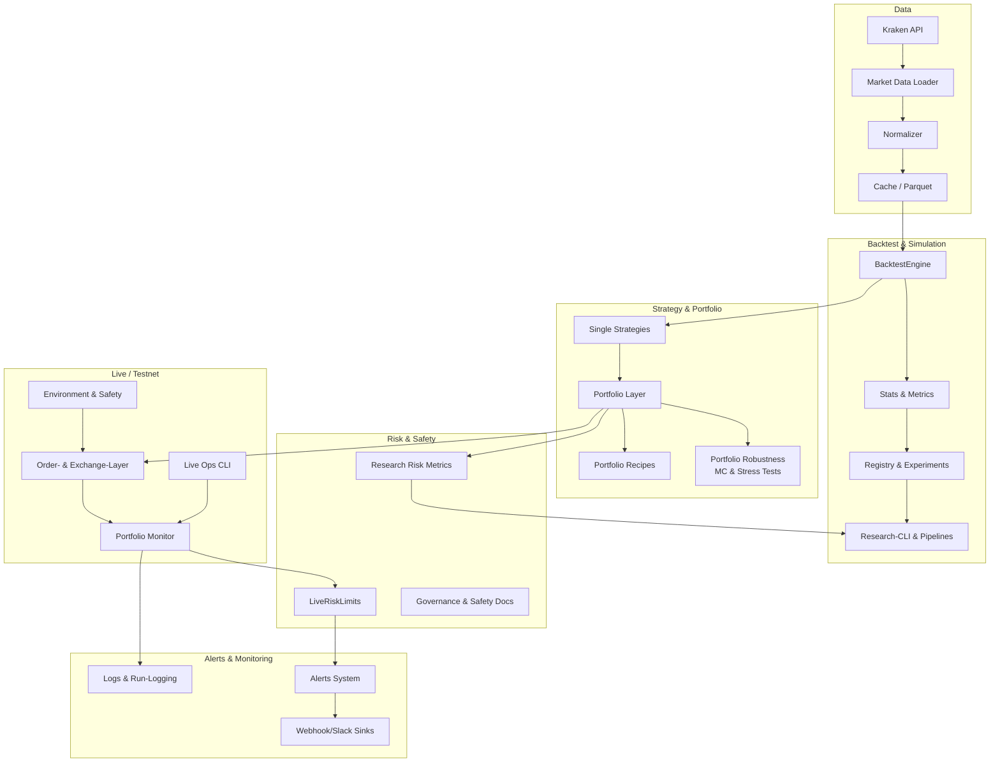

# Peak_Trade v1.0 – Vollständige Übersicht & Rollen-Guide

> **Status:** Phase 63 – v1.0 Gesamtübersicht & Rollen-Guide  
> **Zielgruppe:** Entwickler:innen, die bereits GETTING_STARTED gelesen haben und verstehen wollen, wie alles zusammenhängt

---

## 1. Einleitung & Zielgruppe

### Was ist Peak_Trade?

Peak_Trade ist ein **modulares, research-getriebenes Trading-Framework** mit Fokus auf robuste Backtests, Portfolio-Robustheit, klar definierte Risk- & Governance-Prozesse und saubere Trennung von Research, Shadow/Testnet und Live.

**Kernphilosophie:** Ein Trading-Stack, dem Future-Ich vertraut – technisch, risk-seitig und operativ.

### Für wen ist dieses Dokument?

Dieses Dokument richtet sich an:

- **Entwickler:innen**, die bereits [`GETTING_STARTED.md`](GETTING_STARTED.md) gelesen haben und verstehen wollen, wie alles zusammenhängt
- **Operatoren**, die das System im Live-/Testnet-Betrieb verstehen müssen
- **Reviewer/Risk Officers**, die Governance- und Safety-Prozesse nachvollziehen wollen
- **Future-You**, der nach Monaten wieder tief ins System einsteigen will

**Verwandte Dokumente:**

- [`README.md`](../README.md) – Landing Page
- [`docs/GETTING_STARTED.md`](GETTING_STARTED.md) – Onboarding (erste Stunde)
- [`docs/PEAK_TRADE_FIRST_7_DAYS.md`](PEAK_TRADE_FIRST_7_DAYS.md) – First 7 Days Onboarding (erste Woche)
- [`docs/PEAK_TRADE_V1_RELEASE_NOTES.md`](PEAK_TRADE_V1_RELEASE_NOTES.md) – Release Notes

---

## 2. System-Ziele & Prinzipien

### 2.1 Ziele

**Research-First:**
- Saubere Backtests, Sweeps, Portfolio-Robustness
- Reproduzierbare Experimente mit Registry-Integration
- Klare Metriken für Go/No-Go-Entscheidungen

**Safety-First:**
- Risk-Limits auf Order- und Portfolio-Level
- Governance-Prozesse mit klaren Freigabe-Schritten
- Incident-Drills für kontinuierliche Verbesserung

**Live-/Testnet-Track:**
- Stufenmodell: Shadow → Testnet → Live
- Live-Ops CLI für zentrale Operationen
- Alerts & Status-Reports für kontinuierliches Monitoring

### 2.2 Prinzipien

**Trennung von Research & Live:**
- Klare Environment-Modi (paper/testnet/live)
- Research-Code kann Live-Endpoints niemals versehentlich erreichen
- Safety-Guards verhindern unsichere Konfigurationen

**Konfigurations-Driven Design:**
- TOML-basierte Konfiguration (`config/config.toml`, `config/portfolio_recipes.toml`)
- Pydantic-Validierung für Type-Safety
- Klare Defaults mit Override-Möglichkeiten

**Reproduzierbarkeit:**
- Alle Runs werden in der Registry geloggt
- Reports, Status-Reports, Logs & Drills sind nachvollziehbar
- Versionierte Konfigurationen

**Defense-in-Depth:**
- Mehrere Sicherheitsschichten: Environment-Mode, Risk-Limits, Safety-Guards, Governance-Prozesse
- Alerts auf mehreren Ebenen (Risk, System, Data)
- Runbooks für typische Incidents

**Verwandte Dokumente:**

- [`docs/GOVERNANCE_AND_SAFETY_OVERVIEW.md`](GOVERNANCE_AND_SAFETY_OVERVIEW.md)
- [`docs/SAFETY_POLICY_TESTNET_AND_LIVE.md`](SAFETY_POLICY_TESTNET_AND_LIVE.md)

---

## 3. Architektur-Snapshot v1.0

Peak_Trade ist in mehrere Layer strukturiert, die sauber getrennt sind, aber nahtlos zusammenarbeiten:

- **Data-Layer** – Daten-Loading, Caching, Exchange-Integration
- **Backtest- & Research-Layer** – Backtest-Engine, Research-Pipeline, Registry
- **Strategy- & Portfolio-Layer** – Strategien, Portfolio-Kombination, Robustness
- **Live-/Testnet-Layer** – Live-Ops, Exchange-Integration, Portfolio-Monitor
- **Risk & Safety** – Risk-Limits, Alerts, Governance
- **Reporting & Status-Reports** – Reports, Visualisierung, Live-Status



**Datenfluss:**
1. **Market Data** → Loader/Normalizer → Cache → Backtest/Research
2. **Strategien** → Portfolio-Layer → Risk-Checks → Backtest/Research
3. **Research-Output** → Portfolio-Rezepte → Live-Layer → Risk-Limits → Alerts

**Details & tiefere Architektur:** siehe [`docs/ARCHITECTURE_OVERVIEW.md`](ARCHITECTURE_OVERVIEW.md).

---

## 4. Haupt-Bausteine & Features

### 4.1 Data-Layer

**Was kann das?**
- Laden von Marktdaten (Kraken API, CSV-Import)
- Normalisierung auf konsistentes OHLCV-Format
- Parquet-basiertes Caching für Performance

**Verwandte Dokumente:**
- `src/data/` – Implementierung
- [`docs/ARCHITECTURE_OVERVIEW.md`](ARCHITECTURE_OVERVIEW.md) – Layer-Beschreibung

### 4.2 Backtest & Stats

**Was kann das?**
- Realistic Backtest-Engine mit Fees, Slippage, Stop-Loss
- Umfassende Performance-Metriken (Sharpe, Drawdown, Profit Factor, etc.)
- Automatisches Tracking aller Runs in der Registry

**Verwandte Dokumente:**
- [`docs/BACKTEST_ENGINE.md`](BACKTEST_ENGINE.md) – Backtest-Engine-Details
- `src/backtest/` – Implementierung

### 4.3 Strategy- & Portfolio-Layer

**Was kann das?**
- OOP-Strategien (MA Crossover, RSI, Trend-Following), einfach erweiterbar
- Multi-Strategy-Portfolio-Support mit Gewichtung
- Portfolio-Recipes & Presets mit Risk-Profilen (conservative/moderate/aggressive)

**Verwandte Dokumente:**
- [`docs/PORTFOLIO_RECIPES_AND_PRESETS.md`](PORTFOLIO_RECIPES_AND_PRESETS.md) – Portfolio-Presets
- [`docs/STRATEGY_DEV_GUIDE.md`](STRATEGY_DEV_GUIDE.md) – Neue Strategie hinzufügen
- `src/strategies/` – Implementierung

### 4.4 Research-Pipeline v2 & Portfolio-Robustness

**Was kann das?**
- Sweeps, Walk-Forward, Monte-Carlo, Stress-Tests
- Portfolio-Level Robustness-Analysen
- Research-CLI für einheitliche Workflows

**Verwandte Dokumente:**
- [`docs/PHASE_43_VISUALIZATION_AND_SWEEP_DASHBOARDS.md`](PHASE_43_VISUALIZATION_AND_SWEEP_DASHBOARDS.md) – Research-Pipeline
- [`docs/PHASE_47_PORTFOLIO_ROBUSTNESS_AND_STRESS_TESTING.md`](PHASE_47_PORTFOLIO_ROBUSTNESS_AND_STRESS_TESTING.md) – Portfolio-Robustness
- `scripts/research_cli.py` – Research-CLI

### 4.5 Live-/Testnet-Stack

**Was kann das?**
- Environment & Safety mit klarer Trennung Shadow/Testnet/Live
- Live-Ops CLI (`live_ops`) mit Health, Orders, Portfolio
- Exchange-Integration (Kraken Testnet & Live via CCXT)
- Portfolio-Monitor für Live-Portfolio-Snapshot & Risk-Bridge
- Testnet-Orchestrator v1 (Phase 64) – Shadow/Testnet-Run-Orchestrierung
- Monitoring & CLI-Dashboards v1 (Phase 65) – Run-Monitoring
- Alerts & Incident Notifications v1 (Phase 66) – Alert-System
- Live Web Dashboard v0 (Phase 67) – Web-basiertes Monitoring

**Verwandte Dokumente:**
- [`docs/LIVE_TESTNET_TRACK_STATUS.md`](LIVE_TESTNET_TRACK_STATUS.md) – Live-/Testnet-Status
- [`docs/PHASE_51_LIVE_OPS_CLI.md`](PHASE_51_LIVE_OPS_CLI.md) – Live-Ops CLI
- [`docs/LIVE_OPERATIONAL_RUNBOOKS.md`](LIVE_OPERATIONAL_RUNBOOKS.md) – Runbooks (Abschnitte 10a–10d)
- `scripts/live_ops.py` – Live-Ops CLI
- `scripts/testnet_orchestrator_cli.py` – Testnet-Orchestrator CLI
- `scripts/live_monitor_cli.py` – Live Monitor CLI
- `scripts/live_alerts_cli.py` – Live Alerts CLI
- `scripts/live_web_server.py` – Web-Dashboard Server

### 4.6 Risk & Alerts

**Was kann das?**
- Live-Risk-Limits auf Order- und Portfolio-Level
- Automatische Alert-Emission bei Risk-Violations
- Alerts inkl. Logging, stderr, Webhook & Slack

**Verwandte Dokumente:**
- [`docs/LIVE_RISK_LIMITS.md`](LIVE_RISK_LIMITS.md) – Risk-Limits
- [`docs/PHASE_49_LIVE_ALERTS_AND_NOTIFICATIONS.md`](PHASE_49_LIVE_ALERTS_AND_NOTIFICATIONS.md) – Alerts
- `src/live/risk_limits.py` – Implementierung

### 4.7 Reporting (Backtest, Experiments, Live-Status)

**Was kann das?**
- Backtest-Reports mit Metriken, Plots, Trade-Statistiken
- Experiment-Reports für Research-Runs
- Live-Status-Reports (Markdown/HTML) für Daily/Weekly Monitoring

**Verwandte Dokumente:**
- [`docs/LIVE_STATUS_REPORTS.md`](LIVE_STATUS_REPORTS.md) – Live-Status-Reports
- [`docs/PHASE_30_REPORTING_AND_VISUALIZATION.md`](PHASE_30_REPORTING_AND_VISUALIZATION.md) – Reporting
- `src/reporting/` – Implementierung

### 4.8 Governance, Runbooks, Drills

**Was kann das?**
- Governance-Dokumentation mit Rollen & Verantwortlichkeiten
- Runbooks für typische Incidents
- Incident-Drills für praktische Übungen
- Drill-Log für Dokumentation aller Drills

**Verwandte Dokumente:**
- [`docs/GOVERNANCE_AND_SAFETY_OVERVIEW.md`](GOVERNANCE_AND_SAFETY_OVERVIEW.md) – Governance
- [`docs/RUNBOOKS_AND_INCIDENT_HANDLING.md`](RUNBOOKS_AND_INCIDENT_HANDLING.md) – Runbooks
- [`docs/INCIDENT_SIMULATION_AND_DRILLS.md`](INCIDENT_SIMULATION_AND_DRILLS.md) – Incident-Drills
- [`docs/INCIDENT_DRILL_LOG.md`](INCIDENT_DRILL_LOG.md) – Drill-Log
- [`docs/PEAK_TRADE_V1_KNOWN_LIMITATIONS.md`](PEAK_TRADE_V1_KNOWN_LIMITATIONS.md) – Known Limitations v1.0

### 4.9 Observability-Plan

**Was kann das?**
- Plan für zukünftiges Monitoring (Metrics, Logs, Dashboards)
- Integrationspunkte im bestehenden System
- Roadmap von "heute" zu "voller Observability"

**Verwandte Dokumente:**
- [`docs/OBSERVABILITY_AND_MONITORING_PLAN.md`](OBSERVABILITY_AND_MONITORING_PLAN.md) – Observability-Plan

---

## 5. Rollen & typische Workflows

### 5.1 Researcher / Quant

**Was möchte die Person tun?**
- Strategien entwickeln und testen
- Portfolio-Presets evaluieren
- Robustness-Analysen durchführen
- Go/No-Go-Entscheidungen für Live-Promotion treffen

**Typischer Tag / typische Aufgabe:**

1. **Portfolio-Preset auswählen** (z.B. `multi_style_moderate` aus `config/portfolio_recipes.toml`)

2. **Research-Pipeline fahren:**
   ```bash
   python scripts/research_cli.py portfolio \
     --config config/config.toml \
     --portfolio-preset multi_style_moderate \
     --format both
   ```

3. **Portfolio-Robustness interpretieren:**
   ```bash
   python scripts/run_portfolio_robustness.py \
     --config config/config.toml \
     --portfolio-preset multi_style_moderate \
     --format both
   ```

4. **Playbook Research → Live anwenden:**
   - Metriken prüfen (Sharpe, Drawdown, Profit Factor)
   - Go/No-Go-Entscheidung treffen
   - Bei "Go": Mapping auf Live-Konfiguration

**Verwandte Dokumente:**
- [`docs/PLAYBOOK_RESEARCH_TO_LIVE_PORTFOLIOS.md`](PLAYBOOK_RESEARCH_TO_LIVE_PORTFOLIOS.md) – Research → Live Playbook
- [`docs/REFERENCE_SCENARIO_MULTI_STYLE_MODERATE.md`](REFERENCE_SCENARIO_MULTI_STYLE_MODERATE.md) – Referenz-Szenario

### 5.2 Operator / Run-Engineer

**Was möchte die Person tun?**
- System im Live-/Testnet-Betrieb überwachen
- Health-Checks durchführen
- Alerts im Blick behalten
- Status-Reports generieren

**Typischer Tag / typische Aufgabe:**

1. **Morgens `live_ops health`:**
   ```bash
   python scripts/live_ops.py health --config config/config.toml
   ```

2. **Portfolio-Status prüfen:**
   ```bash
   python scripts/live_ops.py portfolio --config config/config.toml --json
   ```

3. **Live-Status-Report generieren:**
   ```bash
   python scripts/generate_live_status_report.py \
     --config config/config.toml \
     --output-dir reports/live_status \
     --format markdown \
     --tag daily
   ```

4. **Alerts im Blick behalten:**
   - Slack-Channel für Alerts überwachen
   - Bei kritischen Alerts: Runbook ausführen

**Verwandte Dokumente:**
- [`docs/LIVE_STATUS_REPORTS.md`](LIVE_STATUS_REPORTS.md) – Live-Status-Reports
- [`docs/PHASE_51_LIVE_OPS_CLI.md`](PHASE_51_LIVE_OPS_CLI.md) – Live-Ops CLI
- [`docs/RUNBOOKS_AND_INCIDENT_HANDLING.md`](RUNBOOKS_AND_INCIDENT_HANDLING.md) – Runbooks

### 5.3 Reviewer / Risk & Governance

**Was möchte die Person tun?**
- Status-Reports & Drills checken
- Governance-Doku & Safety-Policies referenzieren
- Go/No-Go-Entscheidungen für Live-Promotion treffen
- Risk-Policies definieren und überwachen

**Typischer Tag / typische Aufgabe:**

1. **Status-Reports prüfen:**
   - Wöchentliche Status-Reports durchgehen
   - Risk-Metriken analysieren
   - Trends identifizieren

2. **Drills überprüfen:**
   - Drill-Log durchgehen
   - Qualität der Reaktionen bewerten
   - Lessons Learned dokumentieren

3. **Governance-Doku referenzieren:**
   - Safety-Policies prüfen
   - Risk-Limits validieren
   - Freigabe-Entscheidungen dokumentieren

**Verwandte Dokumente:**
- [`docs/GOVERNANCE_AND_SAFETY_OVERVIEW.md`](GOVERNANCE_AND_SAFETY_OVERVIEW.md) – Governance
- [`docs/INCIDENT_SIMULATION_AND_DRILLS.md`](INCIDENT_SIMULATION_AND_DRILLS.md) – Incident-Drills
- [`docs/INCIDENT_DRILL_LOG.md`](INCIDENT_DRILL_LOG.md) – Drill-Log

---

## 6. Kern-Flows im Detail (3 Golden Paths)

### 6.1 Flow A – Research eines neuen Portfolios (Preset-basiert)

**Referenz:** `multi_style_moderate` aus dem Reference Scenario

**Narrativer Ablauf:**

1. **Portfolio-Preset auswählen** – In `config/portfolio_recipes.toml` ist `multi_style_moderate` definiert
2. **Basis-Research durchführen** – Research-CLI mit Portfolio-Preset
3. **Portfolio-Robustness analysieren** – Robustness-Module mit Monte-Carlo & Stress-Tests
4. **Go/No-Go-Entscheidung** – Metriken prüfen (Sharpe, Drawdown, Profit Factor)
5. **Bei "Go": Mapping auf Live-Konfiguration** – Portfolio in Live-Config überführen

**Konkrete CLI-Commands:**

```bash
# 1. Portfolio-Preset auswählen (in config/portfolio_recipes.toml)
# [portfolio_recipes.multi_style_moderate] ist bereits definiert

# 2. Basis-Research durchführen
python scripts/research_cli.py portfolio \
  --config config/config.toml \
  --portfolio-preset multi_style_moderate \
  --format both

# 3. Portfolio-Robustness analysieren
python scripts/run_portfolio_robustness.py \
  --config config/config.toml \
  --portfolio-preset multi_style_moderate \
  --format both

# 4. Go/No-Go-Entscheidung
# Metriken aus Reports prüfen:
# - Sharpe >= 1.5?
# - Max Drawdown <= -15%?
# - Profit Factor >= 1.3?
# - Min. 50 Trades?

# 5. Bei "Go": Mapping auf Live-Konfiguration
# Portfolio in config/config.toml [live_risk] überführen
# Siehe PLAYBOOK_RESEARCH_TO_LIVE_PORTFOLIOS.md für Details
```

**Verwandte Dokumente:**
- [`docs/PLAYBOOK_RESEARCH_TO_LIVE_PORTFOLIOS.md`](PLAYBOOK_RESEARCH_TO_LIVE_PORTFOLIOS.md) – Research → Live Playbook
- [`docs/REFERENCE_SCENARIO_MULTI_STYLE_MODERATE.md`](REFERENCE_SCENARIO_MULTI_STYLE_MODERATE.md) – Referenz-Szenario
- [`docs/PORTFOLIO_RECIPES_AND_PRESETS.md`](PORTFOLIO_RECIPES_AND_PRESETS.md) – Portfolio-Presets

### 6.2 Flow B – Daily Ops im Testnet (Operator-View)

**Narrativer Ablauf:**

1. **Morgens Health-Check** – System-Status prüfen (Config, Exchange, Alerts, Risk)
2. **Portfolio-Status prüfen** – Aktuelles Portfolio-Snapshot mit Risk-Evaluation
3. **Alerts im Blick behalten** – Slack-Channel für kritische Alerts überwachen
4. **Live-Status-Report generieren** – Täglicher Snapshot für Dokumentation

**Konkrete CLI-Commands:**

```bash
# 1. Health-Check
python scripts/live_ops.py health --config config/config.toml

# Output zeigt:
# - Config-Status (OK/FAIL)
# - Exchange-Verfügbarkeit
# - Alerts-Konfiguration
# - Live-Risk-Konfiguration

# 2. Portfolio-Status prüfen
python scripts/live_ops.py portfolio \
  --config config/config.toml \
  --json

# Output zeigt:
# - Aktuelles Equity
# - Total Exposure
# - Offene Positionen
# - Risk-Evaluation (Violations, Margins)

# 3. Alerts im Blick behalten
# Slack-Channel überwachen (falls konfiguriert)
# Bei kritischen Alerts: Runbook ausführen

# 4. Live-Status-Report generieren
python scripts/generate_live_status_report.py \
  --config config/config.toml \
  --output-dir reports/live_status \
  --format markdown \
  --tag daily
```

**Verwandte Dokumente:**
- [`docs/LIVE_TESTNET_TRACK_STATUS.md`](LIVE_TESTNET_TRACK_STATUS.md) – Live-/Testnet-Status
- [`docs/PHASE_51_LIVE_OPS_CLI.md`](PHASE_51_LIVE_OPS_CLI.md) – Live-Ops CLI
- [`docs/LIVE_STATUS_REPORTS.md`](LIVE_STATUS_REPORTS.md) – Live-Status-Reports

### 6.3 Flow C – Incident Drill & Follow-Up

**Referenz:** Risk-Limit-Verletzung-Drill oder PnL-Divergenz-Drill

**Narrativer Ablauf:**

1. **Drill-Szenario auswählen** – Z.B. "Risk-Limit-Verletzung" oder "PnL-Divergenz"
2. **Drill durchführen** – Gemäß `INCIDENT_SIMULATION_AND_DRILLS.md`
3. **Runbook ausführen** – Schritt-für-Schritt-Anleitung befolgen
4. **Ergebnis dokumentieren** – Im `INCIDENT_DRILL_LOG.md` protokollieren
5. **Lessons Learned** – Erkenntnisse in Runbooks & Governance-Doku einarbeiten

**Konkrete CLI-Commands:**

```bash
# 1. Drill-Szenario auswählen
# Siehe INCIDENT_SIMULATION_AND_DRILLS.md für verfügbare Szenarien:
# - Data-Gap
# - PnL-Divergenz
# - Risk-Limit-Verletzung
# - Alerts-System-Fehler

# 2. Drill durchführen (Beispiel: Risk-Limit-Verletzung)
# a) Simulierte Risk-Limit-Verletzung erzeugen
# b) Alert-System prüfen (wurde Alert ausgelöst?)
# c) Runbook ausführen

# 3. Runbook ausführen
# Siehe RUNBOOKS_AND_INCIDENT_HANDLING.md für:
# - Schritt-für-Schritt-Anleitung
# - Eskalations-Pfade
# - Post-Mortem-Prozess

# 4. Ergebnis dokumentieren
# Im INCIDENT_DRILL_LOG.md eintragen:
# - Datum & Zeit
# - Szenario
# - Durchgeführte Schritte
# - Erkenntnisse

# 5. Lessons Learned
# Erkenntnisse in Runbooks & Governance-Doku einarbeiten
```

**Verwandte Dokumente:**
- [`docs/INCIDENT_SIMULATION_AND_DRILLS.md`](INCIDENT_SIMULATION_AND_DRILLS.md) – Incident-Drills
- [`docs/INCIDENT_DRILL_LOG.md`](INCIDENT_DRILL_LOG.md) – Drill-Log
- [`docs/RUNBOOKS_AND_INCIDENT_HANDLING.md`](RUNBOOKS_AND_INCIDENT_HANDLING.md) – Runbooks

---

## 7. Governance, Safety & Observability

### 7.1 Governance & Safety

**Risk-Limits:**
- Order-Level Limits (max_order_notional, max_symbol_exposure)
- Portfolio-Level Limits (max_total_exposure, max_daily_loss)
- Automatische Blockierung bei Violations

**Stufenmodell:**
- Shadow → Testnet → Live
- Klare Go/No-Go-Entscheidungspunkte
- Checklisten für jeden Stufenübergang

**Freigabe-Entscheidungen:**
- Zwei-Augen-Prinzip für kritische Änderungen
- Dokumentationspflichten für alle Freigaben
- Review-Prozesse für Risk-Limit-Änderungen

**Verwandte Dokumente:**
- [`docs/GOVERNANCE_AND_SAFETY_OVERVIEW.md`](GOVERNANCE_AND_SAFETY_OVERVIEW.md) – Governance
- [`docs/LIVE_TESTNET_TRACK_STATUS.md`](LIVE_TESTNET_TRACK_STATUS.md) – Live-/Testnet-Status

### 7.2 Drills & Runbooks

**Regelmäßige Übungen:**
- Monatlich mindestens 1 Drill (abwechselnd Szenarien)
- Quartalsweise kompletter Zyklus durch alle Szenarien
- Praktische Validierung von Runbooks und Tooling

**Incidents dokumentieren:**
- Alle Drills werden im Drill-Log protokolliert
- Echte Incidents werden in Post-Mortems analysiert
- Lessons Learned werden in Runbooks eingearbeitet

**Verwandte Dokumente:**
- [`docs/INCIDENT_SIMULATION_AND_DRILLS.md`](INCIDENT_SIMULATION_AND_DRILLS.md) – Incident-Drills
- [`docs/INCIDENT_DRILL_LOG.md`](INCIDENT_DRILL_LOG.md) – Drill-Log
- [`docs/RUNBOOKS_AND_INCIDENT_HANDLING.md`](RUNBOOKS_AND_INCIDENT_HANDLING.md) – Runbooks

### 7.3 Observability

**Monitoring-Ziele:**
- Innerhalb von 1 Minute erkennen, wenn kritische Komponenten nicht mehr korrekt arbeiten
- Jederzeit wissen, ob das System innerhalb der definierten Risk-Limits operiert
- Jeder Incident ist im Nachhinein anhand Logs und Drills nachvollziehbar

**Status heute:**
- Alerts (Logging, stderr, Webhook, Slack)
- Live-Status-Reports (Daily/Weekly)
- Health-Checks via Live-Ops CLI

**Observability-Plan für morgen:**
- Metrics-Backend (z.B. Prometheus)
- Dashboards (z.B. Grafana)
- Zentrale Log-Aggregation (optional: ELK/Loki)

**Verwandte Dokumente:**
- [`docs/OBSERVABILITY_AND_MONITORING_PLAN.md`](OBSERVABILITY_AND_MONITORING_PLAN.md) – Observability-Plan

---

## 8. Test- & Qualitäts-Status

### 8.1 Test-Status (Stand v1.0)

**Anzahl Tests:**
- ~84 Test-Dateien
- Umfassende Coverage für alle Haupt-Bereiche

**Haupt-Testbereiche:**

- **Data/Backtest:**
  - Data-Loading & Normalisierung
  - Backtest-Engine mit verschiedenen Szenarien
  - Stats & Metriken-Berechnung

- **Research/Registry:**
  - Experiment-Registry
  - Research-Pipeline v2
  - Portfolio-Robustness

- **Portfolio-Robustness:**
  - Portfolio-Kombination
  - Monte-Carlo-Simulationen
  - Stress-Tests

- **Live-Risk & Alerts:**
  - Risk-Limits (Order- & Portfolio-Level)
  - Alert-System (Logging, Webhook, Slack)
  - Risk-Violation-Handling

- **Live-Ops CLI:**
  - Health-Checks
  - Portfolio-Monitoring
  - Order-Preview

- **Live-Status-Reports:**
  - Report-Generierung
  - Markdown/HTML-Output
  - Operator-Notizen

- **Smoke-Tests/Integration-Tests:**
  - End-to-End-Flows
  - Exchange-Integration (Testnet)
  - Live-Readiness-Checks

### 8.2 Bekannte Limitierungen

- Einige Tests haben Import-Themen (z.B. `test_live_web.py`)
- Performance-Tests sind noch nicht vollständig (siehe [`docs/PERFORMANCE_NOTES.md`](PERFORMANCE_NOTES.md))

**Verwandte Dokumente:**
- [`docs/TECH_DEBT_BACKLOG.md`](TECH_DEBT_BACKLOG.md) – Tech-Debt & Backlog
- [`docs/PERFORMANCE_NOTES.md`](PERFORMANCE_NOTES.md) – Performance-Notes

---

## 9. Dokumentations-Landkarte

| Bereich | Dokument | Beschreibung |
|---------|----------|--------------|
| **Onboarding & Overview** | [`README.md`](../README.md) | Landing Page |
| | [`docs/GETTING_STARTED.md`](GETTING_STARTED.md) | Onboarding (erste Stunde) |
| | [`docs/PEAK_TRADE_FIRST_7_DAYS.md`](PEAK_TRADE_FIRST_7_DAYS.md) | First 7 Days Onboarding (erste Woche) |
| | [`docs/PEAK_TRADE_V1_RELEASE_NOTES.md`](PEAK_TRADE_V1_RELEASE_NOTES.md) | v1.0 Release Notes |
| | [`docs/PEAK_TRADE_STATUS_OVERVIEW.md`](PEAK_TRADE_STATUS_OVERVIEW.md) | Projekt-Status (Prozent-Übersicht) |
| **Architektur** | [`docs/ARCHITECTURE_OVERVIEW.md`](ARCHITECTURE_OVERVIEW.md) | High-Level-Architektur & Layer |
| **Research & Portfolios** | [`docs/PLAYBOOK_RESEARCH_TO_LIVE_PORTFOLIOS.md`](PLAYBOOK_RESEARCH_TO_LIVE_PORTFOLIOS.md) | Research → Live Playbook |
| | [`docs/PORTFOLIO_RECIPES_AND_PRESETS.md`](PORTFOLIO_RECIPES_AND_PRESETS.md) | Portfolio-Presets & Recipes |
| | [`docs/REFERENCE_SCENARIO_MULTI_STYLE_MODERATE.md`](REFERENCE_SCENARIO_MULTI_STYLE_MODERATE.md) | Referenz-Szenario |
| **Live-/Testnet-Stack** | [`docs/LIVE_TESTNET_TRACK_STATUS.md`](LIVE_TESTNET_TRACK_STATUS.md) | Live-/Testnet-Status |
| | [`docs/PHASE_51_LIVE_OPS_CLI.md`](PHASE_51_LIVE_OPS_CLI.md) | Live-Ops CLI |
| | [`docs/LIVE_STATUS_REPORTS.md`](LIVE_STATUS_REPORTS.md) | Live-Status-Reports |
| **Governance & Safety** | [`docs/GOVERNANCE_AND_SAFETY_OVERVIEW.md`](GOVERNANCE_AND_SAFETY_OVERVIEW.md) | Governance & Safety |
| | [`docs/RUNBOOKS_AND_INCIDENT_HANDLING.md`](RUNBOOKS_AND_INCIDENT_HANDLING.md) | Runbooks & Incident-Handling |
| | [`docs/INCIDENT_SIMULATION_AND_DRILLS.md`](INCIDENT_SIMULATION_AND_DRILLS.md) | Incident-Drills |
| | [`docs/INCIDENT_DRILL_LOG.md`](INCIDENT_DRILL_LOG.md) | Drill-Log |
| **Monitoring & Performance** | [`docs/OBSERVABILITY_AND_MONITORING_PLAN.md`](OBSERVABILITY_AND_MONITORING_PLAN.md) | Observability-Plan |
| | [`docs/PERFORMANCE_NOTES.md`](PERFORMANCE_NOTES.md) | Performance-Notes |
| **AI-Assistenz** | [`docs/ai/CLAUDE_GUIDE.md`](ai/CLAUDE_GUIDE.md) | Claude/Cursor Guide |

**Ziel:** Wer dieses Kapitel liest, weiß genau, **wo** er für welches Thema weiterlesen muss.

---

## 10. Ausblick über v1.0 hinaus

### 10.1 Geplante Themen (Post-v1.0)

**Neue Märkte/Assets:**
- Erweiterte Exchange-Integration (weitere Exchanges via CCXT)
- Zusätzliche Asset-Klassen (z.B. Futures, Options)

**Tiefere UI/Monitoring-Integration:**
- Vollwertiges Monitoring mit Prometheus/Grafana
- Interaktive Dashboards für Live-Monitoring
- Web-UI für Status-Reports & Portfolio-Views

**ML/komplexere Strategien:**
- Machine-Learning-basierte Strategien
- Reinforcement Learning für Portfolio-Optimierung

**Echte Exchange-Live-Execution:**
- Automatisierte Live-Trading-Orchestrierung (optional)
- Erweiterte Order-Typen (OCO, Bracket-Orders)

### 10.2 Live-Readiness v1.1 – Execution Design & Gating (Phase 71)

### 10.3 Live-Operator-Konsole & Status-CLI (Phase 72)

**Status:** Read-Only Status-CLI (keine State-Änderungen)

**Was Phase 72 getan hat:**
- ✅ Read-Only Status-CLI implementiert (`scripts/live_operator_status.py`)
- ✅ Status-Report-Generierung mit allen relevanten Informationen
- ✅ Integration von `is_live_execution_allowed()` für klare Gating-Erklärungen
- ✅ LiveRiskLimits-Anzeige (Phase 71: Design)
- ✅ Phase-71/72-Hinweise für Operatoren
- ✅ Tests für Status-Logik hinzugefügt

**WICHTIG:** Phase 72 ist **reiner Status & Transparenz** – keine Config-Änderungen, keine State-Änderungen, keine echten Orders.

**Details:** Siehe [`docs/PHASE_72_LIVE_OPERATOR_CONSOLE.md`](PHASE_72_LIVE_OPERATOR_CONSOLE.md)

**Status:** Design & Dry-Wiring (keine echte Live-Aktivierung)

**Was Phase 71 getan hat:**
- ✅ Live-Execution-Path als Design modelliert (Dry-Run)
- ✅ `LiveOrderExecutor` implementiert (nur Logging, keine echten Orders)
- ✅ Factory-Funktion `create_order_executor()` für Execution-Pfad-Auswahl
- ✅ Zweistufiges Gating (`enable_live_trading` + `live_mode_armed`)
- ✅ Live-spezifische Limits in Config modelliert
- ✅ Tests für Design & Gating hinzugefügt

**WICHTIG:** Phase 71 erlaubt weiterhin **keine** echten Live-Trades. Das System **weiß**, wie ein Live-Execution-Path aussehen würde, aber er ist technisch auf "Dry-Run" verdrahtet.

**Details:** Siehe [`docs/PHASE_71_LIVE_EXECUTION_DESIGN_AND_GATING.md`](PHASE_71_LIVE_EXECUTION_DESIGN_AND_GATING.md)

**Details siehe später:** `ROADMAP_V2_AND_BEYOND.md` (noch in Planung)

---

## 11. Known Limitations v1.0 (Phase 68)

**Wichtig:** Diese Limitierungen sind bewusst dokumentiert und werden in zukünftigen Versionen adressiert.

### 11.1 Live-Trading

| Limitierung | Status | Kommentar |
|-------------|--------|-----------|
| **Keine echte Live-Order-Ausführung** | Bewusst blockiert | SafetyGuard blockt alle Live-Orders in Phase 17+. Live ist architektonisch vorbereitet, aber nicht aktiviert. |
| **Nur Kraken als Exchange** | v1.0 | Weitere Exchanges (Binance, Coinbase) können über `DEV_GUIDE_ADD_EXCHANGE.md` hinzugefügt werden. |
| **Keine automatische Hedge-/Position-Sizing** | v1.0 | Order-Sizing ist manuell oder über Konfiguration. |

### 11.2 Web-Dashboard

| Limitierung | Status | Kommentar |
|-------------|--------|-----------|
| **Read-only** | Bewusst | Keine Order-Erzeugung, kein Start/Stop aus Web UI. |
| **Keine Authentifizierung** | v0 | Nur für lokale/vertrauenswürdige Netzwerke. |
| **Polling statt WebSocket** | v0 | Auto-Refresh via JavaScript (5s Default). |

### 11.3 Alerts & Notifications

| Limitierung | Status | Kommentar |
|-------------|--------|-----------|
| **Email-Notifier ist Stub** | v1.0 | Interface vorhanden, echte SMTP-Integration später. |
| **Telegram-Notifier ist Stub** | v1.0 | Interface vorhanden, echte Bot-Integration später. |
| **Kein Alert-Throttling** | v1.0 | Alerts können bei vielen Events gehäuft auftreten. |

### 11.4 Data & Market Access

| Limitierung | Status | Kommentar |
|-------------|--------|-----------|
| **Nur Crypto-Märkte** | v1.0 | Fokus auf BTC, ETH, weitere Altcoins. |
| **Kein historischer Data-Download** | v1.0 | Daten müssen manuell oder via Loader bezogen werden. |
| **Kein automatischer Data-Quality-Check** | v1.0 | Data-Gaps werden geloggt, aber nicht automatisch gefüllt. |

### 11.5 Test-Suite

| Limitierung | Status | Kommentar |
|-------------|--------|-----------|
| **1733 Tests** | ✅ Alle grün | 5 skipped (bekannte Edge-Cases). |
| **Pandas FutureWarnings gefiltert** | Bewusst | Werden bei pandas 3.0 Migration adressiert. |
| **Keine Performance-Tests** | v1.0 | Load-/Stress-Tests für große Datenmengen fehlen. |

### 11.6 Deployment & CI

| Limitierung | Status | Kommentar |
|-------------|--------|-----------|
| **Kein Docker-Setup** | v1.0 | Local-First Development. |
| **Keine CI-Pipeline** | v1.0 | GitHub Actions können hinzugefügt werden. |

> **Hinweis:** Diese Limitierungen beeinträchtigen nicht die Kernfunktionalität für Research, Backtesting, Shadow-/Testnet-Monitoring und Risk-Management. Sie sind bewusst dokumentiert für Transparenz.

---

## 12. Änderungs-Historie

| Datum      | Änderung                                                     |
|------------|--------------------------------------------------------------|
| 2025-12-07 | Phase 63 – Erstversion im Rahmen von v1.0 Overview          |

---

**Built with ❤️ and safety-first architecture**

