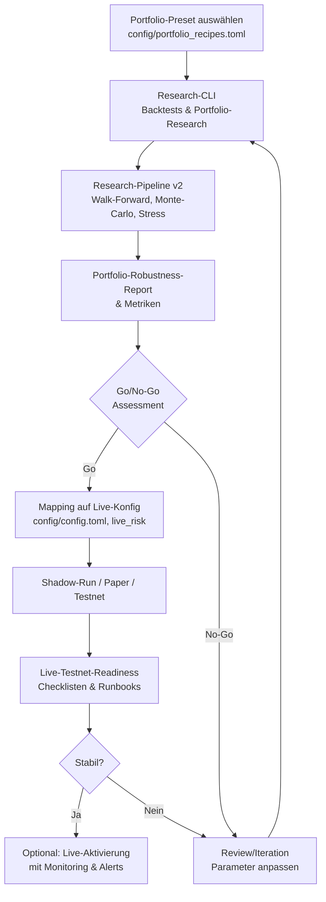

# Peak_Trade – Playbook: Research → Live Portfolios

> **Phase 54** – End-to-End-Prozess für Portfolio-Promotion von Research bis Live
>
> **Ziel:** Reproduzierbarer, dokumentierter Weg von Portfolio-Presets in der Research-Welt hin zu einer konservativen, dokumentierten Live-/Testnet-Aktivierung.

---

## 1. Einleitung

Dieses Playbook beschreibt den **kompletten Weg** von einem Portfolio-Preset (z.B. `multi_style_moderate` oder `rsi_reversion_conservative`) in der Research-Welt hin zu einer **Shadow-/Testnet-/Live-Deployment-Entscheidung**.

### Fokus

- **Reproduzierbare Research-Schritte**: Klare CLI-Commands und Workflows
- **Klare Go/No-Go-Kriterien**: Metriken-basierte Entscheidungslogik
- **Saubere Dokumentation**: Jeder Schritt wird dokumentiert
- **Sichere Überführung**: Governance & Safety-Anbindung bei jedem Schritt

### Einbettung im Peak_Trade-Ökosystem

Dieses Playbook verknüpft:

- **Research-Track**: Backtests, Sweeps, Portfolio-Robustness (Phase 43, 47, 53)
- **Live-/Testnet-Track**: Shadow-Runs, Testnet, Live-Operations (Phase 17, 38, 48, 49, 50, 51)
- **Governance & Safety**: Risk-Policies, Go/No-Go-Kriterien (Phase 25)

**Verwandte Dokumente:**

- [`ARCHITECTURE_OVERVIEW.md`](ARCHITECTURE_OVERVIEW.md) – High-Level-Architektur
- [`PEAK_TRADE_STATUS_OVERVIEW.md`](PEAK_TRADE_STATUS_OVERVIEW.md) – Aktueller Gesamtstatus
- [`PORTFOLIO_RECIPES_AND_PRESETS.md`](PORTFOLIO_RECIPES_AND_PRESETS.md) – Portfolio-Auswahl & Presets
- [`LIVE_TESTNET_TRACK_STATUS.md`](LIVE_TESTNET_TRACK_STATUS.md) – Reifegrad des Live-Stacks
- [`GOVERNANCE_AND_SAFETY_OVERVIEW.md`](GOVERNANCE_AND_SAFETY_OVERVIEW.md) – Governance-Rahmen

---

## 2. Rollen & Voraussetzungen

### Rollen

| Rolle | Verantwortung |
|-------|---------------|
| **Quant/Research** | Backtests, Sweeps, Robustheits-Analysen, Metriken-Interpretation |
| **Operator/Ops** | Überwachung von Live-/Testnet-Runs, Alerts, Runbooks, Incident-Handling |
| **Risk/Governance** | Definition von Risk-Policies, Go/No-Go-Kriterien, Freigaben für Live-Promotion |

### Voraussetzungen

- ✅ Peak_Trade-Projekt ist aufgebaut (Python-Umgebung, Tests grün)
- ✅ Zugriff auf historische Daten für die gewünschten Märkte (z.B. BTC/ETH)
- ✅ Portfolio-Recipes sind definiert (`config/portfolio_recipes.toml`)
- ✅ Live-/Risk-/Alerts-Konfiguration in `config/config.toml` vorhanden
- ✅ Research-Pipeline v2 ist funktionsfähig (Phase 43)
- ✅ Portfolio-Robustness-Module sind verfügbar (Phase 47)

---

## 3. Überblick: Pipeline „Research → Live Portfolios"



**Textuelle Übersicht:**

1. **Portfolio-Preset auswählen** (Schritt 4)
2. **Basis-Research & erste Backtests** (Schritt 5)
3. **Research-Pipeline v2 & Portfolio-Robustheit** (Schritt 6)
4. **Metriken & Schwellen: Go/No-Go-Logik** (Schritt 7)
5. **Go/No-Go-Entscheidung & Dokumentation** (Schritt 8)
6. **Mapping Research → Live-Konfiguration** (Schritt 9)
7. **Shadow-/Paper-/Testnet-Phase** (Schritt 10)
8. **Laufendes Monitoring & Re-Kalibrierung** (Schritt 11)

---

## 4. Schritt 1 – Portfolio-Preset auswählen

### Verweise

- [`PORTFOLIO_RECIPES_AND_PRESETS.md`](PORTFOLIO_RECIPES_AND_PRESETS.md) – Übersicht aller verfügbaren Presets
- `config/portfolio_recipes.toml` – Rezept-Definitionen

### Verfügbare Presets (Phase 53)

| Preset | Beschreibung | Risk-Profil | Assets | Style(s) |
|--------|--------------|-------------|--------|----------|
| `rsi_reversion_conservative` | Defensives Mean-Reversion-Portfolio | conservative | BTC, ETH | RSI-Reversion |
| `rsi_reversion_moderate` | Balanced Mean-Reversion-Portfolio | moderate | BTC, ETH | RSI-Reversion |
| `rsi_reversion_aggressive` | Aggressives Mean-Reversion-Portfolio | aggressive | BTC, ETH | RSI-Reversion |
| `multi_style_moderate` | Mischung aus Trend + Mean-Reversion | moderate | BTC, ETH | Trend + Reversion |
| `multi_style_aggressive` | Aggressive Multi-Style-Variante | aggressive | BTC, ETH | Trend + Reversion |

### Kriterien für die Wahl

1. **Ziel-Volatilität & Risk-Profil**
   - `conservative`: Geringere Volatilität, breitere Stops, niedrigere Position-Sizes
   - `moderate`: Ausgewogener Kompromiss aus Return & Drawdown
   - `aggressive`: Höhere Volatilität, kürzere Lookbacks, mehr Trade-Frequenz

2. **Märkte & Timeframes**
   - Welche Assets sind relevant? (z.B. BTC/ETH)
   - Welche Timeframes passen zum Handels-Horizont? (1h, 4h, 15m)

3. **Handels-Horizont**
   - **Intraday**: Kürzere Timeframes (15m, 30m), höhere Trade-Frequenz
   - **Swing**: Längere Timeframes (1h, 4h), moderate Trade-Frequenz

### Beispiel-Auswahl

```bash
# Konservatives Portfolio für defensives Trading
PORTFOLIO_PRESET="rsi_reversion_conservative"

# Oder: Multi-Style für Diversifikation
PORTFOLIO_PRESET="multi_style_moderate"
```

---

## 5. Schritt 2 – Basis-Research & erste Backtests

### 5.1 Erster Portfolio-Run

**Command:**

```bash
python scripts/research_cli.py portfolio \
  --config config/config.toml \
  --portfolio-preset rsi_reversion_conservative \
  --format both
```

**Was passiert:**

- Lädt Portfolio-Rezept `rsi_reversion_conservative` aus `config/portfolio_recipes.toml`
- Führt Backtests für alle Strategien im Portfolio durch
- Aggregiert Ergebnisse auf Portfolio-Ebene
- Generiert Reports (Markdown + HTML) mit Metriken und Plots

**Outputs:**

- Portfolio-Report in `results/reports/portfolio_*`
- Metriken: CAGR, Sharpe, Max Drawdown, Volatilität, etc.
- Equity-Curve-Plots
- Trade-Statistiken pro Strategie

### 5.2 Erste Interpretation

**Kern-Kennzahlen (erste Einschätzung):**

| Metrik | Bedeutung | Erste Einschätzung |
|--------|-----------|-------------------|
| **CAGR / Annualized Return** | Jährliche Rendite | Sollte positiv sein, aber hier noch keine harte Schwelle |
| **Volatilität** | Standardabweichung der Returns | Sollte zum Risk-Profil passen (conservative = niedrig, aggressive = höher) |
| **Sharpe Ratio** | Risk-adjusted Return | Erste Orientierung: > 0.5 ist gut, > 1.0 ist sehr gut |
| **Max Drawdown** | Größter Verlust vom Peak | Sollte zum Risk-Profil passen (conservative < 20%, aggressive < 40%) |
| **Hit-Ratio** | Anteil profitabler Trades | > 50% ist ein gutes Zeichen |
| **Profit-Factor** | Summe Gewinne / Summe Verluste | > 1.2 ist ein gutes Zeichen |

**Hinweis:** In diesem Schritt noch **keine harten Go/No-Go-Entscheidungen**, nur ein grobes Gefühl, ob das Portfolio grundsätzlich vielversprechend ist.

**Beispiel-Interpretation:**

```text
✅ Portfolio zeigt positive CAGR (8.5% p.a.)
✅ Sharpe Ratio ist akzeptabel (1.1)
⚠️  Max Drawdown ist mit 18% etwas hoch für conservative
✅ Hit-Ratio ist gut (55%)
→ Portfolio ist ein Kandidat für weitere Robustheits-Tests
```

---

## 6. Schritt 3 – Research-Pipeline v2 & Portfolio-Robustheit

### 6.1 Research-Pipeline v2 laufen lassen

**Verweise:**

- Phase 43 – Research-Pipeline v2 Dokumentation
- `scripts/research_cli.py` – Pipeline-Subcommand

**Beispiel-Command:**

```bash
python scripts/research_cli.py pipeline \
  --sweep-name rsi_reversion_basic \
  --config config/config.toml \
  --format both \
  --with-plots \
  --top-n 5 \
  --run-walkforward \
  --walkforward-train-window 90d \
  --walkforward-test-window 30d \
  --run-montecarlo \
  --mc-num-runs 1000 \
  --run-stress-tests \
  --stress-scenarios single_crash_bar vol_spike
```

**Was passiert:**

1. **Sweep**: Parameter-Optimierung für RSI-Reversion-Strategien
2. **Top-N-Auswahl**: Beste 5 Konfigurationen werden ausgewählt
3. **Walk-Forward**: Out-of-Sample-Test mit Rolling-Window
4. **Monte-Carlo**: Robustheit gegenüber Sampling-Noise (1000 Runs)
5. **Stress-Tests**: Verhalten in Crash-/Volatility-Szenarien

**Outputs:**

- Sweep-Report mit Top-Konfigurationen
- Walk-Forward-Report (Train vs. Test-Performance)
- Monte-Carlo-Report (Verteilung der Metriken)
- Stress-Test-Report (Performance in Crash-Szenarien)

### 6.2 Portfolio-Robustness (Phase 47) explizit

**Command:**

```bash
python scripts/run_portfolio_robustness.py \
  --config config/config.toml \
  --portfolio-preset multi_style_moderate \
  --run-montecarlo \
  --mc-num-runs 3000 \
  --run-stress-tests \
  --stress-scenarios single_crash_bar vol_spike \
  --stress-severity 0.25 \
  --format both
```

**Was passiert:**

- Portfolio-Robustness auf **Portfolio-Ebene** (nicht nur Einzel-Strategien)
- Monte-Carlo-Simulation mit 3000 Runs
- Stress-Tests mit definierter Severity (0.25 = 25% Crash-Simulation)
- Portfolio-Level-Metriken (Korrelation, Diversifikation, etc.)

**Zusätzliche Outputs (vs. Einzel-Backtests):**

- **Portfolio-Level-Metriken**: Korrelation zwischen Strategien, Diversifikations-Vorteile
- **Monte-Carlo-Verteilung**: Portfolio-Performance unter verschiedenen Szenarien
- **Stress-Test-Ergebnisse**: Portfolio-Drawdown in Crash-Szenarien
- **Risk-Decomposition**: Welche Strategien tragen wie viel zum Gesamt-Risk bei

**Beispiel-Interpretation:**

```text
✅ Portfolio Sharpe (OOS): 1.2 (über Schwelle für moderate)
✅ Max Drawdown (Portfolio): 22% (unter Schwelle für moderate)
✅ Stress-Test (Crash): Drawdown 28% (akzeptabel für moderate)
✅ Monte-Carlo: 95% der Runs zeigen Sharpe > 0.8
→ Portfolio ist robust und erfüllt moderate-Kriterien
```

---

## 7. Schritt 4 – Metriken & Schwellen: Go/No-Go-Logik vorbereiten

Dieser Abschnitt definiert **empfohlene Richtwerte** für Go/No-Go-Entscheidungen. Diese sind als **Guardrails** zu verstehen und sollten mit `GOVERNANCE_AND_SAFETY_OVERVIEW.md` abgestimmt sein.

### Empfohlene Richtwerte

| Profil | Sharpe (OOS) | Max Drawdown (Portfolio) | Stress-Szenario (Crash) | Bemerkung |
|--------|--------------|--------------------------|-------------------------|-----------|
| **conservative** | ≥ 0.8 – 1.0 | ≤ 15–20% | Drawdown im Crash ≤ 25–30% | Fokus auf Drawdown-Kontrolle |
| **moderate** | ≥ 1.0 – 1.3 | ≤ 25–30% | Crash-Drawdown ≤ 35–40% | Balanced Return vs. Risk |
| **aggressive** | ≥ 1.2 – 1.5 | ≤ 35–40% | Crash-Drawdown ≤ 45–50% | Höhere Returns, höhere DD akzeptiert |

### Zusätzliche qualitative Checks

1. **Regime-Stabilität**: Portfolio sollte in verschiedenen Markt-Regimen (Trending, Ranging, Volatile) funktionieren
2. **Korrelation**: Strategien im Portfolio sollten nicht zu stark korreliert sein (Diversifikation)
3. **Trade-Frequenz**: Sollte zum Risk-Profil passen (conservative = weniger Trades, aggressive = mehr Trades)

### Konservative Entscheidungslogik

**Bei borderline-Fällen:**

- **Im Zweifel konservativ entscheiden**: Lieber ein Portfolio mehr testen als zu früh live gehen
- **Zusätzliche Checks**: Wenn Metriken knapp über/unter Schwellen sind, weitere Tests durchführen
- **Dokumentation**: Alle Entscheidungen dokumentieren, auch wenn sie "No-Go" sind

---

## 8. Schritt 5 – Go/No-Go-Entscheidung & Dokumentation

### Decision-Flow

```
1. Metriken checken (Schritt 7)
   │
   ├─→ Wenn Kennzahlen deutlich über Richtwerten → Go-Kandidat
   │
   ├─→ Wenn Kennzahlen teilweise darunter → Review/Iteration
   │   │
   │   └─→ Parameter anpassen, Portfolio anpassen → zurück zu Schritt 2
   │
   └─→ Wenn Kennzahlen klar unzureichend → No-Go
       │
       └─→ Dokumentieren und ggf. Portfolio verwerfen oder später erneut prüfen
```

### Dokumentation

**Empfohlenes Template:**

Erstelle ein Dokument `docs/PORTFOLIO_DECISION_LOG.md` (oder ähnlich) mit folgender Struktur:

```markdown
# Portfolio Decision Log

## Portfolio: rsi_reversion_conservative
**Datum:** 2025-12-15
**Preset:** rsi_reversion_conservative
**Risk-Profil:** conservative

### Kern-Metriken
- Sharpe (OOS): 1.05
- Max Drawdown: 18%
- Stress-Test (Crash): 26%
- Monte-Carlo (95% CI): Sharpe 0.9 - 1.2

### Entscheidung
**Status:** PROMOTE_TO_SHADOW

**Begründung:**
- Sharpe über Schwelle für conservative (≥ 0.8)
- Max Drawdown akzeptabel (18% < 20%)
- Stress-Test zeigt robustes Verhalten
- Monte-Carlo bestätigt Stabilität

### Nächste Schritte
1. Shadow-Run für 2 Wochen
2. Vergleich Shadow-Performance mit Research-Ergebnissen
3. Bei Erfolg → Testnet-Promotion

### Reports
- Portfolio-Robustness-Report: `results/reports/portfolio_robustness_2025-12-15/`
- Research-Pipeline-Report: `results/reports/pipeline_rsi_reversion_2025-12-15/`
```

**Mögliche Entscheidungs-Status:**

- `REJECT` – Portfolio erfüllt Kriterien nicht, wird verworfen
- `REVISE` – Portfolio muss angepasst werden, zurück zu Schritt 2
- `PROMOTE_TO_SHADOW` – Portfolio ist bereit für Shadow-Run
- `PROMOTE_TO_TESTNET` – Portfolio hat Shadow-Phase erfolgreich durchlaufen
- `PROMOTE_TO_LIVE` – Portfolio ist bereit für Live-Trading (nur nach Testnet-Erfolg)

### Bezug zu Governance

**Verweise:**

- [`GOVERNANCE_AND_SAFETY_OVERVIEW.md`](GOVERNANCE_AND_SAFETY_OVERVIEW.md) – Governance-Rahmen
- [`SAFETY_POLICY_TESTNET_AND_LIVE.md`](SAFETY_POLICY_TESTNET_AND_LIVE.md) – Safety-Policies

**Wichtig:**

- **Jede Promotion** in den Live-/Testnet-Track sollte dokumentiert und durch definierte Rollen freigegeben werden (z.B. Research + Risk)
- **Keine Alleingänge**: Bei Unsicherheit immer konservativ entscheiden
- **Versionierung**: Alle Config-Änderungen sollten versioniert sein (Git)

---

## 9. Schritt 6 – Mapping Research → Live-Konfiguration

### 9.1 Strategy-Ebene

**Strategy-Konfigurationen in `config/config.toml`:**

Die Research-Presets verwenden bereits Strategy-Konfigurationen, die direkt in Live genutzt werden können:

```toml
# Beispiel: RSI Reversion BTC Conservative
[strategy.rsi_reversion_btc_conservative]
rsi_window = 21
lower = 25.0
upper = 75.0
# ... weitere Parameter
```

**Sicherstellen:**

- ✅ Dieselben Parameter wie im Research-Setup verwendet werden
- ✅ Timeframes & Symbole identisch sind (oder bewusst angepasst und dokumentiert)
- ✅ Stop-Loss / Take-Profit-Parameter konsistent sind

### 9.2 Portfolio-Ebene

**Mapping der `strategies` + `weights` aus `portfolio_recipes.toml`:**

```toml
# Beispiel: multi_style_moderate
strategies = [
  "rsi_reversion_btc_moderate",
  "rsi_reversion_eth_moderate",
  "ma_trend_btc_moderate",
  "trend_following_eth_moderate",
]
weights = [0.25, 0.25, 0.25, 0.25]
```

**Hinweis:** Wenn der Live-Layer derzeit nur Strategien einzeln behandelt, muss das Portfolio evtl. "implizit" über mehrere parallele Strategien abgebildet werden. Die Gewichte können dann über Position-Sizing oder Capital-Allocation umgesetzt werden.

### 9.3 Risk-Limits

**Verweise auf `[live_risk]` in `config/config.toml`:**

```toml
[live_risk]
enabled = true
base_currency = "EUR"
max_order_notional = 1000.0
max_symbol_exposure_notional = 2000.0
max_total_exposure_notional = 5000.0
max_open_positions = 5
max_daily_loss_abs = 500.0
max_daily_loss_pct = 5.0
block_on_violation = true
```

**Anpassung an Portfolio:**

| Portfolio-Typ | Empfohlene Limits | Begründung |
|---------------|-------------------|------------|
| **conservative** | Niedrige Max-Exposure, enge Daily-Loss-Limits | Fokus auf Drawdown-Kontrolle |
| **moderate** | Moderate Limits, ausgewogen | Balanced Risk |
| **aggressive** | Höhere Limits (aber im Governance-Rahmen) | Mehr Trade-Frequenz erlaubt |

**Beispiel-Anpassung für `rsi_reversion_conservative`:**

```toml
[live_risk]
# Conservative Portfolio → konservative Limits
max_order_notional = 800.0  # Niedriger als Default
max_symbol_exposure_notional = 1500.0  # Niedriger als Default
max_total_exposure_notional = 3000.0  # Niedriger als Default
max_daily_loss_abs = 300.0  # Enger als Default
max_daily_loss_pct = 3.0  # Enger als Default
```

### 9.4 Alerts & Monitoring

**Alerts aktivieren:**

```toml
[live_alerts]
enabled = true
min_level = "warning"
sinks = ["log", "stderr"]  # Optional: "webhook", "slack_webhook"
log_logger_name = "peak_trade.live.alerts"
```

**Sinks konfigurieren:**

- **Logging**: Standard-Logging (immer aktiv)
- **Stderr**: Konsolen-Output (für Development)
- **Webhook**: HTTP-Webhooks (für externe Systeme)
- **Slack**: Slack-Webhooks (für Team-Notifications)

**Testen:**

```bash
# Teste Alert-System
python scripts/live_ops.py health --config config/config.toml
```

---

## 10. Schritt 7 – Shadow-/Paper-/Testnet-Phase

### Verweise

- [`LIVE_READINESS_CHECKLISTS.md`](LIVE_READINESS_CHECKLISTS.md) – Checklisten für Live-Readiness
- [`RUNBOOKS_AND_INCIDENT_HANDLING.md`](RUNBOOKS_AND_INCIDENT_HANDLING.md) – Incident-Handling
- [`LIVE_TESTNET_PREPARATION.md`](LIVE_TESTNET_PREPARATION.md) – Testnet-Vorbereitung

### Stufenplan

#### 10.1 Shadow-Run / Paper-Mode

**Ziel:** Portfolio auf historischen oder Live-Daten passiv mitlaufen lassen (ohne echte Orders).

**Aktivierung:**

```bash
# Shadow-Run starten (Paper-Mode)
python scripts/run_shadow_paper_session.py \
  --config config/config.toml \
  --symbol BTC/EUR \
  --timeframe 1h \
  --duration-hours 168  # 1 Woche
```

**Monitoring:**

```bash
# Portfolio-Snapshot anzeigen
python scripts/live_ops.py portfolio \
  --config config/config.toml

# Health-Check
python scripts/live_ops.py health \
  --config config/config.toml
```

**Vergleich:**

- Metriken der Shadow-Phase mit Research-Ergebnissen vergleichen
- Performance sollte ähnlich sein (mit Toleranz für Market-Noise)
- Bei größeren Abweichungen: Ursache analysieren

**Dauer:** Empfohlen 1–2 Wochen

#### 10.2 Testnet-Phase

**Voraussetzungen:**

- ✅ Shadow-Phase erfolgreich abgeschlossen
- ✅ Testnet-Exchange konfiguriert (Phase 38)
- ✅ Live-Risk-Limits aktiv
- ✅ Alerts aktiv

**Aktivierung:**

```bash
# Testnet-Session starten
python scripts/run_testnet_session.py \
  --config config/config.toml \
  --profile ma_crossover_small  # Oder custom Profile
```

**Monitoring:**

- Portfolio-Snapshots regelmäßig prüfen
- Alerts überwachen (Risk-Violations, große Verluste, etc.)
- Runbooks für typische Incidents befolgen

**Dauer:** Empfohlen 2–4 Wochen

#### 10.3 Promotion in Live

**Voraussetzungen:**

- ✅ Research-Metriken stimmen
- ✅ Shadow-Phase unauffällig
- ✅ Testnet-Phase stabil
- ✅ **Checklisten** in `LIVE_READINESS_CHECKLISTS.md` erfüllt
- ✅ Governance-Freigabe (Research + Risk)

**Aktivierung:**

```bash
# Live-Session starten (NUR nach expliziter Freigabe!)
python scripts/live_ops.py start \
  --config config/config.toml \
  --confirm-token <TOKEN>  # Safety-Token erforderlich
```

**Wichtig:** Live-Aktivierung sollte **nur nach expliziter Freigabe** erfolgen und mit einem Safety-Token bestätigt werden.

---

## 11. Schritt 8 – Laufendes Monitoring & Re-Kalibrierung

### 11.1 Monitoring-Tools

**Live-Ops CLI:**

```bash
# Health-Check
python scripts/live_ops.py health --config config/config.toml

# Portfolio-Snapshot (Text)
python scripts/live_ops.py portfolio --config config/config.toml

# Portfolio-Snapshot (JSON)
python scripts/live_ops.py portfolio --config config/config.toml --json

# Order-Status
python scripts/live_ops.py orders --config config/config.toml
```

**Alerts (Slack/Webhook):**

- Tägliche oder Event-basierte Alerts im Channel
- Automatische Benachrichtigungen bei Risk-Violations
- Performance-Updates (optional)

### 11.2 Re-Kalibrierung / Re-Balancing

**Regelmäßige Reviews (empfohlen: monatlich / quartalsweise):**

1. **Portfolio erneut durch Research-Pipeline v2 / Portfolio-Robustness schicken**
   - Neue Daten einbeziehen
   - Performance & Risk-Metriken überprüfen

2. **Entscheidungen dokumentieren:**
   - Weights anpassen
   - Strategies austauschen
   - Portfolio ggf. deaktivieren

3. **Beispiel-Workflow:**

```bash
# 1. Aktuelle Performance analysieren
python scripts/live_ops.py portfolio --config config/config.toml --json > current_performance.json

# 2. Portfolio erneut durch Robustness-Tests schicken
python scripts/run_portfolio_robustness.py \
  --config config/config.toml \
  --portfolio-preset multi_style_moderate \
  --format both

# 3. Vergleich: Aktuelle Performance vs. Research-Ergebnisse
# 4. Entscheidung: Anpassen oder beibehalten
```

### 11.3 Incident-Prozesse

**Verweise:**

- [`RUNBOOKS_AND_INCIDENT_HANDLING.md`](RUNBOOKS_AND_INCIDENT_HANDLING.md) – Incident-Handling

**Typische Incidents:**

- **PnL-Divergenzen**: Performance weicht von Research-Ergebnissen ab
- **Data-Gaps**: Fehlende Marktdaten
- **Risk-Limit-Verletzungen**: Limits werden überschritten
- **Exchange-Issues**: Probleme mit Exchange-API

**Hinweis:** Dieses Playbook beschreibt nur den "Happy Path" – Incidents werden in den Runbooks behandelt.

---

## 12. Anhang – Konkrete Beispiel-Playbooks

### Beispiel A: `rsi_reversion_conservative`

**Schritt 1: Preset auswählen**
```bash
PORTFOLIO_PRESET="rsi_reversion_conservative"
```

**Schritt 2: Basis-Research**
```bash
python scripts/research_cli.py portfolio \
  --config config/config.toml \
  --portfolio-preset rsi_reversion_conservative \
  --format both
```
**Ergebnis:** Sharpe 1.05, MaxDD 18%, Hit-Ratio 55% → ✅ Kandidat

**Schritt 3: Portfolio-Robustness**
```bash
python scripts/run_portfolio_robustness.py \
  --config config/config.toml \
  --portfolio-preset rsi_reversion_conservative \
  --run-montecarlo --mc-num-runs 2000 \
  --run-stress-tests --stress-scenarios single_crash_bar vol_spike \
  --format both
```
**Ergebnis:** Sharpe (OOS) 1.0, Stress-DD 26% → ✅ Erfüllt conservative-Kriterien

**Schritt 4: Go/No-Go**
- ✅ Sharpe ≥ 0.8 (1.0)
- ✅ MaxDD ≤ 20% (18%)
- ✅ Stress-DD ≤ 30% (26%)
- **Entscheidung:** `PROMOTE_TO_SHADOW`

**Schritt 5: Mapping**
- Strategy-Configs: `rsi_reversion_btc_conservative`, `rsi_reversion_eth_conservative`
- Risk-Limits: Konservativ angepasst (max_order_notional = 800.0, etc.)

**Schritt 6: Shadow-Run**
- 2 Wochen Shadow-Run
- Performance ähnlich zu Research → ✅

**Schritt 7: Testnet**
- 2 Wochen Testnet
- Stabil, keine Incidents → ✅

**Schritt 8: Live (optional)**
- Nach Governance-Freigabe → Live-Aktivierung

---

### Beispiel B: `multi_style_moderate`

**Schritt 1: Preset auswählen**
```bash
PORTFOLIO_PRESET="multi_style_moderate"
```

**Schritt 2: Basis-Research**
```bash
python scripts/research_cli.py portfolio \
  --config config/config.toml \
  --portfolio-preset multi_style_moderate \
  --format both
```
**Ergebnis:** Sharpe 1.2, MaxDD 22%, Diversifikation gut → ✅ Kandidat

**Schritt 3: Portfolio-Robustness**
```bash
python scripts/run_portfolio_robustness.py \
  --config config/config.toml \
  --portfolio-preset multi_style_moderate \
  --run-montecarlo --mc-num-runs 3000 \
  --run-stress-tests --stress-scenarios single_crash_bar vol_spike \
  --stress-severity 0.25 \
  --format both
```
**Ergebnis:** Sharpe (OOS) 1.15, Stress-DD 32%, Korrelation niedrig → ✅ Erfüllt moderate-Kriterien

**Schritt 4: Go/No-Go**
- ✅ Sharpe ≥ 1.0 (1.15)
- ✅ MaxDD ≤ 30% (22%)
- ✅ Stress-DD ≤ 40% (32%)
- ✅ Diversifikation: Korrelation zwischen Strategien < 0.5
- **Entscheidung:** `PROMOTE_TO_SHADOW`

**Schritt 5: Mapping**
- Strategy-Configs: 4 Strategien (RSI BTC/ETH, MA BTC, Trend ETH)
- Risk-Limits: Moderate Limits (Standard-Werte)

**Schritt 6–8:** Analog zu Beispiel A

---

## 13. Zusammenfassung & Best Practices

### Zusammenfassung

Dieses Playbook beschreibt einen **reproduzierbaren, dokumentierten Weg** von Portfolio-Presets in der Research-Welt hin zu einer konservativen, dokumentierten Live-/Testnet-Aktivierung.

**Kern-Prinzipien:**

1. **Reproduzierbarkeit**: Jeder Schritt ist mit CLI-Commands dokumentiert
2. **Metriken-basierte Entscheidungen**: Klare Go/No-Go-Kriterien
3. **Dokumentation**: Alle Entscheidungen werden dokumentiert
4. **Governance-Anbindung**: Jede Promotion folgt definierten Prozessen

### Best Practices

1. **Konservativ entscheiden**: Im Zweifel lieber ein Portfolio mehr testen
2. **Dokumentieren**: Alle Entscheidungen und Metriken dokumentieren
3. **Versionieren**: Config-Änderungen in Git versionieren
4. **Regelmäßige Reviews**: Portfolios regelmäßig neu evaluieren
5. **Incident-Handling**: Runbooks für typische Probleme befolgen

### Nächste Schritte

- **Neue Portfolios evaluieren**: Nutze dieses Playbook für neue Portfolio-Presets
- **Bestehende Portfolios re-evaluieren**: Regelmäßige Reviews durchführen
- **Playbook verbessern**: Feedback einarbeiten, Prozesse verfeinern

---

**Built with ❤️ and safety-first architecture**

