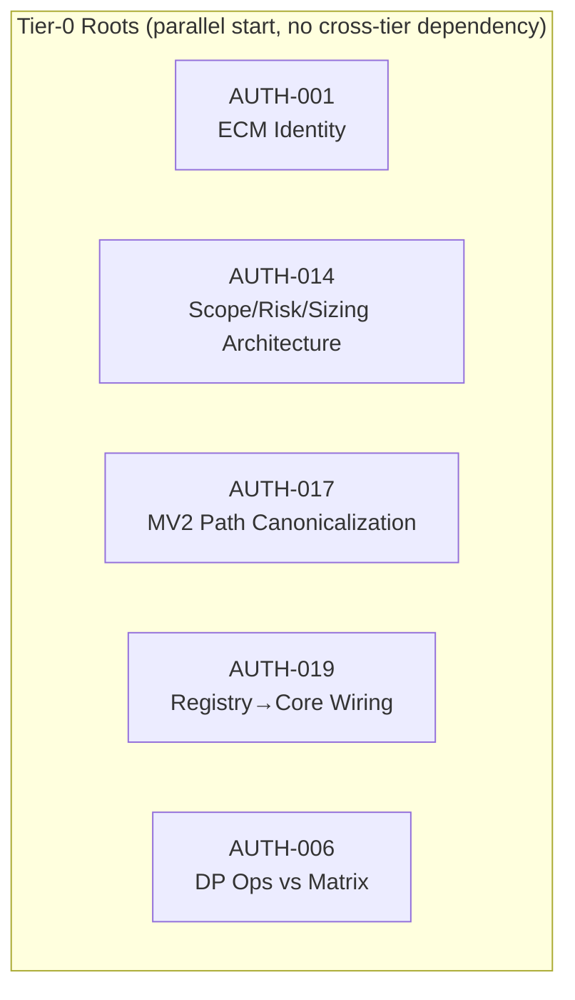
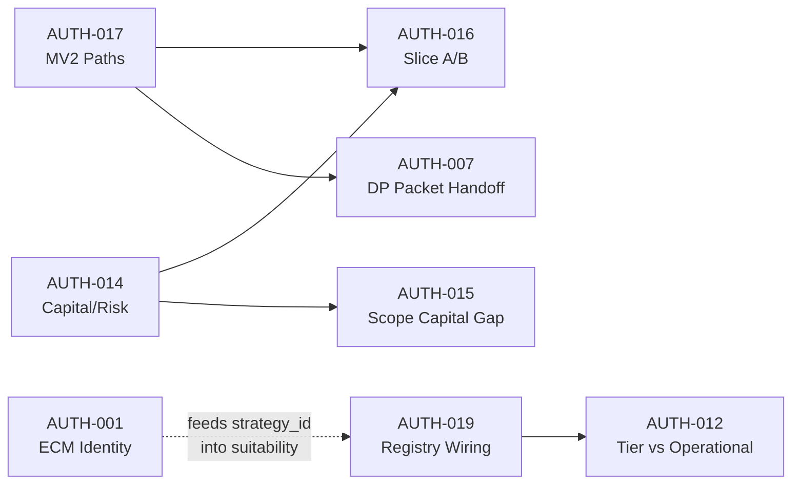

# Authority Resolution Synthesis v1

**Status:** READ-ONLY PROPOSAL — keine Auflösung, keine Enforcement, keine Implementierung  
**Erzeugt:** 2026-07-05  
**Branch:** `main` @ `2f1672bee8761f8d50def3f6ef31cc803824b2e9`  
**Input:** [`authority_conflict_matrix_v1.md`](authority_conflict_matrix_v1.md) (23 Konflikte)  
**Scope:** Kanonische Strukturvorschläge only — **kein** finaler Implementierungsentscheid

---

## Zweck

Dieses Dokument transformiert die Authority Conflict Matrix v1 in einen **Resolution Proposal Graph**: Domain-Cluster, Single-Source-of-Truth-Kandidaten, Abhängigkeitsreihenfolge und Collapse-Chains bei falscher Auflösung. Es wählt **keine** finale Implementierung und mutiert **kein** Registry-, Runtime- oder Strategy-Layer-Artefakt.

**Validation Rule (frozen, aus Matrix übernommen):**

```text
NOT in Runtime Decision Core → NON-OPERATIONAL (even if implemented)
```

---

## Section 1: Domain Clusters (A / B / C)

### Domain A — ECM Domain

**Scope:** Strategy-Identität, Config-Registry-Split, Feature-Engine-Pfad vs Strategy-Layer, parallele ECM/Armstrong-Implementierungen, Tier/Live-Readiness für Armstrong-Familie, Alias-Inkonsistenz (ECM-spezifisch).

| AUTH-ID | Kurzbezeichnung | Typ | Risiko | Rolle im Cluster |
|---------|-----------------|-----|--------|------------------|
| **AUTH-001** | `ecm_cycle` vs `armstrong_cycle` identity | C | HIGH | **Root-Konflikt** — alle ECM-Identitätsableitungen hängen hier |
| **AUTH-002** | Config `[strategy.ecm_cycle]` ohne StrategySpec | C | HIGH | Downstream von AUTH-001 |
| **AUTH-003** | `src/features/` vs Strategy-layer ECM | A+D | MEDIUM | Schicht-Ambiguität; docs-deferred, kein Code-Umzug |
| **AUTH-004** | `ecm.py` (functional) vs `ArmstrongCycleStrategy` (OOP) | D | MEDIUM | Semantik-Split; downstream von AUTH-001 |
| **AUTH-005** | Armstrong live-readiness metadata triangle | C+B | HIGH | Parallel zu AUTH-001; Dual-Source Tiering |
| **AUTH-013** | Alias policy: `el_karoui_vol_v1` aliased, `ecm_cycle` not | C | MEDIUM | Registry-Grammatik; ECM-spezifischer Ableger von AUTH-001 |
| **AUTH-020** | `el_karoui_vol_model` registry vs R&D docs drift | A+B | MEDIUM | **Pattern-Analog** zu AUTH-005 (Tier-Dual-Source); kein ECM-Kern, aber gleiche Leseregel |

**Residual Docs-Echo (Domain A):** AUTH-003 teilt B-01-Abhängigkeit; kein separater Authority-Kern.

**Cluster-Größe:** 7 primäre Konflikte (+ 1 Pattern-Analog)

---

### Domain B — Decision / Execution Domain (Double Play / Core Runtime)

**Scope:** MV2 Offline Decision Core, Double Play Authority, parallele Replay-/Packet-Pfade, Slice A/B-Grenze, Registry→Suitability→Replay-Wiring, Registry-Operational-Semantik, Strategy-Registry-Orphans und Functional-ID-Policy.

| AUTH-ID | Kurzbezeichnung | Typ | Risiko | Rolle im Cluster |
|---------|-----------------|-----|--------|------------------|
| **AUTH-006** | Ops DP evaluator vs MV2 composition matrix | B | HIGH | **DP-Authority-Root** — Legacy vs canonical offline |
| **AUTH-007** | Packet handoff vs runtime DP observations | D | MEDIUM | Downstream von AUTH-006 / AUTH-DP-02 |
| **AUTH-008** | Multiple Double Play replay surfaces | D | MEDIUM | Downstream von AUTH-017 |
| **AUTH-012** | Registry production tier vs Runtime NON-OPERATIONAL | B | HIGH | **Operational-Semantik-Root** — Tier ≠ wired |
| **AUTH-016** | Slice A vs Slice B authority split | D | MEDIUM | Architektur-Grenze Replay ↔ Bridge |
| **AUTH-017** | Decision Packet flow vs Integrated Replay | D | HIGH | **MV2-Path-Root** — compute vs handoff schema |
| **AUTH-019** | No default Registry → Suitability → Replay wiring | B | HIGH | **Strategy→Core-Wiring-Root** |
| **AUTH-009** | `breakout_confirmation_v1` orphan module | C | MEDIUM | Registry-Subcluster; unabhängiger Leaf |
| **AUTH-010** | Functional-only IDs without full OOP StrategySpec | C | MEDIUM | Registry-Subcluster; Policy-Leaf |
| **AUTH-011** | `rsi_strategy` vs `rsi_reversion` dual identity | C | MEDIUM | Registry-Subcluster; hängt an AUTH-010 Policy |

**Residual Docs-Echo (Domain B):** AUTH-021 (Feature-Engine stale DAG), AUTH-022 (R&D stub grammar) — LOW, structural docs only.

**Cluster-Größe:** 10 primäre Konflikte (+ 2 Docs-Echo)

**Cross-Domain-Kante:** AUTH-016 und AUTH-017 berühren Domain C (Slice B = Capital/Risk); als **Boundary-Konflikte** modelliert, primär in B verankert.

---

### Domain C — Capital & Risk Domain (Scope / Sizing / Risk / Packet)

**Scope:** Runbook-Owner-Split vs merged `capital_risk_sizing_v1`, Scope Capital Replay-Lücke, Attestation-Slot-Modell, Packet-Handoff für Scope Capital.

| AUTH-ID | Kurzbezeichnung | Typ | Risiko | Rolle im Cluster |
|---------|-----------------|-----|--------|------------------|
| **AUTH-014** | Runbook 3 owners vs merged sizing module | B+D | HIGH | **Capital/Risk-Root** — Architektur-Ratifikation erforderlich |
| **AUTH-015** | Scope Capital packet vs replay chain absence | B | HIGH | Downstream von AUTH-014 |
| **AUTH-018** | Attestation slots vs merged module | D | MEDIUM | Downstream von AUTH-014 |
| **AUTH-016** | *(shared)* Slice A / Slice B split | D | MEDIUM | **Boundary** — welcher Slice bindet Sizing |
| **AUTH-017** | *(shared)* Packet vs Integrated Replay | D | HIGH | **Boundary** — Packet-Schema vs Compute-Pfad für Capital-Handoff |

**Residual Docs-Echo (Domain C):** Keine dedizierten LOW-Konflikte; Runbook v2.6 vs Code-Divergenz ist Kern von AUTH-014.

**Cluster-Größe:** 3 primäre + 2 geteilte Boundary-Konflikte

---

### Docs-Only Residual Layer (cross-domain, nicht authority-kern)

| AUTH-ID | Kurzbezeichnung | Primär-Domain | Risiko |
|---------|-----------------|---------------|--------|
| **AUTH-021** | `missing_features_plan.md` stale DAG | A (Feature-Engine) | LOW |
| **AUTH-022** | R&D stub status grammar | B (Registry visibility) | LOW |
| **AUTH-023** | Psychology path residual | — (Reporting) | LOW |

Diese Konflikte **kollabieren nicht** durch Authority-Ratifikation in A/B/C — sie erfordern Safe/Structural Docs-Fixes (Section A/B des drift_cleanup_plan).

---

## Section 2: Candidate Canonical Authority per Domain

> **Hinweis:** „Candidate“ = theoretischer SSOT-Vorschlag für Governance-Diskussion. **Nicht** ratifiziert, **nicht** enforced.

### Domain A — ECM Domain

| Aspekt | Candidate SSOT | Competing Authority Layers | Minimal Viable Canonicalization Path (theoretical) |
|--------|----------------|----------------------------|-----------------------------------------------------|
| **Strategy identity** | `armstrong_cycle` als **primary StrategySpec-ID** in `registry.py`; `ecm_cycle` als **legacy/functional alias candidate** (noch nicht gewählt welche Option) | Strategy Layer (`ecm.py` functional loader), Registry (`StrategySpec`), Config (`[strategy.ecm_cycle]`), Docs (post-A kanonisch Strategy-Layer) | **Phase A.1:** Governance Decision Record „ECM Identity“ (R-02) — dokumentiert Optionen (a) alias, (b) config migration, (c) dual-ID matrix **ohne** Code. **Phase A.2:** Einheitliche Alias-Grammatik-Policy (AUTH-013). **Phase A.3:** Config alignment (AUTH-002). **Phase A.4:** Semantik `ecm.py` vs Armstrong OOP (AUTH-004). |
| **Code location / layer** | Strategy Layer only — `src/strategies/ecm.py` + `src/strategies/armstrong/`; Feature-Engine (`src/features/`) = **Class C deferred** | Docs (`missing_features_plan`), CI reference targets, historische Feature-Engine-DAG | Docs-only convergence: deferred header + `feature_state_map_v1` Class C Verweis (B-01); **kein** Modul-Umzug |
| **Live-readiness truth** | `STRATEGY_REGISTRY_TIERING_DUAL_SOURCE_CONTRACT_V1` als **Leseregel-Oberbehörde**; pro `strategy_id` eine ratifizierte Wahrheit — **Quelle noch offen** | `registry.py` Spec fields, `config.toml`, `strategy_tiering.toml` | Separates governed alignment slice; **nicht** aus Read-Model inferieren (AUTH-005, AUTH-020) |

**Domain-A SSOT-Kandidat (Summary):**  
`STRATEGY_ECM_ARMSTRONG_WIRING_INVENTORY_READ_MODEL_V0` (read-only inventory) + zukünftiges **ECM Identity Decision Record** als ratifizierte Identitäts-Wahrheit — bis dahin **kein** impliziter SSOT.

---

### Domain B — Decision / Execution Domain

| Aspekt | Candidate SSOT | Competing Authority Layers | Minimal Viable Canonicalization Path (theoretical) |
|--------|----------------|----------------------------|-----------------------------------------------------|
| **Offline decision compute** | `integrated_offline_trading_logic_replay_v1.py` — inkl. `double_play_composition_matrix_v1` | Ops `evaluate_double_play`, `offline_double_play_scenario_replay_v0`, Decision Packet assemble path | **Phase B.1:** AUTH-017 path canonicalization (compute owner = Integrated Replay). **Phase B.2:** AUTH-006 docs markers (`LEGACY_NON_AUTHORITATIVE`). **Phase B.3:** AUTH-008 subordinate surfaces explizit labeln |
| **Handoff / evidence schema** | `decision_packet_v1` + `local_evaluator_v1` — **deklarativ**, nicht compute-authoritative | Integrated Replay compute outputs, Ops observations, Packet fixtures in scenario replay | Explizite Richtungsregel: Packet = evidence/handoff; Replay = compute — **kein** auto-mirror (AUTH-007) ohne Design Change |
| **Operational semantics** | Validation Rule + `feature_state_map_v1` — **Runtime Core wiring = operational prerequisite** | Registry `tier="production"`, Strategy count, Operator UI assumptions | WG-01 Read Model: Registry-Tier = Promotion-Metadaten; Runtime-Operational = Core-bound + Activation (AUTH-012) |
| **Strategy→Core wiring** | `suitability_binding_v1` + dokumentierte Snapshot-Sequence — **not** implicit `registry.py` | Full `_STRATEGY_REGISTRY`, `mv2_research_wiring_v1` (non-default adapter) | B-04 Read Model spec; optional default snapshot builder — **documented sequence only** (AUTH-019, DEF-02) |
| **Registry functional/OOP policy** | `_LEGACY_ALIASES` + `_FUNCTIONAL_ONLY_STRATEGY_IDS` als **policy surfaces** — unified grammar TBD | Per-ID ad-hoc loaders, orphan modules | AUTH-010 policy ratification → AUTH-011 alias; AUTH-009 disposition leaf (DEF-05) |

**Domain-B SSOT-Kandidat (Summary):**  
`MASTER_V2_DECISION_AUTHORITY_MAP_V1` + `integrated_offline_trading_logic_replay_v1.py` als **offline compute authority**; `feature_state_map_v1` Validation Rule als **operational gate**.

---

### Domain C — Capital & Risk Domain

| Aspekt | Candidate SSOT | Competing Authority Layers | Minimal Viable Canonicalization Path (theoretical) |
|--------|----------------|----------------------------|-----------------------------------------------------|
| **Sizing chain semantics** | `capital_risk_sizing_v1.py` — **merged implementation truth** (ScopeCapitalEnvelope → PreSizingRisk → Sizing → PostSizingRisk) | Runbook v2.6 (3 separate owners: Risk, Sizing, Scope Capital), attestation slot model | **Phase C.1:** Architecture ratification AUTH-014 — Option (a) „merged-by-intent“ **oder** (b) drei Replay-Steps. **Phase C.2:** Runbook annotation alignment. **Phase C.3:** Attestation slot sync (AUTH-018) |
| **Scope Capital replay presence** | *Abhängig von AUTH-014* — entweder dedizierter Replay-Step **oder** bewusst als Slice-B-input merged | `ScopeCapitalEnvelopeHandoffV1` in packet/evaluator only; absent in Integrated Replay | AUTH-015 closure **nach** AUTH-014; R-06 design note |
| **Slice boundary** | Slice A = decision evidence through entry/exit; Slice B = `canonical_core_runtime_integration_intent_pipeline_bridge_v0` → sizing → intent → firewall | Implizite „Slice A completeness“-Annahme, Runbook Step 29P/29Q | Canonical chain documentation; DEF-01 activation design clarifies binding (AUTH-016) |
| **Attestation alignment** | `trading_core_decision_attestation_v1` slot model **aligned to ratified Runbook owners** | Merged module docstring in `capital_risk_sizing_v1` | Post AUTH-014 contract review slice |

**Domain-C SSOT-Kandidat (Summary):**  
**Code-Implementierung** (`capital_risk_sizing_v1`) als *de facto* merge truth; **Runbook v2.6** als *de jure* owner split — **Spannung explizit offen** bis AUTH-014 Ratifikation. Kein SSOT ohne Architecture Decision Record.

---

## Section 3: Dependency Order Graph

### 3.1 Tier-0 — Must Resolve First (blocking roots)



| Priority | AUTH-ID | Domain | Begründung |
|----------|---------|--------|------------|
| **P0-A** | AUTH-001 | A | Blockiert AUTH-002, AUTH-004, AUTH-013, DOC-06 |
| **P0-B** | AUTH-017 | B | Blockiert AUTH-008, B-06, DEF-01 activation clarity |
| **P0-B** | AUTH-019 | B | Blockiert AUTH-012 operational semantics closure, DEF-02 |
| **P0-B** | AUTH-006 | B | Unabhängig docs-markierbar; HIGH bei falscher Ops-Authority-Annahme |
| **P0-C** | AUTH-014 | C | Blockiert AUTH-015, AUTH-018, DEF-03, DEF-04 |

**AUTH-005** (Armstrong tier triangle) und **AUTH-012** (tier vs operational) sind **Tier-0.5** — parallel startbar, aber AUTH-012 **empfiehlt** AUTH-019-Closure für vollständige Read Model.

---

### 3.2 Tier-1 — Downstream (after Tier-0)

```text
AUTH-001 (ECM Identity)
├── AUTH-002 (Config alignment)
├── AUTH-004 (ecm.py vs Armstrong semantics)
├── AUTH-013 (alias policy consistency)
└── DOC-06 closure

AUTH-014 (Scope/Risk/Sizing ratification)
├── AUTH-015 (Scope Capital replay integration)
├── AUTH-016 (Slice A/B documentation — partial)
├── AUTH-018 (Attestation alignment)
├── DEF-03, DEF-04
└── B-05

AUTH-017 (MV2 path canonicalization)
├── AUTH-008 (DP replay surfaces hierarchy)
├── AUTH-007 (Packet vs runtime observations — design boundary)
├── B-06
└── DEF-01 (activation stack)

AUTH-019 (Registry→Core wiring)
├── AUTH-012 (tier vs operational read model)
├── AUTH-010 (functional-only policy — consistency)
│   └── AUTH-011 (rsi dual identity)
├── B-04
└── DEF-02
```

---

### 3.3 Tier-2 — Leaves / Independent

| AUTH-ID | Domain | Abhängigkeit | Unabhängigkeit |
|---------|--------|--------------|----------------|
| AUTH-003 | A | B-01 (docs) | Kein Block auf AUTH-001 für docs-deferred path |
| AUTH-005 | A | Dual-Source Contract | Parallel zu AUTH-001; pattern für AUTH-020 |
| AUTH-009 | B | AUTH-010 policy optional | DEF-05 leaf — disposition unabhängig von ECM |
| AUTH-020 | A | AUTH-005 pattern | El-Karoui-spezifisch; alias docs bereits applied |
| AUTH-021 | — | B-01 | Docs-only |
| AUTH-022 | — | B-02 | Docs-only |
| AUTH-023 | — | A-06 follow-up | Docs-only |

---

### 3.4 Cross-Domain Dependency Edges



**Kritischer Pfad (longest chain):**  
`AUTH-019 → AUTH-012` parallel mit `AUTH-001 → AUTH-002 → AUTH-013` und `AUTH-014 → AUTH-015 → AUTH-018` — Domains A/B/C **können parallel** ratifiziert werden; Cross-Edges betreffen nur Integration-Design (DEF-01), nicht ECM-Identität direkt.

---

### 3.5 Recommended Resolution Wave Order (proposal only)

| Wave | AUTH-IDs | Domain | Artefakt-Typ |
|------|----------|--------|--------------|
| **W1** | AUTH-006, AUTH-017 (docs supplement), AUTH-012 (read model docs) | B | Docs markers + authority map |
| **W2** | AUTH-001, AUTH-014, AUTH-019 | A, C, B | Governance Decision Records (no code) |
| **W3** | AUTH-002, AUTH-004, AUTH-013, AUTH-005, AUTH-010, AUTH-011 | A, B | Post-W2 registry/config alignment **proposal** |
| **W4** | AUTH-015, AUTH-018, AUTH-008, AUTH-007, AUTH-016 | C, B | Architecture design notes |
| **W5** | AUTH-009, AUTH-020, AUTH-003, AUTH-021–023 | Mixed | Leaves + docs echo |

---

## Section 4: Conflict Collapse Chains

> **Collapse Chain** = Kaskade falscher Annahmen, wenn ein Upstream-Konflikt **ohne** Tier-0-Ratifikation „aufgelöst“ wird (z. B. docs-only Fix, implizite Alias-Annahme, Tier-Inflation).

### 4.1 Domain A — ECM Collapse Chains

| Falsch aufgelöst | Sofortige Fehlannahme | Downstream Collapse |
|------------------|----------------------|---------------------|
| **AUTH-002** docs-only: Config behält `ecm_cycle`, Docs sagen `armstrong_cycle` | Config-Loader lädt falsche Section | Backtest/Replay bindet falsche Parameter; AUTH-001 bleibt latent |
| **AUTH-001** Option (c) dual-ID **ohne** load-path matrix | Zwei „kanonische“ IDs ohne Resolver | AUTH-013 inkonsistent; Suitability snapshot ambiguous strategy keys |
| **AUTH-004** „merge code paths“ ohne Semantik-Record | Shared lib vs strategy unklar | Test/fixture drift; Research vs Production split undokumentiert |
| **AUTH-005** Registry-Felder als Live-Truth **ignoriert tiering TOML** | `is_live_ready=True` in registry bei `allow_live=false` in TOML | Operator aktiviert Live-Pfad für R&D-strategie; HIGH routing risk |
| **AUTH-013** alias nur in Docs, nicht in `_LEGACY_ALIASES` | Docs sagen alias, Loader map nicht | CI/docs grün, Runtime-Loader fail-closed oder silent wrong module |

**Chain A-max (worst case):**  
AUTH-001 premature alias → AUTH-002 config orphan → AUTH-019 suitability binds `ecm_cycle` key → AUTH-012 false „operational“ claim wenn Tier=production gelesen ohne Core wiring.

---

### 4.2 Domain B — Decision/Execution Collapse Chains

| Falsch aufgelöst | Sofortige Fehlannahme | Downstream Collapse |
|------------------|----------------------|---------------------|
| **AUTH-006** Ops evaluator als authoritative markiert | Double Play decisions aus Legacy-Ops | Replay evidence ≠ Ops output; Authority Map widerspricht Runtime routing |
| **AUTH-017** Decision Packet path als compute owner | `local_evaluator_v1` ersetzt Integrated Replay | Slice A evidence chain broken; AUTH-008 surfaces konkurrieren ohne Hierarchie |
| **AUTH-008** scenario replay promoted ohne subordination | Fixture-Packet = canonical compute | Scope Capital fixtures (AUTH-015) wirken authoritative ohne Replay-Step |
| **AUTH-012** Registry tier=production → operational | 23+ Strategien „live ready“ per Registry | Operator bypasses Validation Rule; DEF-08 live count illusion |
| **AUTH-019** implicit registry=core strategies | `registry.py` direkt in Replay | Suitability snapshot contract violated; offline-only paths break determinism |
| **AUTH-010** promote all functional IDs to OOP **ohne** alias policy | Duplicate module refs | AUTH-011 rsi split persists under new IDs |

**Chain B-max (worst case):**  
AUTH-006 Ops authority → AUTH-007 packet mirror assumed → AUTH-017 wrong compute owner → AUTH-016 Slice A claimed complete → Capital/Risk (Domain C) receives decision evidence ohne Slice B bridge (DEF-01 activation ohne sizing).

---

### 4.3 Domain C — Capital & Risk Collapse Chains

| Falsch aufgelöst | Sofortige Fehlannahme | Downstream Collapse |
|------------------|----------------------|---------------------|
| **AUTH-014** Runbook 3-owner **ohne** code change enforced | Runbook steps erwartet separate Replay-Steps | Code merged chain ignored; attestation fails silently |
| **AUTH-014** „merged-by-intent“ **ohne** Runbook update | Code truth ≠ Runbook truth | Operator audit trail mismatch; AUTH-018 slot refs orphan |
| **AUTH-015** Scope Capital Replay-Step added **ohne** AUTH-014 | Duplicate Scope evaluation | Double-counting capital envelope in Slice B merge |
| **AUTH-015** Packet handoff treated as replay substitute | `ScopeCapitalEnvelopeHandoffV1` = authoritative sizing input | Integrated Replay bypass; AUTH-017 handoff/compute confusion |
| **AUTH-018** attestation slots split **ohne** module split | Attestation expects 3 modules, code has 1 | Governance attestation green with wrong semantics |

**Chain C-max (worst case):**  
AUTH-014 skipped → AUTH-015 packet-only Scope Capital → AUTH-018 attestation misaligned → Slice B `capital_risk_sizing_v1` receives envelope ohne ratifizierte Owner-Reihenfolge → Post-sizing risk gate order ambiguous.

---

### 4.4 Cross-Domain Collapse (A × B × C)

```text
Premature ECM alias (A)
  → wrong strategy_id in suitability snapshot (B)
    → Integrated Replay binds wrong strategy module
      → Capital/Risk sizing uses wrong strategy context (C)

Premature operational tier inflation (B)
  → Armstrong/ecm marked operational via registry alone (A)
    → Live-readiness triangle (AUTH-005) ignored
      → Activation stack (DEF-01) proceeds without Core evidence

MV2 path inversion (B: AUTH-017)
  → Packet flow owns compute
    → Scope Capital handoff in packet treated as sized (C: AUTH-015)
      → Missing PreSizingRisk/PostSizingRisk in attestation chain (AUTH-018)
```

---

## Section 5: NO-EXECUTION SAFETY NOTE

### Verbindliche Nicht-Aktionen (dieses Artefakt)

| Kategorie | Explizit verboten |
|-----------|-------------------|
| **Registry** | Keine Alias-Mutation (`ecm_cycle`, `rsi_strategy`, `_LEGACY_ALIASES`) |
| **Config** | Keine Migration `[strategy.ecm_cycle]` → `[strategy.armstrong_cycle]` |
| **Runtime** | Keine Bridge-Aktivierung (`BOUND_NOT_ACTIVATED` Lift), keine Ops-Rewire |
| **Strategy Layer** | Kein Merge/Split von `ecm.py` vs Armstrong OOP |
| **Feature State Map** | Keine Reclassifikation operational/non-operational |
| **Enforcement** | Keine Umsetzung der „Expected Canonical Ownership“-Spalten aus der Matrix |

### Was dieses Dokument **ist**

- Ein **Proposal Graph** für Operator-Priorisierung und Architecture-Review-Packets
- Eine **Abhängigkeitskarte** für parallele vs sequenzielle Governance-Wellen
- Eine **Collapse-Referenz** für fail-closed Review („Was bricht bei premature fix?“)

### Was dieses Dokument **nicht ist**

- Kein ECM Identity Decision Record (R-02)
- Kein Scope/Risk/Sizing Architecture Decision (R-06 / AUTH-B-05)
- Kein Ratifikations-Urteil für `armstrong_cycle` vs `ecm_cycle`
- Kein Ersatz für `MASTER_V2_DECISION_AUTHORITY_MAP_V1` oder `STRATEGY_REGISTRY_TIERING_DUAL_SOURCE_CONTRACT_V1`

### Operator-Priorisierung (HIGH, aus Matrix — Review only)

| Domain | HIGH AUTH-IDs für separates Governance/Architecture-Review |
|--------|--------------------------------------------------------------|
| A | AUTH-001, AUTH-005 |
| B | AUTH-006, AUTH-012, AUTH-017, AUTH-019 |
| C | AUTH-014, AUTH-015 |

**Nächster Schritt (Operator, außerhalb dieses Scans):** Wave-1 docs markers (AUTH-006, AUTH-017 supplement) **parallel** zu Wave-2 Decision Record Scoping — **keine** Code- oder Registry-Mutation ohne explizites Operator-GO und PRE_PR_VALIDATION.

---

## Appendix: Conflict → Domain Index

| AUTH-ID | Domain | Tier | Root? |
|---------|--------|------|-------|
| AUTH-001 | A | 0 | ✅ |
| AUTH-002 | A | 1 | |
| AUTH-003 | A | 2 | |
| AUTH-004 | A | 1 | |
| AUTH-005 | A | 0.5 | |
| AUTH-006 | B | 0 | ✅ |
| AUTH-007 | B | 1 | |
| AUTH-008 | B | 1 | |
| AUTH-009 | B | 2 | |
| AUTH-010 | B | 1 | |
| AUTH-011 | B | 2 | |
| AUTH-012 | B | 0.5 | |
| AUTH-013 | A | 1 | |
| AUTH-014 | C | 0 | ✅ |
| AUTH-015 | C | 1 | |
| AUTH-016 | B/C | 1 | boundary |
| AUTH-017 | B/C | 0 | ✅ |
| AUTH-018 | C | 1 | |
| AUTH-019 | B | 0 | ✅ |
| AUTH-020 | A | 2 | pattern |
| AUTH-021 | — | 2 | docs |
| AUTH-022 | — | 2 | docs |
| AUTH-023 | — | 2 | docs |

---

## Cross-References

| Artefakt | Rolle in dieser Synthesis |
|----------|---------------------------|
| [`authority_conflict_matrix_v1.md`](authority_conflict_matrix_v1.md) | Input — 23 Konflikte, Dependency Graph §8 |
| [`feature_state_map_v1.md`](feature_state_map_v1.md) | Validation Rule, Class A/B/C/D |
| [`drift_cleanup_plan_v1.md`](drift_cleanup_plan_v1.md) | AUTH-ECM/D P/REG, DEF-*, Safe vs Blocked |
| [`../ops/specs/MASTER_V2_DECISION_AUTHORITY_MAP_V1.md`](../ops/specs/MASTER_V2_DECISION_AUTHORITY_MAP_V1.md) | Domain B SSOT candidate |
| [`../ops/specs/STRATEGY_ECM_ARMSTRONG_WIRING_INVENTORY_READ_MODEL_V0.md`](../ops/specs/STRATEGY_ECM_ARMSTRONG_WIRING_INVENTORY_READ_MODEL_V0.md) | Domain A inventory (not SSOT) |

**Synthesis-Owner:** Authority Resolution Synthesis v1  
**Evidence frozen at:** `2f1672bee8761f8d50def3f6ef31cc803824b2e9`
