<!-- GENERATED FILE. DO NOT EDIT BY HAND. SOURCE=config/governance/current_system_interaction_authority_map_v1/source_v1.json VIEW=interface_handoff AUTHORITY=NONE -->

# Interface / Handoff View

AUTHORITY=NONE

```mermaid
flowchart LR
  governance_promotion -->|authorization_to_seam| m9_volatility_max_age
  cap22_research_backtest_live_parity_b09 -->|b09_parity_proof_preserves_selection_authority| selection_cap23
  runtime_binding_cap24 -->|binding_cap24_to_operator_profile_b11| operator_profile_explainability_b11
  runtime_binding_cap24 -->|binding_to_mv2| mv2_double_play
  c1_confirmation -->|c1_injected_governed_cycle| governed_cycle
  execution_external_effect -->|dashboard_read| presentation_dashboard
  treasury_29p -->|equity_value_unbound| capital_risk_sizing
  full_autonomy_n5 -->|fa_compose_cap23_produce_join| selection_cap23
  full_autonomy_n5 -->|fa_compose_cap24_bind_join| runtime_binding_cap24
  full_autonomy_n5 -->|fa_compose_governed_cycle_n1| governed_cycle
  full_autonomy_n5 -->|fa_compose_mv2_dp_handoff_join| mv2_double_play
  full_autonomy_n5 -->|fa_compose_portfolio_budget| portfolio_reservation
  future_profile_snapshot_b07 -->|future_profile_b07_to_operator_profile_b11| operator_profile_explainability_b11
  g17_typed_vol_cmc_bind -->|g17_bind_into_mv2_cycle| mv2_double_play
  governed_cycle -->|governed_cycle_t2_mv2_stack| mv2_double_play
  governed_cycle -->|governed_cycle_venue_plan_status| venue_plan_td_mode
  mv2_double_play -->|integrated_replay_safety_gate_before_intent| order_intent
  order_intent -->|intent_to_execution| execution_external_effect
  k1_credential_seam -->|k1_bind_governed_cycle_occupancy| governed_cycle
  mv2_double_play -->|learning_capture| learning_ddo
  learning_ddo -->|learning_evidence_export_to_optimization| optimization_universe
  meta_learning -->|meta_search_backflow| optimization_universe
  market_intelligence_forecast_calibration_offline_stack_d03 -->|mi_offline_compose_ddo_n_bars_outcome| learning_ddo
  market_intelligence_forecast_calibration_offline_stack_d03 -->|mi_offline_to_multi_cycle_m5_m8_replay| optimization_universe
  market_intelligence_forecast_calibration_offline_stack_d03 -->|mi_offline_to_optimization_research_input| optimization_universe
  market_intelligence_forecast_calibration_offline_stack_d03 -->|mi_offline_typed_export_to_learning_path| learning_ddo
  mv2_double_play -->|mv2_executable_pre_external_terminal| execution_external_effect
  mv2_double_play -->|mv2_to_sizing| capital_risk_sizing
  mv2_double_play -->|mv2_valid_no_trade_terminal| execution_external_effect
  operator_profile_explainability_b11 -->|operator_profile_b11_to_closure_b12| ranking_selection_profile_closure_b12
  optimization_universe -->|optimization_to_governance| governance_promotion
  cap22_research_backtest_live_parity_b09 -->|parity_b09_to_closure_b12| ranking_selection_profile_closure_b12
  portfolio_reservation -->|portfolio_to_enter| treasury_29p
  okx_eea_private_account_state_runtime_wp_b -->|private_state_runtime_adapts_fresh_pretrade_get| full_core_fresh_pretrade_runtime_get
  okx_eea_private_account_state_runtime_wp_b -->|private_state_runtime_preserves_cap23_selection_owner| selection_cap23
  peak_trade_public_market_data_runtime_wp_a -->|public_md_runtime_adapter_to_ranking_cap22| ranking_cap22
  peak_trade_public_market_data_runtime_wp_a -->|public_md_runtime_preserves_cap23_selection_owner| selection_cap23
  ranking_cap22 -->|ranking_context_to_future_profile_b07| future_profile_snapshot_b07
  ranking_cap22 -->|ranking_economics_to_b09_parity_proof| cap22_research_backtest_live_parity_b09
  ranking_cap22 -->|ranking_to_selection| selection_cap23
  ranking_cap22 -->|ranking_witness_b06_to_operator_profile_b11| operator_profile_explainability_b11
  reconciliation_runtime_binding -->|reconciliation_portfolio_truth_fa_cap24| runtime_binding_cap24
  reconciliation_runtime_binding -->|reconciliation_startup_before_cap24_bind| runtime_binding_cap24
  runtime_binding_cap24 -->|replay_provenance_drop| mv2_double_play
  cap22_robustness_and_stress_b10 -->|robustness_b10_to_closure_b12| ranking_selection_profile_closure_b12
  safety -->|safety_signals_into_integrated_replay| mv2_double_play
  selection_cap23 -->|selection_cap23_to_operator_profile_b11| operator_profile_explainability_b11
  selection_cap23 -->|selection_reference_to_future_profile_b07| future_profile_snapshot_b07
  selection_cap23 -->|selection_to_binding| runtime_binding_cap24
  capital_risk_sizing -->|sizing_to_intent| order_intent
  selection_cap23 -->|step29m_consumes_selection| step29m
  treasury_29p -->|treasury_to_admission| capital_risk_sizing
  universe_cap21 -->|universe_to_ranking| ranking_cap22
  market_data_private_state_runtime_convergence_wp_c -->|wp_c_converged_o4_to_ddo_learning| learning_ddo
  market_data_private_state_runtime_convergence_wp_c -->|wp_c_converged_public_ranking_handoff| ranking_cap22
  market_data_private_state_runtime_convergence_wp_c -->|wp_c_effective_authorization_readmodel| execution_external_effect
  market_data_private_state_runtime_convergence_wp_c -->|wp_c_preserves_cap23_selection_owner| selection_cap23
```

## authorization_to_seam

- lifecycle=PARTIAL
- flow_type=PROMOTION_FLOW
- contract_or_payload=parameter seam to age-policy consumer
- producer=governance_promotion
- consumer=evaluate_canonical_volatility_estimate_age_policy_v1
- authority_effect=NONE
- decision_effect=SEAM_NOT_ENFORCEMENT
- direct_or_indirect=DIRECT
- identity_binding=M9_TARGET
- temporal_binding=UNKNOWN
- version_binding=config/governance/m9_volatility_numeric_max_age_numeric_productive_target_v1_decision_v1.json
- provenance_binding=ENFORCEMENT_FALSE
- promotion_required=TRUE
- fail_closed=TRUE
- evidence=`src/governance/m9_volatility_numeric_max_age_numeric_productive_target_v1.py`, `config/governance/m9_volatility_numeric_max_age_numeric_productive_target_v1_decision_v1.json`

## b09_parity_proof_preserves_selection_authority

- lifecycle=PROVEN_CURRENT
- flow_type=EVIDENCE_FLOW
- contract_or_payload=CAP23_RESCORE_COUNT=0; CAP23_RERANK_COUNT=0; CAP23_SOLE_SELECTION_OWNER=true
- producer=cap22_research_backtest_live_parity_b09
- consumer=selection_cap23
- authority_effect=NONE
- decision_effect=ASSERTS_EXISTING_CAP23_SELECTION_OWNER_ONLY
- direct_or_indirect=INDIRECT
- identity_binding=CAP23_SELECTED_IDENTITY_REMAINS_DOWNSTREAM_RESULT
- temporal_binding=NO_RUNTIME_ACTIVATION
- version_binding=PEAK_TRADE_RESEARCH_BACKTEST_LIVE_PARITY_V1
- provenance_binding=B09_EVIDENCE_SUMMARY_AND_TEST_PROOF
- promotion_required=FALSE
- fail_closed=TRUE
- evidence=`docs/evidence/peak_trade_research_backtest_live_parity_v1/SUMMARY.json`, `tests/ops/test_peak_trade_research_backtest_live_parity_v1.py`

## binding_cap24_to_operator_profile_b11

- lifecycle=PROVEN_CURRENT
- flow_type=DATA_FLOW
- contract_or_payload=RuntimeBindingEvidenceV1 bound selected identity projected only
- producer=runtime_binding_cap24
- consumer=operator_profile_explainability_b11
- authority_effect=NONE
- decision_effect=OBSERVABILITY_ONLY_NO_BINDING
- direct_or_indirect=DIRECT
- identity_binding=BOUND_INSTRUMENT_MATCHES_CAP23_SELECTION
- temporal_binding=NO_WALL_CLOCK_ECONOMIC_SEMANTICS
- version_binding=RuntimeBindingEvidenceV1
- provenance_binding=BINDING_CONFIG_AND_SELECTION_DIGEST_PROJECTED
- promotion_required=FALSE
- fail_closed=TRUE
- evidence=`src/ops/peak_trade_operator_profile_explainability_v1/operator_view_v1.py`, `tests/ops/test_peak_trade_operator_profile_explainability_v1.py`

## binding_to_mv2

- lifecycle=PROVEN_CURRENT
- flow_type=DECISION_FLOW
- contract_or_payload=BoundInstrumentV1
- producer=runtime_binding_cap24
- consumer=run_current_productive_master_v2_runtime_cycle_v1
- authority_effect=NONE
- decision_effect=FIRST_TRADING_DECISION_CONSUMER
- direct_or_indirect=DIRECT
- identity_binding=BOUND_INSTRUMENT
- temporal_binding=UNKNOWN
- version_binding=BoundInstrumentV1
- provenance_binding=CYCLE_TO_REPLAY_CALL
- promotion_required=FALSE
- fail_closed=TRUE
- evidence=`src/ops/ranking_universe_to_full_core_ssf_handoff_contract_v1.py`, `src/ops/full_core_live_path_composition_root_v1/current_productive_master_v2_runtime_cycle_v1.py`

## c1_injected_governed_cycle

- lifecycle=PROVEN_CURRENT
- flow_type=CONSTRAINT_FLOW
- contract_or_payload=map_injected_candles_payload_to_current_productive_c1_observation_v1; perform_get=false offline
- producer=current_productive_scoped_one_shot_c1_observation_source_v1
- consumer=run_current_productive_governed_cycle_v1
- authority_effect=NONE
- decision_effect=FRESH_C1_REQUIRED_FOR_CYCLE
- direct_or_indirect=DIRECT
- identity_binding=C1_OBSERVATION
- temporal_binding=CURSOR_FLOOR
- version_binding=CurrentProductiveC1ObservationV1
- provenance_binding=NETWORK_NOT_AUTHORIZED_THIS_SLICE
- promotion_required=FALSE
- fail_closed=TRUE
- evidence=`src/ops/full_core_live_path_composition_root_v1/current_productive_governed_cycle_orchestrator_v1.py`, `src/ops/stateful_confirmation_and_c1_productive_binding_v1/constants_v1.py`

## dashboard_read

- lifecycle=PROVEN_CURRENT
- flow_type=PRESENTATION_FLOW
- contract_or_payload=runtime SSOT to read model to dashboard
- producer=read_model
- consumer=dashboard
- authority_effect=NONE
- decision_effect=DISPLAY_ONLY
- direct_or_indirect=INDIRECT
- identity_binding=NONE
- temporal_binding=UNKNOWN
- version_binding=read_model
- provenance_binding=AUTHORITY_EFFECT_NONE
- promotion_required=FALSE
- fail_closed=TRUE
- evidence=`src/ops/canonical_read_model_and_market_dashboard_rebuild_v1/constants_v1.py`

## equity_value_unbound

- lifecycle=UNKNOWN
- flow_type=DATA_FLOW
- contract_or_payload=DETAILS_USDC_AVAILEQ mapping option B
- producer=treasury_29p
- consumer=sizing_context
- authority_effect=NONE
- decision_effect=NUMERIC_VENUE_VALUE_UNBOUND
- direct_or_indirect=DIRECT
- identity_binding=UNRESOLVED_OWNER
- temporal_binding=FRESHNESS_NOT_AUTHORITY
- version_binding=MAPPING_BLOCK
- provenance_binding=SEALED_VENUE_NUMBER_UNKNOWN
- promotion_required=UNKNOWN
- fail_closed=TRUE
- evidence=`docs/runbooks/canonical/PEAK_TRADE_MASTER_RUNBOOK.md`, `src/ops/governed_productive_account_equity_authority_producer_v1/__init__.py`

## fa_compose_cap23_produce_join

- lifecycle=PROVEN_CURRENT
- flow_type=DATA_FLOW
- contract_or_payload=produce_occupied_lane_cap23_n1_selections_v1; compose-only; Cap23 sole writer preserved
- producer=run_productive_full_autonomy_n5_runtime_orchestrator_v1
- consumer=produce_occupied_lane_cap23_n1_selections_v1
- authority_effect=NONE
- decision_effect=COMPOSE_INVOKE_NOT_SECOND_SELECTION_AUTHORITY
- direct_or_indirect=DIRECT
- identity_binding=OCCUPIED_LANE_N1
- temporal_binding=UNKNOWN
- version_binding=src/ops/current_mf_n5_ranking_domain_occupied_lane_cap23_n1_produce_join_v1/produce_join_v1.py
- provenance_binding=JOIN_CAP23_SELECTION_AUTHORITY_FALSE
- promotion_required=FALSE
- fail_closed=TRUE
- evidence=`src/ops/current_mf_n5_full_autonomy_productive_runtime_orchestrator_v1/orchestrator_v1.py`, `src/ops/current_mf_n5_full_autonomy_productive_runtime_orchestrator_v1/constants_v1.py`, `src/ops/single_selected_future_policy_v1/constants_v1.py`

## fa_compose_cap24_bind_join

- lifecycle=PROVEN_CURRENT
- flow_type=DATA_FLOW
- contract_or_payload=bind_occupied_lane_cap24_n1_instruments_v1 with reconciliation_state_root and observed_portfolio
- producer=run_productive_full_autonomy_n5_runtime_orchestrator_v1
- consumer=bind_occupied_lane_cap24_n1_instruments_v1
- authority_effect=NONE
- decision_effect=COMPOSE_BIND_NOT_SECOND_BINDING_AUTHORITY
- direct_or_indirect=DIRECT
- identity_binding=BOUND_INSTRUMENT_PER_LANE
- temporal_binding=UNKNOWN
- version_binding=src/ops/current_mf_n5_boundary_occupied_lane_cap24_n1_bind_join_v1/bind_join_v1.py
- provenance_binding=JOIN_CAP24_BINDING_AUTHORITY_FALSE
- promotion_required=FALSE
- fail_closed=TRUE
- evidence=`src/ops/current_mf_n5_full_autonomy_productive_runtime_orchestrator_v1/orchestrator_v1.py`, `src/ops/current_mf_n5_boundary_occupied_lane_cap24_n1_bind_join_v1/bind_join_v1.py`

## fa_compose_governed_cycle_n1

- lifecycle=PROVEN_CURRENT
- flow_type=CONSTRAINT_FLOW
- contract_or_payload=invoke_occupied_lane_governed_cycle_n1_consumer_v1 per lane; terminal PRE_EXTERNAL or HOLD_CLOSED
- producer=compose_occupied_lane_n1_host_join_readiness_v1
- consumer=run_current_productive_governed_cycle_v1
- authority_effect=NONE
- decision_effect=ORCHESTRATION_SEQUENCE_ONLY
- direct_or_indirect=INDIRECT
- identity_binding=N1_LANE_ISOLATED_ROOTS
- temporal_binding=UNKNOWN
- version_binding=src/ops/current_mf_n5_full_autonomy_occupied_lane_governed_cycle_n1_consumer_join_v1/invoke_join_v1.py
- provenance_binding=AUTONOMY_CAN_POST_FALSE
- promotion_required=FALSE
- fail_closed=TRUE
- evidence=`src/ops/current_mf_n5_full_autonomy_occupied_lane_n1_host_join_readiness_v1/readiness_join_v1.py`, `src/ops/full_core_live_path_composition_root_v1/current_productive_governed_cycle_orchestrator_v1.py`

## fa_compose_mv2_dp_handoff_join

- lifecycle=PROVEN_CURRENT
- flow_type=DATA_FLOW
- contract_or_payload=compose_occupied_lane_mv2_dp_handoff_v1 admitted bound instruments
- producer=run_productive_full_autonomy_n5_runtime_orchestrator_v1
- consumer=compose_occupied_lane_mv2_dp_handoff_v1
- authority_effect=NONE
- decision_effect=HANDOFF_COMPOSE_ONLY
- direct_or_indirect=DIRECT
- identity_binding=MV2_DP_SINGLE_DECISION_UNIVERSE
- temporal_binding=UNKNOWN
- version_binding=src/ops/current_mf_n5_full_autonomy_occupied_lane_mv2_dp_handoff_join_v1/handoff_join_v1.py
- provenance_binding=JOIN_TRADING_AUTHORITY_FALSE
- promotion_required=FALSE
- fail_closed=TRUE
- evidence=`src/ops/current_mf_n5_full_autonomy_productive_runtime_orchestrator_v1/orchestrator_v1.py`, `src/ops/current_mf_n5_full_autonomy_occupied_lane_mv2_dp_handoff_join_v1/handoff_join_v1.py`

## fa_compose_portfolio_budget

- lifecycle=PARTIAL
- flow_type=CONSTRAINT_FLOW
- contract_or_payload=PortfolioCapitalReservationBudgetOwnerV1 passed into readiness compose
- producer=run_productive_full_autonomy_n5_runtime_orchestrator_v1
- consumer=portfolio_capital_reservation_budget_owner_v1
- authority_effect=NONE
- decision_effect=BUDGET_OWNER_IMPORT_ONLY
- direct_or_indirect=DIRECT
- identity_binding=SHARED_BUDGET_OWNER
- temporal_binding=RESTART_NOT_RECONSTRUCTABLE
- version_binding=src/ops/portfolio_capital_reservation_budget_v1/contract_v1.py
- provenance_binding=AUTHORITY_EFFECT_NONE
- promotion_required=FALSE
- fail_closed=TRUE
- evidence=`src/ops/current_mf_n5_full_autonomy_productive_runtime_orchestrator_v1/orchestrator_v1.py`, `src/ops/portfolio_capital_reservation_budget_v1/contract_v1.py`

## future_profile_b07_to_operator_profile_b11

- lifecycle=PROVEN_CURRENT
- flow_type=DATA_FLOW
- contract_or_payload=FutureProfileSnapshotV1 selected instrument profile fields with authority classifications preserved
- producer=future_profile_snapshot_b07
- consumer=operator_profile_explainability_b11
- authority_effect=NONE
- decision_effect=OBSERVABILITY_ONLY
- direct_or_indirect=DIRECT
- identity_binding=SELECTED_INSTRUMENT_REFERENCE_MATCHES_CAP23_SELECTION
- temporal_binding=SOURCE_TIMESTAMPS_PROJECTED_ONLY
- version_binding=FUTURE_PROFILE_SNAPSHOT_V1
- provenance_binding=PROFILE_INTEGRITY_DIGEST_PROJECTED
- promotion_required=FALSE
- fail_closed=TRUE
- evidence=`src/ops/peak_trade_operator_profile_explainability_v1/operator_view_v1.py`, `tests/ops/test_peak_trade_operator_profile_explainability_v1.py`

## g17_bind_into_mv2_cycle

- lifecycle=PROVEN_CURRENT
- flow_type=DATA_FLOW
- contract_or_payload=apply_current_productive_g17_typed_vol_cmc_bind_v1 on CanonicalMarketContextV1 inside MV2 cycle
- producer=apply_current_productive_g17_typed_vol_cmc_bind_v1
- consumer=run_current_productive_master_v2_runtime_cycle_v1
- authority_effect=NONE
- decision_effect=MARKET_CONTEXT_ENRICHMENT_ONLY
- direct_or_indirect=DIRECT
- identity_binding=TYPED_VOL_ON_CONTEXT
- temporal_binding=UNKNOWN
- version_binding=current_productive_g17_typed_vol_cmc_bind_v1
- provenance_binding=NOT_SELECTION_NOT_EXECUTION
- promotion_required=FALSE
- fail_closed=TRUE
- evidence=`src/ops/full_core_live_path_composition_root_v1/current_productive_g17_typed_vol_cmc_bind_v1.py`, `src/ops/full_core_live_path_composition_root_v1/current_productive_master_v2_runtime_cycle_v1.py`

## governed_cycle_t2_mv2_stack

- lifecycle=PROVEN_CURRENT
- flow_type=DECISION_FLOW
- contract_or_payload=t2_cycle_dispatch invokes N=1 productive stack including run_current_productive_master_v2_runtime_cycle_v1
- producer=run_current_productive_governed_cycle_v1
- consumer=run_current_productive_master_v2_runtime_cycle_v1
- authority_effect=NONE
- decision_effect=ORCHESTRATED_NOT_PARALLEL_DECISION_OWNER
- direct_or_indirect=INDIRECT
- identity_binding=BOUND_INSTRUMENT
- temporal_binding=UNKNOWN
- version_binding=t2_cycle_dispatch
- provenance_binding=AUTONOMY_CAN_RESELECT_DOWNSTREAM_FALSE
- promotion_required=FALSE
- fail_closed=TRUE
- evidence=`src/ops/full_core_live_path_composition_root_v1/current_productive_governed_cycle_orchestrator_v1.py`, `src/ops/full_core_live_path_composition_root_v1/current_productive_master_v2_runtime_cycle_v1.py`

## governed_cycle_venue_plan_status

- lifecycle=PARTIAL
- flow_type=DATA_FLOW
- contract_or_payload=venue_plan_status from t2 result rollup; CURRENT_PRODUCTIVE_VENUE_PLAN_STATUS in evidence
- producer=run_current_productive_governed_cycle_v1
- consumer=current_productive_venue_plan_td_mode_and_order_environment_authority_v1
- authority_effect=NONE
- decision_effect=STATUS_ROLLUP_NOT_POST
- direct_or_indirect=INDIRECT
- identity_binding=VENUE_PLAN_STATUS_STRING
- temporal_binding=UNKNOWN
- version_binding=CURRENT_PRODUCTIVE_VENUE_PLAN_STATUS
- provenance_binding=RUNTIME_AUTHORIZATION_EFFECT_NONE
- promotion_required=FALSE
- fail_closed=TRUE
- evidence=`src/ops/full_core_live_path_composition_root_v1/current_productive_governed_cycle_orchestrator_v1.py`, `src/ops/full_core_live_path_composition_root_v1/current_productive_venue_plan_td_mode_and_order_environment_authority_v1.py`, `evidence/ops/full_core_current_productive_fresh_runtime_cycle_after_non_executable_decision_v1/20260916T010000Z/SUMMARY.json`

## integrated_replay_safety_gate_before_intent

- lifecycle=PROVEN_CURRENT
- flow_type=CONSTRAINT_FLOW
- contract_or_payload=safety_kernel hard_block skips canonical_order_intent bind; ReplayExecutionSafetyV1 at composition admission
- producer=run_integrated_offline_trading_logic_replay_v1
- consumer=canonical_order_intent_owner_v1
- authority_effect=NONE
- decision_effect=ENTER_BLOCK_OR_POST_29Q_CONSUMPTION_GUARD
- direct_or_indirect=DIRECT
- identity_binding=REPLAY_EVIDENCE_TO_INTENT_PLAN
- temporal_binding=UNKNOWN
- version_binding=ReplayExecutionSafetyV1
- provenance_binding=NOT_FILEGATE_NOT_SECOND_DECISION_OWNER
- promotion_required=FALSE
- fail_closed=TRUE
- evidence=`src/trading/master_v2/integrated_offline_trading_logic_replay_v1.py`, `src/trading/master_v2/replay_execution_safety_contract_v1.py`, `src/ops/full_core_live_path_composition_root_v1/composition_root_v1.py`

## intent_to_execution

- lifecycle=PROVEN_CURRENT
- flow_type=DECISION_FLOW
- contract_or_payload=standing non-implication pins
- producer=order_intent
- consumer=execution_external_effect
- authority_effect=NONE
- decision_effect=NO_POST
- direct_or_indirect=DIRECT
- identity_binding=NO_EXTERNAL_EFFECT
- temporal_binding=UNKNOWN
- version_binding=src/ops/full_core_live_path_composition_root_v1/constants_v1.py
- provenance_binding=POST_ALLOWED_FALSE
- promotion_required=FALSE
- fail_closed=TRUE
- evidence=`src/ops/full_core_live_path_composition_root_v1/constants_v1.py`

## k1_bind_governed_cycle_occupancy

- lifecycle=PROVEN_CURRENT
- flow_type=CONSTRAINT_FLOW
- contract_or_payload=bind_k1_credential_capability_for_governed_cycle_occupancy_v1; material_loaded must be false
- producer=checkout_independent_credential_governed_cycle_occupancy_bind_v1
- consumer=run_current_productive_governed_cycle_v1
- authority_effect=NONE
- decision_effect=CREDENTIAL_SEAM_NOT_TRADING_DECISION
- direct_or_indirect=DIRECT
- identity_binding=K1_NOT_TRADING_DECISION_OWNER
- temporal_binding=UNKNOWN
- version_binding=bind_k1_credential_capability_for_governed_cycle_occupancy_v1
- provenance_binding=KEYCHAIN_UNAUTHORIZED
- promotion_required=FALSE
- fail_closed=TRUE
- evidence=`src/ops/full_core_live_path_composition_root_v1/current_productive_governed_cycle_orchestrator_v1.py`, `src/ops/full_core_live_path_composition_root_v1/checkout_independent_credential_governed_cycle_occupancy_bind_v1.py`

## learning_capture

- lifecycle=PARTIAL
- flow_type=EVIDENCE_FLOW
- contract_or_payload=OBSERVATION_ONLY_CAPTURE_ADAPTER
- producer=producer_result
- consumer=existing_ddo_record
- authority_effect=NONE
- decision_effect=MUST_NOT_MUTATE_PRODUCER
- direct_or_indirect=DIRECT
- identity_binding=UNKNOWN
- temporal_binding=HOST_DURABILITY_UNPROVEN
- version_binding=src/learning/deterministic_decision_outcome_v0/capture_v0.py
- provenance_binding=HOST_LIST_NOT_CLOSED
- promotion_required=FALSE
- fail_closed=TRUE
- evidence=`src/learning/deterministic_decision_outcome_v0/capture_v0.py`, `docs/runbooks/canonical/PEAK_TRADE_MASTER_RUNBOOK.md`

## learning_evidence_export_to_optimization

- lifecycle=PROVEN_CURRENT
- flow_type=EVIDENCE_FLOW
- contract_or_payload=CANONICAL_OPTIMIZATION_UNIVERSE_LEARNING_INPUT_V1 fail-closed ack; PRODUCTIVE_OPTIMIZATION_JOIN_AUTHORIZED=false
- producer=learning_evidence_export_v1
- consumer=validate_canonical_optimization_universe_learning_input_v1
- authority_effect=NONE
- decision_effect=OFFLINE_RESEARCH_INPUT_ONLY
- direct_or_indirect=DIRECT
- identity_binding=LEARNING_EVIDENCE_RECORD_V1
- temporal_binding=EXPORT_FROM_LEARNING_STATE
- version_binding=META_LEARNING_OPTIMIZATION_UNIVERSE_BOUNDARY_AND_LEARNING_EVIDENCE_EXPORT_NORMATIVE_V1
- provenance_binding=UNIFIED_BLUEPRINT_D02_d02_learning_to_optimization
- promotion_required=FALSE
- fail_closed=TRUE
- evidence=`config/governance/unified_blueprint_d01_d02_topology_adjudication_v1.json`, `src/learning/deterministic_decision_outcome_v0/learning_evidence_export_v1.py`, `src/experiments/canonical_optimization_universe_learning_input_v1.py`, `tests/experiments/test_canonical_optimization_universe_v1.py`

## meta_search_backflow

- lifecycle=FORBIDDEN
- flow_type=BACKFLOW
- contract_or_payload=meta evidence to search budget
- producer=meta_learning
- consumer=optimization_universe
- authority_effect=NONE
- decision_effect=NOT_A_CLOSED_AUTHORITY_LOOP
- direct_or_indirect=UNKNOWN
- identity_binding=UNKNOWN
- temporal_binding=UNKNOWN
- version_binding=UNKNOWN
- provenance_binding=M6_EXECUTOR_NOT_INVOKED
- promotion_required=TRUE
- fail_closed=TRUE
- evidence=`src/experiments/canonical_meta_learning_v1.py`, `docs/runbooks/canonical/PEAK_TRADE_MASTER_RUNBOOK.md`

## mi_offline_compose_ddo_n_bars_outcome

- lifecycle=PROVEN_CURRENT
- flow_type=DATA_FLOW
- contract_or_payload=forecast_outcome_join_v1 references N_BARS actual_outcome_ref only; NO_DUPLICATE_OUTCOME_TRUTH; normative N_BARS semantics unchanged
- producer=market_intelligence_forecast_calibration_offline_stack_d03
- consumer=learning_ddo
- authority_effect=NONE
- decision_effect=OFFLINE_EVIDENCE_COMPOSE_ONLY
- direct_or_indirect=INDIRECT
- identity_binding=FORECAST_EVIDENCE_ID_EXPLICIT_N_BAR_SPEC
- temporal_binding=FORECAST_CREATED_BEFORE_OUTCOME_BOUNDARY
- version_binding=MARKET_INTELLIGENCE_FORECAST_CALIBRATION_OFFLINE_STACK_V1
- provenance_binding=tests/learning/test_market_intelligence_forecast_calibration_offline_stack_v1.py
- promotion_required=FALSE
- fail_closed=TRUE
- evidence=`tests/learning/test_market_intelligence_forecast_calibration_offline_stack_v1.py`, `src/learning/market_intelligence_forecast_calibration_offline_stack_v1/forecast_outcome_join_v1.py`

## mi_offline_to_multi_cycle_m5_m8_replay

- lifecycle=PROVEN_CURRENT
- flow_type=DATA_FLOW
- contract_or_payload=Phase 10 MI-crossing bounded multi-cycle offline replay: offline orchestrator MI-enriched M4 closure → M5 return → M6 meta ingest → M7 feedback → deterministic multi-cycle identity; SEARCH_EXECUTION_AUTHORIZED=false
- producer=market_intelligence_forecast_calibration_offline_stack_d03
- consumer=optimization_universe
- authority_effect=NONE
- decision_effect=OFFLINE_RESEARCH_EVIDENCE_ONLY
- direct_or_indirect=INDIRECT
- identity_binding=MI_LINEAGE_AND_CYCLE_DIGEST_REPLAY_IDENTITY
- temporal_binding=PRIOR_CYCLE_BOUNDED_RESEARCH_FEEDBACK_CARRY_FORWARD
- version_binding=UNIFIED_BLUEPRINT_PHASE_10_MI_CROSSING_MULTI_CYCLE_OFFLINE_REPLAY_V1
- provenance_binding=tests/learning/test_unified_blueprint_phase_10_mi_crossing_multi_cycle_offline_replay_v1.py
- promotion_required=FALSE
- fail_closed=TRUE
- evidence=`config/governance/unified_blueprint_phase_10_mi_crossing_multi_cycle_offline_replay_v1.json`, `tests/learning/test_unified_blueprint_phase_10_mi_crossing_multi_cycle_offline_replay_v1.py`, `src/experiments/canonical_unified_blueprint_mi_crossing_bounded_multi_cycle_offline_replay_v1.py`

## mi_offline_to_optimization_research_input

- lifecycle=PROVEN_CURRENT
- flow_type=DATA_FLOW
- contract_or_payload=MI-enriched M4 intake: market_intelligence_optimization_research_input_v1 + canonical_optimization_universe_mi_enriched_m4_intake_v1 → run_optimization_universe_experiment_plane_v1; PROPOSAL_ONLY; OPTIMIZATION_PRODUCTIVE_AUTHORITY NONE
- producer=market_intelligence_forecast_calibration_offline_stack_d03
- consumer=optimization_universe
- authority_effect=NONE
- decision_effect=OFFLINE_RESEARCH_INPUT_ONLY
- direct_or_indirect=INDIRECT
- identity_binding=MI_LINEAGE_REFS_IN_PLANE_CHAIN_AND_OPTIMIZATION_EXPERIMENT_EVIDENCE
- temporal_binding=OFFLINE_ORCHESTRATOR_MI_ENRICHED_M4_CLOSURE
- version_binding=UNIFIED_BLUEPRINT_PHASE_9_MI_TO_OPTIMIZATION_M4_INTEGRATION_V1
- provenance_binding=tests/learning/test_unified_blueprint_phase_9_mi_to_optimization_m4_integration_v1.py
- promotion_required=FALSE
- fail_closed=TRUE
- evidence=`config/governance/unified_blueprint_phase_9_mi_to_optimization_m4_integration_v1.json`, `tests/learning/test_unified_blueprint_phase_9_mi_to_optimization_m4_integration_v1.py`, `src/experiments/canonical_optimization_universe_mi_enriched_m4_intake_v1.py`, `src/learning/market_intelligence_forecast_calibration_offline_stack_v1/mi_optimization_research_input_v1.py`

## mi_offline_typed_export_to_learning_path

- lifecycle=PROVEN_CURRENT
- flow_type=DATA_FLOW
- contract_or_payload=MARKET_INTELLIGENCE_LEARNING_EVIDENCE via mi_to_learning_evidence_bridge_v1 and mi_learning_evidence_learning_export_v1; DDO reducers unchanged; learning_evidence_export_v1 path routing only
- producer=market_intelligence_forecast_calibration_offline_stack_d03
- consumer=learning_ddo
- authority_effect=NONE
- decision_effect=OFFLINE_TYPED_EVIDENCE_EXPORT_ONLY
- direct_or_indirect=INDIRECT
- identity_binding=FORECAST_EVIDENCE_ID_SURVIVES_JOIN_AND_EXPORT
- temporal_binding=NO_LOOKAHEAD_TEMPORAL_INTEGRITY_DIGEST
- version_binding=UNIFIED_BLUEPRINT_PHASE_8_MI_TO_LEARNING_INTEGRATION_V1
- provenance_binding=tests/learning/test_unified_blueprint_phase_8_mi_to_learning_integration_v1.py
- promotion_required=FALSE
- fail_closed=TRUE
- evidence=`config/governance/unified_blueprint_phase_8_mi_to_learning_integration_v1.json`, `tests/learning/test_unified_blueprint_phase_8_mi_to_learning_integration_v1.py`, `src/learning/market_intelligence_forecast_calibration_offline_stack_v1/mi_to_learning_evidence_bridge_v1.py`, `src/learning/market_intelligence_forecast_calibration_offline_stack_v1/mi_learning_evidence_learning_export_v1.py`

## mv2_executable_pre_external_terminal

- lifecycle=PARTIAL
- flow_type=CONSTRAINT_FLOW
- contract_or_payload=EXECUTABLE_VENUE_PLAN_BOUND with eligibility true; PRE_EXTERNAL_EFFECT boundary; POST still unauthorized in cycle
- producer=run_current_productive_governed_cycle_v1
- consumer=execution_external_effect
- authority_effect=NONE
- decision_effect=EXECUTABLE_PRE_EXTERNAL_NOT_POST
- direct_or_indirect=INDIRECT
- identity_binding=EXECUTABLE_VENUE_PLAN_BOUND
- temporal_binding=UNKNOWN
- version_binding=DISPOSITION_PRE_EXTERNAL_EFFECT
- provenance_binding=SEPARATE_OWNER_GO_FOR_POST
- promotion_required=TRUE
- fail_closed=TRUE
- evidence=`src/ops/full_core_live_path_composition_root_v1/current_productive_governed_cycle_orchestrator_v1.py`, `docs/ops/specs/FULL_CORE_CURRENT_PRODUCTIVE_FRESH_RUNTIME_CYCLE_TO_EXACT_ENVELOPE_BOUND_SINGLE_USE_POST_BOUNDARY_V1.md`

## mv2_to_sizing

- lifecycle=CONFLICTING
- flow_type=CONSTRAINT_FLOW
- contract_or_payload=CanonicalCoreRuntimeCapitalContextV0
- producer=current_productive_enter_live_29p_join_v1
- consumer=capital_risk_sizing
- authority_effect=NONE
- decision_effect=WIRING_PRESENT_OWNER_CONFLICTING
- direct_or_indirect=DIRECT
- identity_binding=CONTEXT_OBJECT
- temporal_binding=UNKNOWN
- version_binding=offline_replay_futures_metadata_v0
- provenance_binding=FULL_CORE_INSTRUMENT_METADATA_CHAIN_CLOSED_B05
- promotion_required=UNKNOWN
- fail_closed=TRUE
- evidence=`src/ops/full_core_live_path_composition_root_v1/current_productive_enter_live_29p_join_v1.py`, `src/ops/full_core_live_path_composition_root_v1/current_productive_mv2_capital_context_rebind_v1.py`, `config/governance/risk_sizing_authority_decision_contract_freeze_v1.json`

## mv2_valid_no_trade_terminal

- lifecycle=PROVEN_CURRENT
- flow_type=CONSTRAINT_FLOW
- contract_or_payload=NO_EXECUTABLE_DECISION/HOLD/observe; DECISION_EXECUTION_ELIGIBLE=false; POST_COUNT=0; valid terminal not failure
- producer=run_current_productive_master_v2_runtime_cycle_v1
- consumer=execution_external_effect
- authority_effect=NONE
- decision_effect=VALID_NO_TRADE_TERMINAL
- direct_or_indirect=DIRECT
- identity_binding=NO_EXECUTABLE_DECISION
- temporal_binding=UNKNOWN
- version_binding=DISPOSITION_HOLD_CLOSED
- provenance_binding=HOLD_NOT_POST_FAILURE
- promotion_required=FALSE
- fail_closed=TRUE
- evidence=`src/ops/full_core_live_path_composition_root_v1/current_productive_governed_cycle_orchestrator_v1.py`, `evidence/ops/full_core_current_productive_fresh_runtime_cycle_after_non_executable_decision_v1/20260916T010000Z/SUMMARY.json`, `docs/ops/specs/FULL_CORE_CURRENT_PRODUCTIVE_FRESH_RUNTIME_CYCLE_AFTER_NON_EXECUTABLE_DECISION_V1.md`

## operator_profile_b11_to_closure_b12

- lifecycle=PROVEN_CURRENT
- flow_type=EVIDENCE_FLOW
- contract_or_payload=B11 operator profile and explainability summary evidence
- producer=operator_profile_explainability_b11
- consumer=ranking_selection_profile_closure_b12
- authority_effect=NONE
- decision_effect=EVIDENCE_STATUS_ONLY
- direct_or_indirect=DIRECT
- identity_binding=B11_OPERATOR_PROFILE_SUMMARY
- temporal_binding=EVIDENCE_TIMESTAMP_ONLY
- version_binding=peak_trade_operator_profile_explainability.v1
- provenance_binding=docs/evidence/peak_trade_operator_profile_explainability_v1/SUMMARY.json
- promotion_required=FALSE
- fail_closed=TRUE
- evidence=`docs/evidence/peak_trade_operator_profile_explainability_v1/SUMMARY.json`, `docs/evidence/peak_trade_canonical_truth_sync_and_closure_v1/SUMMARY.json`

## optimization_to_governance

- lifecycle=PROVEN_CURRENT
- flow_type=PROMOTION_FLOW
- contract_or_payload=ADMITTED_FOR_GOVERNANCE_REVIEW or DENIED_FAIL_CLOSED
- producer=optimization_universe
- consumer=governance_promotion
- authority_effect=NONE
- decision_effect=PROPOSAL_ONLY
- direct_or_indirect=DIRECT
- identity_binding=PROPOSAL
- temporal_binding=UNKNOWN
- version_binding=M10
- provenance_binding=PRODUCTIVE_APPLY_AUTHORITY_NONE
- promotion_required=TRUE
- fail_closed=TRUE
- evidence=`src/governance/optimization_proposal_governance_ingress_v1.py`

## parity_b09_to_closure_b12

- lifecycle=PROVEN_CURRENT
- flow_type=EVIDENCE_FLOW
- contract_or_payload=B09 parity summary evidence
- producer=cap22_research_backtest_live_parity_b09
- consumer=ranking_selection_profile_closure_b12
- authority_effect=NONE
- decision_effect=EVIDENCE_STATUS_ONLY
- direct_or_indirect=DIRECT
- identity_binding=B09_PARITY_SUMMARY
- temporal_binding=EVIDENCE_TIMESTAMP_ONLY
- version_binding=peak_trade_research_backtest_live_parity.v1
- provenance_binding=docs/evidence/peak_trade_research_backtest_live_parity_v1/SUMMARY.json
- promotion_required=FALSE
- fail_closed=TRUE
- evidence=`docs/evidence/peak_trade_research_backtest_live_parity_v1/SUMMARY.json`, `docs/evidence/peak_trade_canonical_truth_sync_and_closure_v1/SUMMARY.json`

## portfolio_to_enter

- lifecycle=PARTIAL
- flow_type=CONSTRAINT_FLOW
- contract_or_payload=admit_sized_slot_reservation_v1
- producer=portfolio_reservation
- consumer=current_productive_enter_live_29p_join_v1
- authority_effect=NONE
- decision_effect=RESERVATION_IMPORT
- direct_or_indirect=DIRECT
- identity_binding=N1
- temporal_binding=RESTART_NOT_RECONSTRUCTABLE
- version_binding=src/ops/portfolio_capital_reservation_budget_v1/contract_v1.py
- provenance_binding=AUTHORITY_EFFECT_NONE
- promotion_required=FALSE
- fail_closed=TRUE
- evidence=`src/ops/portfolio_capital_reservation_budget_v1/contract_v1.py`, `src/ops/full_core_live_path_composition_root_v1/current_productive_enter_live_29p_join_v1.py`

## private_state_runtime_adapts_fresh_pretrade_get

- lifecycle=PROVEN_CURRENT
- flow_type=DATA_FLOW
- contract_or_payload=Non-authoritative WP-B observation hints only; FRESH_GET_PER_PRETRADE_DECISION owner unchanged; cached WP-B must not substitute required fresh GETs
- producer=okx_eea_private_account_state_runtime_wp_b
- consumer=full_core_fresh_pretrade_runtime_get
- authority_effect=NONE
- decision_effect=OBSERVATION_ADAPTER_ONLY_NO_PRETRADE_AUTHORITY_TRANSFER
- direct_or_indirect=INDIRECT
- identity_binding=REUSES_EXISTING_FRESH_PRETRADE_GET_OWNER
- temporal_binding=NO_RUNTIME_ACTIVATION
- version_binding=OKX_EEA_PRIVATE_ACCOUNT_STATE_RUNTIME_V1
- provenance_binding=src/ops/okx_eea_private_account_state_runtime_v1/consumer_adapters_v1.py
- promotion_required=FALSE
- fail_closed=TRUE
- evidence=`tests/ops/test_okx_eea_private_account_state_runtime_v1.py`, `src/ops/okx_eea_private_account_state_runtime_v1/consumer_adapters_v1.py`

## private_state_runtime_preserves_cap23_selection_owner

- lifecycle=PROVEN_CURRENT
- flow_type=EVIDENCE_FLOW
- contract_or_payload=SELECTION_AUTHORITY=NONE; CAP23_SOLE_SELECTION_OWNER unchanged
- producer=okx_eea_private_account_state_runtime_wp_b
- consumer=selection_cap23
- authority_effect=NONE
- decision_effect=ASSERTS_EXISTING_CAP23_SELECTION_OWNER_ONLY
- direct_or_indirect=INDIRECT
- identity_binding=NO_SELECTION_WRITER
- temporal_binding=NO_RUNTIME_ACTIVATION
- version_binding=OKX_EEA_PRIVATE_ACCOUNT_STATE_RUNTIME_V1
- provenance_binding=src/ops/okx_eea_private_account_state_runtime_v1/safety_boundary_v1.py
- promotion_required=FALSE
- fail_closed=TRUE
- evidence=`tests/ops/test_okx_eea_private_account_state_runtime_v1.py`, `src/ops/okx_eea_private_account_state_runtime_v1/constants_v1.py`

## public_md_runtime_adapter_to_ranking_cap22

- lifecycle=PROVEN_CURRENT
- flow_type=DATA_FLOW
- contract_or_payload=Finalized PT1M mark-price candles via select_finalized_contiguous_pt1m_marks_v1; exactly 61 contiguous finalized observations for B05; no OHLCV or live mark substitution
- producer=peak_trade_public_market_data_runtime_wp_a
- consumer=ranking_cap22
- authority_effect=NONE
- decision_effect=OBSERVATION_ADAPTER_ONLY_NO_RANKING_AUTHORITY
- direct_or_indirect=INDIRECT
- identity_binding=REUSES_EXISTING_CAP22_RANKING_OWNER
- temporal_binding=HISTORICAL_QUERY_WITHOUT_LIVE_WS
- version_binding=PEAK_TRADE_PUBLIC_MARKET_DATA_RUNTIME_V1
- provenance_binding=tests/ops/test_peak_trade_public_market_data_runtime_v1.py
- promotion_required=FALSE
- fail_closed=TRUE
- evidence=`tests/ops/test_peak_trade_public_market_data_runtime_v1.py`, `src/ops/peak_trade_public_market_data_runtime_v1/consumer_adapters_v1.py`

## public_md_runtime_preserves_cap23_selection_owner

- lifecycle=PROVEN_CURRENT
- flow_type=EVIDENCE_FLOW
- contract_or_payload=SELECTION_AUTHORITY=NONE; CAP23_SOLE_SELECTION_OWNER unchanged
- producer=peak_trade_public_market_data_runtime_wp_a
- consumer=selection_cap23
- authority_effect=NONE
- decision_effect=ASSERTS_EXISTING_CAP23_SELECTION_OWNER_ONLY
- direct_or_indirect=INDIRECT
- identity_binding=NO_SELECTION_WRITER
- temporal_binding=NO_RUNTIME_ACTIVATION
- version_binding=PEAK_TRADE_PUBLIC_MARKET_DATA_RUNTIME_V1
- provenance_binding=src/ops/peak_trade_public_market_data_runtime_v1/safety_boundary_v1.py
- promotion_required=FALSE
- fail_closed=TRUE
- evidence=`tests/ops/test_peak_trade_public_market_data_runtime_v1.py`, `src/ops/peak_trade_public_market_data_runtime_v1/constants_v1.py`

## ranking_context_to_future_profile_b07

- lifecycle=PROVEN_CURRENT
- flow_type=DATA_FLOW
- contract_or_payload=FUTURE_PROFILE_SNAPSHOT_V1 observes/references canonical B06 ranking snapshot and B05 feature snapshot values
- producer=ranking_cap22
- consumer=future_profile_snapshot_b07
- authority_effect=NONE
- decision_effect=OBSERVABILITY_ONLY
- direct_or_indirect=DIRECT
- identity_binding=CANDIDATE_INSTRUMENT_ID
- temporal_binding=SOURCE_CAPTURE_TIMESTAMPS_PRESERVED
- version_binding=FUTURE_PROFILE_SNAPSHOT_V1
- provenance_binding=B05_B06_PROVENANCE_REFERENCED
- promotion_required=FALSE
- fail_closed=TRUE
- evidence=`src/ops/future_profile_snapshot_v1/producer_v1.py`, `tests/ops/test_future_profile_snapshot_v1.py`

## ranking_economics_to_b09_parity_proof

- lifecycle=PROVEN_CURRENT
- flow_type=EVIDENCE_FLOW
- contract_or_payload=B05 feature snapshot + B06 economic ranking witness reused for parity proof
- producer=ranking_cap22
- consumer=cap22_research_backtest_live_parity_b09
- authority_effect=NONE
- decision_effect=PARITY_PROOF_ONLY_NO_RANKING_DECISION
- direct_or_indirect=DIRECT
- identity_binding=B05_PRODUCTION_DIGEST_AND_B06_RANK_WITNESS
- temporal_binding=TRAILING_61_FINALIZED_PT1M_MARK_WINDOW_NO_LOOKAHEAD
- version_binding=B03_B04_B05_B06_POLICY_AND_CONFIG_IDENTITY
- provenance_binding=PARITY_PROOF_INTEGRITY_DIGEST
- promotion_required=FALSE
- fail_closed=TRUE
- evidence=`src/ops/peak_trade_research_backtest_live_parity_v1/parity_v1.py`, `tests/ops/test_peak_trade_research_backtest_live_parity_v1.py`

## ranking_to_selection

- lifecycle=PROVEN_CURRENT
- flow_type=DECISION_FLOW
- contract_or_payload=top20 context limit 20; SingleSelectedFutureSelectionV1
- producer=ranking_cap22
- consumer=selection_cap23
- authority_effect=SELECTION_ON_CAP23_ONLY
- decision_effect=CAP23_DECIDES
- direct_or_indirect=DIRECT
- identity_binding=SINGLE_SELECTED_FUTURE
- temporal_binding=UNKNOWN
- version_binding=SingleSelectedFutureSelectionV1
- provenance_binding=CONTEXT_IDS_NOT_SELECTION_AUTHORITY
- promotion_required=FALSE
- fail_closed=TRUE
- evidence=`src/ops/ranking_universe_to_full_core_ssf_handoff_contract_v1.py`, `src/ops/single_selected_future_policy_v1/constants_v1.py`

## ranking_witness_b06_to_operator_profile_b11

- lifecycle=PROVEN_CURRENT
- flow_type=DATA_FLOW
- contract_or_payload=ProductiveFuturesRankingSnapshotV1 and RankingFeatureExplainabilityWitnessV1 projected without recompute/rescore/rerank
- producer=ranking_cap22
- consumer=operator_profile_explainability_b11
- authority_effect=NONE
- decision_effect=OBSERVABILITY_ONLY
- direct_or_indirect=DIRECT
- identity_binding=SELECTED_CANDIDATE_ID_AND_RANK_MATCH_CAP23_SELECTION
- temporal_binding=RANKING_EVENT_TIME_PROJECTED_ONLY
- version_binding=B03_B04_B05_B06_POLICY_AND_WITNESS_IDENTITY
- provenance_binding=RANKING_AND_EXPLAINABILITY_DIGESTS_PROJECTED
- promotion_required=FALSE
- fail_closed=TRUE
- evidence=`src/ops/peak_trade_operator_profile_explainability_v1/operator_view_v1.py`, `tests/ops/test_peak_trade_operator_profile_explainability_v1.py`

## reconciliation_portfolio_truth_fa_cap24

- lifecycle=PROVEN_CURRENT
- flow_type=DATA_FLOW
- contract_or_payload=PortfolioTruthSnapshotV1 observed_portfolio into FA cap24 bind context
- producer=productive_reconciliation_runtime_binding_v1
- consumer=bind_occupied_lane_cap24_n1_instruments_v1
- authority_effect=NONE
- decision_effect=OBSERVED_PORTFOLIO_CONTEXT_ONLY
- direct_or_indirect=INDIRECT
- identity_binding=RECONCILIATION_STATE_ROOT
- temporal_binding=UNKNOWN
- version_binding=PortfolioTruthSnapshotV1
- provenance_binding=NOT_CAP23_SELECTION_AUTHORITY
- promotion_required=FALSE
- fail_closed=TRUE
- evidence=`src/ops/current_mf_n5_full_autonomy_productive_runtime_orchestrator_v1/orchestrator_v1.py`, `src/ops/productive_reconciliation_runtime_binding_v1/models_v1.py`

## reconciliation_startup_before_cap24_bind

- lifecycle=PROVEN_CURRENT
- flow_type=CONSTRAINT_FLOW
- contract_or_payload=run_productive_reconciliation_startup_gate_v1 before alpha in binding_gate_v1
- producer=run_productive_reconciliation_startup_gate_v1
- consumer=run_single_selected_future_runtime_binding_gate_v1
- authority_effect=NONE
- decision_effect=STARTUP_GATE_NOT_SELECTION
- direct_or_indirect=DIRECT
- identity_binding=PORTFOLIO_TRUTH_SNAPSHOT
- temporal_binding=SESSION_START
- version_binding=productive_reconciliation_runtime_binding_v1
- provenance_binding=AUTHORITY_VERSUS_CAP23_UNKNOWN
- promotion_required=FALSE
- fail_closed=TRUE
- evidence=`src/ops/single_selected_future_runtime_binding_v1/binding_gate_v1.py`, `src/ops/productive_reconciliation_runtime_binding_v1/startup_gate_v1.py`

## replay_provenance_drop

- lifecycle=PARTIAL
- flow_type=DATA_FLOW
- contract_or_payload=REPLAY_DROPPED_PROVENANCE_FIELDS
- producer=runtime_binding_cap24
- consumer=run_integrated_offline_trading_logic_replay_v1
- authority_effect=NONE
- decision_effect=THREE_IDS_DROPPED
- direct_or_indirect=DIRECT
- identity_binding=DROPPED
- temporal_binding=UNKNOWN
- version_binding=UNKNOWN
- provenance_binding=selection_id ranking_snapshot_id universe_snapshot_id dropped
- promotion_required=UNKNOWN
- fail_closed=UNKNOWN
- evidence=`src/ops/ranking_universe_to_full_core_ssf_handoff_contract_v1.py`

## robustness_b10_to_closure_b12

- lifecycle=PROVEN_CURRENT
- flow_type=EVIDENCE_FLOW
- contract_or_payload=B10 robustness and stress summary evidence
- producer=cap22_robustness_and_stress_b10
- consumer=ranking_selection_profile_closure_b12
- authority_effect=NONE
- decision_effect=EVIDENCE_STATUS_ONLY
- direct_or_indirect=DIRECT
- identity_binding=B10_ROBUSTNESS_SUMMARY
- temporal_binding=EVIDENCE_TIMESTAMP_ONLY
- version_binding=peak_trade_b10_robustness_and_stress.v1
- provenance_binding=docs/evidence/peak_trade_robustness_and_stress_v1/SUMMARY.json
- promotion_required=FALSE
- fail_closed=TRUE
- evidence=`docs/evidence/peak_trade_robustness_and_stress_v1/SUMMARY.json`, `docs/evidence/peak_trade_canonical_truth_sync_and_closure_v1/SUMMARY.json`

## safety_signals_into_integrated_replay

- lifecycle=PROVEN_CURRENT
- flow_type=CONSTRAINT_FLOW
- contract_or_payload=safety_mode, safety_exit_signal, trading_gate on IntegratedOfflineReplayInputV1
- producer=current_productive_master_v2_runtime_cycle_v1
- consumer=run_integrated_offline_trading_logic_replay_v1
- authority_effect=NONE
- decision_effect=REPLAY_SAFETY_INPUT_AND_KERNEL_BIND
- direct_or_indirect=DIRECT
- identity_binding=CYCLE_TO_REPLAY_INPUT
- temporal_binding=UNKNOWN
- version_binding=IntegratedOfflineReplayInputV1
- provenance_binding=HOST_EXIT_POLICY_AND_KERNEL_ADAPTER
- promotion_required=FALSE
- fail_closed=TRUE
- evidence=`src/ops/full_core_live_path_composition_root_v1/current_productive_master_v2_runtime_cycle_v1.py`, `src/trading/master_v2/integrated_offline_trading_logic_replay_v1.py`, `src/trading/master_v2/safety_kernel_offline_replay_binding_adapter_v0.py`

## selection_cap23_to_operator_profile_b11

- lifecycle=PROVEN_CURRENT
- flow_type=DATA_FLOW
- contract_or_payload=SingleSelectedFutureSelectionV1 identity, state, reason codes, and selection provenance projected only
- producer=selection_cap23
- consumer=operator_profile_explainability_b11
- authority_effect=NONE
- decision_effect=OBSERVABILITY_ONLY_NO_SELECTION
- direct_or_indirect=DIRECT
- identity_binding=CAP23_SELECTION_ID_AND_INSTRUMENT_ID
- temporal_binding=SELECTED_AT_AND_VALIDITY_TIMESTAMPS_PROJECTED_ONLY
- version_binding=SingleSelectedFutureSelectionV1
- provenance_binding=SELECTION_INTEGRITY_DIGEST_PROJECTED
- promotion_required=FALSE
- fail_closed=TRUE
- evidence=`src/ops/peak_trade_operator_profile_explainability_v1/operator_view_v1.py`, `tests/ops/test_peak_trade_operator_profile_explainability_v1.py`

## selection_reference_to_future_profile_b07

- lifecycle=PROVEN_CURRENT
- flow_type=DATA_FLOW
- contract_or_payload=optional selected_future_id observability reference
- producer=selection_cap23
- consumer=future_profile_snapshot_b07
- authority_effect=NONE
- decision_effect=OBSERVABILITY_ONLY_NO_SELECTION
- direct_or_indirect=DIRECT
- identity_binding=SELECTION_REFERENCE_ONLY
- temporal_binding=UNKNOWN
- version_binding=FUTURE_PROFILE_SNAPSHOT_V1
- provenance_binding=CAP23_REMAINS_SOLE_SELECTION_OWNER
- promotion_required=FALSE
- fail_closed=TRUE
- evidence=`src/ops/future_profile_snapshot_v1/producer_v1.py`, `tests/ops/test_future_profile_snapshot_v1.py`

## selection_to_binding

- lifecycle=PROVEN_CURRENT
- flow_type=DECISION_FLOW
- contract_or_payload=SingleSelectedFutureSelectionV1 to BoundInstrumentV1
- producer=selection_cap23
- consumer=runtime_binding_cap24
- authority_effect=NONE
- decision_effect=BIND_EXISTING_IDENTITY
- direct_or_indirect=DIRECT
- identity_binding=SELECTION_SINGLE_WRITER
- temporal_binding=UNKNOWN
- version_binding=src/ops/ranking_universe_to_full_core_ssf_handoff_contract_v1.py
- provenance_binding=SECOND_AUTHORITY_CREATED_FALSE
- promotion_required=FALSE
- fail_closed=TRUE
- evidence=`src/ops/ranking_universe_to_full_core_ssf_handoff_contract_v1.py`, `src/ops/single_selected_future_runtime_binding_v1/constants_v1.py`

## sizing_to_intent

- lifecycle=PARTIAL
- flow_type=DECISION_FLOW
- contract_or_payload=final quantity and notional fields
- producer=capital_risk_sizing
- consumer=canonical_order_intent_owner_v1
- authority_effect=NONE
- decision_effect=PLAN_ONLY_WIRING
- direct_or_indirect=UNKNOWN
- identity_binding=UNKNOWN
- temporal_binding=UNKNOWN
- version_binding=UNKNOWN
- provenance_binding=STEP_29Q_PLAN_ONLY
- promotion_required=TRUE
- fail_closed=TRUE
- evidence=`src/ops/full_core_live_path_composition_root_v1/constants_v1.py`, `src/governance/capital_risk_sizing_v1.py`

## step29m_consumes_selection

- lifecycle=PROVEN_CURRENT
- flow_type=EVIDENCE_FLOW
- contract_or_payload=persisted Cap2.3 output
- producer=selection_cap23
- consumer=step29m
- authority_effect=NONE
- decision_effect=POST_SELECTION_ONLY
- direct_or_indirect=DIRECT
- identity_binding=POST_SELECTION
- temporal_binding=UNKNOWN
- version_binding=step29m
- provenance_binding=NO_SELECTION_AUTHORITY
- promotion_required=FALSE
- fail_closed=TRUE
- evidence=`src/backtest/step29m_current_single_selected_future_dynamic_binding_v1.py`

## treasury_to_admission

- lifecycle=CONFLICTING
- flow_type=DATA_FLOW
- contract_or_payload=conditional treasury decrease join
- producer=treasury_29p
- consumer=capital_admission
- authority_effect=CONFLICTING
- decision_effect=DECREASE_NOT_MINT
- direct_or_indirect=DIRECT
- identity_binding=OBSERVATION_GATED
- temporal_binding=UNKNOWN
- version_binding=UNKNOWN
- provenance_binding=RUNBOOK_WORDING_VERSUS_DECREASE_JOIN
- promotion_required=UNKNOWN
- fail_closed=TRUE
- evidence=`docs/runbooks/canonical/PEAK_TRADE_MASTER_RUNBOOK.md`, `src/ops/full_core_live_path_composition_root_v1/current_productive_enter_live_29p_join_v1.py`

## universe_to_ranking

- lifecycle=PARTIAL
- flow_type=DECISION_FLOW
- contract_or_payload=governed_futures_universe_snapshot.v1
- producer=universe_cap21
- consumer=ranking_cap22
- authority_effect=NONE
- decision_effect=CONTEXT_ONLY
- direct_or_indirect=DIRECT
- identity_binding=SNAPSHOT_ID_PRESENT
- temporal_binding=UNKNOWN
- version_binding=governed_futures_universe_snapshot.v1
- provenance_binding=RANKING_ACTIVATION_PARTIAL
- promotion_required=FALSE
- fail_closed=TRUE
- evidence=`src/ops/governed_futures_universe_producer_v1/constants_v1.py`, `src/ops/productive_futures_ranking_producer_v1/constants_v1.py`

## wp_c_converged_o4_to_ddo_learning

- lifecycle=PROVEN_CURRENT
- flow_type=DATA_FLOW
- contract_or_payload=converged_o4_handoff_v1 for consumer o4_n_bars_learning; WP-A FinalizedPt1hO4BarFactV1 only; no forward_fill; no competing productive O4 session read
- producer=market_data_private_state_runtime_convergence_wp_c
- consumer=learning_ddo
- authority_effect=NONE
- decision_effect=OBSERVATION_ONLY_DDO_N_BARS_MATERIALIZATION
- direct_or_indirect=INDIRECT
- identity_binding=REUSES_WP_A_CANONICAL_PT1H_O4_FACTS
- temporal_binding=OFFLINE_AND_PRODUCTIVE_HOST_OBSERVATION
- version_binding=O4_N_BARS_PUBLIC_PLANE_CONVERGENCE_V1
- provenance_binding=tests/learning/test_ddo_o4_n_bars_public_plane_convergence_v1.py
- promotion_required=FALSE
- fail_closed=TRUE
- evidence=`tests/learning/test_ddo_o4_n_bars_public_plane_convergence_v1.py`, `src/ops/market_data_private_state_runtime_convergence_v1/o4_n_bars_learning_caller_closure_v1.py`, `src/ops/wallclock_full_canonical_decision_to_simulated_economics_runtime_bridge_v1/ddo_o4_n_bars_public_plane_convergence_v1.py`

## wp_c_converged_public_ranking_handoff

- lifecycle=PROVEN_CURRENT
- flow_type=DATA_FLOW
- contract_or_payload=Converged B05 handoff via WP-A finalized PT1M marks only; competing transport consumer truth forbidden; Cap 2.3 unchanged
- producer=market_data_private_state_runtime_convergence_wp_c
- consumer=ranking_cap22
- authority_effect=NONE
- decision_effect=CONVERGENCE_ADAPTER_ONLY_NO_RANKING_AUTHORITY
- direct_or_indirect=INDIRECT
- identity_binding=REUSES_WP_A_CANONICAL_FACTS
- temporal_binding=OFFLINE_CI_HARNESS
- version_binding=MARKET_DATA_PRIVATE_STATE_RUNTIME_CONVERGENCE_V1
- provenance_binding=tests/ops/test_market_data_private_state_runtime_convergence_v1.py
- promotion_required=FALSE
- fail_closed=TRUE
- evidence=`tests/ops/test_market_data_private_state_runtime_convergence_v1.py`, `src/ops/market_data_private_state_runtime_convergence_v1/public_handoff_v1.py`

## wp_c_effective_authorization_readmodel

- lifecycle=PROVEN_CURRENT
- flow_type=EVIDENCE_FLOW
- contract_or_payload=Operator-visible effective authorization; observation capability must not imply send authority; standing LIVE_* seams distinct from external effect
- producer=market_data_private_state_runtime_convergence_wp_c
- consumer=full_core_live_path_composition_root
- authority_effect=NONE
- decision_effect=READMODEL_ONLY_NO_AUTHORITY_MINT
- direct_or_indirect=INDIRECT
- identity_binding=NO_AUTHORITY_MINT
- temporal_binding=NO_RUNTIME_ACTIVATION
- version_binding=MARKET_DATA_PRIVATE_STATE_RUNTIME_CONVERGENCE_V1
- provenance_binding=src/ops/market_data_private_state_runtime_convergence_v1/effective_authorization_readmodel_v1.py
- promotion_required=FALSE
- fail_closed=TRUE
- evidence=`tests/ops/test_market_data_private_state_runtime_convergence_v1.py`, `src/ops/market_data_private_state_runtime_convergence_v1/effective_authorization_readmodel_v1.py`

## wp_c_preserves_cap23_selection_owner

- lifecycle=PROVEN_CURRENT
- flow_type=EVIDENCE_FLOW
- contract_or_payload=CAP_2_3_SELECTION_OWNER_STATUS=UNCHANGED; WP-C may not select or rerank
- producer=market_data_private_state_runtime_convergence_wp_c
- consumer=selection_cap23
- authority_effect=NONE
- decision_effect=ASSERTS_EXISTING_CAP23_SELECTION_OWNER_ONLY
- direct_or_indirect=INDIRECT
- identity_binding=NO_SELECTION_WRITER
- temporal_binding=NO_RUNTIME_ACTIVATION
- version_binding=MARKET_DATA_PRIVATE_STATE_RUNTIME_CONVERGENCE_V1
- provenance_binding=src/ops/market_data_private_state_runtime_convergence_v1/safety_boundary_v1.py
- promotion_required=FALSE
- fail_closed=TRUE
- evidence=`tests/ops/test_market_data_private_state_runtime_convergence_v1.py`, `src/ops/market_data_private_state_runtime_convergence_v1/constants_v1.py`
