<!-- GENERATED FILE. DO NOT EDIT BY HAND. SOURCE=config/governance/current_system_interaction_authority_map_v1/source_v1.json VIEW=interface_handoff AUTHORITY=NONE -->

# Interface / Handoff View

AUTHORITY=NONE

```mermaid
flowchart LR
  governance_promotion -->|authorization_to_seam| m9_volatility_max_age
  runtime_binding_cap24 -->|binding_to_mv2| mv2_double_play
  execution_external_effect -->|dashboard_read| presentation_dashboard
  treasury_29p -->|equity_value_unbound| capital_risk_sizing
  order_intent -->|intent_to_execution| execution_external_effect
  mv2_double_play -->|learning_capture| learning_ddo
  meta_learning -->|meta_search_backflow| optimization_universe
  mv2_double_play -->|mv2_to_sizing| capital_risk_sizing
  optimization_universe -->|optimization_to_governance| governance_promotion
  portfolio_reservation -->|portfolio_to_enter| treasury_29p
  ranking_cap22 -->|ranking_to_selection| selection_cap23
  runtime_binding_cap24 -->|replay_provenance_drop| mv2_double_play
  selection_cap23 -->|selection_to_binding| runtime_binding_cap24
  capital_risk_sizing -->|sizing_to_intent| order_intent
  selection_cap23 -->|step29m_consumes_selection| step29m
  treasury_29p -->|treasury_to_admission| capital_risk_sizing
  universe_cap21 -->|universe_to_ranking| ranking_cap22
```

## authorization_to_seam

- lifecycle=PARTIAL
- flow_type=PROMOTION_FLOW
- contract_or_payload=parameter seam to age-policy consumer
- producer=governance_promotion
- consumer=evaluate_canonical_volatility_estimate_age_policy_v1
- authority_effect=NONE
- decision_effect=SEAM_NOT_ENFORCEMENT
- direct_or_indirect=DIRECT
- identity_binding=M9_TARGET
- temporal_binding=UNKNOWN
- version_binding=config/governance/m9_volatility_numeric_max_age_numeric_productive_target_v1_decision_v1.json
- provenance_binding=ENFORCEMENT_FALSE
- promotion_required=TRUE
- fail_closed=TRUE
- evidence=`src/governance/m9_volatility_numeric_max_age_numeric_productive_target_v1.py`, `config/governance/m9_volatility_numeric_max_age_numeric_productive_target_v1_decision_v1.json`

## binding_to_mv2

- lifecycle=PROVEN_CURRENT
- flow_type=DECISION_FLOW
- contract_or_payload=BoundInstrumentV1
- producer=runtime_binding_cap24
- consumer=run_current_productive_master_v2_runtime_cycle_v1
- authority_effect=NONE
- decision_effect=FIRST_TRADING_DECISION_CONSUMER
- direct_or_indirect=DIRECT
- identity_binding=BOUND_INSTRUMENT
- temporal_binding=UNKNOWN
- version_binding=BoundInstrumentV1
- provenance_binding=CYCLE_TO_REPLAY_CALL
- promotion_required=FALSE
- fail_closed=TRUE
- evidence=`src/ops/ranking_universe_to_full_core_ssf_handoff_contract_v1.py`, `src/ops/full_core_live_path_composition_root_v1/current_productive_master_v2_runtime_cycle_v1.py`

## dashboard_read

- lifecycle=PROVEN_CURRENT
- flow_type=PRESENTATION_FLOW
- contract_or_payload=runtime SSOT to read model to dashboard
- producer=read_model
- consumer=dashboard
- authority_effect=NONE
- decision_effect=DISPLAY_ONLY
- direct_or_indirect=INDIRECT
- identity_binding=NONE
- temporal_binding=UNKNOWN
- version_binding=read_model
- provenance_binding=AUTHORITY_EFFECT_NONE
- promotion_required=FALSE
- fail_closed=TRUE
- evidence=`src/ops/canonical_read_model_and_market_dashboard_rebuild_v1/constants_v1.py`

## equity_value_unbound

- lifecycle=UNKNOWN
- flow_type=DATA_FLOW
- contract_or_payload=DETAILS_USDC_AVAILEQ mapping option B
- producer=treasury_29p
- consumer=sizing_context
- authority_effect=NONE
- decision_effect=NUMERIC_VENUE_VALUE_UNBOUND
- direct_or_indirect=DIRECT
- identity_binding=UNRESOLVED_OWNER
- temporal_binding=FRESHNESS_NOT_AUTHORITY
- version_binding=MAPPING_BLOCK
- provenance_binding=SEALED_VENUE_NUMBER_UNKNOWN
- promotion_required=UNKNOWN
- fail_closed=TRUE
- evidence=`docs/runbooks/canonical/PEAK_TRADE_MASTER_RUNBOOK.md`, `src/ops/governed_productive_account_equity_authority_producer_v1/__init__.py`

## intent_to_execution

- lifecycle=PROVEN_CURRENT
- flow_type=DECISION_FLOW
- contract_or_payload=standing non-implication pins
- producer=order_intent
- consumer=execution_external_effect
- authority_effect=NONE
- decision_effect=NO_POST
- direct_or_indirect=DIRECT
- identity_binding=NO_EXTERNAL_EFFECT
- temporal_binding=UNKNOWN
- version_binding=src/ops/full_core_live_path_composition_root_v1/constants_v1.py
- provenance_binding=POST_ALLOWED_FALSE
- promotion_required=FALSE
- fail_closed=TRUE
- evidence=`src/ops/full_core_live_path_composition_root_v1/constants_v1.py`

## learning_capture

- lifecycle=PARTIAL
- flow_type=EVIDENCE_FLOW
- contract_or_payload=OBSERVATION_ONLY_CAPTURE_ADAPTER
- producer=producer_result
- consumer=existing_ddo_record
- authority_effect=NONE
- decision_effect=MUST_NOT_MUTATE_PRODUCER
- direct_or_indirect=DIRECT
- identity_binding=UNKNOWN
- temporal_binding=HOST_DURABILITY_UNPROVEN
- version_binding=src/learning/deterministic_decision_outcome_v0/capture_v0.py
- provenance_binding=HOST_LIST_NOT_CLOSED
- promotion_required=FALSE
- fail_closed=TRUE
- evidence=`src/learning/deterministic_decision_outcome_v0/capture_v0.py`, `docs/runbooks/canonical/PEAK_TRADE_MASTER_RUNBOOK.md`

## meta_search_backflow

- lifecycle=FORBIDDEN
- flow_type=BACKFLOW
- contract_or_payload=meta evidence to search budget
- producer=meta_learning
- consumer=optimization_universe
- authority_effect=NONE
- decision_effect=NOT_A_CLOSED_AUTHORITY_LOOP
- direct_or_indirect=UNKNOWN
- identity_binding=UNKNOWN
- temporal_binding=UNKNOWN
- version_binding=UNKNOWN
- provenance_binding=M6_EXECUTOR_NOT_INVOKED
- promotion_required=TRUE
- fail_closed=TRUE
- evidence=`src/experiments/canonical_meta_learning_v1.py`, `docs/runbooks/canonical/PEAK_TRADE_MASTER_RUNBOOK.md`

## mv2_to_sizing

- lifecycle=CONFLICTING
- flow_type=CONSTRAINT_FLOW
- contract_or_payload=CanonicalCoreRuntimeCapitalContextV0
- producer=current_productive_enter_live_29p_join_v1
- consumer=capital_risk_sizing
- authority_effect=NONE
- decision_effect=WIRING_PRESENT_OWNER_CONFLICTING
- direct_or_indirect=DIRECT
- identity_binding=CONTEXT_OBJECT
- temporal_binding=UNKNOWN
- version_binding=offline_replay_futures_metadata_v0
- provenance_binding=INSTRUMENT_METADATA_OWNER_UNRESOLVED
- promotion_required=UNKNOWN
- fail_closed=TRUE
- evidence=`src/ops/full_core_live_path_composition_root_v1/current_productive_enter_live_29p_join_v1.py`, `src/ops/full_core_live_path_composition_root_v1/current_productive_mv2_capital_context_rebind_v1.py`, `config/governance/risk_sizing_authority_decision_contract_freeze_v1.json`

## optimization_to_governance

- lifecycle=PROVEN_CURRENT
- flow_type=PROMOTION_FLOW
- contract_or_payload=ADMITTED_FOR_GOVERNANCE_REVIEW or DENIED_FAIL_CLOSED
- producer=optimization_universe
- consumer=governance_promotion
- authority_effect=NONE
- decision_effect=PROPOSAL_ONLY
- direct_or_indirect=DIRECT
- identity_binding=PROPOSAL
- temporal_binding=UNKNOWN
- version_binding=M10
- provenance_binding=PRODUCTIVE_APPLY_AUTHORITY_NONE
- promotion_required=TRUE
- fail_closed=TRUE
- evidence=`src/governance/optimization_proposal_governance_ingress_v1.py`

## portfolio_to_enter

- lifecycle=PARTIAL
- flow_type=CONSTRAINT_FLOW
- contract_or_payload=admit_sized_slot_reservation_v1
- producer=portfolio_reservation
- consumer=current_productive_enter_live_29p_join_v1
- authority_effect=NONE
- decision_effect=RESERVATION_IMPORT
- direct_or_indirect=DIRECT
- identity_binding=N1
- temporal_binding=RESTART_NOT_RECONSTRUCTABLE
- version_binding=src/ops/portfolio_capital_reservation_budget_v1/contract_v1.py
- provenance_binding=AUTHORITY_EFFECT_NONE
- promotion_required=FALSE
- fail_closed=TRUE
- evidence=`src/ops/portfolio_capital_reservation_budget_v1/contract_v1.py`, `src/ops/full_core_live_path_composition_root_v1/current_productive_enter_live_29p_join_v1.py`

## ranking_to_selection

- lifecycle=PROVEN_CURRENT
- flow_type=DECISION_FLOW
- contract_or_payload=top20 context limit 20; SingleSelectedFutureSelectionV1
- producer=ranking_cap22
- consumer=selection_cap23
- authority_effect=SELECTION_ON_CAP23_ONLY
- decision_effect=CAP23_DECIDES
- direct_or_indirect=DIRECT
- identity_binding=SINGLE_SELECTED_FUTURE
- temporal_binding=UNKNOWN
- version_binding=SingleSelectedFutureSelectionV1
- provenance_binding=CONTEXT_IDS_NOT_SELECTION_AUTHORITY
- promotion_required=FALSE
- fail_closed=TRUE
- evidence=`src/ops/ranking_universe_to_full_core_ssf_handoff_contract_v1.py`, `src/ops/single_selected_future_policy_v1/constants_v1.py`

## replay_provenance_drop

- lifecycle=PARTIAL
- flow_type=DATA_FLOW
- contract_or_payload=REPLAY_DROPPED_PROVENANCE_FIELDS
- producer=runtime_binding_cap24
- consumer=run_integrated_offline_trading_logic_replay_v1
- authority_effect=NONE
- decision_effect=THREE_IDS_DROPPED
- direct_or_indirect=DIRECT
- identity_binding=DROPPED
- temporal_binding=UNKNOWN
- version_binding=UNKNOWN
- provenance_binding=selection_id ranking_snapshot_id universe_snapshot_id dropped
- promotion_required=UNKNOWN
- fail_closed=UNKNOWN
- evidence=`src/ops/ranking_universe_to_full_core_ssf_handoff_contract_v1.py`

## selection_to_binding

- lifecycle=PROVEN_CURRENT
- flow_type=DECISION_FLOW
- contract_or_payload=SingleSelectedFutureSelectionV1 to BoundInstrumentV1
- producer=selection_cap23
- consumer=runtime_binding_cap24
- authority_effect=NONE
- decision_effect=BIND_EXISTING_IDENTITY
- direct_or_indirect=DIRECT
- identity_binding=SELECTION_SINGLE_WRITER
- temporal_binding=UNKNOWN
- version_binding=src/ops/ranking_universe_to_full_core_ssf_handoff_contract_v1.py
- provenance_binding=SECOND_AUTHORITY_CREATED_FALSE
- promotion_required=FALSE
- fail_closed=TRUE
- evidence=`src/ops/ranking_universe_to_full_core_ssf_handoff_contract_v1.py`, `src/ops/single_selected_future_runtime_binding_v1/constants_v1.py`

## sizing_to_intent

- lifecycle=PARTIAL
- flow_type=DECISION_FLOW
- contract_or_payload=final quantity and notional fields
- producer=capital_risk_sizing
- consumer=canonical_order_intent_owner_v1
- authority_effect=NONE
- decision_effect=PLAN_ONLY_WIRING
- direct_or_indirect=UNKNOWN
- identity_binding=UNKNOWN
- temporal_binding=UNKNOWN
- version_binding=UNKNOWN
- provenance_binding=STEP_29Q_PLAN_ONLY
- promotion_required=TRUE
- fail_closed=TRUE
- evidence=`src/ops/full_core_live_path_composition_root_v1/constants_v1.py`, `src/governance/capital_risk_sizing_v1.py`

## step29m_consumes_selection

- lifecycle=PROVEN_CURRENT
- flow_type=EVIDENCE_FLOW
- contract_or_payload=persisted Cap2.3 output
- producer=selection_cap23
- consumer=step29m
- authority_effect=NONE
- decision_effect=POST_SELECTION_ONLY
- direct_or_indirect=DIRECT
- identity_binding=POST_SELECTION
- temporal_binding=UNKNOWN
- version_binding=step29m
- provenance_binding=NO_SELECTION_AUTHORITY
- promotion_required=FALSE
- fail_closed=TRUE
- evidence=`src/backtest/step29m_current_single_selected_future_dynamic_binding_v1.py`

## treasury_to_admission

- lifecycle=CONFLICTING
- flow_type=DATA_FLOW
- contract_or_payload=conditional treasury decrease join
- producer=treasury_29p
- consumer=capital_admission
- authority_effect=CONFLICTING
- decision_effect=DECREASE_NOT_MINT
- direct_or_indirect=DIRECT
- identity_binding=OBSERVATION_GATED
- temporal_binding=UNKNOWN
- version_binding=UNKNOWN
- provenance_binding=RUNBOOK_WORDING_VERSUS_DECREASE_JOIN
- promotion_required=UNKNOWN
- fail_closed=TRUE
- evidence=`docs/runbooks/canonical/PEAK_TRADE_MASTER_RUNBOOK.md`, `src/ops/full_core_live_path_composition_root_v1/current_productive_enter_live_29p_join_v1.py`

## universe_to_ranking

- lifecycle=PARTIAL
- flow_type=DECISION_FLOW
- contract_or_payload=governed_futures_universe_snapshot.v1
- producer=universe_cap21
- consumer=ranking_cap22
- authority_effect=NONE
- decision_effect=CONTEXT_ONLY
- direct_or_indirect=DIRECT
- identity_binding=SNAPSHOT_ID_PRESENT
- temporal_binding=UNKNOWN
- version_binding=governed_futures_universe_snapshot.v1
- provenance_binding=RANKING_ACTIVATION_PARTIAL
- promotion_required=FALSE
- fail_closed=TRUE
- evidence=`src/ops/governed_futures_universe_producer_v1/constants_v1.py`, `src/ops/productive_futures_ranking_producer_v1/constants_v1.py`
