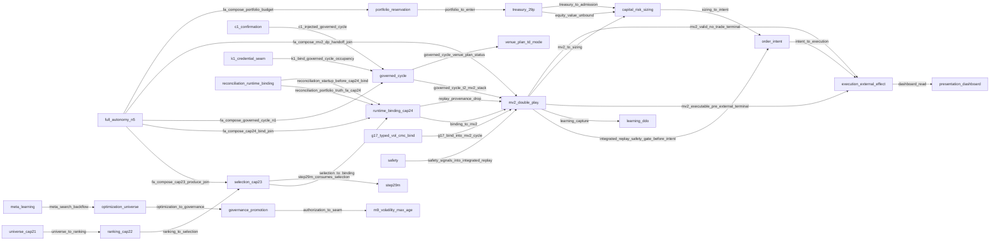

<!-- GENERATED FILE. DO NOT EDIT BY HAND. SOURCE=config/governance/current_system_interaction_authority_map_v1/source_v1.json VIEW=interface_handoff AUTHORITY=NONE -->

# Interface / Handoff View

AUTHORITY=NONE

## authorization_to_seam

- lifecycle=PARTIAL
- flow_type=PROMOTION_FLOW
- contract_or_payload=parameter seam to age-policy consumer
- producer=governance_promotion
- consumer=evaluate_canonical_volatility_estimate_age_policy_v1
- authority_effect=NONE
- decision_effect=SEAM_NOT_ENFORCEMENT
- direct_or_indirect=DIRECT
- identity_binding=M9_TARGET
- temporal_binding=UNKNOWN
- version_binding=config/governance/m9_volatility_numeric_max_age_numeric_productive_target_v1_decision_v1.json
- provenance_binding=ENFORCEMENT_FALSE
- promotion_required=TRUE
- fail_closed=TRUE
- evidence=`src/governance/m9_volatility_numeric_max_age_numeric_productive_target_v1.py`, `config/governance/m9_volatility_numeric_max_age_numeric_productive_target_v1_decision_v1.json`

## binding_to_mv2

- lifecycle=PROVEN_CURRENT
- flow_type=DECISION_FLOW
- contract_or_payload=BoundInstrumentV1
- producer=runtime_binding_cap24
- consumer=run_current_productive_master_v2_runtime_cycle_v1
- authority_effect=NONE
- decision_effect=FIRST_TRADING_DECISION_CONSUMER
- direct_or_indirect=DIRECT
- identity_binding=BOUND_INSTRUMENT
- temporal_binding=UNKNOWN
- version_binding=BoundInstrumentV1
- provenance_binding=CYCLE_TO_REPLAY_CALL
- promotion_required=FALSE
- fail_closed=TRUE
- evidence=`src/ops/ranking_universe_to_full_core_ssf_handoff_contract_v1.py`, `src/ops/full_core_live_path_composition_root_v1/current_productive_master_v2_runtime_cycle_v1.py`

## c1_injected_governed_cycle

- lifecycle=PROVEN_CURRENT
- flow_type=CONSTRAINT_FLOW
- contract_or_payload=map_injected_candles_payload_to_current_productive_c1_observation_v1; perform_get=false offline
- producer=current_productive_scoped_one_shot_c1_observation_source_v1
- consumer=run_current_productive_governed_cycle_v1
- authority_effect=NONE
- decision_effect=FRESH_C1_REQUIRED_FOR_CYCLE
- direct_or_indirect=DIRECT
- identity_binding=C1_OBSERVATION
- temporal_binding=CURSOR_FLOOR
- version_binding=CurrentProductiveC1ObservationV1
- provenance_binding=NETWORK_NOT_AUTHORIZED_THIS_SLICE
- promotion_required=FALSE
- fail_closed=TRUE
- evidence=`src/ops/full_core_live_path_composition_root_v1/current_productive_governed_cycle_orchestrator_v1.py`, `src/ops/stateful_confirmation_and_c1_productive_binding_v1/constants_v1.py`

## dashboard_read

- lifecycle=PROVEN_CURRENT
- flow_type=PRESENTATION_FLOW
- contract_or_payload=runtime SSOT to read model to dashboard
- producer=read_model
- consumer=dashboard
- authority_effect=NONE
- decision_effect=DISPLAY_ONLY
- direct_or_indirect=INDIRECT
- identity_binding=NONE
- temporal_binding=UNKNOWN
- version_binding=read_model
- provenance_binding=AUTHORITY_EFFECT_NONE
- promotion_required=FALSE
- fail_closed=TRUE
- evidence=`src/ops/canonical_read_model_and_market_dashboard_rebuild_v1/constants_v1.py`

## equity_value_unbound

- lifecycle=UNKNOWN
- flow_type=DATA_FLOW
- contract_or_payload=DETAILS_USDC_AVAILEQ mapping option B
- producer=treasury_29p
- consumer=sizing_context
- authority_effect=NONE
- decision_effect=NUMERIC_VENUE_VALUE_UNBOUND
- direct_or_indirect=DIRECT
- identity_binding=UNRESOLVED_OWNER
- temporal_binding=FRESHNESS_NOT_AUTHORITY
- version_binding=MAPPING_BLOCK
- provenance_binding=SEALED_VENUE_NUMBER_UNKNOWN
- promotion_required=UNKNOWN
- fail_closed=TRUE
- evidence=`docs/runbooks/canonical/PEAK_TRADE_MASTER_RUNBOOK.md`, `src/ops/governed_productive_account_equity_authority_producer_v1/__init__.py`

## fa_compose_cap23_produce_join

- lifecycle=PROVEN_CURRENT
- flow_type=DATA_FLOW
- contract_or_payload=produce_occupied_lane_cap23_n1_selections_v1; compose-only; Cap23 sole writer preserved
- producer=run_productive_full_autonomy_n5_runtime_orchestrator_v1
- consumer=produce_occupied_lane_cap23_n1_selections_v1
- authority_effect=NONE
- decision_effect=COMPOSE_INVOKE_NOT_SECOND_SELECTION_AUTHORITY
- direct_or_indirect=DIRECT
- identity_binding=OCCUPIED_LANE_N1
- temporal_binding=UNKNOWN
- version_binding=src/ops/current_mf_n5_ranking_domain_occupied_lane_cap23_n1_produce_join_v1/produce_join_v1.py
- provenance_binding=JOIN_CAP23_SELECTION_AUTHORITY_FALSE
- promotion_required=FALSE
- fail_closed=TRUE
- evidence=`src/ops/current_mf_n5_full_autonomy_productive_runtime_orchestrator_v1/orchestrator_v1.py`, `src/ops/current_mf_n5_full_autonomy_productive_runtime_orchestrator_v1/constants_v1.py`, `src/ops/single_selected_future_policy_v1/constants_v1.py`

## fa_compose_cap24_bind_join

- lifecycle=PROVEN_CURRENT
- flow_type=DATA_FLOW
- contract_or_payload=bind_occupied_lane_cap24_n1_instruments_v1 with reconciliation_state_root and observed_portfolio
- producer=run_productive_full_autonomy_n5_runtime_orchestrator_v1
- consumer=bind_occupied_lane_cap24_n1_instruments_v1
- authority_effect=NONE
- decision_effect=COMPOSE_BIND_NOT_SECOND_BINDING_AUTHORITY
- direct_or_indirect=DIRECT
- identity_binding=BOUND_INSTRUMENT_PER_LANE
- temporal_binding=UNKNOWN
- version_binding=src/ops/current_mf_n5_boundary_occupied_lane_cap24_n1_bind_join_v1/bind_join_v1.py
- provenance_binding=JOIN_CAP24_BINDING_AUTHORITY_FALSE
- promotion_required=FALSE
- fail_closed=TRUE
- evidence=`src/ops/current_mf_n5_full_autonomy_productive_runtime_orchestrator_v1/orchestrator_v1.py`, `src/ops/current_mf_n5_boundary_occupied_lane_cap24_n1_bind_join_v1/bind_join_v1.py`

## fa_compose_governed_cycle_n1

- lifecycle=PROVEN_CURRENT
- flow_type=CONSTRAINT_FLOW
- contract_or_payload=invoke_occupied_lane_governed_cycle_n1_consumer_v1 per lane; terminal PRE_EXTERNAL or HOLD_CLOSED
- producer=compose_occupied_lane_n1_host_join_readiness_v1
- consumer=run_current_productive_governed_cycle_v1
- authority_effect=NONE
- decision_effect=ORCHESTRATION_SEQUENCE_ONLY
- direct_or_indirect=INDIRECT
- identity_binding=N1_LANE_ISOLATED_ROOTS
- temporal_binding=UNKNOWN
- version_binding=src/ops/current_mf_n5_full_autonomy_occupied_lane_governed_cycle_n1_consumer_join_v1/invoke_join_v1.py
- provenance_binding=AUTONOMY_CAN_POST_FALSE
- promotion_required=FALSE
- fail_closed=TRUE
- evidence=`src/ops/current_mf_n5_full_autonomy_occupied_lane_n1_host_join_readiness_v1/readiness_join_v1.py`, `src/ops/full_core_live_path_composition_root_v1/current_productive_governed_cycle_orchestrator_v1.py`

## fa_compose_mv2_dp_handoff_join

- lifecycle=PROVEN_CURRENT
- flow_type=DATA_FLOW
- contract_or_payload=compose_occupied_lane_mv2_dp_handoff_v1 admitted bound instruments
- producer=run_productive_full_autonomy_n5_runtime_orchestrator_v1
- consumer=compose_occupied_lane_mv2_dp_handoff_v1
- authority_effect=NONE
- decision_effect=HANDOFF_COMPOSE_ONLY
- direct_or_indirect=DIRECT
- identity_binding=MV2_DP_SINGLE_DECISION_UNIVERSE
- temporal_binding=UNKNOWN
- version_binding=src/ops/current_mf_n5_full_autonomy_occupied_lane_mv2_dp_handoff_join_v1/handoff_join_v1.py
- provenance_binding=JOIN_TRADING_AUTHORITY_FALSE
- promotion_required=FALSE
- fail_closed=TRUE
- evidence=`src/ops/current_mf_n5_full_autonomy_productive_runtime_orchestrator_v1/orchestrator_v1.py`, `src/ops/current_mf_n5_full_autonomy_occupied_lane_mv2_dp_handoff_join_v1/handoff_join_v1.py`

## fa_compose_portfolio_budget

- lifecycle=PARTIAL
- flow_type=CONSTRAINT_FLOW
- contract_or_payload=PortfolioCapitalReservationBudgetOwnerV1 passed into readiness compose
- producer=run_productive_full_autonomy_n5_runtime_orchestrator_v1
- consumer=portfolio_capital_reservation_budget_owner_v1
- authority_effect=NONE
- decision_effect=BUDGET_OWNER_IMPORT_ONLY
- direct_or_indirect=DIRECT
- identity_binding=SHARED_BUDGET_OWNER
- temporal_binding=RESTART_NOT_RECONSTRUCTABLE
- version_binding=src/ops/portfolio_capital_reservation_budget_v1/contract_v1.py
- provenance_binding=AUTHORITY_EFFECT_NONE
- promotion_required=FALSE
- fail_closed=TRUE
- evidence=`src/ops/current_mf_n5_full_autonomy_productive_runtime_orchestrator_v1/orchestrator_v1.py`, `src/ops/portfolio_capital_reservation_budget_v1/contract_v1.py`

## g17_bind_into_mv2_cycle

- lifecycle=PROVEN_CURRENT
- flow_type=DATA_FLOW
- contract_or_payload=apply_current_productive_g17_typed_vol_cmc_bind_v1 on CanonicalMarketContextV1 inside MV2 cycle
- producer=apply_current_productive_g17_typed_vol_cmc_bind_v1
- consumer=run_current_productive_master_v2_runtime_cycle_v1
- authority_effect=NONE
- decision_effect=MARKET_CONTEXT_ENRICHMENT_ONLY
- direct_or_indirect=DIRECT
- identity_binding=TYPED_VOL_ON_CONTEXT
- temporal_binding=UNKNOWN
- version_binding=current_productive_g17_typed_vol_cmc_bind_v1
- provenance_binding=NOT_SELECTION_NOT_EXECUTION
- promotion_required=FALSE
- fail_closed=TRUE
- evidence=`src/ops/full_core_live_path_composition_root_v1/current_productive_g17_typed_vol_cmc_bind_v1.py`, `src/ops/full_core_live_path_composition_root_v1/current_productive_master_v2_runtime_cycle_v1.py`

## governed_cycle_t2_mv2_stack

- lifecycle=PROVEN_CURRENT
- flow_type=DECISION_FLOW
- contract_or_payload=t2_cycle_dispatch invokes N=1 productive stack including run_current_productive_master_v2_runtime_cycle_v1
- producer=run_current_productive_governed_cycle_v1
- consumer=run_current_productive_master_v2_runtime_cycle_v1
- authority_effect=NONE
- decision_effect=ORCHESTRATED_NOT_PARALLEL_DECISION_OWNER
- direct_or_indirect=INDIRECT
- identity_binding=BOUND_INSTRUMENT
- temporal_binding=UNKNOWN
- version_binding=t2_cycle_dispatch
- provenance_binding=AUTONOMY_CAN_RESELECT_DOWNSTREAM_FALSE
- promotion_required=FALSE
- fail_closed=TRUE
- evidence=`src/ops/full_core_live_path_composition_root_v1/current_productive_governed_cycle_orchestrator_v1.py`, `src/ops/full_core_live_path_composition_root_v1/current_productive_master_v2_runtime_cycle_v1.py`

## governed_cycle_venue_plan_status

- lifecycle=PARTIAL
- flow_type=DATA_FLOW
- contract_or_payload=venue_plan_status from t2 result rollup; CURRENT_PRODUCTIVE_VENUE_PLAN_STATUS in evidence
- producer=run_current_productive_governed_cycle_v1
- consumer=current_productive_venue_plan_td_mode_and_order_environment_authority_v1
- authority_effect=NONE
- decision_effect=STATUS_ROLLUP_NOT_POST
- direct_or_indirect=INDIRECT
- identity_binding=VENUE_PLAN_STATUS_STRING
- temporal_binding=UNKNOWN
- version_binding=CURRENT_PRODUCTIVE_VENUE_PLAN_STATUS
- provenance_binding=RUNTIME_AUTHORIZATION_EFFECT_NONE
- promotion_required=FALSE
- fail_closed=TRUE
- evidence=`src/ops/full_core_live_path_composition_root_v1/current_productive_governed_cycle_orchestrator_v1.py`, `src/ops/full_core_live_path_composition_root_v1/current_productive_venue_plan_td_mode_and_order_environment_authority_v1.py`, `evidence/ops/full_core_current_productive_fresh_runtime_cycle_after_non_executable_decision_v1/20260916T010000Z/SUMMARY.json`

## integrated_replay_safety_gate_before_intent

- lifecycle=PROVEN_CURRENT
- flow_type=CONSTRAINT_FLOW
- contract_or_payload=safety_kernel hard_block skips canonical_order_intent bind; ReplayExecutionSafetyV1 at composition admission
- producer=run_integrated_offline_trading_logic_replay_v1
- consumer=canonical_order_intent_owner_v1
- authority_effect=NONE
- decision_effect=ENTER_BLOCK_OR_POST_29Q_CONSUMPTION_GUARD
- direct_or_indirect=DIRECT
- identity_binding=REPLAY_EVIDENCE_TO_INTENT_PLAN
- temporal_binding=UNKNOWN
- version_binding=ReplayExecutionSafetyV1
- provenance_binding=NOT_FILEGATE_NOT_SECOND_DECISION_OWNER
- promotion_required=FALSE
- fail_closed=TRUE
- evidence=`src/trading/master_v2/integrated_offline_trading_logic_replay_v1.py`, `src/trading/master_v2/replay_execution_safety_contract_v1.py`, `src/ops/full_core_live_path_composition_root_v1/composition_root_v1.py`

## intent_to_execution

- lifecycle=PROVEN_CURRENT
- flow_type=DECISION_FLOW
- contract_or_payload=standing non-implication pins
- producer=order_intent
- consumer=execution_external_effect
- authority_effect=NONE
- decision_effect=NO_POST
- direct_or_indirect=DIRECT
- identity_binding=NO_EXTERNAL_EFFECT
- temporal_binding=UNKNOWN
- version_binding=src/ops/full_core_live_path_composition_root_v1/constants_v1.py
- provenance_binding=POST_ALLOWED_FALSE
- promotion_required=FALSE
- fail_closed=TRUE
- evidence=`src/ops/full_core_live_path_composition_root_v1/constants_v1.py`

## k1_bind_governed_cycle_occupancy

- lifecycle=PROVEN_CURRENT
- flow_type=CONSTRAINT_FLOW
- contract_or_payload=bind_k1_credential_capability_for_governed_cycle_occupancy_v1; material_loaded must be false
- producer=checkout_independent_credential_governed_cycle_occupancy_bind_v1
- consumer=run_current_productive_governed_cycle_v1
- authority_effect=NONE
- decision_effect=CREDENTIAL_SEAM_NOT_TRADING_DECISION
- direct_or_indirect=DIRECT
- identity_binding=K1_NOT_TRADING_DECISION_OWNER
- temporal_binding=UNKNOWN
- version_binding=bind_k1_credential_capability_for_governed_cycle_occupancy_v1
- provenance_binding=KEYCHAIN_UNAUTHORIZED
- promotion_required=FALSE
- fail_closed=TRUE
- evidence=`src/ops/full_core_live_path_composition_root_v1/current_productive_governed_cycle_orchestrator_v1.py`, `src/ops/full_core_live_path_composition_root_v1/checkout_independent_credential_governed_cycle_occupancy_bind_v1.py`

## learning_capture

- lifecycle=PARTIAL
- flow_type=EVIDENCE_FLOW
- contract_or_payload=OBSERVATION_ONLY_CAPTURE_ADAPTER
- producer=producer_result
- consumer=existing_ddo_record
- authority_effect=NONE
- decision_effect=MUST_NOT_MUTATE_PRODUCER
- direct_or_indirect=DIRECT
- identity_binding=UNKNOWN
- temporal_binding=HOST_DURABILITY_UNPROVEN
- version_binding=src/learning/deterministic_decision_outcome_v0/capture_v0.py
- provenance_binding=HOST_LIST_NOT_CLOSED
- promotion_required=FALSE
- fail_closed=TRUE
- evidence=`src/learning/deterministic_decision_outcome_v0/capture_v0.py`, `docs/runbooks/canonical/PEAK_TRADE_MASTER_RUNBOOK.md`

## meta_search_backflow

- lifecycle=FORBIDDEN
- flow_type=BACKFLOW
- contract_or_payload=meta evidence to search budget
- producer=meta_learning
- consumer=optimization_universe
- authority_effect=NONE
- decision_effect=NOT_A_CLOSED_AUTHORITY_LOOP
- direct_or_indirect=UNKNOWN
- identity_binding=UNKNOWN
- temporal_binding=UNKNOWN
- version_binding=UNKNOWN
- provenance_binding=M6_EXECUTOR_NOT_INVOKED
- promotion_required=TRUE
- fail_closed=TRUE
- evidence=`src/experiments/canonical_meta_learning_v1.py`, `docs/runbooks/canonical/PEAK_TRADE_MASTER_RUNBOOK.md`

## mv2_executable_pre_external_terminal

- lifecycle=PARTIAL
- flow_type=CONSTRAINT_FLOW
- contract_or_payload=EXECUTABLE_VENUE_PLAN_BOUND with eligibility true; PRE_EXTERNAL_EFFECT boundary; POST still unauthorized in cycle
- producer=run_current_productive_governed_cycle_v1
- consumer=execution_external_effect
- authority_effect=NONE
- decision_effect=EXECUTABLE_PRE_EXTERNAL_NOT_POST
- direct_or_indirect=INDIRECT
- identity_binding=EXECUTABLE_VENUE_PLAN_BOUND
- temporal_binding=UNKNOWN
- version_binding=DISPOSITION_PRE_EXTERNAL_EFFECT
- provenance_binding=SEPARATE_OWNER_GO_FOR_POST
- promotion_required=TRUE
- fail_closed=TRUE
- evidence=`src/ops/full_core_live_path_composition_root_v1/current_productive_governed_cycle_orchestrator_v1.py`, `docs/ops/specs/FULL_CORE_CURRENT_PRODUCTIVE_FRESH_RUNTIME_CYCLE_TO_EXACT_ENVELOPE_BOUND_SINGLE_USE_POST_BOUNDARY_V1.md`

## mv2_to_sizing

- lifecycle=CONFLICTING
- flow_type=CONSTRAINT_FLOW
- contract_or_payload=CanonicalCoreRuntimeCapitalContextV0
- producer=current_productive_enter_live_29p_join_v1
- consumer=capital_risk_sizing
- authority_effect=NONE
- decision_effect=WIRING_PRESENT_OWNER_CONFLICTING
- direct_or_indirect=DIRECT
- identity_binding=CONTEXT_OBJECT
- temporal_binding=UNKNOWN
- version_binding=offline_replay_futures_metadata_v0
- provenance_binding=FULL_CORE_INSTRUMENT_METADATA_CHAIN_CLOSED_B05
- promotion_required=UNKNOWN
- fail_closed=TRUE
- evidence=`src/ops/full_core_live_path_composition_root_v1/current_productive_enter_live_29p_join_v1.py`, `src/ops/full_core_live_path_composition_root_v1/current_productive_mv2_capital_context_rebind_v1.py`, `config/governance/risk_sizing_authority_decision_contract_freeze_v1.json`

## mv2_valid_no_trade_terminal

- lifecycle=PROVEN_CURRENT
- flow_type=CONSTRAINT_FLOW
- contract_or_payload=NO_EXECUTABLE_DECISION/HOLD/observe; DECISION_EXECUTION_ELIGIBLE=false; POST_COUNT=0; valid terminal not failure
- producer=run_current_productive_master_v2_runtime_cycle_v1
- consumer=execution_external_effect
- authority_effect=NONE
- decision_effect=VALID_NO_TRADE_TERMINAL
- direct_or_indirect=DIRECT
- identity_binding=NO_EXECUTABLE_DECISION
- temporal_binding=UNKNOWN
- version_binding=DISPOSITION_HOLD_CLOSED
- provenance_binding=HOLD_NOT_POST_FAILURE
- promotion_required=FALSE
- fail_closed=TRUE
- evidence=`src/ops/full_core_live_path_composition_root_v1/current_productive_governed_cycle_orchestrator_v1.py`, `evidence/ops/full_core_current_productive_fresh_runtime_cycle_after_non_executable_decision_v1/20260916T010000Z/SUMMARY.json`, `docs/ops/specs/FULL_CORE_CURRENT_PRODUCTIVE_FRESH_RUNTIME_CYCLE_AFTER_NON_EXECUTABLE_DECISION_V1.md`

## optimization_to_governance

- lifecycle=PROVEN_CURRENT
- flow_type=PROMOTION_FLOW
- contract_or_payload=ADMITTED_FOR_GOVERNANCE_REVIEW or DENIED_FAIL_CLOSED
- producer=optimization_universe
- consumer=governance_promotion
- authority_effect=NONE
- decision_effect=PROPOSAL_ONLY
- direct_or_indirect=DIRECT
- identity_binding=PROPOSAL
- temporal_binding=UNKNOWN
- version_binding=M10
- provenance_binding=PRODUCTIVE_APPLY_AUTHORITY_NONE
- promotion_required=TRUE
- fail_closed=TRUE
- evidence=`src/governance/optimization_proposal_governance_ingress_v1.py`

## portfolio_to_enter

- lifecycle=PARTIAL
- flow_type=CONSTRAINT_FLOW
- contract_or_payload=admit_sized_slot_reservation_v1
- producer=portfolio_reservation
- consumer=current_productive_enter_live_29p_join_v1
- authority_effect=NONE
- decision_effect=RESERVATION_IMPORT
- direct_or_indirect=DIRECT
- identity_binding=N1
- temporal_binding=RESTART_NOT_RECONSTRUCTABLE
- version_binding=src/ops/portfolio_capital_reservation_budget_v1/contract_v1.py
- provenance_binding=AUTHORITY_EFFECT_NONE
- promotion_required=FALSE
- fail_closed=TRUE
- evidence=`src/ops/portfolio_capital_reservation_budget_v1/contract_v1.py`, `src/ops/full_core_live_path_composition_root_v1/current_productive_enter_live_29p_join_v1.py`

## ranking_to_selection

- lifecycle=PROVEN_CURRENT
- flow_type=DECISION_FLOW
- contract_or_payload=top20 context limit 20; SingleSelectedFutureSelectionV1
- producer=ranking_cap22
- consumer=selection_cap23
- authority_effect=SELECTION_ON_CAP23_ONLY
- decision_effect=CAP23_DECIDES
- direct_or_indirect=DIRECT
- identity_binding=SINGLE_SELECTED_FUTURE
- temporal_binding=UNKNOWN
- version_binding=SingleSelectedFutureSelectionV1
- provenance_binding=CONTEXT_IDS_NOT_SELECTION_AUTHORITY
- promotion_required=FALSE
- fail_closed=TRUE
- evidence=`src/ops/ranking_universe_to_full_core_ssf_handoff_contract_v1.py`, `src/ops/single_selected_future_policy_v1/constants_v1.py`

## reconciliation_portfolio_truth_fa_cap24

- lifecycle=PROVEN_CURRENT
- flow_type=DATA_FLOW
- contract_or_payload=PortfolioTruthSnapshotV1 observed_portfolio into FA cap24 bind context
- producer=productive_reconciliation_runtime_binding_v1
- consumer=bind_occupied_lane_cap24_n1_instruments_v1
- authority_effect=NONE
- decision_effect=OBSERVED_PORTFOLIO_CONTEXT_ONLY
- direct_or_indirect=INDIRECT
- identity_binding=RECONCILIATION_STATE_ROOT
- temporal_binding=UNKNOWN
- version_binding=PortfolioTruthSnapshotV1
- provenance_binding=NOT_CAP23_SELECTION_AUTHORITY
- promotion_required=FALSE
- fail_closed=TRUE
- evidence=`src/ops/current_mf_n5_full_autonomy_productive_runtime_orchestrator_v1/orchestrator_v1.py`, `src/ops/productive_reconciliation_runtime_binding_v1/models_v1.py`

## reconciliation_startup_before_cap24_bind

- lifecycle=PROVEN_CURRENT
- flow_type=CONSTRAINT_FLOW
- contract_or_payload=run_productive_reconciliation_startup_gate_v1 before alpha in binding_gate_v1
- producer=run_productive_reconciliation_startup_gate_v1
- consumer=run_single_selected_future_runtime_binding_gate_v1
- authority_effect=NONE
- decision_effect=STARTUP_GATE_NOT_SELECTION
- direct_or_indirect=DIRECT
- identity_binding=PORTFOLIO_TRUTH_SNAPSHOT
- temporal_binding=SESSION_START
- version_binding=productive_reconciliation_runtime_binding_v1
- provenance_binding=AUTHORITY_VERSUS_CAP23_UNKNOWN
- promotion_required=FALSE
- fail_closed=TRUE
- evidence=`src/ops/single_selected_future_runtime_binding_v1/binding_gate_v1.py`, `src/ops/productive_reconciliation_runtime_binding_v1/startup_gate_v1.py`

## replay_provenance_drop

- lifecycle=PARTIAL
- flow_type=DATA_FLOW
- contract_or_payload=REPLAY_DROPPED_PROVENANCE_FIELDS
- producer=runtime_binding_cap24
- consumer=run_integrated_offline_trading_logic_replay_v1
- authority_effect=NONE
- decision_effect=THREE_IDS_DROPPED
- direct_or_indirect=DIRECT
- identity_binding=DROPPED
- temporal_binding=UNKNOWN
- version_binding=UNKNOWN
- provenance_binding=selection_id ranking_snapshot_id universe_snapshot_id dropped
- promotion_required=UNKNOWN
- fail_closed=UNKNOWN
- evidence=`src/ops/ranking_universe_to_full_core_ssf_handoff_contract_v1.py`

## safety_signals_into_integrated_replay

- lifecycle=PROVEN_CURRENT
- flow_type=CONSTRAINT_FLOW
- contract_or_payload=safety_mode, safety_exit_signal, trading_gate on IntegratedOfflineReplayInputV1
- producer=current_productive_master_v2_runtime_cycle_v1
- consumer=run_integrated_offline_trading_logic_replay_v1
- authority_effect=NONE
- decision_effect=REPLAY_SAFETY_INPUT_AND_KERNEL_BIND
- direct_or_indirect=DIRECT
- identity_binding=CYCLE_TO_REPLAY_INPUT
- temporal_binding=UNKNOWN
- version_binding=IntegratedOfflineReplayInputV1
- provenance_binding=HOST_EXIT_POLICY_AND_KERNEL_ADAPTER
- promotion_required=FALSE
- fail_closed=TRUE
- evidence=`src/ops/full_core_live_path_composition_root_v1/current_productive_master_v2_runtime_cycle_v1.py`, `src/trading/master_v2/integrated_offline_trading_logic_replay_v1.py`, `src/trading/master_v2/safety_kernel_offline_replay_binding_adapter_v0.py`

## selection_to_binding

- lifecycle=PROVEN_CURRENT
- flow_type=DECISION_FLOW
- contract_or_payload=SingleSelectedFutureSelectionV1 to BoundInstrumentV1
- producer=selection_cap23
- consumer=runtime_binding_cap24
- authority_effect=NONE
- decision_effect=BIND_EXISTING_IDENTITY
- direct_or_indirect=DIRECT
- identity_binding=SELECTION_SINGLE_WRITER
- temporal_binding=UNKNOWN
- version_binding=src/ops/ranking_universe_to_full_core_ssf_handoff_contract_v1.py
- provenance_binding=SECOND_AUTHORITY_CREATED_FALSE
- promotion_required=FALSE
- fail_closed=TRUE
- evidence=`src/ops/ranking_universe_to_full_core_ssf_handoff_contract_v1.py`, `src/ops/single_selected_future_runtime_binding_v1/constants_v1.py`

## sizing_to_intent

- lifecycle=PARTIAL
- flow_type=DECISION_FLOW
- contract_or_payload=final quantity and notional fields
- producer=capital_risk_sizing
- consumer=canonical_order_intent_owner_v1
- authority_effect=NONE
- decision_effect=PLAN_ONLY_WIRING
- direct_or_indirect=UNKNOWN
- identity_binding=UNKNOWN
- temporal_binding=UNKNOWN
- version_binding=UNKNOWN
- provenance_binding=STEP_29Q_PLAN_ONLY
- promotion_required=TRUE
- fail_closed=TRUE
- evidence=`src/ops/full_core_live_path_composition_root_v1/constants_v1.py`, `src/governance/capital_risk_sizing_v1.py`

## step29m_consumes_selection

- lifecycle=PROVEN_CURRENT
- flow_type=EVIDENCE_FLOW
- contract_or_payload=persisted Cap2.3 output
- producer=selection_cap23
- consumer=step29m
- authority_effect=NONE
- decision_effect=POST_SELECTION_ONLY
- direct_or_indirect=DIRECT
- identity_binding=POST_SELECTION
- temporal_binding=UNKNOWN
- version_binding=step29m
- provenance_binding=NO_SELECTION_AUTHORITY
- promotion_required=FALSE
- fail_closed=TRUE
- evidence=`src/backtest/step29m_current_single_selected_future_dynamic_binding_v1.py`

## treasury_to_admission

- lifecycle=CONFLICTING
- flow_type=DATA_FLOW
- contract_or_payload=conditional treasury decrease join
- producer=treasury_29p
- consumer=capital_admission
- authority_effect=CONFLICTING
- decision_effect=DECREASE_NOT_MINT
- direct_or_indirect=DIRECT
- identity_binding=OBSERVATION_GATED
- temporal_binding=UNKNOWN
- version_binding=UNKNOWN
- provenance_binding=RUNBOOK_WORDING_VERSUS_DECREASE_JOIN
- promotion_required=UNKNOWN
- fail_closed=TRUE
- evidence=`docs/runbooks/canonical/PEAK_TRADE_MASTER_RUNBOOK.md`, `src/ops/full_core_live_path_composition_root_v1/current_productive_enter_live_29p_join_v1.py`

## universe_to_ranking

- lifecycle=PARTIAL
- flow_type=DECISION_FLOW
- contract_or_payload=governed_futures_universe_snapshot.v1
- producer=universe_cap21
- consumer=ranking_cap22
- authority_effect=NONE
- decision_effect=CONTEXT_ONLY
- direct_or_indirect=DIRECT
- identity_binding=SNAPSHOT_ID_PRESENT
- temporal_binding=UNKNOWN
- version_binding=governed_futures_universe_snapshot.v1
- provenance_binding=RANKING_ACTIVATION_PARTIAL
- promotion_required=FALSE
- fail_closed=TRUE
- evidence=`src/ops/governed_futures_universe_producer_v1/constants_v1.py`, `src/ops/productive_futures_ranking_producer_v1/constants_v1.py`
