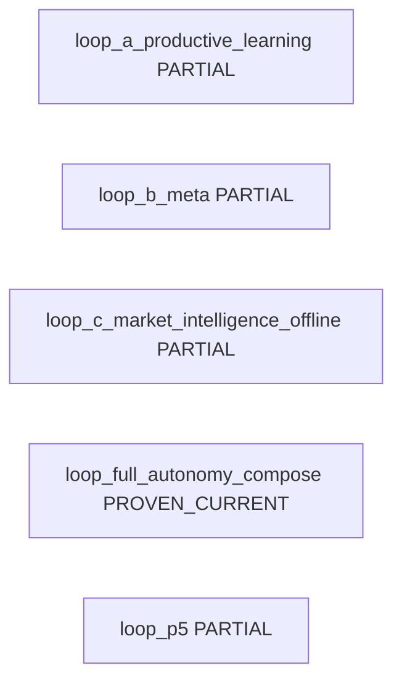

<!-- GENERATED FILE. DO NOT EDIT BY HAND. SOURCE=config/governance/current_system_interaction_authority_map_v1/source_v1.json VIEW=loop_backflow AUTHORITY=NONE -->

# Loop / Backflow View

AUTHORITY=NONE

## loop_a_productive_learning

- closure_status=PARTIAL
- members=learning_ddo, optimization_universe
- purpose=Observation after producer results as research input. Boundary slice stops before search.
- forward_edges=learning_capture, learning_evidence_export_to_optimization
- return_edges=(none)
- productive_effect=NONE
- authority_boundary=OBSERVATION_ONLY
- promotion_boundary=NO_SELF_DEPLOY
- external_effect=NONE
- evidence=`config/governance/unified_blueprint_d01_d02_topology_adjudication_v1.json`, `src/learning/deterministic_decision_outcome_v0/capture_v0.py`, `src/learning/deterministic_decision_outcome_v0/learning_evidence_export_v1.py`, `docs/runbooks/canonical/PEAK_TRADE_MASTER_RUNBOOK.md`

## loop_b_meta

- closure_status=PARTIAL
- members=meta_learning, optimization_universe
- purpose=M5 return and M6 ingest. Closed search control is not evidenced.
- forward_edges=(none)
- return_edges=meta_search_backflow
- productive_effect=NONE
- authority_boundary=RESEARCH_ONLY
- promotion_boundary=CANNOT_PROMOTE
- external_effect=NONE
- evidence=`config/governance/unified_blueprint_d01_d02_topology_adjudication_v1.json`, `src/experiments/canonical_meta_learning_v1.py`, `src/experiments/canonical_meta_learning_ingest_v1.py`, `docs/ops/specs/M5_M8_BOUNDED_META_RETURN_AND_REPLAY_COMPLETION_NORMATIVE_V1.md`

## loop_c_market_intelligence_offline

- closure_status=PARTIAL
- members=market_intelligence_forecast_calibration_offline_stack_d03, learning_ddo, optimization_universe
- purpose=Offline MI forecast/calibration compose, typed MI→Learning export (Phase 8 IMPLEMENTED), optimization research intake (Phase 9 M4), and MI-crossing multi-cycle M5→M8 replay (Phase 10).
- forward_edges=mi_offline_compose_ddo_n_bars_outcome, mi_offline_typed_export_to_learning_path, mi_offline_to_optimization_research_input
- return_edges=(none)
- productive_effect=NONE
- authority_boundary=FORECAST_IS_NOT_DECISION
- promotion_boundary=NO_AUTOMATIC_PROMOTION
- external_effect=NONE
- evidence=`config/governance/unified_blueprint_d01_d02_topology_adjudication_v1.json`, `tests/learning/test_market_intelligence_forecast_calibration_offline_stack_v1.py`, `docs/ops/specs/MARKET_INTELLIGENCE_FORECAST_CALIBRATION_OFFLINE_STACK_NORMATIVE_V1.md`

## loop_full_autonomy_compose

- closure_status=PROVEN_CURRENT
- members=full_autonomy_n5, selection_cap23, runtime_binding_cap24, mv2_double_play, governed_cycle
- purpose=Compose-only N=5 orchestration over existing Cap23/Cap24/MV2/cycle owners. No trading or POST authority.
- forward_edges=fa_compose_cap23_produce_join, fa_compose_cap24_bind_join, fa_compose_mv2_dp_handoff_join, fa_compose_governed_cycle_n1
- return_edges=(none)
- productive_effect=NONE
- authority_boundary=COMPOSE_ONLY
- promotion_boundary=NO_SELF_DEPLOY
- external_effect=NONE
- evidence=`src/ops/current_mf_n5_full_autonomy_productive_runtime_orchestrator_v1/orchestrator_v1.py`, `src/ops/current_mf_n5_full_autonomy_productive_runtime_orchestrator_v1/constants_v1.py`

## loop_p5

- closure_status=PARTIAL
- members=p5_layered_core, mv2_double_play
- purpose=Layered core bind without authority cutover.
- forward_edges=(none)
- return_edges=(none)
- productive_effect=NONE
- authority_boundary=CUTOVER_FALSE
- promotion_boundary=CUTOVER_NOT_AUTHORIZED
- external_effect=NONE
- evidence=`src/ops/p5_10_productive_activation_and_binding_v1/constants_v1.py`
