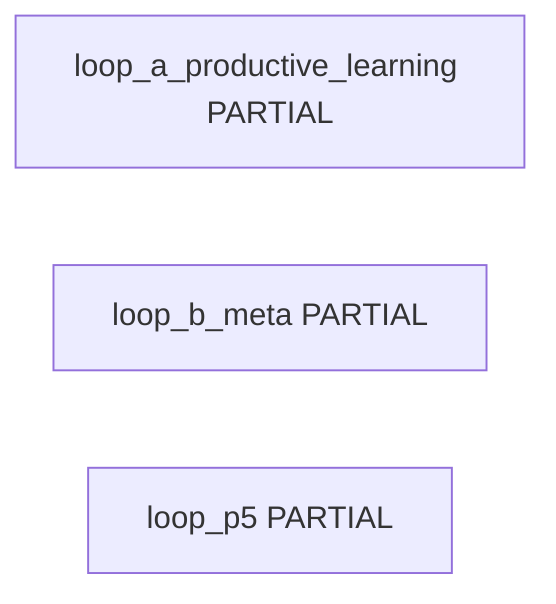

<!-- GENERATED FILE. DO NOT EDIT BY HAND. SOURCE=config/governance/current_system_interaction_authority_map_v1/source_v1.json VIEW=loop_backflow AUTHORITY=NONE -->

# Loop / Backflow View

AUTHORITY=NONE

## loop_a_productive_learning

- closure_status=PARTIAL
- members=learning_ddo, optimization_universe
- purpose=Observation after producer results as research input. Boundary slice stops before search.
- forward_edges=learning_capture
- return_edges=(none)
- productive_effect=NONE
- authority_boundary=OBSERVATION_ONLY
- promotion_boundary=NO_SELF_DEPLOY
- external_effect=NONE
- evidence=`src/learning/deterministic_decision_outcome_v0/capture_v0.py`, `docs/runbooks/canonical/PEAK_TRADE_MASTER_RUNBOOK.md`

## loop_b_meta

- closure_status=PARTIAL
- members=meta_learning, optimization_universe
- purpose=M5 return and M6 ingest. Closed search control is not evidenced.
- forward_edges=(none)
- return_edges=meta_search_backflow
- productive_effect=NONE
- authority_boundary=RESEARCH_ONLY
- promotion_boundary=CANNOT_PROMOTE
- external_effect=NONE
- evidence=`src/experiments/canonical_meta_learning_v1.py`, `docs/runbooks/canonical/PEAK_TRADE_MASTER_RUNBOOK.md`

## loop_p5

- closure_status=PARTIAL
- members=p5_layered_core, mv2_double_play
- purpose=Layered core bind without authority cutover.
- forward_edges=(none)
- return_edges=(none)
- productive_effect=NONE
- authority_boundary=CUTOVER_FALSE
- promotion_boundary=CUTOVER_NOT_AUTHORIZED
- external_effect=NONE
- evidence=`src/ops/p5_10_productive_activation_and_binding_v1/constants_v1.py`
