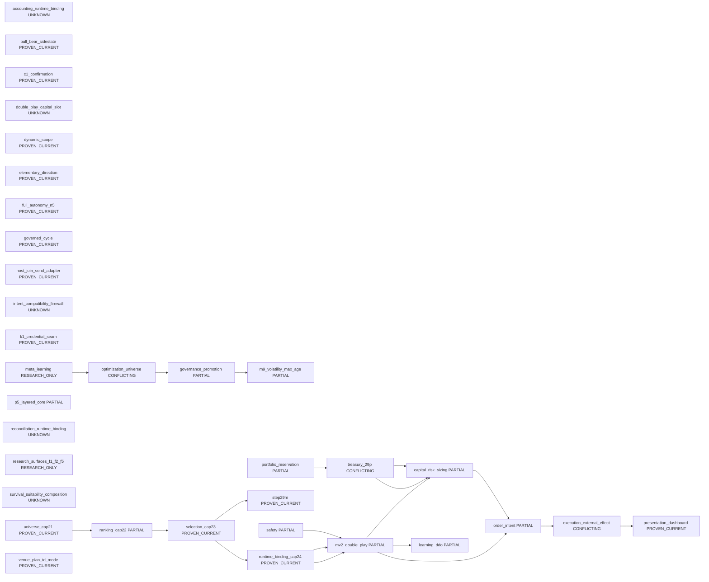

<!-- GENERATED FILE. DO NOT EDIT BY HAND. SOURCE=config/governance/current_system_interaction_authority_map_v1/source_v1.json VIEW=system_landscape AUTHORITY=NONE -->

# System Landscape

AUTHORITY=NONE

| id | tier | status | authority_class | owner | evidence |
| --- | --- | --- | --- | --- | --- |
| accounting_runtime_binding | INTERMEDIATE | UNKNOWN | UNKNOWN | UNKNOWN | `src/ops/productive_futures_accounting_runtime_binding_v1/constants_v1.py` |
| bull_bear_sidestate | FIRST_CLASS | PROVEN_CURRENT | CANONICAL_AUTHORITY | trading.master_v2.double_play_state | `src/trading/master_v2/bull_bear_state_switch_scenario_binding_adapter_v0.py`, `src/trading/master_v2/double_play_state.py` |
| c1_confirmation | INTERMEDIATE | PROVEN_CURRENT | CANONICAL_AUTHORITY | ops.stateful_confirmation_and_c1_productive_binding_v1 | `src/ops/stateful_confirmation_and_c1_productive_binding_v1/constants_v1.py`, `docs/runbooks/canonical/PEAK_TRADE_MASTER_RUNBOOK.md` |
| capital_risk_sizing | FIRST_CLASS | PARTIAL | PARTIAL | src.governance.capital_risk_sizing_v1 (mv2_governance_intent_bound quantity algebra only) | `config/governance/risk_sizing_authority_decision_contract_freeze_v1.json`, `config/governance/risk_sizing_owner_inventory_ssot_v1.json`, `src/ops/full_core_live_path_composition_root_v1/constants_v1.py`, `src/governance/capital_risk_sizing_v1.py` |
| double_play_capital_slot | INTERMEDIATE | UNKNOWN | UNKNOWN | NONE | `src/trading/master_v2/double_play_capital_slot.py` |
| dynamic_scope | FIRST_CLASS | PROVEN_CURRENT | CANONICAL_AUTHORITY | ops.dynamic_scope_persistence_binding_v1 | `src/ops/dynamic_scope_persistence_binding_v1/constants_v1.py`, `src/trading/master_v2/double_play_state.py` |
| elementary_direction | INTERMEDIATE | PROVEN_CURRENT | NAVIGATION_INDEX | src.trading.market_state.elementary_direction_v1 | `src/trading/market_state/elementary_direction_v1.py` |
| execution_external_effect | FIRST_CLASS | CONFLICTING | CONFLICTING | full_core_live_path_composition_root_v1 | `src/ops/full_core_live_path_composition_root_v1/constants_v1.py`, `docs/runbooks/canonical/PEAK_TRADE_MASTER_RUNBOOK.md` |
| full_autonomy_n5 | FIRST_CLASS | PROVEN_CURRENT | CANONICAL_AUTHORITY | src.ops.current_mf_n5_full_autonomy_productive_runtime_orchestrator_v1 | `src/ops/current_mf_n5_full_autonomy_productive_runtime_orchestrator_v1/constants_v1.py`, `docs/runbooks/canonical/PEAK_TRADE_MASTER_RUNBOOK.md` |
| governance_promotion | FIRST_CLASS | PARTIAL | CANONICAL_AUTHORITY | optimization_proposal_governance_ingress_v1 | `src/governance/authorized_productive_parameter_seam_v1.py`, `config/governance/m9_volatility_numeric_max_age_numeric_productive_target_v1_decision_v1.json` |
| governed_cycle | INTERMEDIATE | PROVEN_CURRENT | CANONICAL_AUTHORITY | governed_continuous_cycle_orchestrator_v1 | `src/ops/full_core_live_path_composition_root_v1/constants_v1.py`, `docs/runbooks/canonical/PEAK_TRADE_MASTER_RUNBOOK.md` |
| host_join_send_adapter | INTERMEDIATE | PROVEN_CURRENT | CANONICAL_AUTHORITY | n1_host_join_readiness_v1 | `src/ops/current_mf_n5_full_autonomy_occupied_lane_n1_host_join_readiness_v1/constants_v1.py`, `src/ops/full_core_live_path_composition_root_v1/constants_v1.py` |
| intent_compatibility_firewall | INTERMEDIATE | UNKNOWN | UNKNOWN | UNKNOWN | `src/governance/intent_compatibility_firewall_v1.py` |
| k1_credential_seam | INTERMEDIATE | PROVEN_CURRENT | CANONICAL_AUTHORITY | K1_NOT_TRADING_DECISION_OWNER | `docs/runbooks/canonical/PEAK_TRADE_MASTER_RUNBOOK.md` |
| learning_ddo | FIRST_CLASS | PARTIAL | CANONICAL_AUTHORITY | src.learning.deterministic_decision_outcome_v0 | `src/learning/deterministic_decision_outcome_v0/capture_v0.py`, `docs/runbooks/canonical/PEAK_TRADE_MASTER_RUNBOOK.md` |
| m9_volatility_max_age | INTERMEDIATE | PARTIAL | PARTIAL | m9_volatility_numeric_max_age_numeric_productive_target_v1 | `src/governance/m9_volatility_numeric_max_age_numeric_productive_target_v1.py`, `config/governance/m9_volatility_numeric_max_age_numeric_productive_target_v1_decision_v1.json` |
| meta_learning | FIRST_CLASS | RESEARCH_ONLY | RESEARCH_ONLY | src.experiments.canonical_meta_learning_v1 | `src/experiments/canonical_meta_learning_v1.py`, `docs/runbooks/canonical/PEAK_TRADE_MASTER_RUNBOOK.md` |
| mv2_double_play | FIRST_CLASS | PARTIAL | CANONICAL_AUTHORITY | run_current_productive_master_v2_runtime_cycle_v1 | `src/ops/full_core_live_path_composition_root_v1/current_productive_master_v2_runtime_cycle_v1.py`, `src/ops/whole_system_connection_closure_bounded_wp_v1/constants_v1.py`, `docs/runbooks/canonical/PEAK_TRADE_MASTER_RUNBOOK.md` |
| optimization_universe | FIRST_CLASS | CONFLICTING | CONFLICTING | src.experiments.canonical_optimization_universe_v1 | `src/experiments/canonical_optimization_universe_v1.py`, `docs/runbooks/canonical/PEAK_TRADE_MASTER_RUNBOOK.md` |
| order_intent | FIRST_CLASS | PARTIAL | CANONICAL_AUTHORITY | canonical_order_intent_owner_v1 | `src/ops/full_core_live_path_composition_root_v1/constants_v1.py`, `docs/runbooks/canonical/PEAK_TRADE_MASTER_RUNBOOK.md` |
| p5_layered_core | INTERMEDIATE | PARTIAL | PARTIAL | src.ops.p5_10_productive_activation_and_binding_v1 | `src/ops/p5_10_productive_activation_and_binding_v1/constants_v1.py`, `docs/runbooks/canonical/PEAK_TRADE_MASTER_RUNBOOK.md` |
| portfolio_reservation | FIRST_CLASS | PARTIAL | CANONICAL_AUTHORITY | portfolio_capital_reservation_budget_owner_v1 | `src/ops/portfolio_capital_reservation_budget_v1/contract_v1.py`, `src/ops/full_core_live_path_composition_root_v1/current_productive_enter_live_29p_join_v1.py` |
| presentation_dashboard | FIRST_CLASS | PROVEN_CURRENT | CANONICAL_AUTHORITY | canonical_read_model_and_market_dashboard_rebuild_v1 | `src/ops/canonical_read_model_and_market_dashboard_rebuild_v1/constants_v1.py`, `docs/runbooks/canonical/PEAK_TRADE_MASTER_RUNBOOK.md` |
| ranking_cap22 | FIRST_CLASS | PARTIAL | CANONICAL_AUTHORITY | ops.productive_futures_ranking_producer_v1 | `src/ops/productive_futures_ranking_producer_v1/constants_v1.py`, `docs/runbooks/canonical/PEAK_TRADE_MASTER_RUNBOOK.md` |
| reconciliation_runtime_binding | INTERMEDIATE | UNKNOWN | UNKNOWN | UNKNOWN | `src/ops/productive_reconciliation_runtime_binding_v1/constants_v1.py` |
| research_surfaces_f1_f2_f5 | INTERMEDIATE | RESEARCH_ONLY | RESEARCH_ONLY | src.experiments.canonical_optimization_universe_v1 | `src/experiments/canonical_optimization_universe_v1.py` |
| runtime_binding_cap24 | FIRST_CLASS | PROVEN_CURRENT | CANONICAL_AUTHORITY | ops.single_selected_future_runtime_binding_v1 | `src/ops/single_selected_future_runtime_binding_v1/constants_v1.py`, `src/ops/ranking_universe_to_full_core_ssf_handoff_contract_v1.py` |
| safety | FIRST_CLASS | PARTIAL | PARTIAL | UNCLOSED_SEE_OPEN_RECORD:safety_owner_unclosed | `src/ops/full_core_live_path_composition_root_v1/current_productive_master_v2_runtime_cycle_v1.py`, `docs/runbooks/canonical/PEAK_TRADE_MASTER_RUNBOOK.md` |
| selection_cap23 | FIRST_CLASS | PROVEN_CURRENT | CANONICAL_AUTHORITY | ops.single_selected_future_policy_v1 | `src/ops/ranking_universe_to_full_core_ssf_handoff_contract_v1.py`, `src/ops/single_selected_future_policy_v1/constants_v1.py` |
| step29m | FIRST_CLASS | PROVEN_CURRENT | CANONICAL_AUTHORITY | src.backtest.step29m_current_single_selected_future_dynamic_binding_v1 | `src/backtest/step29m_current_single_selected_future_dynamic_binding_v1.py`, `docs/runbooks/canonical/PEAK_TRADE_MASTER_RUNBOOK.md` |
| survival_suitability_composition | INTERMEDIATE | UNKNOWN | UNKNOWN | UNKNOWN | `docs/runbooks/canonical/PEAK_TRADE_MASTER_RUNBOOK.md` |
| treasury_29p | FIRST_CLASS | CONFLICTING | CONFLICTING | UNRESOLVED | `docs/runbooks/canonical/PEAK_TRADE_MASTER_RUNBOOK.md`, `config/governance/risk_sizing_authority_decision_contract_freeze_v1.json`, `src/ops/governed_productive_account_equity_authority_producer_v1/__init__.py` |
| universe_cap21 | FIRST_CLASS | PROVEN_CURRENT | CANONICAL_AUTHORITY | ops.governed_futures_universe_producer_v1 | `src/ops/governed_futures_universe_producer_v1/constants_v1.py`, `docs/runbooks/canonical/PEAK_TRADE_MASTER_RUNBOOK.md` |
| venue_plan_td_mode | FIRST_CLASS | PROVEN_CURRENT | CANONICAL_AUTHORITY | current_productive_venue_plan_td_mode_and_order_environment_authority_v1 | `src/ops/full_core_live_path_composition_root_v1/current_productive_venue_plan_td_mode_and_order_environment_authority_v1.py`, `docs/runbooks/canonical/PEAK_TRADE_MASTER_RUNBOOK.md` |
