<!-- GENERATED FILE. DO NOT EDIT BY HAND. SOURCE=config/governance/current_system_interaction_authority_map_v1/source_v1.json VIEW=system_landscape AUTHORITY=NONE -->

# System Landscape

AUTHORITY=NONE

```mermaid
flowchart LR
  accounting_runtime_binding["accounting_runtime_binding UNKNOWN"]
  bull_bear_sidestate["bull_bear_sidestate PROVEN_CURRENT"]
  c1_confirmation["c1_confirmation PROVEN_CURRENT"]
  cap22_research_backtest_live_parity_b09["cap22_research_backtest_live_parity_b09 PROVEN_CURRENT"]
  cap22_robustness_and_stress_b10["cap22_robustness_and_stress_b10 PROVEN_CURRENT"]
  capital_risk_sizing["capital_risk_sizing PARTIAL"]
  double_play_capital_slot["double_play_capital_slot UNKNOWN"]
  dynamic_scope["dynamic_scope PROVEN_CURRENT"]
  elementary_direction["elementary_direction PROVEN_CURRENT"]
  execution_external_effect["execution_external_effect CONFLICTING"]
  full_autonomy_n5["full_autonomy_n5 PROVEN_CURRENT"]
  full_core_fresh_pretrade_runtime_get["full_core_fresh_pretrade_runtime_get PROVEN_CURRENT"]
  future_profile_snapshot_b07["future_profile_snapshot_b07 PROVEN_CURRENT"]
  g17_typed_vol_cmc_bind["g17_typed_vol_cmc_bind PROVEN_CURRENT"]
  governance_promotion["governance_promotion PARTIAL"]
  governed_cycle["governed_cycle PROVEN_CURRENT"]
  host_join_send_adapter["host_join_send_adapter PROVEN_CURRENT"]
  intent_compatibility_firewall["intent_compatibility_firewall UNKNOWN"]
  k1_credential_seam["k1_credential_seam PROVEN_CURRENT"]
  learning_ddo["learning_ddo PARTIAL"]
  m9_volatility_max_age["m9_volatility_max_age PARTIAL"]
  market_data_private_state_runtime_convergence_wp_c["market_data_private_state_runtime_convergence_wp_c PROVEN_CURRENT"]
  market_intelligence_forecast_calibration_offline_stack_d03["market_intelligence_forecast_calibration_offline_stack_d03 PARTIAL"]
  meta_learning["meta_learning RESEARCH_ONLY"]
  mv2_double_play["mv2_double_play PARTIAL"]
  okx_eea_private_account_state_runtime_wp_b["okx_eea_private_account_state_runtime_wp_b PROVEN_CURRENT"]
  operator_profile_explainability_b11["operator_profile_explainability_b11 PROVEN_CURRENT"]
  optimization_universe["optimization_universe RESEARCH_ONLY"]
  order_intent["order_intent PARTIAL"]
  p5_layered_core["p5_layered_core PARTIAL"]
  peak_trade_public_market_data_runtime_wp_a["peak_trade_public_market_data_runtime_wp_a PROVEN_CURRENT"]
  portfolio_reservation["portfolio_reservation PARTIAL"]
  presentation_dashboard["presentation_dashboard PROVEN_CURRENT"]
  ranking_cap22["ranking_cap22 PROVEN_CURRENT"]
  ranking_selection_profile_closure_b12["ranking_selection_profile_closure_b12 PROVEN_CURRENT"]
  reconciliation_runtime_binding["reconciliation_runtime_binding UNKNOWN"]
  research_surfaces_f1_f2_f5["research_surfaces_f1_f2_f5 RESEARCH_ONLY"]
  runtime_binding_cap24["runtime_binding_cap24 PROVEN_CURRENT"]
  safety["safety PARTIAL"]
  selection_cap23["selection_cap23 PROVEN_CURRENT"]
  step29m["step29m PROVEN_CURRENT"]
  survival_suitability_composition["survival_suitability_composition PARTIAL"]
  treasury_29p["treasury_29p PARTIAL"]
  universe_cap21["universe_cap21 PROVEN_CURRENT"]
  venue_plan_td_mode["venue_plan_td_mode PROVEN_CURRENT"]
  governance_promotion --> m9_volatility_max_age
  cap22_research_backtest_live_parity_b09 --> selection_cap23
  runtime_binding_cap24 --> operator_profile_explainability_b11
  runtime_binding_cap24 --> mv2_double_play
  c1_confirmation --> governed_cycle
  execution_external_effect --> presentation_dashboard
  treasury_29p --> capital_risk_sizing
  full_autonomy_n5 --> selection_cap23
  full_autonomy_n5 --> runtime_binding_cap24
  full_autonomy_n5 --> governed_cycle
  full_autonomy_n5 --> mv2_double_play
  full_autonomy_n5 --> portfolio_reservation
  future_profile_snapshot_b07 --> operator_profile_explainability_b11
  g17_typed_vol_cmc_bind --> mv2_double_play
  governed_cycle --> mv2_double_play
  governed_cycle --> venue_plan_td_mode
  mv2_double_play --> order_intent
  order_intent --> execution_external_effect
  k1_credential_seam --> governed_cycle
  mv2_double_play --> learning_ddo
  learning_ddo --> optimization_universe
  meta_learning --> optimization_universe
  market_intelligence_forecast_calibration_offline_stack_d03 --> learning_ddo
  market_intelligence_forecast_calibration_offline_stack_d03 --> market_intelligence_forecast_calibration_offline_stack_d03
  market_intelligence_forecast_calibration_offline_stack_d03 --> optimization_universe
  market_intelligence_forecast_calibration_offline_stack_d03 --> optimization_universe
  market_intelligence_forecast_calibration_offline_stack_d03 --> learning_ddo
  mv2_double_play --> execution_external_effect
  mv2_double_play --> capital_risk_sizing
  mv2_double_play --> execution_external_effect
  operator_profile_explainability_b11 --> ranking_selection_profile_closure_b12
  optimization_universe --> governance_promotion
  cap22_research_backtest_live_parity_b09 --> ranking_selection_profile_closure_b12
  portfolio_reservation --> treasury_29p
  okx_eea_private_account_state_runtime_wp_b --> full_core_fresh_pretrade_runtime_get
  okx_eea_private_account_state_runtime_wp_b --> selection_cap23
  peak_trade_public_market_data_runtime_wp_a --> ranking_cap22
  peak_trade_public_market_data_runtime_wp_a --> selection_cap23
  ranking_cap22 --> future_profile_snapshot_b07
  ranking_cap22 --> cap22_research_backtest_live_parity_b09
  ranking_cap22 --> selection_cap23
  ranking_cap22 --> operator_profile_explainability_b11
  reconciliation_runtime_binding --> runtime_binding_cap24
  reconciliation_runtime_binding --> runtime_binding_cap24
  runtime_binding_cap24 --> mv2_double_play
  cap22_robustness_and_stress_b10 --> ranking_selection_profile_closure_b12
  safety --> mv2_double_play
  selection_cap23 --> operator_profile_explainability_b11
  selection_cap23 --> future_profile_snapshot_b07
  selection_cap23 --> runtime_binding_cap24
  capital_risk_sizing --> order_intent
  selection_cap23 --> step29m
  treasury_29p --> capital_risk_sizing
  universe_cap21 --> ranking_cap22
  market_data_private_state_runtime_convergence_wp_c --> learning_ddo
  market_data_private_state_runtime_convergence_wp_c --> ranking_cap22
  market_data_private_state_runtime_convergence_wp_c --> execution_external_effect
  market_data_private_state_runtime_convergence_wp_c --> selection_cap23
```

| id | tier | status | authority_class | owner | evidence |
| --- | --- | --- | --- | --- | --- |
| accounting_runtime_binding | INTERMEDIATE | UNKNOWN | UNKNOWN | UNKNOWN | `src/ops/productive_futures_accounting_runtime_binding_v1/constants_v1.py` |
| bull_bear_sidestate | INTERMEDIATE | PROVEN_CURRENT | CANONICAL_AUTHORITY | trading.master_v2.double_play_state | `src/trading/master_v2/bull_bear_state_switch_scenario_binding_adapter_v0.py`, `src/trading/master_v2/double_play_state.py` |
| c1_confirmation | INTERMEDIATE | PROVEN_CURRENT | CANONICAL_AUTHORITY | ops.stateful_confirmation_and_c1_productive_binding_v1 | `src/ops/stateful_confirmation_and_c1_productive_binding_v1/constants_v1.py`, `docs/runbooks/canonical/PEAK_TRADE_MASTER_RUNBOOK.md` |
| cap22_research_backtest_live_parity_b09 | INTERMEDIATE | PROVEN_CURRENT | NONE | ops.peak_trade_research_backtest_live_parity_v1 | `docs/evidence/peak_trade_research_backtest_live_parity_v1/SUMMARY.json`, `tests/ops/test_peak_trade_research_backtest_live_parity_v1.py`, `src/ops/peak_trade_research_backtest_live_parity_v1/parity_v1.py` |
| cap22_robustness_and_stress_b10 | INTERMEDIATE | PROVEN_CURRENT | NONE | ops.peak_trade_robustness_and_stress_v1 | `docs/evidence/peak_trade_robustness_and_stress_v1/SUMMARY.json`, `tests/ops/test_peak_trade_robustness_and_stress_v1.py`, `src/ops/peak_trade_robustness_and_stress_v1/robustness_v1.py` |
| capital_risk_sizing | FIRST_CLASS | PARTIAL | PARTIAL | src.governance.capital_risk_sizing_v1 (mv2_governance_intent_bound quantity algebra only) | `config/governance/risk_sizing_authority_decision_contract_freeze_v1.json`, `config/governance/risk_sizing_owner_inventory_ssot_v1.json`, `src/ops/full_core_live_path_composition_root_v1/constants_v1.py`, `src/governance/capital_risk_sizing_v1.py` |
| double_play_capital_slot | INTERMEDIATE | UNKNOWN | UNKNOWN | NONE | `src/trading/master_v2/double_play_capital_slot.py` |
| dynamic_scope | INTERMEDIATE | PROVEN_CURRENT | CANONICAL_AUTHORITY | ops.dynamic_scope_persistence_binding_v1 | `src/ops/dynamic_scope_persistence_binding_v1/constants_v1.py`, `src/trading/master_v2/double_play_state.py` |
| elementary_direction | INTERMEDIATE | PROVEN_CURRENT | NAVIGATION_INDEX | src.trading.market_state.elementary_direction_v1 | `src/trading/market_state/elementary_direction_v1.py` |
| execution_external_effect | FIRST_CLASS | CONFLICTING | CONFLICTING | full_core_live_path_composition_root_v1 | `src/ops/full_core_live_path_composition_root_v1/constants_v1.py`, `docs/runbooks/canonical/PEAK_TRADE_MASTER_RUNBOOK.md` |
| full_autonomy_n5 | FIRST_CLASS | PROVEN_CURRENT | CANONICAL_AUTHORITY | src.ops.current_mf_n5_full_autonomy_productive_runtime_orchestrator_v1 | `src/ops/current_mf_n5_full_autonomy_productive_runtime_orchestrator_v1/constants_v1.py`, `docs/runbooks/canonical/PEAK_TRADE_MASTER_RUNBOOK.md` |
| full_core_fresh_pretrade_runtime_get | INTERMEDIATE | PROVEN_CURRENT | CANONICAL_AUTHORITY | ops.full_core_live_path_composition_root_v1.fresh_pretrade_runtime_get_v1 | `tests/ops/test_full_core_fresh_pretrade_runtime_get_seam_v1.py`, `src/ops/full_core_live_path_composition_root_v1/fresh_pretrade_runtime_get_v1.py` |
| future_profile_snapshot_b07 | INTERMEDIATE | PROVEN_CURRENT | NONE | ops.future_profile_snapshot_v1 | `tests/ops/test_future_profile_snapshot_v1.py`, `src/ops/future_profile_snapshot_v1/producer_v1.py` |
| g17_typed_vol_cmc_bind | INTERMEDIATE | PROVEN_CURRENT | CANONICAL_AUTHORITY | ops.full_core_live_path_composition_root_v1.current_productive_g17_typed_vol_cmc_bind_v1 | `src/ops/full_core_live_path_composition_root_v1/current_productive_g17_typed_vol_cmc_bind_v1.py`, `src/ops/full_core_live_path_composition_root_v1/current_productive_master_v2_runtime_cycle_v1.py`, `docs/ops/specs/FULL_CORE_CURRENT_PRODUCTIVE_G17_DK_MV2_TYPED_VOL_HOT_PATH_JOIN_V1.md` |
| governance_promotion | INTERMEDIATE | PARTIAL | CANONICAL_AUTHORITY | optimization_proposal_governance_ingress_v1 | `src/governance/authorized_productive_parameter_seam_v1.py`, `config/governance/m9_volatility_numeric_max_age_numeric_productive_target_v1_decision_v1.json` |
| governed_cycle | INTERMEDIATE | PROVEN_CURRENT | CANONICAL_AUTHORITY | governed_continuous_cycle_orchestrator_v1 | `src/ops/full_core_live_path_composition_root_v1/constants_v1.py`, `docs/runbooks/canonical/PEAK_TRADE_MASTER_RUNBOOK.md` |
| host_join_send_adapter | INTERMEDIATE | PROVEN_CURRENT | CANONICAL_AUTHORITY | n1_host_join_readiness_v1 | `src/ops/current_mf_n5_full_autonomy_occupied_lane_n1_host_join_readiness_v1/constants_v1.py`, `src/ops/full_core_live_path_composition_root_v1/constants_v1.py` |
| intent_compatibility_firewall | INTERMEDIATE | UNKNOWN | UNKNOWN | UNKNOWN | `src/governance/intent_compatibility_firewall_v1.py` |
| k1_credential_seam | INTERMEDIATE | PROVEN_CURRENT | CANONICAL_AUTHORITY | K1_NOT_TRADING_DECISION_OWNER | `docs/runbooks/canonical/PEAK_TRADE_MASTER_RUNBOOK.md` |
| learning_ddo | FIRST_CLASS | PARTIAL | CANONICAL_AUTHORITY | src.learning.deterministic_decision_outcome_v0 | `src/learning/deterministic_decision_outcome_v0/capture_v0.py`, `docs/runbooks/canonical/PEAK_TRADE_MASTER_RUNBOOK.md` |
| m9_volatility_max_age | INTERMEDIATE | PARTIAL | PARTIAL | m9_volatility_numeric_max_age_numeric_productive_target_v1 | `src/governance/m9_volatility_numeric_max_age_numeric_productive_target_v1.py`, `config/governance/m9_volatility_numeric_max_age_numeric_productive_target_v1_decision_v1.json` |
| market_data_private_state_runtime_convergence_wp_c | INTERMEDIATE | PROVEN_CURRENT | NONE | ops.market_data_private_state_runtime_convergence_v1 | `tests/ops/test_market_data_private_state_runtime_convergence_v1.py`, `docs/ops/specs/MARKET_DATA_PRIVATE_STATE_RUNTIME_CONVERGENCE_V1.md` |
| market_intelligence_forecast_calibration_offline_stack_d03 | INTERMEDIATE | PARTIAL | NONE | learning.market_intelligence_forecast_calibration_offline_stack_v1 | `tests/learning/test_market_intelligence_forecast_calibration_offline_stack_v1.py`, `tests/learning/test_market_context_v1.py`, `tests/learning/test_market_context_existing_fact_materialization_v1.py`, `tests/learning/test_market_context_phase_19_orthogonal_materialization_v1.py`, `tests/learning/test_market_context_realized_behavior_join_v1.py`, `tests/learning/test_loop_a_conditioned_learning_evidence_v1.py`, `docs/ops/specs/MARKET_INTELLIGENCE_FORECAST_CALIBRATION_OFFLINE_STACK_NORMATIVE_V1.md`, `docs/ops/specs/UNIFIED_BLUEPRINT_PHASE_17_NORMATIVE_NON_PRICE_CMC_CONTRACT_NORMATIVE_V1.md`, `docs/ops/specs/UNIFIED_BLUEPRINT_PHASE_18_EXISTING_FACT_MARKET_CONTEXT_MATERIALIZATION_NORMATIVE_V1.md`, `docs/ops/specs/UNIFIED_BLUEPRINT_PHASE_19_ORTHOGONAL_CONTEXT_NORMATIVE_V1.md`, `docs/ops/specs/UNIFIED_BLUEPRINT_PHASE_20_BEHAVIOR_JOIN_NORMATIVE_V1.md`, `docs/ops/specs/UNIFIED_BLUEPRINT_PHASE_21_LEARNING_INTEGRATION_NORMATIVE_V1.md`, `config/governance/normative_non_price_cmc_contract_owner_decision_v1.json`, `config/governance/unified_blueprint_phase_18_existing_fact_market_context_materialization_v1.json`, `config/governance/unified_blueprint_phase_19_orthogonal_context_v1.json`, `config/governance/unified_blueprint_phase_20_behavior_join_v1.json`, `config/governance/unified_blueprint_phase_21_learning_integration_v1.json` |
| meta_learning | FIRST_CLASS | RESEARCH_ONLY | RESEARCH_ONLY | src.experiments.canonical_meta_learning_v1 | `src/experiments/canonical_meta_learning_v1.py`, `docs/runbooks/canonical/PEAK_TRADE_MASTER_RUNBOOK.md` |
| mv2_double_play | FIRST_CLASS | PARTIAL | CANONICAL_AUTHORITY | run_current_productive_master_v2_runtime_cycle_v1 | `src/ops/full_core_live_path_composition_root_v1/current_productive_master_v2_runtime_cycle_v1.py`, `src/ops/whole_system_connection_closure_bounded_wp_v1/constants_v1.py`, `docs/runbooks/canonical/PEAK_TRADE_MASTER_RUNBOOK.md`, `docs/governance/MASTER_V2_DOUBLE_PLAY_EVIDENCE_INPUT_PLANE_P0_EVIDENCE_SEAM_CENSUS_V1.md`, `docs/governance/MASTER_V2_DOUBLE_PLAY_EVIDENCE_INPUT_PLANE_P1_AUTHORITY_CONTRACTS_V1.md`, `docs/evidence/master_v2_double_play_evidence_input_plane_p0/l1_l10_evidence_seam_census_v1.json`, `docs/evidence/master_v2_double_play_evidence_input_plane_p1/p1_proof_bundle_v1.json`, `docs/evidence/master_v2_double_play_evidence_input_plane_p2/p2_proof_bundle_v1.json`, `docs/evidence/master_v2_double_play_evidence_input_plane_p3/p3_proof_bundle_v1.json`, `src/governance/master_v2_double_play_evidence_input_plane_p0_evidence_seam_census_v1.py`, `src/governance/master_v2_double_play_evidence_input_plane_p1_authority_contracts_and_schemas_v1/__init__.py`, `src/governance/master_v2_double_play_evidence_input_plane_p2_evidence_adjudicator_runtime_v1/__init__.py`, `src/governance/master_v2_double_play_evidence_input_plane_p3_input_creator_binder_runtime_v1/__init__.py`, `tests/governance/test_master_v2_double_play_evidence_input_plane_p1_authority_contracts_and_schemas_v1.py`, `tests/governance/test_master_v2_double_play_evidence_input_plane_p2_evidence_adjudicator_runtime_v1.py`, `tests/governance/test_master_v2_double_play_evidence_input_plane_p3_input_creator_binder_runtime_v1.py` |
| okx_eea_private_account_state_runtime_wp_b | INTERMEDIATE | PROVEN_CURRENT | NONE | ops.okx_eea_private_account_state_runtime_v1 | `tests/ops/test_okx_eea_private_account_state_runtime_v1.py`, `docs/ops/specs/OKX_EEA_PRIVATE_ACCOUNT_STATE_RUNTIME_V1.md` |
| operator_profile_explainability_b11 | INTERMEDIATE | PROVEN_CURRENT | NONE | ops.peak_trade_operator_profile_explainability_v1 | `docs/evidence/peak_trade_operator_profile_explainability_v1/SUMMARY.json`, `tests/ops/test_peak_trade_operator_profile_explainability_v1.py`, `src/ops/peak_trade_operator_profile_explainability_v1/operator_view_v1.py` |
| optimization_universe | FIRST_CLASS | RESEARCH_ONLY | NONE | src.experiments.canonical_optimization_universe_v1 | `src/experiments/canonical_optimization_universe_v1.py`, `docs/runbooks/canonical/PEAK_TRADE_MASTER_RUNBOOK.md` |
| order_intent | FIRST_CLASS | PARTIAL | CANONICAL_AUTHORITY | canonical_order_intent_owner_v1 | `src/ops/full_core_live_path_composition_root_v1/constants_v1.py`, `docs/runbooks/canonical/PEAK_TRADE_MASTER_RUNBOOK.md` |
| p5_layered_core | INTERMEDIATE | PARTIAL | PARTIAL | src.ops.p5_10_productive_activation_and_binding_v1 | `src/ops/p5_10_productive_activation_and_binding_v1/constants_v1.py`, `docs/runbooks/canonical/PEAK_TRADE_MASTER_RUNBOOK.md` |
| peak_trade_public_market_data_runtime_wp_a | INTERMEDIATE | PROVEN_CURRENT | NONE | ops.peak_trade_public_market_data_runtime_v1 | `tests/ops/test_peak_trade_public_market_data_runtime_v1.py`, `docs/ops/specs/PEAK_TRADE_PUBLIC_MARKET_DATA_RUNTIME_V1.md` |
| portfolio_reservation | FIRST_CLASS | PARTIAL | CANONICAL_AUTHORITY | portfolio_capital_reservation_budget_owner_v1 | `src/ops/portfolio_capital_reservation_budget_v1/contract_v1.py`, `src/ops/full_core_live_path_composition_root_v1/current_productive_enter_live_29p_join_v1.py` |
| presentation_dashboard | FIRST_CLASS | PROVEN_CURRENT | CANONICAL_AUTHORITY | canonical_read_model_and_market_dashboard_rebuild_v1 | `src/ops/canonical_read_model_and_market_dashboard_rebuild_v1/constants_v1.py`, `docs/runbooks/canonical/PEAK_TRADE_MASTER_RUNBOOK.md` |
| ranking_cap22 | FIRST_CLASS | PROVEN_CURRENT | CANONICAL_AUTHORITY | ops.productive_futures_ranking_producer_v1 | `src/ops/productive_futures_ranking_producer_v1/constants_v1.py`, `src/ops/productive_futures_ranking_producer_v1/models_v1.py`, `src/ops/productive_futures_ranking_producer_v1/policy_v1.py`, `src/ops/productive_futures_ranking_producer_v1/producer_v1.py`, `src/ops/productive_futures_ranking_producer_v1/ranking_v1.py`, `src/ops/peak_trade_ranking_matrix_policy_v1.py`, `src/ops/peak_trade_ranking_feature_contract_v1.py`, `src/ops/peak_trade_ranking_feature_production_v1/producer_v1.py`, `docs/ops/specs/PEAK_TRADE_RANKING_MATRIX_POLICY_V1.md`, `docs/ops/specs/PEAK_TRADE_RANKING_FEATURE_CONTRACT_V1.md`, `docs/ops/specs/PEAK_TRADE_RANKING_FEATURE_PRODUCTION_V1.md`, `docs/runbooks/canonical/PEAK_TRADE_MASTER_RUNBOOK.md` |
| ranking_selection_profile_closure_b12 | INTERMEDIATE | PROVEN_CURRENT | NONE | docs.evidence.peak_trade_canonical_truth_sync_and_closure_v1 | `docs/evidence/peak_trade_canonical_truth_sync_and_closure_v1/SUMMARY.json`, `docs/evidence/peak_trade_research_backtest_live_parity_v1/SUMMARY.json`, `docs/evidence/peak_trade_robustness_and_stress_v1/SUMMARY.json`, `docs/evidence/peak_trade_operator_profile_explainability_v1/SUMMARY.json` |
| reconciliation_runtime_binding | INTERMEDIATE | UNKNOWN | UNKNOWN | UNKNOWN | `src/ops/productive_reconciliation_runtime_binding_v1/constants_v1.py` |
| research_surfaces_f1_f2_f5 | INTERMEDIATE | RESEARCH_ONLY | RESEARCH_ONLY | src.experiments.canonical_optimization_universe_v1 | `src/experiments/canonical_optimization_universe_v1.py` |
| runtime_binding_cap24 | FIRST_CLASS | PROVEN_CURRENT | CANONICAL_AUTHORITY | ops.single_selected_future_runtime_binding_v1 | `src/ops/single_selected_future_runtime_binding_v1/constants_v1.py`, `src/ops/single_selected_future_runtime_binding_v1/models_v1.py`, `src/ops/single_selected_future_runtime_binding_v1/binding_gate_v1.py`, `src/ops/ranking_universe_to_full_core_ssf_handoff_contract_v1.py` |
| safety | FIRST_CLASS | PARTIAL | PARTIAL | UNCLOSED_SEE_OPEN_RECORD:safety_owner_unclosed | `src/ops/full_core_live_path_composition_root_v1/current_productive_master_v2_runtime_cycle_v1.py`, `docs/runbooks/canonical/PEAK_TRADE_MASTER_RUNBOOK.md` |
| selection_cap23 | FIRST_CLASS | PROVEN_CURRENT | CANONICAL_AUTHORITY | ops.single_selected_future_policy_v1 | `src/ops/ranking_universe_to_full_core_ssf_handoff_contract_v1.py`, `src/ops/single_selected_future_policy_v1/constants_v1.py`, `src/ops/single_selected_future_policy_v1/models_v1.py`, `src/ops/single_selected_future_policy_v1/policy_v1.py`, `src/ops/single_selected_future_policy_v1/producer_v1.py`, `src/ops/single_selected_future_policy_v1/selection_v1.py`, `tests/ops/test_single_selected_future_policy_v1.py`, `docs/evidence/capability_2_3_single_selected_future_policy_v1/SUMMARY.json` |
| step29m | FIRST_CLASS | PROVEN_CURRENT | CANONICAL_AUTHORITY | src.backtest.step29m_current_single_selected_future_dynamic_binding_v1 | `src/backtest/step29m_current_single_selected_future_dynamic_binding_v1.py`, `docs/runbooks/canonical/PEAK_TRADE_MASTER_RUNBOOK.md` |
| survival_suitability_composition | INTERMEDIATE | PARTIAL | PARTIAL | trading.master_v2.post_confirmation_survival_suitability_composition_binding_v1 | `src/trading/master_v2/post_confirmation_survival_suitability_composition_binding_v1.py`, `src/trading/master_v2/double_play_composition_matrix_v1.py`, `docs/runbooks/canonical/PEAK_TRADE_MASTER_RUNBOOK.md` |
| treasury_29p | FIRST_CLASS | PARTIAL | NAVIGATION_INDEX | TREASURY_PHASE_BINDINGS_NAVIGATION_ONLY | `docs/runbooks/canonical/PEAK_TRADE_MASTER_RUNBOOK.md`, `docs/ops/specs/C08_TREASURY_OBSERVED_OR_RECONCILED_CAPITAL_SEMANTIC_AUTHORITY_CLOSEOUT_V1.md`, `config/governance/risk_sizing_b05_full_core_governed_authority_chain_closure_v1.json` |
| universe_cap21 | FIRST_CLASS | PROVEN_CURRENT | CANONICAL_AUTHORITY | ops.governed_futures_universe_producer_v1 | `src/ops/governed_futures_universe_producer_v1/constants_v1.py`, `docs/runbooks/canonical/PEAK_TRADE_MASTER_RUNBOOK.md` |
| venue_plan_td_mode | INTERMEDIATE | PROVEN_CURRENT | CANONICAL_AUTHORITY | current_productive_venue_plan_td_mode_and_order_environment_authority_v1 | `src/ops/full_core_live_path_composition_root_v1/current_productive_venue_plan_td_mode_and_order_environment_authority_v1.py`, `docs/runbooks/canonical/PEAK_TRADE_MASTER_RUNBOOK.md` |
