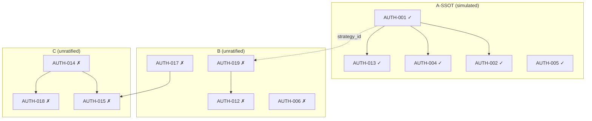
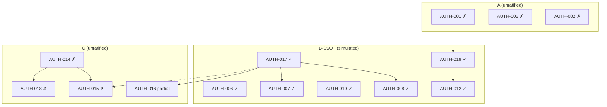
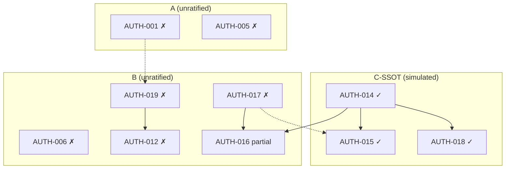

# SSOT Counterfactual Impact Simulation v1

**Status:** READ-ONLY COUNTERFACTUAL — keine SSOT-Auswahl, keine Konfliktauflösung, keine Architektur-Aktion  
**Erzeugt:** 2026-07-05  
**Branch:** `main` @ `2f1672bee8761f8d50def3f6ef31cc803824b2e9`  
**Scope:** Systemweite Wirkungssimulation pro SSOT-Kandidat **ohne** Ratifikation

**Inputs (frozen):**

| Artefakt | Pfad |
|----------|------|
| SSOT Decision Surface — Neutral v1 | [`ssot_decision_surface_neutral_v1.md`](ssot_decision_surface_neutral_v1.md) |
| Authority Resolution Synthesis v1 | [`authority_resolution_synthesis_v1.md`](authority_resolution_synthesis_v1.md) |
| Authority Conflict Matrix v1 | [`authority_conflict_matrix_v1.md`](authority_conflict_matrix_v1.md) |
| SSOT Decision Hygiene Report v1 | [`ssot_decision_hygiene_report_v1.md`](ssot_decision_hygiene_report_v1.md) |

**Validation Rule (frozen observation — nicht ratifiziert als Meta-SSOT):**

```text
NOT in Runtime Decision Core → NON-OPERATIONAL (even if implemented)
```

**Explizite Nicht-Ziele:**

- Keine SSOT-Ratifikation für irgendeine Domäne
- Keine Konfliktauflösung (AUTH-001–023 bleiben offen in dieser Simulation)
- Keine Code-, Registry-, Config- oder Runtime-Mutation
- Keine Rangfolge, Empfehlung oder „beste Wahl“ zwischen Szenarien
- Nur Konsequenz-Abbildung unter der Annahme: *„Kandidat X wird als SSOT ratifiziert; B und C bleiben unratifiziert“*

**Methodik:** Für jedes Szenario wird die in Synthesis §2 beschriebene *Candidate SSOT*-Oberfläche als **hypothetische Ratifikationsannahme** gesetzt. Nicht-ratifizierte Cluster bleiben im Ist-Zustand (Matrix Current Ownership). Breakpoints werden nach Propagierungszeit klassifiziert; Reconciliation Cost ist qualitativ (low / medium / high / critical).

---

## SECTION 1 — Scenario A Impact (ECM SSOT)

> **Hypothetische Ratifikationsannahme (Simulation only):**  
> Candidate A wird als SSOT für Strategy-Identity / Registry-Config-Cluster ratifiziert. Konkret modelliert als: ein kanonischer `strategy_id` (`armstrong_cycle` als StrategySpec-Oberfläche **oder** dokumentierte Alias-Matrix zu `ecm_cycle`); Strategy Layer (`src/strategies/ecm.py`, `src/strategies/armstrong/`) als einzige Code-Schicht für ECM; `STRATEGY_REGISTRY_TIERING_DUAL_SOURCE_CONTRACT_V1` als Leseregel-Oberbehörde für Live-Readiness pro ID.  
> **Nicht ratifiziert in dieser Simulation:** Candidate B (Execution), Candidate C (Capital/Risk).

### 1.1 Hypothetical SSOT Selection Outcome

| Dimension | Simulierte Ratifikations-Oberfläche | Offen bleibt (B/C unratifiziert) |
|-----------|-------------------------------------|----------------------------------|
| Strategy identity | AUTH-001 geschlossen (eine von Option a/b/c aus drift_cleanup_plan) | AUTH-006, AUTH-017, AUTH-014 |
| Config alignment | AUTH-002 folgt AUTH-001 | Runbook 3-owner vs merged module |
| Code layer | AUTH-003/004: Strategy Layer only; Feature-Engine deferred | MV2 compute vs packet path |
| Live-readiness | AUTH-005: Dual-Source Contract, per-ID Quelle ratifiziert | Registry tier vs Runtime NON-OPERATIONAL (AUTH-012) |
| Alias grammar | AUTH-013 konsistent mit AUTH-001 | Functional-only policy (AUTH-010) nur teilweise berührt |

### 1.2 Layer Impact Simulation

#### a) Runtime Decision Core

| Aspekt | Simulierte Wirkung |
|--------|-------------------|
| Slice A (Integrated Replay) | Kein direkter ECM-Import im Core heute; Wirkung **indirekt** über `strategy_id` in Suitability-Snapshot (AUTH-019-Kante) |
| Slice B (Intent Pipeline Bridge) | Unverändert gebunden an `capital_risk_sizing_v1`; ECM-SSOT definiert nicht Slice-Grenzen |
| Operational count | Validation Rule unberührt — ECM-Strategien bleiben NON-OPERATIONAL bis Core-Wiring (B-Cluster) |
| Double Play / MV2 | AUTH-006, AUTH-017, AUTH-008 bleiben konkurrierende Oberflächen |

#### b) Strategy Layer / Registry

| Aspekt | Simulierte Wirkung |
|--------|-------------------|
| `_STRATEGY_REGISTRY` | Alias/Identity-Konsolidierung; AUTH-001/002/013/004 als A-interne Kette geschlossen |
| `_FUNCTIONAL_ONLY_STRATEGY_IDS` | `ecm_cycle`-Disposition folgt AUTH-001-Option — beeinflusst AUTH-010-Policy-Konsistenz |
| Orphans (AUTH-009) | Unabhängig von A-SSOT; bleibt Leaf |
| `rsi_strategy` / `el_karoui` (AUTH-011, AUTH-020) | AUTH-013-Präzedenz wirkt; AUTH-020 folgt AUTH-005-Muster — nicht automatisch geschlossen |

#### c) Capital / Risk Layer

| Aspekt | Simulierte Wirkung |
|--------|-------------------|
| `capital_risk_sizing_v1` | Erhält Strategy-Kontext aus Snapshot; **falscher** `strategy_id`-Key bei AUTH-001-Fehlwahl → indirektes Sizing-Kontext-Risiko |
| Scope Capital (AUTH-015) | Unverändert offen — Packet-Handoff vs Replay-Lücke |
| Attestation (AUTH-018) | Unverändert offen — Slot-Modell vs merged module |
| Slice A/B (AUTH-016) | Unverändert — Boundary nicht durch A-SSOT definiert |

#### d) Documentation Layer

| Aspekt | Simulierte Wirkung |
|--------|-------------------|
| DOC-06 / Wiring Inventory | Konvergenz mit ratifizierter Identität; AUTH-003 docs-deferred Pfad aligniert |
| `missing_features_plan.md` (AUTH-021) | Teilweise entlastet (Feature-Engine deferred bestätigt); B-01 weiter separat |
| Matrix / Synthesis / Feature State Map | A-Konflikte als „ratified“ markierbar; B/C-Spalten bleiben widersprüchlich |
| Operator-facing tier docs | AUTH-005 geschlossen in A — **aber** AUTH-012 (tier ≠ operational) weiter offen → Leser-Risiko |

#### e) Cross-Domain Dependency Graph

```text
[A-SSOT] AUTH-001 resolved
  → AUTH-002, AUTH-004, AUTH-013 (intra-A closure)
  → strategy_id key in suitability snapshot [edge to B: AUTH-019]
       → Integrated Replay module binding [B unresolved: wiring sequence offen]
            → Capital context in Slice B [C unresolved: AUTH-014/015]
```

**Dual-parent Boundary (AUTH-016, AUTH-017):** Unverändert — A-SSOT definiert weder Slice-Grenze noch Packet-vs-Compute.

### 1.3 Breakpoints & Reconciliation Cost

| Kategorie | AUTH-IDs / Oberflächen | Beschreibung |
|-----------|------------------------|--------------|
| **Immediate** | AUTH-012 | Registry `tier="production"` für Armstrong widerspricht weiterhin Validation Rule — Operator kann „live ready“ aus Registry lesen während Core NON-OPERATIONAL |
| **Immediate** | AUTH-017, AUTH-006 | Ops evaluator vs Integrated Replay — parallele Compute-Autoritäten ohne B-SSOT |
| **Immediate** | AUTH-014 | Runbook 3-owner vs `capital_risk_sizing_v1` merge — Code/Runbook-Spannung explizit |
| **Delayed** | AUTH-019 | A-geschlossene `strategy_id` in Snapshot ohne B-Wiring-SSOT → deterministische Replay-Pfade unklar |
| **Delayed** | AUTH-010, AUTH-011 | Functional-only Policy nicht vollständig durch A-SSOT geschlossen |
| **Delayed** | AUTH-015, AUTH-018 | Scope Capital + Attestation folgen AUTH-014 — propagieren nach Capital-Review |
| **Hidden** | Chain A-max (Synthesis §4.1) | A alias → suitability `ecm_cycle` key → AUTH-012 false operational wenn Tier allein gelesen |
| **Hidden** | AUTH-005 ohne AUTH-012 | Live-readiness ratifiziert in A, operational gate in B offen → UI/Routing-Annahme-Kollision |
| **Hidden** | El-Karoui-Präzedenz | A-SSOT alias grammar suggeriert AUTH-011-Lösung — unterschiedliche Registry-Typen (Hygiene §4.4) |

**Reconciliation Cost (Scenario A only):** **medium** für A-interne Kette; **high** für Cross-Edges zu B; **critical** wenn AUTH-001-Option ohne Load-Path-Matrix ratifiziert wird (Chain A-max).

### 1.4 Dependency Fallout Map



### 1.5 Conflict Amplification Points (AUTH-IDs)

| AUTH-ID | Amplification Mechanism | Warum A-SSOT verschärft statt löst |
|---------|-------------------------|-------------------------------------|
| AUTH-012 | A schließt Live-Readiness pro ID; B-Operational-Read-Model offen | Zwei „Wahrheiten“: ratifizierte Readiness vs NON-OPERATIONAL Core |
| AUTH-019 | A fixiert strategy keys; B fixiert Wiring-Sequence nicht | Snapshot-Keys ohne dokumentierte Core-Bindung |
| AUTH-017 | Unverändert parallel Packet vs Integrated Replay | A-Identität irrelevant für Compute-Owner |
| AUTH-014 | Unverändert Runbook vs Code | Capital-Architektur unabhängig von ECM |
| AUTH-016 | Boundary dual-parent | A definiert Slice nicht |
| AUTH-010 | A-SSOT kann functional-only-Set ändern | Policy-Leaf in B-Cluster |

### 1.6 System Stability Rating (qualitative, Scenario A only)

| Dimension | Rating | Begründung (simuliert) |
|-----------|--------|------------------------|
| A-interne Konsistenz | stabilisiert | AUTH-001-Kette schließbar |
| B-Cluster-Kohärenz | destabilisiert | 10+ offene Konflikte; Cross-Edge von A speist AUTH-019 |
| C-Cluster-Kohärenz | unverändert fragil | AUTH-014 Hub offen |
| Cross-domain integration | fragil | AUTH-001→019→012 Kette ohne B-Closure |
| Operator interpretability | gemischt | A-Docs klarer; tier/operational-Spaltung schärfer sichtbar |
| Fail-closed safety | erhalten | Validation Rule unberührt; 0 live operational bleibt |

**Scenario A stability (gesamt, qualitativ):** partielle Stabilisierung in Strategy/Identity; **systemweite** Kohärenz bleibt durch unratifizierte B/C gebunden.

---

## SECTION 2 — Scenario B Impact (Execution SSOT)

> **Hypothetische Ratifikationsannahme (Simulation only):**  
> Candidate B wird als SSOT für Decision/Execution/Runtime-Cluster ratifiziert. Konkret modelliert als: `integrated_offline_trading_logic_replay_v1.py` + `double_play_composition_matrix_v1` = offline compute authority; `decision_packet_v1` + `local_evaluator_v1` = handoff/evidence schema (nicht compute); Validation Rule + `feature_state_map_v1` = operational prerequisite; `suitability_binding_v1` + dokumentierte Snapshot-Sequence = Strategy→Core wiring; Ops `evaluate_double_play` = LEGACY_NON_AUTHORITATIVE.  
> **Nicht ratifiziert in dieser Simulation:** Candidate A (ECM), Candidate C (Capital/Risk).

### 2.1 Hypothetical SSOT Selection Outcome

| Dimension | Simulierte Ratifikations-Oberfläche | Offen bleibt (A/C unratifiziert) |
|-----------|-------------------------------------|----------------------------------|
| Offline compute | AUTH-006, AUTH-017, AUTH-008 geschlossen (Hierarchie) | AUTH-001 ECM identity |
| Handoff schema | AUTH-007: Packet = evidence; Replay = compute | AUTH-014 Runbook vs merge |
| Operational semantics | AUTH-012: Tier ≠ operational; Core wiring required | AUTH-005 live-readiness triangle |
| Strategy→Core | AUTH-019: suitability snapshot sequence | AUTH-002 config orphan |
| Registry policy | AUTH-010 als Policy-Oberfläche; AUTH-009 Leaf | AUTH-013 ECM alias |

### 2.2 Layer Impact Simulation

#### a) Runtime Decision Core

| Aspekt | Simulierte Wirkung |
|--------|-------------------|
| Slice A | AUTH-017/006/008 geschlossen — Integrated Replay als compute owner; Scenario Replay subordinate |
| Slice B | Bridge weiterhin `BOUND_NOT_ACTIVATED`; B-SSOT definiert **nicht** Capital-Owner-Reihenfolge |
| Packet flow | AUTH-007 Grenze ratifiziert — kein auto-mirror Ops→Packet |
| Activation (DEF-01) | Klarere Pfad-Hierarchie; Slice-A-Vollständigkeit explizit **nicht** Slice-B-Ersatz |

#### b) Strategy Layer / Registry

| Aspekt | Simulierte Wirkung |
|--------|-------------------|
| Operational read model | AUTH-012 geschlossen — Registry-Tier = Promotion; Operational = Core-bound |
| Suitability wiring | AUTH-019 geschlossen — kein implizites `registry.py` = Core |
| ECM (AUTH-001–005) | **Unverändert offen** — `ecm_cycle` vs `armstrong_cycle` weiter dual |
| Functional IDs (AUTH-010/011) | Policy ratifiziert in B; ECM-spezifische Alias (AUTH-013) hängt an offenem AUTH-001 |
| Production tier count | 23+ Strategien bleiben in Registry; operational count = Core-bound subset (klarer dokumentiert) |

#### c) Capital / Risk Layer

| Aspekt | Simulierte Wirkung |
|--------|-------------------|
| AUTH-016 | Slice A/B Grenze durch B-SSOT dokumentiert; **welcher Slice bindet Sizing** teilweise geklärt |
| AUTH-014 | **Offen** — merged module vs Runbook 3-owner |
| AUTH-015 | Scope Capital in Packet ≠ Replay — Lücke bleibt; B-SSOT kann Packet als handoff-only bestätigen → **verschärft** sichtbare Lücke |
| AUTH-018 | Attestation slots vs merged module — unverändert |
| Chain B-max (Synthesis §4.2) | Risiko wenn AUTH-016 „Slice A complete“ ohne C-Closure gelesen wird |

#### d) Documentation Layer

| Aspekt | Simulierte Wirkung |
|--------|-------------------|
| `MASTER_V2_DECISION_AUTHORITY_MAP_V1` | Aligniert mit B-SSOT; Stage-Tabelle „partial/unclear“ reduziert |
| AUTH-021, AUTH-022 | Docs-Echo; nicht durch B-SSOT allein geschlossen |
| ECM docs (DOC-06 BLOCKED) | Weiterhin widersprüchlich zu ratifiziertem B-Wiring wenn falsche strategy_id |
| Feature State Map Class A/B | B-SSOT verstärkt Class-A-Semantik für Integrated Replay |

#### e) Cross-Domain Dependency Graph

```text
[B-SSOT] AUTH-017, AUTH-006, AUTH-019, AUTH-012 resolved
  → AUTH-008, AUTH-007 (intra-B)
  → Slice A/B boundary documented [AUTH-016 partial]
       → capital_risk_sizing_v1 input path [C unresolved: AUTH-014]
            → Scope Capital replay gap [AUTH-015 ✗]
  ← strategy_id from registry/snapshot [A unresolved: AUTH-001]
       → wrong module binding if A offen
```

### 2.3 Breakpoints & Reconciliation Cost

| Kategorie | AUTH-IDs / Oberflächen | Beschreibung |
|-----------|------------------------|--------------|
| **Immediate** | AUTH-001, AUTH-002 | Dual ECM identity — Suitability snapshot kann ambiguous keys tragen |
| **Immediate** | AUTH-005 | Armstrong triangle — Registry vs Config vs TOML widerspricht B-Operational-Read-Model-Lesern |
| **Immediate** | AUTH-014 | Runbook vs merged code — explizite Architektur-Spannung |
| **Delayed** | AUTH-015 | Packet handoff als non-compute bestätigt → fehlender Replay-Step sichtbarer |
| **Delayed** | AUTH-018 | Attestation erwartet 3 Owner-Slots; Code hat 1 merged module |
| **Delayed** | AUTH-013, AUTH-011 | Alias policy ohne A-SSOT — inkonsistent mit B functional-policy |
| **Hidden** | Chain B-max | Ops authority assumption (wenn B-SSOT unvollständig enforced) → Capital ohne Slice B |
| **Hidden** | AUTH-008 scenario fixtures | Scope Capital fixtures wirken authoritative ohne Replay-Step (AUTH-015) |
| **Hidden** | Premature tier deflation | B-SSOT operational strictness + offenes AUTH-005 → Operator unterbewertet tier metadata |

**Reconciliation Cost (Scenario B only):** **low–medium** für B-interne Kette; **high** für A×B Cross-Edge (AUTH-001→019); **critical** für B×C wenn AUTH-016 als „complete“ ohne AUTH-014 gelesen (Chain B-max).

### 2.4 Dependency Fallout Map



### 2.5 Conflict Amplification Points (AUTH-IDs)

| AUTH-ID | Amplification Mechanism | Warum B-SSOT verschärft statt löst |
|---------|-------------------------|-------------------------------------|
| AUTH-001 | B ratifiziert snapshot wiring; A offen | Replay bindet möglicherweise falsches ECM-Modul |
| AUTH-005 | B trennt operational vs tier; A offen | Drei Live-Readiness-Quellen ohne per-ID SSOT |
| AUTH-014 | B klärt Slice A endet vor sizing; C offen | Lücke Runbook↔Code **sichtbarer**, nicht geschlossen |
| AUTH-015 | B bestätigt Packet ≠ compute | Scope Capital absent in Replay — Gap explicit |
| AUTH-016 | dual-parent; B dokumentiert Slice A | Capital-Sizing-Bindung ohne C-SSOT ambiguous |
| AUTH-020 | Tier pattern analog AUTH-005 | El-Karoui drift unter B operational lens |

### 2.6 System Stability Rating (qualitative, Scenario B only)

| Dimension | Rating | Begründung (simuliert) |
|-----------|--------|------------------------|
| B-interne Konsistenz | stabilisiert | MV2 path, DP authority, wiring, operational read model |
| A-Cluster-Kohärenz | unverändert fragil | ECM identity offen; speist B via AUTH-019 |
| C-Cluster-Kohärenz | destabilisiert (Sichtbarkeit) | AUTH-014/015/018 kontrastieren schärfer mit ratifiziertem Slice-Modell |
| Cross-domain integration | fragil | B-max chain ohne C; A→B strategy_id |
| Operator interpretability | verbessert für MV2 | verschlechtert für ECM/Capital ohne A/C |
| Fail-closed safety | gestärkt | Operational gate explizit; Tier-Inflation-Risiko reduziert |

**Scenario B stability (gesamt, qualitativ):** starke Stabilisierung im Runtime/Execution-Kern; **Capital- und Identity-Ränder** bleiben strukturell unterspannung.

---

## SECTION 3 — Scenario C Impact (Capital SSOT)

> **Hypothetische Ratifikationsannahme (Simulation only):**  
> Candidate C wird als SSOT für Capital/Risk/Sizing-Cluster ratifiziert. Konkret modelliert als: `capital_risk_sizing_v1.py` merged chain (ScopeCapitalEnvelope → PreSizingRisk → Sizing → PostSizingRisk) = Implementierungs-Wahrheit; Runbook v2.6 entweder (a) annotiert als merged-by-intent **oder** (b) drei Replay-Steps — eine Option wird ratifiziert; Attestation slot model aligned post AUTH-014; Scope Capital replay presence folgt AUTH-014-Option.  
> **Nicht ratifiziert in dieser Simulation:** Candidate A (ECM), Candidate B (Execution).

### 3.1 Hypothetical SSOT Selection Outcome

| Dimension | Simulierte Ratifikations-Oberfläche | Offen bleibt (A/B unratifiziert) |
|-----------|-------------------------------------|----------------------------------|
| Sizing chain | AUTH-014 geschlossen (merge **or** split explizit) | AUTH-001 identity |
| Scope Capital replay | AUTH-015 folgt AUTH-014-Option | AUTH-017 compute path |
| Attestation | AUTH-018 aligned to ratified owners | AUTH-012 tier vs operational |
| Slice boundary | AUTH-016 partial — C definiert Sizing-Bindung in Slice B | AUTH-006 DP authority |
| Packet handoff | Scope Capital in Packet = input; Replay-Step ratifiziert oder bewusst merged | AUTH-008 replay surfaces |

### 3.2 Layer Impact Simulation

#### a) Runtime Decision Core

| Aspekt | Simulierte Wirkung |
|--------|-------------------|
| Slice B | `capital_risk_sizing_v1` Owner-Reihenfolge ratifiziert; Bridge-Pipeline kohärenter |
| Slice A | Unverändert — AUTH-017/006 offen; Integrated Replay vs Packet parallel |
| Scope Capital in Replay | AUTH-015 geschlossen per C-Option — **oder** dedizierter Step addiert (Architektur-Implikation) |
| Double Play | Kein C-SSOT-Einfluss auf AUTH-006/008 |

#### b) Strategy Layer / Registry

| Aspekt | Simulierte Wirkung |
|--------|-------------------|
| Direkter Impact | minimal — Capital-SSOT konsumiert Strategy-Kontext, definiert es nicht |
| Indirekt | Sizing-Kontext abhängig von Strategy-Parametern bei offenem AUTH-001 |
| AUTH-012 | Unverändert — Registry production tier vs NON-OPERATIONAL |
| AUTH-019 | Unverändert — Wiring offen |

#### c) Capital / Risk Layer

| Aspekt | Simulierte Wirkung |
|--------|-------------------|
| AUTH-014 | Hub geschlossen — Runbook↔Code-Spannung aufgelöst (eine Richtung) |
| AUTH-015 | Replay-Integration oder bewusste Packet-only-Ratifizierung |
| AUTH-018 | Attestation slots sync mit gewählter Owner-Struktur |
| AUTH-016 | C-SSOT definiert **welcher Slice** Sizing bindet — Boundary-Klarheit aus C-Perspektive |
| Chain C-max (Synthesis §4.3) | Vermieden wenn AUTH-014 vollständig ratifiziert |

#### d) Documentation Layer

| Aspekt | Simulierte Wirkung |
|--------|-------------------|
| Runbook v2.6 | Aligniert oder explizit superseded für sizing steps |
| `trading_core_decision_attestation_v1` | Slot-Refs konsistent |
| MV2 Authority Map | Slice B Stage-Tabelle ergänzbar; Slice A weiter partial |
| ECM / Registry docs | Unberührt — AUTH-001–005 offen |

#### e) Cross-Domain Dependency Graph

```text
[C-SSOT] AUTH-014 resolved
  → AUTH-015, AUTH-018 (intra-C)
  → AUTH-016 Sizing-Bindung [partial dual-parent]
       ← Slice A evidence [B unresolved: AUTH-017]
            ← strategy_id [A unresolved: AUTH-001]
  ← Packet ScopeCapitalHandoff [B unresolved: handoff vs compute hierarchy]
```

### 3.3 Breakpoints & Reconciliation Cost

| Kategorie | AUTH-IDs / Oberflächen | Beschreibung |
|-----------|------------------------|--------------|
| **Immediate** | AUTH-017 | Parallel MV2 paths — C definiert nicht compute owner |
| **Immediate** | AUTH-006 | Ops vs composition matrix — unverändert |
| **Immediate** | AUTH-001 | ECM dual identity — Sizing context ambiguity |
| **Delayed** | AUTH-019 | Snapshot wiring ohne B-SSOT |
| **Delayed** | AUTH-012 | Operational semantics ohne B-SSOT |
| **Delayed** | AUTH-008 | Scenario replay fixtures vs C-ratifizierte Scope Capital step |
| **Hidden** | AUTH-015 duplicate step | Scope Capital Replay-Step ohne AUTH-014-Option → double-count risk |
| **Hidden** | Packet as replay substitute | ScopeCapitalEnvelopeHandoff treated as sized input ohne B-SSOT |
| **Hidden** | Slice A completeness | C ratifiziert Slice B sizing; B offen → evidence chain gap |

**Reconciliation Cost (Scenario C only):** **low–medium** für C-interne Kette bei vollständiger AUTH-014-Ratifizierung; **high** für C×B (AUTH-016/017); **critical** wenn AUTH-015 vor AUTH-014-Option oder ohne B handoff/compute rule (Chain C-max).

### 3.4 Dependency Fallout Map



### 3.5 Conflict Amplification Points (AUTH-IDs)

| AUTH-ID | Amplification Mechanism | Warum C-SSOT verschärft statt löst |
|---------|-------------------------|-------------------------------------|
| AUTH-017 | C ratifiziert Scope Capital presence; B offen | Handoff vs compute hierarchy unklar — wer erzeugt Envelope? |
| AUTH-016 | C definiert Slice B sizing; B offen | Slice A evidence end — Integrationslücke |
| AUTH-001 | Sizing context from strategy | Falsche ID → Capital korrekt intern, falsch extern |
| AUTH-012 | C irrelevant für tier; B offen | Operator verwechselt Capital-ratifiziert mit operational |
| AUTH-008 | Scenario fixtures with ScopeCapital | Fixture authority vs C-ratifizierter Replay step |
| AUTH-019 | Wiring offen | Capital pipeline erhält Snapshot ohne Sequence-SSOT |

### 3.6 System Stability Rating (qualitative, Scenario C only)

| Dimension | Rating | Begründung (simuliert) |
|-----------|--------|------------------------|
| C-interne Konsistenz | stabilisiert | AUTH-014-Kette schließbar |
| A-Cluster-Kohärenz | unverändert fragil | Kein A-Impact |
| B-Cluster-Kohärenz | destabilisiert (Integration) | Slice A→B joint unklar ohne B-SSOT |
| Cross-domain integration | fragil | C-max und B-max chains latent |
| Operator interpretability | verbessert für Capital/Runbook | MV2/ECM weiter ambiguous |
| Fail-closed safety | erhalten | Validation Rule unberührt |

**Scenario C stability (gesamt, qualitativ):** partielle Stabilisierung in Capital/Risk/Sizing; **Upstream Decision Path** bleibt ohne B-SSOT strukturell offen.

---

## COMPARATIVE TABLE (Scenarios A / B / C)

> **Leseregel:** Spalten sind **symmetrisch**; keine „Preferred“-Spalte. Ratings beschreiben **simulierte** Wirkung pro Szenario isoliert, nicht relative Überlegenheit.

| Dimension | Scenario A (ECM SSOT) | Scenario B (Execution SSOT) | Scenario C (Capital SSOT) |
|-----------|----------------------|----------------------------|---------------------------|
| **Primary stabilized layer** | Strategy / Registry / Config | Runtime Decision Core / MV2 | Capital / Risk / Sizing / Runbook |
| **Primary destabilized layer** | B-Cluster (wiring, MV2 path) | C-Cluster (Scope Capital gap sichtbarer) | B-Cluster (Slice A evidence) |
| **Immediate breakpoints** | AUTH-012, AUTH-017, AUTH-014 | AUTH-001, AUTH-005, AUTH-014 | AUTH-017, AUTH-006, AUTH-001 |
| **Delayed breakpoints** | AUTH-019, AUTH-015, AUTH-018 | AUTH-015, AUTH-018, AUTH-013 | AUTH-019, AUTH-012, AUTH-008 |
| **Hidden breakpoints** | Chain A-max; AUTH-005×012 | Chain B-max; AUTH-008 fixtures | Chain C-max; Packet substitute |
| **Reconciliation cost (intra-cluster)** | medium | low–medium | low–medium |
| **Reconciliation cost (cross-domain)** | high | high | high |
| **Reconciliation cost (worst-case chain)** | critical (A-max) | critical (B-max) | critical (C-max) |
| **AUTH-IDs closed (simulated)** | AUTH-001,002,003,004,005,013 (+020 partial) | AUTH-006,007,008,010,012,017,019 (+011 partial) | AUTH-014,015,018 (+016 partial) |
| **AUTH-IDs amplified** | AUTH-012,019,017,014 | AUTH-001,005,014,015,016 | AUTH-017,016,001,012,008 |
| **Boundary AUTH-016/017** | Unresolved | Partial B-side closure | Partial C-side closure |
| **Docs-only residual (021–023)** | Unchanged | Unchanged | Unchanged |
| **Validation Rule effect** | Unchanged (fail-closed) | Strengthened interpretability | Unchanged |
| **System stability (qualitative)** | Partial A; fragile systemwide | Partial B; fragile A/C edges | Partial C; fragile B upstream |

---

## SECTION 4 — NON-SELECTION INSIGHT

> Dieser Abschnitt beschreibt strukturelle Eigenschaften, die **unabhängig davon** gelten, welcher Kandidat ratifiziert würde — und wo das System **ohne** SSOT-Wahl am fragilsten ist.

### 4.1 Assumptions Most Sensitive to ANY SSOT Choice

| Sensitive Assumption | Betroffene AUTH-IDs | Warum jede Wahl es berührt |
|---------------------|---------------------|----------------------------|
| **Validation Rule (NON-OPERATIONAL default)** | AUTH-012, AUTH-005, AUTH-020 | Jede Domänen-SSOT erzeugt „ratifizierte“ Lesart neben der Rule — Verwechslung operational ↔ identity/tier |
| **strategy_id in Suitability Snapshot** | AUTH-001, AUTH-019, AUTH-011 | A fixiert ID; B fixiert Wiring; C konsumiert — jede Wahl prägt Snapshot-Semantik |
| **Slice A / Slice B joint completeness** | AUTH-016, AUTH-017, AUTH-014, AUTH-015 | Kein Single-Domain-SSOT definiert vollständige A→B→C Kette |
| **Dual-Source Tiering Contract** | AUTH-005, AUTH-020, AUTH-012 | Ratifikation in A oder B ändert welche Quelle „gewinnt“ ohne per-ID Entscheid |
| **Packet vs Compute directionality** | AUTH-007, AUTH-017, AUTH-015 | B oder C ratifiziert eine Seite — andere Domäne bleibt konkurrierend |
| **Registry functional/OOP grammar** | AUTH-010, AUTH-013, AUTH-001 | A-SSOT oder B-SSOT policy — nie beide gleichzeitig ohne Cross-Alignment |
| **Runbook vs Code ownership** | AUTH-014, AUTH-018 | C-SSOT löst lokal; B oder A Ratifikation ändert nicht Runbook ohne C |
| **Collapse-Chain Null-Hypothese** | A-max, B-max, C-max | Hygiene §4.4: Kandidaten in Synthesis wirken als implizite Null-Hypothese — jede Wahl testet Abweichung von **einem** Kandidaten, nicht von Status quo |

### 4.2 System Parts Invariant Under Selection

| Invariant | Evidenz | Gilt unter A / B / C |
|-----------|---------|----------------------|
| **0 live operational features** | Matrix Runtime Core; Snapshot | Ja — keine SSOT-Wahl aktiviert Bridge |
| **`BOUND_NOT_ACTIVATED` / `BOUND_OFFLINE`** | Matrix §Runtime Decision Core | Ja — C-SSOT ändert nicht Activation |
| **Docs-only residual AUTH-021–023** | Neutral Surface §Docs-Only Layer | Ja — erfordern Safe/Structural Docs-Fixes unabhängig von A/B/C |
| **Orphan `breakout_confirmation_v1` (AUTH-009)** | Leaf in B; unabhängig von A/C | Ja — unless B-SSOT registry policy explizit einbezieht |
| **Psychology reporting path (AUTH-023)** | Reporting layer | Ja |
| **Feature-Engine Class C deferred** | AUTH-003 docs-deferred | Ja unter B/C; bestätigt unter A |
| **Fail-closed ohne Core wiring** | Validation Rule | Ja — intentional safety invariant |
| **23 Konflikte existieren pre-SSOT** | Matrix §7 | Ja — partial closure only per scenario |

### 4.3 Structurally Most Fragile Loci (without SSOT selection)

| Fragility Locus | Typ | AUTH-IDs | Mechanism |
|-----------------|-----|----------|-----------|
| **A × B identity→wiring edge** | Cross-domain | AUTH-001 → AUTH-019 → AUTH-012 | Falsche strategy key + Tier-Read ohne Core = false operational |
| **B × C path→capital edge** | Cross-domain | AUTH-017 → AUTH-015 → AUTH-018 | Packet/handoff vs compute + Scope Capital gap + attestation mismatch |
| **Boundary dual-parent** | Architectural | AUTH-016, AUTH-017 | Kein Single-Cluster-SSOT schließt beide Eltern |
| **Tier metadata triangle** | Registry/Config | AUTH-005, AUTH-020 | Drei Quellen ohne per-ID ratifizierte Quelle — unabhängig von MV2-SSOT |
| **Implicit de-facto authorities** | Governance meta | Hygiene §1.2 | `armstrong_cycle`, Integrated Replay, merged sizing — **vor** Ratifikation vorbelegt |
| **Linear artefact chain bias** | Process | Hygiene §4.1 | Synthesis/Kandidaten lesen sich als Fortsetzung, nicht Optionen |
| **Validation Rule ↔ Identity conflation** | Semantic | AUTH-012 vs AUTH-001 | Operational gate ersetzt nicht Identity-SSOT — verbreitetste Fehlinterpretation |
| **Scenario replay fixtures** | Hidden runtime | AUTH-008 × AUTH-015 | Subordinate surface mit Capital fixtures ohne Hierarchy-SSOT |

### 4.4 Single-SSOT Insufficiency (structural observation)

Keines der drei Szenarien schließt **alle** 23 AUTH-Konflikte. Strukturelle Beobachtung aus Neutral Surface §3.3:

```text
Maximal simulated closure per scenario:
  A → ~7 primäre A-Konflikte (+ partial 020)
  B → ~10 primäre B-Konflikte (+ partial 011)
  C → ~3 primäre C-Konflikte (+ partial 016/017 boundary)

Shared boundary (AUTH-016, AUTH-017) requires ≥2 domain perspectives regardless of which is ratified first.

Docs-only layer (AUTH-021, AUTH-022, AUTH-023) invariant — no A/B/C alone collapses.
```

Diese Beobachtung ist **keine Empfehlung** für Multi-SSOT oder Sequenz — nur Feststellung: unitary selection per candidate leaves predictable residual conflict sets.

### 4.5 Simulation Limits

| Limit | Beschreibung |
|-------|--------------|
| Kein Code gelesen | Simulation basiert auf Governance-Artefakten @ frozen SHA |
| Keine Options-(a/b/c)-Verzweigung innerhalb A | Jede AUTH-001-Option hätte unterschiedliche A-max severity — hier aggregiert |
| Keine AUTH-014 Option (a vs b) Verzweigung innerhalb C | Merge-by-intent vs drei Replay-Steps — aggregiert |
| Keine Enforcement-Simulation | Ratifikation ≠ Runtime-Mutation in diesem Artefakt |
| Keine Ranking-Sprache | Stability ratings sind pro-Szenario, nicht vergleichend ordinal |

---

## Explicit Non-Actions (this artifact)

| Kategorie | Verboten |
|-----------|----------|
| SSOT-Auswahl | Keine Ratifikation A, B oder C |
| Konfliktauflösung | Keine AUTH-001–023 Entscheidung |
| Architektur | Keine Slice-, Bridge- oder Registry-Änderung |
| Normalisierung | Keine „Expected“-Spalten-Enforcement |
| Sequenzierung | Keine Wave-/Tier-Reihenfolge-Empfehlung |

**Nächster Schritt (Operator, außerhalb dieses Artefakts):** Explizite SSOT-Entscheidung **oder** Multi-Domain-Ratifikationsplanung auf Basis von Neutral Surface + dieser Counterfactual — nur mit Operator-GO und PRE_PR_VALIDATION. Dieses Dokument liefert **keine** Empfehlung.

---

## Cross-References

| Artefakt | Rolle in dieser Simulation |
|----------|----------------------------|
| [`ssot_decision_surface_neutral_v1.md`](ssot_decision_surface_neutral_v1.md) | Candidate clusters, neutral graph |
| [`authority_resolution_synthesis_v1.md`](authority_resolution_synthesis_v1.md) | Candidate SSOT surfaces, collapse chains |
| [`authority_conflict_matrix_v1.md`](authority_conflict_matrix_v1.md) | Current ownership, 23 conflicts |
| [`ssot_decision_hygiene_report_v1.md`](ssot_decision_hygiene_report_v1.md) | Bias inventory, sensitive assumptions |

**Simulation-Owner:** SSOT Counterfactual Impact Simulation v1  
**Evidence frozen at:** `2f1672bee8761f8d50def3f6ef31cc803824b2e9`
