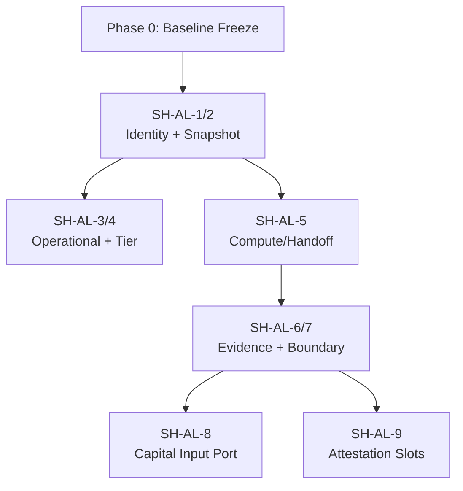
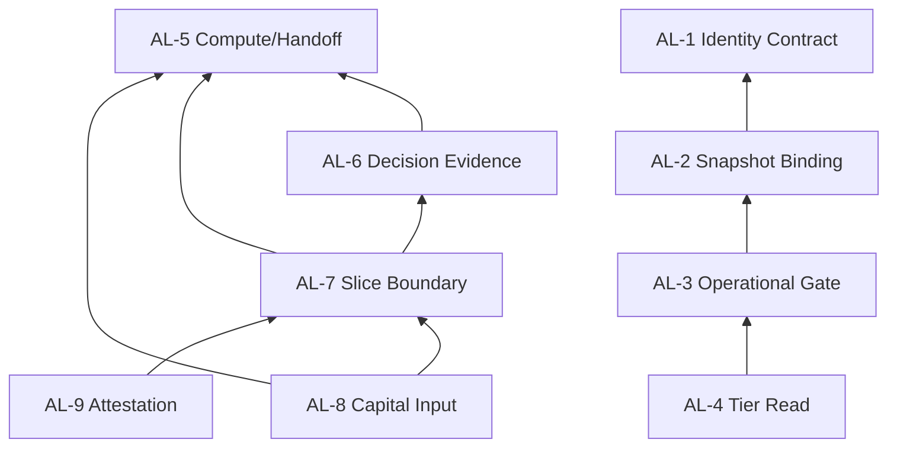
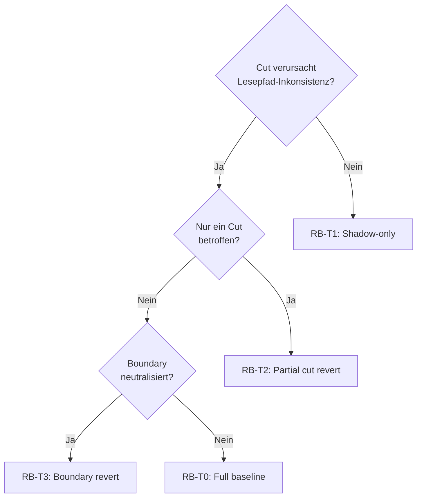

# SSOT Cycle Break Execution Strategy v1 (Safe Transition Design)

**Status:** READ-ONLY TRANSITION DESIGN — keine SSOT-Auswahl, keine Konfliktauflösung, keine Architektur-Ausführung  
**Erzeugt:** 2026-07-05  
**Branch:** `main` @ `2f1672bee8761f8d50def3f6ef31cc803824b2e9`  
**Scope:** Minimal-Risiko-Übergangsstrategie zur Eliminierung zyklischer Authority-Abhängigkeiten zwischen A (ECM), B (Execution), C (Capital) — **ohne** Runtime-Mutation, **ohne** Cut-Set-Auswahl, **ohne** SSOT-Ratifikation

**Inputs (frozen):**

| Artefakt | Pfad |
|----------|------|
| SSOT Cycle Break Implementation Plan v1 | [`ssot_cycle_break_plan_v1.md`](ssot_cycle_break_plan_v1.md) |
| SSOT System Decoupling Design v1 | [`ssot_decoupling_design_v1.md`](ssot_decoupling_design_v1.md) |
| SSOT Counterfactual Impact Simulation v1 | [`ssot_counterfactual_simulation_v1.md`](ssot_counterfactual_simulation_v1.md) |

**Domain-Labels (Referenz only — keine Rangfolge):**

| Label | Cluster | Original-Bezeichnung |
|-------|---------|----------------------|
| **A** | Candidate A | ECM / Strategy-Identity / Registry-Config |
| **B** | Candidate B | Decision / Execution / Runtime |
| **C** | Candidate C | Capital / Risk / Sizing |

**Validation Rule (frozen observation — nicht als Meta-SSOT ratifiziert):**

```text
NOT in Runtime Decision Core → NON-OPERATIONAL (even if implemented)
```

**Explizite Nicht-Ziele dieses Artefakts:**

- Keine SSOT-Ratifikation für A, B oder C
- Keine Auflösung von AUTH-001–023
- Keine Code-, Config-, Bridge- oder Registry-Mutation
- Keine Empfehlung, welches MCS (2α/2β/2γ/3★) oder welche AL-Schicht „zuerst“ operativ umgesetzt werden soll
- Keine Cut-Set-Auswahl — nur parallele Übergangspläne pro dokumentiertem MCS

---

## Section 1: Transition Framework (Phase 0 → Phase 3)

### 1.1 Phasenmodell (design-only)

Alle MCS-Übergänge folgen demselben **vierphasigen Sicherheitsrahmen**. Phasen beschreiben **logische** Übergangsstufen — keine Kalender-, Wave- oder Operator-GO-Sequenz.

| Phase | Bezeichnung | Zweck | Runtime-Wirkung |
|-------|-------------|-------|-----------------|
| **Phase 0** | Baseline Freeze & Invariant Lock | Aktuellen Authority-Graph einfrieren; Invarianten dokumentieren | **Keine** — Ist-Verhalten unverändert |
| **Phase 1** | Shadow Contract Introduction | AL-Schichten als **parallele Lesepfade** einführen; Pass-through-Semantik | **Keine** — Shadow liest, enforced nicht |
| **Phase 2** | Cut Activation (Logical) | Authority-Kanten logisch severieren; Contract-Grenzen aktivieren | **Keine** bei `BOUND_NOT_ACTIVATED` — nur Governance-Lesepfad |
| **Phase 3** | Boundary Neutralization & Residual Isolation | Dual-parent Nodes neutralisieren; Residual-Zyklen isolieren; Rollback-Gates schließen oder verwerfen | **Keine** ohne explizite Operator-Enforcement außerhalb dieses Plans |

### 1.2 Dependency-Safe Ordering Principles

Reihenfolge innerhalb jeder MCS-Transition folgt **harte Abhängigkeitsregeln** — unabhängig davon, welches MCS später gewählt wird:

| Regel-ID | Regel | Begründung |
|----------|-------|------------|
| **ORD-1** | Upstream opaque refs vor Downstream sequence cuts | E-AB-1 (AL-1/2) muss Shadow haben, bevor B-Sequence-Authority isoliert wird |
| **ORD-2** | Meta/semantic cuts (E-AB-2, E-META-1) nach oder parallel zu structural A→B cuts, nie vor AL-1 Shadow | Verhindert operational/tier-Vakuum während Identity noch implizit |
| **ORD-3** | Compute/Handoff inversion (E-BC-1, AL-5) vor Capital input typing (E-CA-1, AL-8) | Counterfactual §4.3: Packet substitute bricht vor Sizing-Port |
| **ORD-4** | Slice boundary neutralization (AL-7) vor Attestation slot typing (AL-9) | CY-CINT-1: Slots referenzieren Boundary-Stages |
| **ORD-5** | Boundary node neutralization (AUTH-016/017) erst nach mindestens einem B↔C Kanten-Cut Shadow | Dual-parent ohne Kanten-Cut erzeugt Owner-Vakuum |
| **ORD-6** | Kein Cut Activation ohne abgeschlossene Phase-1-Shadow für betroffene AL-Schicht | Rollback erfordert funktionierenden Pass-through |

### 1.3 Phase-Gate Checklist (pro Cut-Edge)

Jede Cut-Edge-Transition durchläuft identische Gates:

```text
Phase 0 → 1:  Invarianten dokumentiert ∧ Shadow-Interface spezifiziert ∧ Pass-through-Äquivalenz definiert
Phase 1 → 2:  Shadow-Output ≡ Ist-Authority-Lesart (observation-only) ∧ Rollback-Pfad getestet (logical)
Phase 2 → 3:  Residual-Zyklen kartiert ∧ Boundary-Neutralisierung spezifiziert (falls MCS-relevant)
Phase 3:      Rollback-Gate entweder geschlossen (Cut bestätigt) oder reveriert zu Phase 1 Shadow-only
```

---

## Section 2: MCS-2 Transition Plans (Cardinality 2)

> **Hinweis:** Die folgenden Pläne sind **parallele Design-Alternativen**. Dieses Dokument wählt **keines** als bevorzugt.

### 2.1 MCS-2α — `{E-AB-1, E-BC-1}`

**Cuts:** Identity↔Wiring (A→B) + Compute↔Packet-Substitute (B→C)  
**AL-Schichten:** AL-1, AL-2, AL-5  
**Gebrochene Zyklen (partial→structural):** CY-AB-1, CY-BC-1, CY-ABC-1 (partial)  
**Residual:** CY-META-1, CY-CINT-1 (partial), E-BC-2/E-BC-3

#### Phase 0 — Baseline Freeze

| Schritt | Aktion (logical) | AUTH-Bezug |
|---------|------------------|------------|
| 0α-1 | Authority-Graph E-AB-1 und E-BC-1 als Cut-Kandidaten markieren | AUTH-001↔019, AUTH-017↔015 |
| 0α-2 | Invarianten-Lock: 0 live operational; `BOUND_NOT_ACTIVATED`; fail-closed | Counterfactual §4.2 |
| 0α-3 | Fragility-Loci-Snapshot: A×B identity→wiring; B×C path→capital | Counterfactual §4.3 |

#### Phase 1 — Shadow Contract Introduction

| Reihenfolge | Shadow-Interface | Pass-through-Semantik |
|-------------|------------------|----------------------|
| 1 (ORD-1) | **SH-AL-1/2** — StrategyIdentityContract + SuitabilitySnapshotBinding | Shadow listet bestehende `strategy_id`-Keys exakt wie Ist-Snapshot; keine Key-Umdeutung |
| 2 (ORD-3) | **SH-AL-5** — ComputeHandoffSeparation | Shadow taggt bestehende Handoff-Pfade mit `evidence_provenance: LEGACY_IMPLICIT` — spiegelt Ist ohne Inversion |

#### Phase 2 — Cut Activation (Logical)

| Reihenfolge | Cut | Activation-Regel |
|-------------|-----|------------------|
| 1 | **E-AB-1** | B-Leser dürfen Identity nur via `StrategyIdentityRef` konsumieren; Alias-Inference explizit verboten (CB-A→B-1) |
| 2 | **E-BC-1** | Handoff ohne `evidence_provenance` gilt als **untyped** — nicht als Compute-Ersatz (CB-B→C-1) |

#### Phase 3 — Residual Isolation

| Residual | Isolation-Strategie |
|----------|---------------------|
| CY-META-1 | **Nicht adressiert** in MCS-2α — bleibt als bewusstes Residual dokumentiert |
| E-BC-2/E-BC-3 | Dual-parent AUTH-016/014-Kopplung bleibt; **keine** Boundary-Neutralisierung in 2α |
| CY-CINT-1 | Partial — Attestation weiterhin an undokumentierte Boundary gebunden |

**Rollback boundary (2α):** Nach Phase-2-Aktivierung von E-AB-1 allein → Revert zu SH-AL-1/2 Pass-through. Nach E-BC-1 → zusätzlich SH-AL-5 Pass-through. Phase-3 ohne Boundary-Neutralisierung ist vollständig revertierbar zu Phase 1.

---

### 2.2 MCS-2β — `{E-AB-2, E-BC-2}`

**Cuts:** Operational↔Tier (B→A) + Capital↔Slice-Boundary (C→B)  
**AL-Schichten:** AL-3, AL-4, AL-6, AL-7  
**Gebrochene Zyklen:** CY-AB-1, CY-BC-1, CY-CINT-1  
**Residual:** CY-ABC-1 (E-AB-1 + E-CA-1), CY-META-1 (partial), E-BC-1

#### Phase 0 — Baseline Freeze

| Schritt | Aktion (logical) | AUTH-Bezug |
|---------|------------------|------------|
| 0β-1 | E-AB-2 und E-BC-2 als Cut-Kandidaten markieren | AUTH-012↔005, AUTH-014↔016 |
| 0β-2 | Tier-Triangle und dual-parent AUTH-016 dokumentieren | AUTH-005, AUTH-016 |
| 0β-3 | Validation-Rule-Lesepfad von Identity/Tier trennen (Beobachtung only) | E-META-1 Beobachtung |

#### Phase 1 — Shadow Contract Introduction

| Reihenfolge | Shadow-Interface | Pass-through-Semantik |
|-------------|------------------|----------------------|
| 1 (ORD-2) | **SH-AL-3/4** — OperationalGateReadModel + TierReadSpec | Shadow reproduziert exakt Ist-Lesart: operational aus Core-Wiring; tier aus Registry/Config — **keine** Orthogonalität erzwungen |
| 2 (ORD-5 prep) | **SH-AL-6/7** — DecisionEvidenceBundle + SliceBoundaryContract | Shadow deklariert `slice_a_terminus`/`slice_b_terminus` als **Beobachtungsorte** aus bestehender Doku — kein Owner-Transfer |

#### Phase 2 — Cut Activation (Logical)

| Reihenfolge | Cut | Activation-Regel |
|-------------|-----|------------------|
| 1 | **E-AB-2** | Operational gate darf Tier/Live-Readiness **nicht** inferieren (CB-META-1, CB-A-tier-1) |
| 2 | **E-BC-2** | Capital-Architektur darf Slice-Grenze **nicht** als Owner-Anspruch definieren (CB-BND-1) |

#### Phase 3 — Residual Isolation

| Residual | Isolation-Strategie |
|----------|---------------------|
| CY-ABC-1 | E-AB-1 und E-CA-1 **nicht** geschnitten — ABC-Rückweg C→A→B bleibt |
| E-BC-1 | Packet-Substitute-Pfad bleibt aktiv — AL-5 **nicht** in 2β Scope |
| CY-META-1 | Partial — E-META-1 nur indirekt via AL-3 adressiert |

**Rollback boundary (2β):** E-AB-2 revert → SH-AL-3/4 unified read path. E-BC-2 revert → SH-AL-7 deklarativ-only ohne Owner-Entkopplung. AL-6 Shadow kann unabhängig revertiert werden.

---

### 2.3 MCS-2γ — `{E-AB-1, E-BC-2}`

**Cuts:** Identity↔Wiring (A→B) + Capital↔Slice-Boundary (C→B)  
**AL-Schichten:** AL-1, AL-2, AL-6, AL-7  
**Gebrochene Zyklen:** CY-AB-1, CY-BC-1, CY-ABC-1 (partial), CY-CINT-1 (partial)  
**Residual:** CY-META-1, E-BC-1

#### Phase 0 — Baseline Freeze

| Schritt | Aktion (logical) | AUTH-Bezug |
|---------|------------------|------------|
| 0γ-1 | E-AB-1 und E-BC-2 markieren | AUTH-001↔019, AUTH-014↔016 |
| 0γ-2 | Kombinierte Fragility: A×B edge + Boundary dual-parent | Counterfactual §4.3 |
| 0γ-3 | E-BC-1 Residual explizit als offener Substitute-Pfad dokumentieren | AUTH-017↔015 |

#### Phase 1 — Shadow Contract Introduction

| Reihenfolge | Shadow-Interface | Pass-through-Semantik |
|-------------|------------------|----------------------|
| 1 (ORD-1) | **SH-AL-1/2** | Identisch zu 2α Phase 1 |
| 2 (ORD-5) | **SH-AL-6/7** | Identisch zu 2β Phase 1 |

#### Phase 2 — Cut Activation (Logical)

| Reihenfolge | Cut | Activation-Regel |
|-------------|-----|------------------|
| 1 | **E-AB-1** | CB-A→B-1, CB-B-seq-1 |
| 2 | **E-BC-2** | CB-BND-1 — AUTH-016 neutralisiert (Capital-seitiger Anspruch) |

#### Phase 3 — Residual Isolation

| Residual | Isolation-Strategie |
|----------|---------------------|
| CY-META-1 | Unaddressed — E-AB-2 nicht geschnitten |
| E-BC-1 | Packet-Substitute bleibt — **kein** AL-5 in 2γ |
| CY-ABC-1 | Partial — E-CA-1 offen; AL-8 nicht eingeführt |

**Rollback boundary (2γ):** Unabhängige Reverts pro Cut möglich; E-BC-2-Revert erfordert Re-Aktivierung dual-parent AUTH-016 Lesart.

---

### 2.4 MCS-2 Vergleichsmatrix (Design only — keine Auswahl)

| Dimension | MCS-2α | MCS-2β | MCS-2γ |
|-----------|--------|--------|--------|
| Primär geschnittene Domänen-Kante | A→B, B→C | B→A, C→B | A→B, C→B |
| Meta-Zyklus CY-META-1 | Residual | Partial | Residual |
| ABC-Dreieck CY-ABC-1 | Partial | Residual (stärker) | Partial |
| Attestation CY-CINT-1 | Partial | Adressiert | Partial |
| Packet-Substitute E-BC-1 | Geschnitten | Residual | Residual |
| Rollback-Komplexität | niedrig (2 Cuts, keine Boundary) | mittel (semantic + boundary) | mittel (cross-domain mix) |

---

## Section 3: MCS-3★ Transition Plan (Cardinality 3)

**Cuts:** `{E-AB-1, E-BC-1, E-AB-2}`  
**AL-Schichten (Kern):** AL-1, AL-2, AL-3, AL-4, AL-5  
**Vollständige Break (mit Ergänzung):** + Boundary-Neutralisierung (AUTH-016, AUTH-017) + AL-6, AL-7, AL-8, AL-9  
**Gebrochene Zyklen:** CY-AB-1, CY-BC-1, CY-ABC-1, CY-META-1 (partial), CY-CINT-1 (partial)  
**Residual ohne Ergänzung:** E-BC-2 dual-parent ohne Boundary-Neutralisierung

### 3.1 Phase 0 — Baseline Freeze

| Schritt | Aktion (logical) |
|---------|------------------|
| 0★-1 | Alle drei Cut-Edges und Boundary-Nodes AUTH-016/017 als Transition-Scope markieren |
| 0★-2 | Vollständige Zyklus-Inventur CY-AB-1 … CY-CINT-1 einfrieren |
| 0★-3 | Counterfactual Invarianten-Set verifizieren (0 operational; 23 Konflikte pre-SSOT) |
| 0★-4 | Collapse-Chain Null-Hypothese dokumentieren (A-max, B-max, C-max) — **keine** Auflösung |

### 3.2 Phase 1 — Shadow Contract Introduction (Dependency-Safe Ordering)



| Wave (logical) | Shadow-Interfaces | ORD-Regel | Pass-through |
|----------------|-------------------|-----------|--------------|
| **1** | SH-AL-1, SH-AL-2 | ORD-1 | Bestehende strategy keys + snapshot sequence unverändert |
| **2a** | SH-AL-3, SH-AL-4 | ORD-2 | Unified read — operational/tier wie Ist |
| **2b** | SH-AL-5 | ORD-3 | Handoff/Compute-Pfade mit Legacy-Provenance-Tag |
| **3** | SH-AL-6, SH-AL-7 | ORD-4, ORD-5 | Boundary als deklarative Orte aus Ist-Doku |
| **4a** | SH-AL-8 | ORD-3 | Sizing input schema spiegelt Ist-Kontext |
| **4b** | SH-AL-9 | ORD-4 | Attestation slots als `(stage_id, UNASSIGNED)` |

### 3.3 Phase 2 — Cut Activation (Logical, Ordered)

| Aktivierungsschritt | Cut | AL | Contract Boundary |
|---------------------|-----|-----|-------------------|
| 2★-1 | **E-AB-1** | AL-1, AL-2 | CB-A→B-1, CB-B-seq-1 |
| 2★-2 | **E-AB-2** | AL-3, AL-4 | CB-META-1, CB-A-tier-1 |
| 2★-3 | **E-BC-1** | AL-5 | CB-B→C-1 |
| 2★-4 | **E-BC-2** *(Ergänzung)* | AL-7 | CB-BND-1 |
| 2★-5 | **E-BC-3** *(Ergänzung)* | AL-6 | CB-B-out-1 |
| 2★-6 | **E-CA-1** *(Ergänzung)* | AL-8 | CB-C-in-1 |
| 2★-7 | **CY-CINT-1 internal** *(Ergänzung)* | AL-9 | CB-C-att-1 |

**Aktivierungsregel:** Jeder Schritt 2★-N erfordert abgeschlossene Shadow-Äquivalenz für betroffene AL-Schicht (ORD-6).

### 3.4 Phase 3 — Boundary Neutralization & Rollback Gate

| Schritt | Aktion | Ziel |
|---------|--------|------|
| 3★-1 | AUTH-016 → SliceBoundaryContract (non-owning) | Dual-parent neutralisiert |
| 3★-2 | AUTH-017 → ComputeHandoffSeparation (unidirectional) | Evidence-Richtung fixiert |
| 3★-3 | Residual-Zyklus-Scan — alle CY-* als **broken** oder **explicitly residual** klassifizieren |
| 3★-4 | Rollback-Gate: Operator bestätigt Cut-Set oder revertiert zu Phase-1-Shadow-only |

**Vollständige Zyklus-Break-Beobachtung (design topology target):**

```text
|MCS-3★| + Boundary-Neutralisierung(AUTH-016, AUTH-017) + AL-7 + AL-9
  → strukturelle Break aller §1-Zyklen
  → SSOT pro Domäne ratifizierbar ohne zyklische Prämissen-Kette
  → KEINE SSOT-Wahl in diesem Artefakt
```

---

## Section 4: Zero-Downtime Abstraction Points

Zero-Downtime ist hier **governance-semantisch** definiert: Keine Änderung des Runtime Decision Core-Verhaltens während der Transition. Evidenz: Counterfactual §4.2 — System ist pre-SSOT bereits NON-OPERATIONAL; Bridge `BOUND_NOT_ACTIVATED`.

### 4.1 Invariante Zero-Downtime Surfaces

| Surface | Warum zero-downtime | Transition-Modus |
|---------|---------------------|------------------|
| Runtime Decision Core | 0 live operational features | AL-Schichten existieren nur als Governance-Lesepfad |
| Validation Rule gate | Fail-closed unberührt | AL-3 Shadow **addiert** Lesesphäre, ersetzt Rule nicht |
| Registry / `_STRATEGY_REGISTRY` | Keine Key-Mutation in Transition | AL-1 Shadow referenziert Ist-Keys als opaque refs |
| `capital_risk_sizing_v1` chain | Bridge nicht aktiviert | AL-8 Shadow validiert Schema, ändert keine Sizing-Logik |
| Docs-only AUTH-021–023 | Invariant unter allen Szenarien | Außerhalb Transition-Scope |

### 4.2 Per-AL Zero-Downtime Insertion Points

| AL | Insertion Point (logical) | Zero-Downtime Mechanismus |
|----|---------------------------|---------------------------|
| **AL-1** | A→B Identity export boundary | Pass-through: `StrategyIdentityRef` = bestehender key string |
| **AL-2** | B Suitability snapshot sequence | Pass-through: Reihenfolge unverändert; Spalte nur **annotiert** |
| **AL-3** | Meta operational read | Parallel read; Ist-Operational-Semantik bleibt authoritative bis Phase 2 |
| **AL-4** | A tier read | Parallel read; Registry/Config/TOML Lesart unverändert |
| **AL-5** | B→C handoff boundary | Annotation-only provenance tag; kein Pfad-Switch |
| **AL-6** | B Slice A output | Typ-Annotation auf bestehendem Output; kein Feld-Add |
| **AL-7** | AUTH-016 boundary | Deklarative Orts-Labels; keine Stage-Umordnung |
| **AL-8** | C input port | Schema-Check im Shadow-Modus: `FAIL_CLOSED` nur bei expliziter Activation |
| **AL-9** | C attestation slots | Typisierung `(stage_id, UNASSIGNED)` — keine Slot-Umstrukturierung |

### 4.3 Zero-Downtime Violation Guards

| Guard-ID | Bedingung | Aktion bei Verletzung |
|----------|-----------|----------------------|
| **ZD-1** | Shadow-Output ≠ Ist-Lesart | Phase-2-Aktivierung **blockiert** — remain Phase 1 |
| **ZD-2** | AL-Enforcement ändert operational count | Sofort-Revert zu Shadow-only |
| **ZD-3** | Boundary-Neutralisierung vor Kanten-Cut Shadow | ORD-5 Verletzung — Rollback zu Phase 1 |
| **ZD-4** | Runtime Bridge activation während Transition | **Außerhalb Scope** — Transition pausiert (Operator) |

---

## Section 5: Temporary Shadow Interfaces (Logical Only)

Shadow-Interfaces sind **parallele Contract-Oberflächen** ohne Authority-Transfer. Sie existieren ausschließlich in Governance-Dokumentation und Leseregel-Spezifikation — keine Code-Artefakte in diesem Plan.

### 5.1 Shadow Interface Catalog

| Shadow-ID | Realisiert AL | Semantik | Lebensdauer |
|-----------|---------------|----------|-------------|
| **SH-AL-1/2** | AL-1, AL-2 | Dual-column snapshot: `[legacy_key, identity_ref]` — Werte identisch | Phase 1 → Phase 3 oder Rollback |
| **SH-AL-3/4** | AL-3, AL-4 | Dual-read log: `{operational: Ist, tier: Ist, orthogonal: false}` | Phase 1 → Cut E-AB-2 Activation |
| **SH-AL-5** | AL-5 | Provenance overlay: `{path, provenance: LEGACY_IMPLICIT}` | Phase 1 → Cut E-BC-1 Activation |
| **SH-AL-6/7** | AL-6, AL-7 | Boundary map: `{terminus_id, source_doc, owner_claim: null}` | Phase 1 → Boundary Neutralization |
| **SH-AL-8** | AL-8 | Input validator (dry-run): `{schema_ok, fail_closed: false}` | Phase 1 → Cut E-CA-1 Activation |
| **SH-AL-9** | AL-9 | Slot typifier: `{stage_id, owner_domain_tag: UNASSIGNED}` | Phase 1 → CY-CINT-1 Cut |

### 5.2 Shadow ↔ Production Contract Relationship

```text
Phase 1:  Ist-Authority ──► Leser
              │
              └──► Shadow (parallel, pass-through, observation-only)

Phase 2:  Ist-Authority ──► Shadow ──► Contract-enforced read
              │                              │
              └── (deprecated path) ─────────┘  ← Rollback target

Phase 3:  Contract-enforced read only (logical)
          Rollback-Gate closed OR reverted to Phase 1
```

### 5.3 Shadow Interface Retirement Rules

| Bedingung | Retirement-Aktion |
|-----------|-------------------|
| Phase-2-Cut bestätigt + Rollback-Gate geschlossen | Shadow merge into active contract spec |
| Phase-2-Cut revertiert | Shadow becomes sole read path; contract spec withdrawn |
| Residual-Zyklus detected post-activation | Shadow re-enabled for affected edge only |

---

## Section 6: Safe Rollback Boundaries

### 6.1 Rollback Tier Model

| Tier | Bezeichnung | Revert-Umfang | Datenverlust (logical) |
|------|-------------|---------------|------------------------|
| **RB-T0** | Full baseline | Phase 0 — alle Shadows withdrawn | Keiner — reine Ist-Lesart |
| **RB-T1** | Shadow-only | Phase 1 — Cuts deactivated, Shadows remain | Keiner — observation continues |
| **RB-T2** | Partial cut revert | Einzelne Cut-Edge reverted; andere Cuts aktiv | Mögliche Lesepfad-Inkonsistenz — dokumentiert |
| **RB-T3** | Boundary revert | AUTH-016/017 Re-Owner-Claims | Dual-parent Zyklus reaktiviert — **bewusstes Residual** |

### 6.2 Per-Cut Rollback Boundaries

| Cut-Edge | Safe Rollback Point | Reaktivierter Zyklus | Rollback-Kosten |
|----------|---------------------|----------------------|-----------------|
| **E-AB-1** | Nach SH-AL-1/2 etabliert | CY-AB-1 (partial) | niedrig |
| **E-AB-2** | Nach SH-AL-3/4 etabliert | CY-META-1 | niedrig |
| **E-BC-1** | Nach SH-AL-5 etabliert | CY-BC-1 (partial) | mittel — Packet-Substitute returns |
| **E-BC-2** | Nach SH-AL-7 etabliert | CY-BC-1, CY-CINT-1 | mittel — dual-parent returns |
| **E-BC-3** | Nach SH-AL-6 etabliert | Capital präjudiziert Slice A | mittel |
| **E-CA-1** | Nach SH-AL-8 etabliert | CY-ABC-1 | niedrig |
| **Boundary AUTH-016/017** | Nach AL-7/AL-5 Phase 2 | Alle B↔C Zyklen | **hoch** — Tier-3 revert |

### 6.3 Rollback Safety Invariants

Während **jeder** Rollback-Operation gelten:

| Invariant | Enforcement |
|-----------|-------------|
| 0 live operational | Unverändert |
| Validation Rule fail-closed | Unverändert |
| Keine SSOT-Ratifikation | Unverändert |
| 23 AUTH-Konflikte | Unverändert — Rollback löst keine Konflikte |
| Bridge activation | Verboten während Rollback (ZD-4) |

### 6.4 MCS-Specific Rollback Boundaries

| MCS | Atomic Rollback Unit | Nicht-isolierbar ohne Tier-3 |
|-----|----------------------|------------------------------|
| **MCS-2α** | E-AB-1 ⊥ E-BC-1 (unabhängig) | — |
| **MCS-2β** | E-AB-2 ⊥ E-BC-2 (unabhängig) | AL-6 von AL-7 |
| **MCS-2γ** | E-AB-1 ⊥ E-BC-2 (unabhängig) | — |
| **MCS-3★** | Einzelne 2★-N Schritte | Boundary 3★-1/2 nach Phase 3 |

---

## Section 7: Non-Breaking Decoupling Strategy (AL-1 → AL-9)

### 7.1 Kernprinzip: Behavioral Equivalence Preservation

```text
∀ Phase p ∈ {0,1}:  RuntimeBehavior(p) ≡ RuntimeBehavior(baseline)
∀ Phase 2 cut:       GovernanceReadPath(cut) ⊂ GovernanceReadPath(baseline)  -- strict subset, not superset
Phase 3:             Authority graph acyclic; RuntimeBehavior still ≡ baseline (no activation)
```

AL-Schichten **entkoppeln Authority-Lesepfade**, nicht Runtime-Ausführung. Counterfactual §4.2 bestätigt: Ratifikation ≠ Runtime-Mutation; dasselbe gilt für Contract-Transition.

### 7.2 AL Introduction Pattern (vier Schritte, jede AL)

| Schritt | Aktion | Runtime-Wirkung |
|---------|--------|-----------------|
| **A** | Contract-Spec dokumentieren (Felder, Regeln, CB-*) | Keine |
| **B** | Shadow-Interface aktivieren (Pass-through) | Keine |
| **C** | Equivalence-Check: Shadow ≡ Ist | Keine |
| **D** | Cut Activation (logical) — nur nach C bestanden | Keine (Governance-only) |

### 7.3 Per-AL Non-Breaking Introduction

| AL | Einführungsreihenfolge (within MCS) | Non-Breaking Garantie |
|----|-------------------------------------|----------------------|
| **AL-1** | Erste in jedem MCS mit E-AB-1 | Key-String unverändert; nur Typ-Annotation `StrategyIdentityRef` |
| **AL-2** | Paired mit AL-1 | Sequence-Spalte unverändert; Key-Spalte nur annotiert |
| **AL-3** | Vor E-AB-2 Cut; nach AL-1 Shadow in MCS-3★ | Operational gate liest weiterhin Core-Wiring — Shadow addiert Spalte |
| **AL-4** | Paired mit AL-3 | Tier-Quellen unverändert; `tier_source` nur dokumentiert |
| **AL-5** | Vor AL-8; nach AL-1 in MCS-3★ | Handoff-Pfade unverändert; Provenance-Tag default `LEGACY_IMPLICIT` |
| **AL-6** | Nach AL-5; vor AL-7 | Output-Felder unverändert; Bundle-Typ ist Annotation |
| **AL-7** | Nach mindestens einem B↔C Cut Shadow | Boundary-Labels aus Ist-Doku; keine Stage-Reihenfolge-Änderung |
| **AL-8** | Nach AL-5 und AL-7 in vollständiger Transition | Sizing-Logik unverändert; Schema-Validation dry-run only bis Activation |
| **AL-9** | Nach AL-7 | Slot-Struktur unverändert; `owner_domain_tag: UNASSIGNED` default |

### 7.4 Cross-AL Dependency Graph (Introduction Order)



**Leseregel:** Kanten = „Shadow muss existieren bevor abhängige AL Phase 2 erreicht“. AL-1 ist Wurzel; AL-9 ist Blatt.

### 7.5 Non-Breaking Verification Checklist (pro AL)

```text
□ Shadow pass-through produziert bit-identische Governance-Lesart
□ Kein neues authoritative Feld ohne Default = Ist-Wert
□ Kein Enforcement-Punkt aktiviert ohne explizite Phase-2-Gate
□ Rollback zu SH-AL-* in < 1 logical operator action (RB-T1)
□ Counterfactual Invarianten §4.2 unverletzt
```

---

## Section 8: Dependency Isolation Strategy

### 8.1 Isolation Layers

| Layer | Isolation-Mechanismus | Verhindert |
|-------|----------------------|------------|
| **L-ISO-1: Opaque Reference** | Cross-domain IDs als undurchsichtige Refs | A→B Identity-Inference (E-AB-1) |
| **L-ISO-2: Orthogonal Read Spheres** | Getrennte Lesepfade operational / tier / identity | Meta-Zyklus (E-AB-2, E-META-1) |
| **L-ISO-3: Unidirectional Evidence** | Compute produziert; Handoff transportiert | Packet-Substitute (E-BC-1) |
| **L-ISO-4: Non-Owning Boundary** | AUTH-016/017 als Contract, nicht Owner | Dual-parent Recursion (E-BC-2, E-BC-3) |
| **L-ISO-5: Input-Schema-Only** | C validiert Typen, nicht Identity-SSOT | C→A Rückkopplung (E-CA-1) |
| **L-ISO-6: Typed Attestation** | Slots referenzieren Stages, nicht Architektur-Prosa | CY-CINT-1 internal |

### 8.2 Domain Isolation Matrix (post-transition target)

| Von \ Nach | A | B | C | Meta |
|------------|---|---|---|------|
| **A** | intra-domain DAG | opaque `StrategyIdentityRef` only | — (via B evidence) | tier read spec only |
| **B** | **keine** Rückkopplung | intra-domain DAG | `DecisionEvidenceBundle` + provenance | operational read only |
| **C** | **keine** Identity-Resolution | **keine** Compute-Definition | intra-domain DAG | — |
| **Meta** | **keine** Identity-Ratifikation | **keine** Tier-Inflation | — | Validation Rule only |

### 8.3 Residual Dependency Containment

Nach MCS-2-Transition (ohne Ergänzung) bleiben Residual-Zyklen **contained**:

| MCS | Containment-Strategie |
|-----|----------------------|
| MCS-2α | CY-META-1 in L-ISO-2 **nicht** adressiert — explizit markiert; CY-CINT-1 via L-ISO-4 **nicht** adressiert |
| MCS-2β | CY-ABC-1 via L-ISO-5 **nicht** adressiert — E-CA-1 offen |
| MCS-2γ | E-BC-1 via L-ISO-3 **nicht** adressiert — Packet-Substitute contained but active |
| MCS-3★ + Boundary | Alle L-ISO-1…6 adressiert — Residual nur intra-domain |

### 8.4 Intra-Domain Dependencies (explicitly out of transition scope)

Cross-Domain-Isolation **löst nicht** intra-domain Ketten (Cycle Break Plan §8.4):

| Cluster | Kette | Isolation |
|---------|-------|-----------|
| A | AUTH-001 → 002 → 013 → 004 | A-intern — kein Cross-Domain-Rollback |
| B | AUTH-017 → 008; 019 → 012; 006 → 007 | B-intern |
| C | AUTH-014 → 015 → 018 | C-intern |

Transition-Rollback (RB-T0…T3) **restores Cross-Domain cycles only** — intra-domain Konflikte bleiben unverändert.

---

## Section 9: Rollback Safety Description (Consolidated)

### 9.1 Rollback Decision Tree



### 9.2 Rollback Safety Guarantees

| Garantie | Bedingung |
|----------|-----------|
| **G-RB-1** | Jeder Phase-2-Cut hat dokumentierten RB-T1-Pfad |
| **G-RB-2** | Boundary-Neutralisierung (Phase 3) erfordert RB-T3 — nicht RB-T1 |
| **G-RB-3** | Rollback aktiviert nie Runtime Bridge |
| **G-RB-4** | Rollback ratifiziert keinen SSOT-Kandidaten |
| **G-RB-5** | Post-rollback Authority-Graph ≡ Pre-transition Graph (logical) |

### 9.3 Rollback Evidence Requirements (design-only)

Vor Rollback-Gate-Schließung (Phase 3★-4) muss dokumentiert sein:

```text
ROLLBACK_BOUNDARY_ID=<Cut-Edge or Boundary>
SHADOW_EQUIVALENCE_PROVEN=<true|false>
INVARIANTS_INTACT=<0 operational; fail-closed; 23 conflicts>
RESIDUAL_CYCLES=<list>
REVERT_PATH=<RB-T0|T1|T2|T3>
```

---

## Section 10: Explicit Non-Actions

| Kategorie | Verboten in diesem Artefakt |
|-----------|----------------------------|
| **SSOT-Auswahl** | Keine Ratifikation von A, B oder C |
| **Cut-Auswahl** | Keine Empfehlung MCS-2α vs 2β vs 2γ vs 3★ |
| **Konfliktauflösung** | Keine AUTH-001–023 Entscheidung |
| **Implementierung** | Keine Code-, Config-, Bridge- oder Alias-Mutation |
| **Enforcement** | Keine Runtime-Aktivierung oder Bridge-Lift |
| **Priorisierung** | Keine Wave-/Kalender-Sequenz für Operator |
| **Architektur-Ausführung** | Keine Slice-, Registry- oder Runbook-Änderung |

---

## Appendix A: MCS → Phase → AL Quick Index

| MCS | Phase 1 Shadows | Phase 2 Cuts | Phase 3 Ergänzung |
|-----|-----------------|--------------|-------------------|
| **MCS-2α** | SH-AL-1/2, SH-AL-5 | E-AB-1, E-BC-1 | Residual dokumentieren |
| **MCS-2β** | SH-AL-3/4, SH-AL-6/7 | E-AB-2, E-BC-2 | Residual dokumentieren |
| **MCS-2γ** | SH-AL-1/2, SH-AL-6/7 | E-AB-1, E-BC-2 | Residual dokumentieren |
| **MCS-3★** | SH-AL-1…9 (ordered) | E-AB-1, E-AB-2, E-BC-1 (+ Ergänzungen) | Boundary AUTH-016/017 + AL-7/9 |

## Appendix B: Artefakt-Kette

```text
ssot_decoupling_design_v1
  → ssot_cycle_break_plan_v1
    → ssot_cycle_break_execution_strategy_v1   ← dieses Dokument
      → [SSOT Decision — NOT YET]
```

---

**Strategy-Owner:** SSOT Cycle Break Execution Strategy v1 (Safe Transition Design)  
**Evidence frozen at:** `2f1672bee8761f8d50def3f6ef31cc803824b2e9`
