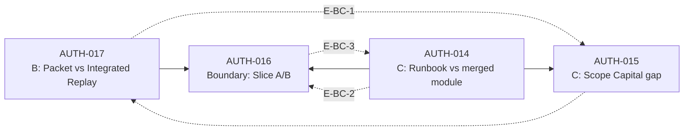
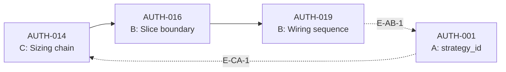
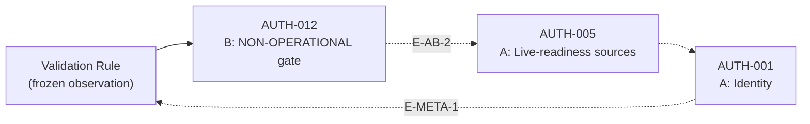
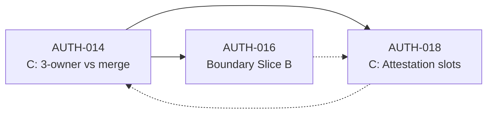

# SSOT Cycle Break Implementation Plan v1 (Graph Cut Design)

**Status:** READ-ONLY IMPLEMENTATION PLAN — keine SSOT-Auswahl, keine Konfliktauflösung, keine Architektur-Ausführung  
**Erzeugt:** 2026-07-05  
**Branch:** `main` @ `2f1672bee8761f8d50def3f6ef31cc803824b2e9`  
**Scope:** Minimaler Graph-Cut-Plan zur Eliminierung zyklischer Authority-Abhängigkeiten zwischen A (ECM), B (Execution), C (Capital) — **ohne** Ratifikation eines SSOT-Kandidaten

**Inputs (frozen):**

| Artefakt | Pfad |
|----------|------|
| SSOT System Decoupling Design v1 | [`ssot_decoupling_design_v1.md`](ssot_decoupling_design_v1.md) |
| SSOT Counterfactual Impact Simulation v1 | [`ssot_counterfactual_simulation_v1.md`](ssot_counterfactual_simulation_v1.md) |
| Authority Resolution Synthesis v1 | [`authority_resolution_synthesis_v1.md`](authority_resolution_synthesis_v1.md) |

**Domain-Labels (Referenz only — keine Rangfolge):**

| Label | Cluster | Original-Bezeichnung |
|-------|---------|----------------------|
| **A** | Candidate A | ECM / Strategy-Identity / Registry-Config |
| **B** | Candidate B | Decision / Execution / Runtime |
| **C** | Candidate C | Capital / Risk / Sizing |

**Validation Rule (frozen observation — nicht als Meta-SSOT ratifiziert):**

```text
NOT in Runtime Decision Core → NON-OPERATIONAL (even if implemented)
```

**Explizite Nicht-Ziele dieses Plans:**

- Keine SSOT-Ratifikation für A, B oder C
- Keine Auflösung von AUTH-001–023
- Keine Ownership-Neuverteilung, Modul-Reassignment oder Code-Mutation
- Keine Empfehlung, welcher MCS oder welche AL-Schicht „zuerst“ eingeführt werden soll
- Keine Sequenzierung in Waves/Phasen — nur beschreibende Graph-Break-Strategie

---

## Section 1: Cyclical Dependency Inventory

Modelliert **Authority-Kopplung** (wer darf welche Wahrheit definieren), nicht Import-/Call-Graph. Kanten = *„Authority in Domäne X referenziert oder überschreibt implizit Authority in Domäne Y“*.

### 1.1 Zyklen-Übersicht

| Zyklus-ID | Pfad (Domain) | Typ | Blockiert SSOT-Selection weil … |
|-----------|---------------|-----|--------------------------------|
| **CY-AB-1** | A → B → A | Identity ↔ Operational | Identity-SSOT und Wiring-SSOT gegenseitig prämissenreich |
| **CY-BC-1** | B → C → B | Path ↔ Capital boundary | Compute-Owner und Capital-Owner definieren Slice gemeinsam |
| **CY-ABC-1** | C → B → A → C | Full triangle | Kein Single-Domain-SSOT schließt End-to-End-Kette |
| **CY-META-1** | Rule ↔ B ↔ A | Semantic | Safety-Gate und Identity/Tier nicht orthogonal gelesen |
| **CY-CINT-1** | C → B → C (via AUTH-016/018) | Attestation boundary | Meta-Slots und Slice-Stages wechselseitig |

**Shared boundary nodes:** AUTH-016 und AUTH-017 — jeder B↔C-Zyklus traversiert mindestens einen davon (Counterfactual §4.4; Synthesis §3.4).

---

## Section 2: Per-Cycle Analysis — Minimal Cut Edges & Break Types

### Break-Type-Legende

| Code | Bezeichnung | Bedeutung |
|------|-------------|-----------|
| **(a)** | Interface insertion | Typisiertes Contract-Interface zwischen Domänen; Authority bleibt intra-domain |
| **(b)** | Dependency inversion | Richtungsumkehr: Downstream konsumiert, definiert nicht; Upstream produziert Evidence |
| **(c)** | Abstraction layer separation | Gemeinsame Boundary wird zu non-owning Contract-Surface neutralisiert |
| **(d)** | Removal of implicit authority link | Implizite Rückschlüsse (Leseregel-Vermischung) explizit unterbunden |

---

### 2.1 CY-AB-1 — Identity ↔ Operational (A ↔ B)

**Mechanismus:** ECM-Identität (A) definiert `strategy_id`-Keys im Suitability-Snapshot (B). Operational-Read-Model (B) liest Registry-Tier und interpretiert Live-Readiness (A) implizit über AUTH-005. AUTH-005 beeinflusst Identity-Promotion (AUTH-001) — Rückkopplung.

**Betroffene AUTH-IDs:** AUTH-001, AUTH-002, AUTH-005, AUTH-012, AUTH-013, AUTH-019


| Minimal Cut Edge | AUTH-Bezug | Break Type | Intervention |
|------------------|------------|------------|--------------|
| **E-AB-1** *(primär)* | AUTH-001 ↮ AUTH-019 | **(a)** Interface insertion | AL-1 StrategyIdentityContract + AL-2 SuitabilitySnapshotBinding |
| **E-AB-2** *(sekundär, Meta)* | AUTH-012 ↮ AUTH-005 | **(d)** Removal of implicit authority link | AL-3 OperationalGateReadModel + AL-4 TierReadSpec |

**Minimal cut set (cycle-local):** `{E-AB-1}` bricht A→B→A-Rückweg teilweise; vollständiger Break erfordert `{E-AB-1, E-AB-2}`.

**Collapse-Referenz:** Chain A-max (Synthesis §4.1); Counterfactual §1.3 Hidden breakpoints.

---

### 2.2 CY-BC-1 — Path ↔ Capital Boundary (B ↔ C)

**Mechanismus:** Execution (B) definiert über AUTH-017 Compute vs Handoff. Capital (C) definiert über AUTH-014 Slice-B-Merge vs Runbook-3-Owner. AUTH-016 dual-parent: B dokumentiert Slice A-Ende; C dokumentiert Slice-B-Sizing-Bindung. AUTH-015 schließt Schleife: Packet-Scope-Capital ohne Replay-Step wirkt wie Compute-Ersatz (B←C).

**Betroffene AUTH-IDs:** AUTH-014, AUTH-015, AUTH-016, AUTH-017, AUTH-018, AUTH-007



| Minimal Cut Edge | AUTH-Bezug | Break Type | Intervention |
|------------------|------------|------------|--------------|
| **E-BC-1** *(primär)* | AUTH-017 ↮ AUTH-015 | **(b)** Dependency inversion | AL-5 ComputeHandoffSeparation |
| **E-BC-2** *(primär)* | AUTH-014 ↮ AUTH-016 | **(c)** Abstraction layer separation | AL-7 SliceBoundaryContract |
| **E-BC-3** *(ergänzend)* | AUTH-016 ↮ AUTH-014 (B-side) | **(c)** Abstraction layer separation | AL-6 DecisionEvidenceBoundary |

**Boundary node neutralization (zusätzlich zu Kanten-Cuts):**

| Node | Neutralisierung | Break Type |
|------|-----------------|------------|
| AUTH-016 | SliceBoundaryContract — deklarative Grenze ohne Owner-Anspruch | **(c)** |
| AUTH-017 | ComputeHandoffSeparation — unidirektionale Evidence-Richtung | **(b)** |

**Minimal cut set (cycle-local):** `{E-BC-1, E-BC-2}` + Boundary-Neutralisierung AUTH-016/017.

**Collapse-Referenz:** Chain B-max, Chain C-max (Synthesis §4.2, §4.3); Counterfactual §4.3 B×C edge.

---

### 2.3 CY-ABC-1 — Full Triangle (C → B → A → C)

**Mechanismus:** Capital (C) konsumiert Strategy-Kontext aus Snapshot/Pipeline. Snapshot-Sequence (B) hängt an Wiring (AUTH-019), das Identity-Keys (A) voraussetzt. Falsche Identity (A) erzeugt falschen Sizing-Kontext (C). Kein C-SSOT allein bricht A; kein A-SSOT allein bricht B-Wiring (Counterfactual §4.4 Single-SSOT Insufficiency).

**Betroffene AUTH-IDs:** AUTH-001, AUTH-014, AUTH-016, AUTH-019, AUTH-015



| Minimal Cut Edge | AUTH-Bezug | Break Type | Intervention |
|------------------|------------|------------|--------------|
| **E-AB-1** | AUTH-001 ↮ AUTH-019 | **(a)** Interface insertion | AL-1, AL-2 |
| **E-BC-1** | AUTH-017 ↮ AUTH-015 | **(b)** Dependency inversion | AL-5 |
| **E-CA-1** | AUTH-001 → AUTH-014 (indirekt) | **(a)** Interface insertion | AL-8 CapitalSizingInputPort |

**Minimal cut set (cycle-local):** `{E-AB-1, E-BC-1, E-CA-1}` — drei Domänen-Schnittstellen; keine Single-Domain-Intervention ausreichend.

**Collapse-Referenz:** Cross-Domain Collapse A×B×C (Synthesis §4.4).

---

### 2.4 CY-META-1 — Validation Rule ↔ Identity/Tier Conflation (Meta A ↔ B)

**Mechanismus:** Validation Rule ist Safety-Gate (Hygiene §1.4), wird aber in Governance-Lesern mit Identity-/Tier-SSOT vermischt. Jede ratifizierte Domänen-SSOT erzeugt „gewonnene“ Lesart neben der Rule (Counterfactual §4.1). Semantischer Zyklus — blockiert unambiguous SSOT-Selection.

**Betroffene AUTH-IDs:** AUTH-001, AUTH-005, AUTH-012, AUTH-020; Meta: Validation Rule



| Minimal Cut Edge | AUTH-Bezug | Break Type | Intervention |
|------------------|------------|------------|--------------|
| **E-AB-2** | AUTH-012 ↮ AUTH-005 | **(d)** Removal of implicit authority link | AL-3 OperationalGateReadModel |
| **E-META-1** | Validation Rule ↔ AUTH-012/005 | **(d)** Removal of implicit authority link | AL-3 + AL-4 TierReadSpec |

**Minimal cut set (cycle-local):** `{E-AB-2, E-META-1}` — orthogonale Lesesphären trennen operational, promotion/tier, identity.

**Collapse-Referenz:** Hygiene §4.4 Validation Rule ↔ Identity conflation; Counterfactual §4.1.

---

### 2.5 CY-CINT-1 — Attestation ↔ Merged Module ↔ Runbook Owners (C internal + B boundary)

**Mechanismus:** Attestation-Slots (C) referenzieren Runbook-Owner gegen merged Code (C). Slice-B-Dokumentation (B/C dual-parent) definiert attestierbare Stages — Rückkopplung zu AUTH-014-Architekturwahl.

**Betroffene AUTH-IDs:** AUTH-014, AUTH-016, AUTH-018



| Minimal Cut Edge / Node | AUTH-Bezug | Break Type | Intervention |
|-------------------------|------------|------------|--------------|
| **E-BC-2** | AUTH-014 ↮ AUTH-016 | **(c)** Abstraction layer separation | AL-7 SliceBoundaryContract |
| **Boundary AUTH-016** | dual-parent neutralization | **(c)** Abstraction layer separation | AL-7 |
| **CY-CINT-1 internal** | AUTH-018 ↔ AUTH-014 mutual definition | **(a)** Interface insertion | AL-9 AttestationSlotContract |

**Minimal cut set (cycle-local):** `{E-BC-2}` + Boundary-Neutralisierung + AL-9.

**Collapse-Referenz:** Chain C-max (Synthesis §4.3).

---

## Section 3: Authority-Edge-Katalog & MCS Mapping

### 3.1 Cross-Domain Edge Inventory

| Edge-ID | Quelle | Senke | AUTH-IDs | Beschreibung |
|---------|--------|-------|----------|--------------|
| **E-AB-1** | A | B | AUTH-001 → AUTH-019 | Identity-Keys in Suitability-Snapshot-Semantik |
| **E-AB-2** | B | A | AUTH-012 → AUTH-005 | Operational gate beeinflusst Live-Readiness-Lesart |
| **E-BC-1** | B | C | AUTH-017 → AUTH-015 | Compute-Pfad vs Packet-Scope-Capital |
| **E-BC-2** | C | B | AUTH-014 → AUTH-016 | Capital-Architektur beansprucht Slice-A/B-Grenze |
| **E-BC-3** | B | C | AUTH-016 → AUTH-014 | Slice-Dokumentation präjudiziert Capital-Owner-Struktur |
| **E-CA-1** | A | C | AUTH-001 → AUTH-014 | Strategy-Kontext in Sizing-Envelope (indirekt via Snapshot) |
| **E-META-1** | Rule | A/B | Validation Rule ↔ AUTH-012/005 | Semantische Vermischung operational ↔ identity/tier |

### 3.2 Cardinality-1 — existiert nicht

Keine einzelne Kante bricht alle fünf Zyklen gleichzeitig (Counterfactual §4.4: Single-SSOT Insufficiency).

| Einzelkanten-Cut | Gebrochene Zyklen | Verbleibende Zyklen |
|------------------|-------------------|---------------------|
| E-AB-1 only | CY-AB-1 (partial), CY-ABC-1 (partial) | CY-BC-1, CY-META-1, CY-CINT-1 |
| E-BC-1 only | CY-BC-1 (partial) | CY-AB-1, CY-ABC-1, CY-META-1 |
| E-BC-2 only | CY-BC-1, CY-CINT-1 (partial) | CY-AB-1, CY-ABC-1, CY-META-1 |
| E-META-1 only | CY-META-1 (semantic) | Alle strukturellen Zyklen |

**Folgerung:** Mindestens **zwei** entkoppelte Schnittstellen erforderlich.

### 3.3 Minimal Cut Sets (MCS) — Cardinality 2

| MCS-ID | Cuts | Gebrochene Zyklen | Residual |
|--------|------|-------------------|----------|
| **MCS-2α** | E-AB-1 + E-BC-1 | CY-AB-1, CY-BC-1, CY-ABC-1 (partial) | CY-META-1, CY-CINT-1 (partial), E-BC-2/E-BC-3 |
| **MCS-2β** | E-AB-2 + E-BC-2 | CY-AB-1, CY-BC-1, CY-CINT-1 | CY-ABC-1 (E-AB-1 + E-CA-1), CY-META-1, E-BC-1 |
| **MCS-2γ** | E-AB-1 + E-BC-2 | CY-AB-1, CY-BC-1, CY-ABC-1 (partial), CY-CINT-1 (partial) | CY-META-1, E-BC-1 |

### 3.4 Minimal Cut Sets — Cardinality 3

| MCS-ID | Cuts | Gebrochene Zyklen | Residual |
|--------|------|-------------------|----------|
| **MCS-3★** | E-AB-1 + E-BC-1 + E-AB-2 | CY-AB-1, CY-BC-1, CY-ABC-1, CY-META-1 (partial), CY-CINT-1 (partial) | E-BC-2 dual-parent ohne Boundary-Neutralisierung |
| **MCS-3δ** | E-BC-2 + E-BC-3 + E-AB-1 | CY-BC-1, CY-CINT-1, CY-ABC-1 (partial) | CY-META-1; E-BC-1 ohne Cut-δ4 |

### 3.5 Vollständige Zyklus-Break (strukturelle Beobachtung)

```text
|MCS-3★| + Boundary-Neutralisierung(AUTH-016, AUTH-017) + AL-7 + AL-9
  → vollständige Break von CY-AB-1, CY-BC-1, CY-ABC-1, CY-META-1, CY-CINT-1
  → SSOT pro Domäne ratifizierbar ohne zyklische Prämissen-Kette
  → KEINE SSOT-Wahl in diesem Plan — nur Graph-Topologie-Ziel
```

### 3.6 MCS ↔ Cycle Quick Matrix

| Zyklus | Minimale Cut-Referenz | MCS-Deckung |
|--------|----------------------|-------------|
| CY-AB-1 | E-AB-1 (+ E-AB-2) | MCS-2α, MCS-2β, MCS-2γ, MCS-3★ |
| CY-BC-1 | E-BC-1 + E-BC-2 | MCS-2α, MCS-2β, MCS-2γ, MCS-3★, MCS-3δ |
| CY-ABC-1 | E-AB-1 + E-BC-1 + E-CA-1 | MCS-2α (partial), MCS-3★ (+ AL-8) |
| CY-META-1 | E-AB-2 + E-META-1 | MCS-2β, MCS-3★ |
| CY-CINT-1 | E-BC-2 + Boundary | MCS-2β, MCS-2γ, MCS-3δ (+ AL-9) |

---

## Section 4: Required Abstraction Layers (AL-1 … AL-9)

> Interface-**Entwurfsebenen** zur Verhinderung von Cross-Domain-Recursion. Keine Implementierung, keine Modul-Umbenennung, keine Ownership-Zuweisung.

### 4.1 Abstraktionsprinzipien

1. **Unidirectional evidence flow** — Compute erzeugt Evidence; Handoff transportiert; Capital konsumiert typisierte Inputs
2. **Opaque cross-domain references** — B referenziert `strategy_id` als opaque key, definiert sie nicht
3. **Orthogonal gates** — Validation Rule, Promotion-Metadata und Identity-SSOT sind getrennte Lesesphären
4. **Boundary nodes as contracts, not owners** — AUTH-016/017 werden Contract-Surfaces, nicht SSOT-Kandidaten

### 4.2 Layer Specification Map

| Layer | Contract-Name | Realisiert Cut(s) | Break Type | Verhindert Zyklen | Contract Boundary (Enforcement Point) |
|-------|---------------|-------------------|------------|-------------------|---------------------------------------|
| **AL-1** | StrategyIdentityContract | E-AB-1 | (a) | CY-AB-1, CY-ABC-1 | A→B: nur `StrategyIdentityRef` (opaque); B darf Identity nicht inferieren |
| **AL-2** | SuitabilitySnapshotBinding | E-AB-1 downstream | (a) | CY-AB-1 | B: Sequence-Semantik ≠ Key-Semantik; Snapshot listet Refs, nicht IDs |
| **AL-3** | OperationalGateReadModel | E-AB-2, E-META-1 | (d) | CY-META-1 | Meta: `operational_status` nur aus Core-Wiring + Activation |
| **AL-4** | TierReadSpec | E-AB-2 (A-intern) | (d) | CY-META-1 | A: `promotion_metadata` separate Lesesphäre; pro-ID `tier_source` |
| **AL-5** | ComputeHandoffSeparation | E-BC-1 | (b) | CY-BC-1, CY-ABC-1 | B→C: Handoff ≠ Compute; `evidence_provenance` Tag Pflicht |
| **AL-6** | DecisionEvidenceBoundary | E-BC-3 | (c) | CY-BC-1 | B output: `DecisionEvidenceBundle` — keine Sizing-Owner-Reihenfolge |
| **AL-7** | SliceBoundaryContract | E-BC-2; AUTH-016 neutralization | (c) | CY-BC-1, CY-CINT-1 | Boundary: `slice_a_terminus`, `slice_b_terminus` als Orte, nicht Owner |
| **AL-8** | CapitalSizingInputPort | E-CA-1 | (a) | CY-ABC-1 | C input: `StrategyContextRef` + Evidence; `FAIL_CLOSED_INPUT` bei unresolved ID |
| **AL-9** | AttestationSlotContract | CY-CINT-1 internal | (a) | CY-CINT-1 | C: Slot = `(stage_id, owner_domain_tag)` — Typisierung, keine Enforcement |

### 4.3 DAG-Zieltopologie (post-intervention, design-only)

```text
[A] StrategyIdentityContract + TierReadSpec
         ↓ (opaque ref)
[B] SuitabilitySnapshotBinding → Integrated Replay / ComputeHandoffSeparation
         ↓ DecisionEvidenceBoundary
[Boundary] SliceBoundaryContract (declarative, non-owning)
         ↓ typed inputs
[C] CapitalSizingInputPort → capital_risk_sizing_v1 chain → AttestationSlotContract
         ↑
[Meta] OperationalGateReadModel (orthogonal read — not upstream SSOT)
```

**Eliminierte Rückkanten:** C→A, B→A (tier), C→B (packet substitute), Rule→Identity.

### 4.4 AL ↔ MCS Alignment

| Abstraktion | Realisiert Cut(s) | Minimale Cut-Set-Deckung |
|-------------|-------------------|--------------------------|
| AL-1 + AL-2 | E-AB-1 | MCS-2α, MCS-2γ, MCS-3★ |
| AL-3 + AL-4 | E-AB-2, E-META-1 | MCS-2β, MCS-3★ |
| AL-5 | E-BC-1 | MCS-2α, MCS-3★ |
| AL-6 + AL-7 | E-BC-2, E-BC-3 | MCS-2β, MCS-2γ, MCS-3δ + Boundary |
| AL-8 | E-CA-1 | MCS-3★ (ABC complete) |
| AL-9 | CY-CINT-1 | MCS-3★ + Boundary |

**Deckungsbeobachtung:** MCS-3★ + AL-7 + AL-9 deckt alle §1-Zyklen ab — **ohne** SSOT-Wahl in A, B oder C.

---

## Section 5: Dependency Inversion Points

Dependency Inversion = Downstream **konsumiert** typisierte Inputs; Upstream **produziert** Evidence; keine Rückwärts-Authority.

| Inversion Point | AUTH-IDs | Vorher (zyklisch) | Nachher (acyclisch) | AL-Layer |
|-----------------|----------|-------------------|---------------------|----------|
| **DIP-1: Identity → Wiring** | AUTH-001, AUTH-019 | B inferiert Identity aus Registry/Tier/Modul-Pfad | A publiziert opaque Ref; B bindet Sequence only | AL-1, AL-2 |
| **DIP-2: Operational → Tier** | AUTH-012, AUTH-005 | B operational gate schließt auf A tier/live-ready | Orthogonale Lesesphären; kein Rückschluss operational→identity | AL-3, AL-4 |
| **DIP-3: Compute → Handoff** | AUTH-017, AUTH-015 | Packet-Scope-Capital ersetzt Compute-Output | Compute produziert; Handoff transportiert mit provenance tag | AL-5 |
| **DIP-4: Capital → Slice boundary** | AUTH-014, AUTH-016 | C definiert „complete decision“ via Slice-Dokumentation | B liefert `DecisionEvidenceBundle`; C konsumiert at typed port | AL-6, AL-7 |
| **DIP-5: Sizing → Strategy context** | AUTH-014, AUTH-001 | C validiert/resolviert Identity-SSOT | C validiert Input-Schema only; unresolved → FAIL_CLOSED | AL-8 |
| **DIP-6: Attestation → Architecture** | AUTH-018, AUTH-014 | Slots und Runbook-Owner wechselseitig definierend | Slots referenzieren Contract-Stages, nicht Prosa/merged docstring | AL-9 |

**Boundary nodes (non-inversion, neutralization):**

| Node | Inversion vs Neutralization | AL-Layer |
|------|----------------------------|----------|
| AUTH-016 | **Neutralization** — Contract-Surface, kein Owner | AL-7 |
| AUTH-017 | **Inversion** — unidirektionale Evidence-Richtung | AL-5 |

---

## Section 6: Contract Boundary Enforcement Map

Wo Contract-Grenzen **durchgesetzt** werden müssen (design-spec only — keine Runtime-Enforcement in diesem Plan):

| Boundary ID | Domäne(n) | Contract | Enforcement Rule | Verhindert |
|-------------|-----------|----------|------------------|------------|
| **CB-A→B-1** | A → B | StrategyIdentityContract | B akzeptiert nur `StrategyIdentityRef`; kein Alias-Inference | E-AB-1 recursion |
| **CB-B-seq-1** | B (internal) | SuitabilitySnapshotBinding | Sequence-Owner ≠ Key-Owner; getrennte Spalten/Semantik | Implicit registry=core |
| **CB-META-1** | Meta ↔ A/B | OperationalGateReadModel | Rule-Leser dürfen nicht Identity/Tier ratifizieren | E-META-1 |
| **CB-A-tier-1** | A (internal) | TierReadSpec | Pro-ID dokumentierte `tier_source`; unabhängig von B operational | E-AB-2 |
| **CB-B→C-1** | B → C | ComputeHandoffSeparation | Handoff-Schema ohne Compute-Mirror ohne `evidence_provenance` | E-BC-1 |
| **CB-B-out-1** | B (output) | DecisionEvidenceBoundary | Slice A endet at typed bundle; keine sizing owner order | E-BC-3 |
| **CB-BND-1** | B ↔ C | SliceBoundaryContract | Grenze = Ort, nicht Owner; dual-parent AUTH-016 neutralisiert | E-BC-2, CY-CINT-1 |
| **CB-C-in-1** | C (input) | CapitalSizingInputPort | Input-Schema-Validation; FAIL_CLOSED bei unresolved ref | E-CA-1 |
| **CB-C-att-1** | C (internal) | AttestationSlotContract | Slot = typed stage ref; kein mutual Runbook↔Code definition | CY-CINT-1 |

---

## Section 7: Cycle → Intervention Summary Matrix

| Zyklus | Minimal Cut Edges | Break Types | Required AL Layers | Contract Boundaries | Boundary Nodes |
|--------|-------------------|-------------|--------------------|--------------------|----------------|
| **CY-AB-1** | E-AB-1, E-AB-2 | (a), (d) | AL-1, AL-2, AL-3, AL-4 | CB-A→B-1, CB-B-seq-1, CB-META-1, CB-A-tier-1 | — |
| **CY-BC-1** | E-BC-1, E-BC-2, E-BC-3 | (b), (c) | AL-5, AL-6, AL-7 | CB-B→C-1, CB-B-out-1, CB-BND-1 | AUTH-016, AUTH-017 |
| **CY-ABC-1** | E-AB-1, E-BC-1, E-CA-1 | (a), (b) | AL-1, AL-2, AL-5, AL-8 | CB-A→B-1, CB-B→C-1, CB-C-in-1 | — |
| **CY-META-1** | E-AB-2, E-META-1 | (d) | AL-3, AL-4 | CB-META-1, CB-A-tier-1 | — |
| **CY-CINT-1** | E-BC-2 + internal | (a), (c) | AL-7, AL-9 | CB-BND-1, CB-C-att-1 | AUTH-016 |

---

## Section 8: Safety Constraints

### 8.1 Verbindliche Nicht-Aktionen

| Kategorie | Verboten in diesem Plan |
|-----------|-------------------------|
| **SSOT-Auswahl** | Keine Ratifikation von A, B oder C als Primary |
| **Konfliktauflösung** | Keine AUTH-001–023 Entscheidung |
| **Ownership** | Keine Modul-, Runbook- oder Registry-Reassignment |
| **Implementierung** | Keine Code-, Config-, Bridge- oder Alias-Mutation |
| **Cut-Auswahl** | Keine Empfehlung MCS-2α vs MCS-3★ vs andere |
| **Sequenzierung** | Keine Wave-/Phase-Reihenfolge für AL-Einführung |
| **Enforcement** | Keine Runtime-Aktivierung oder Bridge-Lift |

### 8.2 Invarianten (unverändert durch Graph-Break-Planung)

| Invariant | Evidenz | Quelle |
|-----------|---------|--------|
| 0 live operational features | Matrix Runtime Core | Counterfactual §4.2 |
| `BOUND_NOT_ACTIVATED` / `BOUND_OFFLINE` | Matrix §Runtime Decision Core | Counterfactual §4.2 |
| 23 Konflikte existieren pre-SSOT | Matrix §7 | Counterfactual §4.2 |
| Fail-closed ohne Core wiring | Validation Rule | Synthesis §5 |
| Docs-only residual AUTH-021–023 | Neutral Surface | Counterfactual §4.2 |

### 8.3 Was Graph-Break **leistet** vs **nicht leistet**

| Graph-Break leistet | Graph-Break leistet **nicht** |
|-------------------|-------------------------------|
| Entfernung zyklischer **Ratifikations-Abhängigkeit** zwischen A/B/C | Schließung der 23 AUTH-Konflikte |
| Acyclic Authority-Topologie für parallele Domain-Ratifikation | Auswahl welcher Kandidat SSOT wird |
| Typisierte Contract-Surfaces statt impliziter Authority-Kanten | Intra-domain Ratifikationsreihenfolge (A-intern, B-intern, C-intern) |
| Orthogonale Lesesphären für Rule/Tier/Operational | Runtime-Mutation oder Enforcement |

### 8.4 Residual Intra-Domain Dependencies (out of scope)

Nach Cross-Domain-Decoupling verbleiben **intra-domain** Ketten — DAGs innerhalb des Clusters, kein Cross-Domain-Rekursionsrisiko:

| Cluster | Intra-domain Kette |
|---------|-------------------|
| A | AUTH-001 → AUTH-002 → AUTH-013 → AUTH-004 |
| B | AUTH-017 → AUTH-008; AUTH-019 → AUTH-012; AUTH-006 → AUTH-007 |
| C | AUTH-014 → AUTH-015 → AUTH-018 |

---

## Section 9: Explicit Non-Actions

| Kategorie | Verboten |
|-----------|----------|
| SSOT-Auswahl | Keine Ratifikation von A, B oder C |
| Konfliktauflösung | Keine AUTH-001–023 Entscheidung |
| Architektur-Ausführung | Keine Slice-, Bridge- oder Registry-Änderung |
| Normalisierung | Keine „Expected“-Spalten-Enforcement aus Matrix |
| Priorisierung | Keine MCS- oder AL-Rangfolge |

---

## Appendix A: Cycle → Cut → AL Quick Index

| Zyklus | Minimal Cut (Referenz) | Break Types | Abstraktion |
|--------|------------------------|-------------|-------------|
| CY-AB-1 | E-AB-1 (+ E-AB-2) | (a), (d) | AL-1, AL-2, AL-3, AL-4 |
| CY-BC-1 | E-BC-1 + E-BC-2 | (b), (c) | AL-5, AL-6, AL-7 |
| CY-ABC-1 | E-AB-1 + E-BC-1 + E-CA-1 | (a), (b) | AL-1, AL-5, AL-8 |
| CY-META-1 | E-AB-2 + E-META-1 | (d) | AL-3, AL-4 |
| CY-CINT-1 | E-BC-2 + Boundary | (a), (c) | AL-7, AL-9 |

## Appendix B: Methodik

1. Zyklus-Extraktion aus Decoupling Design §1.2 und Synthesis §3.4 Cross-Domain Edges
2. Minimal Cut Set Berechnung: Einzelkanten-Analyse → Cardinality-2/3 Enumerierung
3. Break-Type-Klassifikation pro Cut-Edge: (a) interface insertion, (b) dependency inversion, (c) abstraction layer separation, (d) removal of implicit authority link
4. AL-Layer-Mapping: ein Cut-Edge → mindestens ein unidirektionales Contract-Interface
5. Validierung gegen Counterfactual Single-SSOT-Insufficiency §4.4 — Konsistenzcheck, keine SSOT-Wahl

**Kein Code gelesen.** **Keine** Runtime-Inspection. **Keine** SSOT-Ratifikation.

---

## Cross-References

| Artefakt | Rolle in diesem Plan |
|----------|---------------------|
| [`ssot_decoupling_design_v1.md`](ssot_decoupling_design_v1.md) | Cut-Sets, AL-Layer-Spezifikation, Boundary-Neutralisierung |
| [`ssot_counterfactual_simulation_v1.md`](ssot_counterfactual_simulation_v1.md) | Single-SSOT Insufficiency §4.4; Fragility Loci §4.3 |
| [`authority_resolution_synthesis_v1.md`](authority_resolution_synthesis_v1.md) | Domain clusters, Collapse chains §4, Cross-domain edges §3.4 |

**Artefakt-Kette (strukturell, nicht prioritär):**

```text
ssot_decoupling_design_v1
  → ssot_cycle_break_plan_v1   ← dieses Dokument
    → [SSOT Decision — NOT YET]
```

---

**Plan-Owner:** SSOT Cycle Break Implementation Plan v1 (Graph Cut Design)  
**Evidence frozen at:** `2f1672bee8761f8d50def3f6ef31cc803824b2e9`
