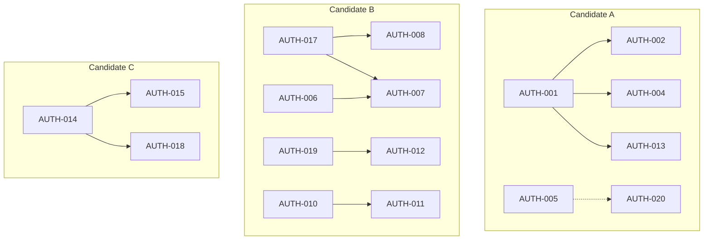
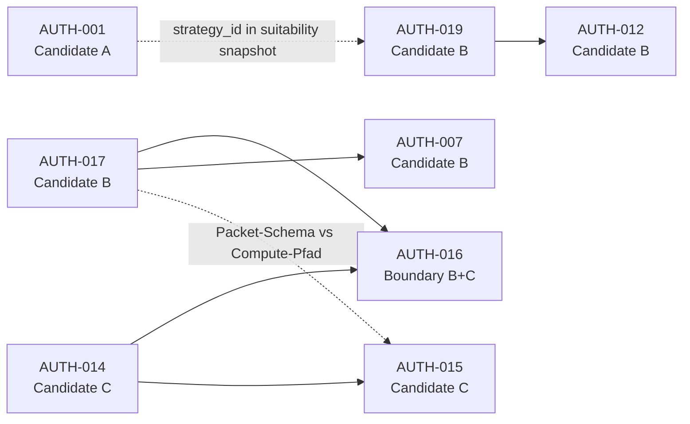

# SSOT Decision Surface — Neutral v1

**Status:** READ-ONLY NEUTRAL SUBSTRATE — keine SSOT-Auswahl, keine Konfliktauflösung, keine Architektur-Aktion  
**Erzeugt:** 2026-07-05  
**Branch:** `main` @ `2f1672bee8761f8d50def3f6ef31cc803824b2e9`  
**Scope:** Entbiasierte Entscheidungsfläche vor SSOT-Ratifikation

**Inputs (neutralisiert aus):**

| Quell-Artefakt | Pfad |
|----------------|------|
| SSOT Decision Hygiene Report v1 | [`ssot_decision_hygiene_report_v1.md`](ssot_decision_hygiene_report_v1.md) |
| Authority Resolution Synthesis v1 | [`authority_resolution_synthesis_v1.md`](authority_resolution_synthesis_v1.md) |
| Authority Conflict Matrix v1 | [`authority_conflict_matrix_v1.md`](authority_conflict_matrix_v1.md) |

**Explizite Nicht-Ziele dieses Artefakts:**

- Keine SSOT-Ratifikation für irgendeine Domäne
- Keine Konfliktauflösung oder Empfehlung
- Keine Code-, Registry-, Config- oder Runtime-Mutation
- Keine Priorisierung, Reihenfolge oder Gewichtung von Kandidaten
- Nur strukturelle Abbildung ohne implizite Hierarchie-Signale

---

## DE-BIASED REPRESENTATION GUARANTEE

Dieses Dokument garantiert folgende Neutralitäts-Eigenschaften:

1. **Kein Kandidat ist vorab gerankt.** Die Bezeichnungen Candidate A, Candidate B und Candidate C sind alphabetische Platzhalter ohne implizite Reihenfolge, Wichtigkeit oder Lösungsdruck.
2. **Keine Domäne wird als primär angenommen.** Es existiert keine festgelegte Schicht-Präzedenz (z. B. Execution vor ECM, Runtime vor Registry, Code vor Runbook).
3. **Keine Execution-Layer-Präzedenz.** Kein Compute-Pfad, kein Wiring-Pfad und kein Operational-Gate wird als übergeordnete Wahrheit behandelt.
4. **Keine Severity-Gewichtung.** Konflikte werden ohne HIGH/MEDIUM/LOW-Klassifikation und ohne „Root“- oder „Tier-0“-Sprache aufgeführt.
5. **Keine „Expected“-Spalte.** Stattdessen: beobachtete konkurrierende Oberflächen pro Konflikt, symmetrisch dargestellt.
6. **Abhängigkeitsgraph ist strukturell, nicht prioritär.** Kanten bedeuten „strukturelle Kopplung“ oder „Downstream-Bezug“, nicht „muss zuerst gelöst werden“.
7. **Keine Wave-/Phase-Reihenfolge.** Governance-Schritte werden nicht in sequenzielle Wellen mit impliziter Kanonisierung geordnet.

**Leseregel:** Jede konkrete Modul-, ID- oder Pfadbenennung in diesem Dokument bezeichnet eine **beobachtete Oberfläche**, nicht eine ratifizierte Wahrheit.

---

## Section 1: Domain Candidates (A / B / C)

> Die folgenden drei Cluster sind **parallele Entscheidungsräume**. Die alphabetische Bezeichnung ersetzt die ursprünglichen Domänenlabels (ECM, Decision/Execution, Capital/Risk) ohne deren implizite Rangfolge zu übernehmen.

### Candidate A — Strategy / Identity / Registry-Config Cluster

**Scope (strukturell):** Strategy-Identität, Config-Registry-Beziehung, Feature-Engine vs Strategy-Layer, parallele Implementierungen, Live-Readiness-Metadaten, Alias-Inkonsistenz.

| AUTH-ID | Kurzbezeichnung | Typ | Rolle im Cluster (strukturell) |
|---------|-----------------|-----|--------------------------------|
| AUTH-001 | `ecm_cycle` vs `armstrong_cycle` identity | C | Hub-Knoten — weitere AUTH-IDs in A hängen strukturell daran |
| AUTH-002 | Config `[strategy.ecm_cycle]` ohne StrategySpec | C | Downstream von AUTH-001 |
| AUTH-003 | `src/features/` vs Strategy-layer ECM | A+D | Schicht-Ambiguität; docs-deferred |
| AUTH-004 | `ecm.py` (functional) vs `ArmstrongCycleStrategy` (OOP) | D | Semantik-Split; downstream von AUTH-001 |
| AUTH-005 | Armstrong live-readiness metadata triangle | C+B | Parallel zu AUTH-001; Dual-Source Tiering |
| AUTH-013 | Alias policy: `el_karoui_vol_v1` aliased, `ecm_cycle` not | C | Registry-Grammatik; Ableger von AUTH-001 |
| AUTH-020 | `el_karoui_vol_model` registry vs R&D docs drift | A+B | Strukturell analog zu AUTH-005; kein ECM-Kern |

**Residual Docs-Echo (Candidate A):** AUTH-003 docs layer B-01 **CLOSED** (PR #5274); residual Type D layer ambiguity remains (intentional / Product-Entscheid).

**Cluster-Größe:** 7 primäre Konflikte (+ 1 strukturelles Analog)

---

### Candidate B — Decision / Execution / Runtime Cluster

**Scope (strukturell):** MV2 Offline Decision Core, Double Play Authority, parallele Replay-/Packet-Pfade, Slice A/B-Grenze, Registry→Suitability→Replay-Wiring, Registry-Operational-Semantik, Strategy-Registry-Orphans und Functional-ID-Policy.

| AUTH-ID | Kurzbezeichnung | Typ | Rolle im Cluster (strukturell) |
|---------|-----------------|-----|--------------------------------|
| AUTH-006 | Ops DP evaluator vs MV2 composition matrix | B | Hub-Knoten — Legacy vs offline Matrix |
| AUTH-007 | Packet handoff vs runtime DP observations | D | Downstream von AUTH-006 / AUTH-DP-02 |
| AUTH-008 | Multiple Double Play replay surfaces | D | Downstream von AUTH-017 |
| AUTH-012 | Registry production tier vs Runtime NON-OPERATIONAL | B | Hub-Knoten — Tier vs wired |
| AUTH-016 | Slice A vs Slice B authority split | D | Architektur-Grenze Replay ↔ Bridge |
| AUTH-017 | Decision Packet flow vs Integrated Replay | D | Hub-Knoten — compute vs handoff schema |
| AUTH-019 | No default Registry → Suitability → Replay wiring | B | Hub-Knoten — Strategy→Core-Wiring |
| AUTH-009 | `breakout_confirmation_v1` orphan module | C | Registry-Subcluster; unabhängiger Leaf |
| AUTH-010 | Functional-only IDs without full OOP StrategySpec | C | Registry-Subcluster; Policy-Leaf |
| AUTH-011 | `rsi_strategy` vs `rsi_reversion` dual identity | C | Registry-Subcluster; hängt an AUTH-010 Policy |

**Residual Docs-Echo (Candidate B):** AUTH-021, AUTH-022 — **CLOSED** on canonical matrix (PR #5274/#5270/#5276); projection must not re-open as structural docs-echo.

**Cluster-Größe:** 10 primäre Konflikte (+ 2 Docs-Echo)

**Cross-Domain-Kanten:** AUTH-016 und AUTH-017 berühren Candidate C (Slice B = Capital/Risk); als **Boundary-Konflikte** modelliert — **dual-parent** (B + C), ohne Verankerung in einer Domäne.

---

### Candidate C — Capital / Risk / Sizing Cluster

**Scope (strukturell):** Runbook-Owner-Split vs merged `capital_risk_sizing_v1`, Scope Capital Replay-Lücke, Attestation-Slot-Modell, Packet-Handoff für Scope Capital.

| AUTH-ID | Kurzbezeichnung | Typ | Rolle im Cluster (strukturell) |
|---------|-----------------|-----|--------------------------------|
| AUTH-014 | Runbook 3 owners vs merged sizing module | B+D | Hub-Knoten — Architektur-Ratifikation offen |
| AUTH-015 | Scope Capital packet vs replay chain absence | B | Downstream von AUTH-014 |
| AUTH-018 | Attestation slots vs merged module | D | Downstream von AUTH-014 |
| AUTH-016 | *(shared)* Slice A / Slice B split | D | **Boundary** — welcher Slice bindet Sizing |
| AUTH-017 | *(shared)* Packet vs Integrated Replay | D | **Boundary** — Packet-Schema vs Compute-Pfad für Capital-Handoff |

**Cluster-Größe:** 3 primäre + 2 geteilte Boundary-Konflikte

---

### Docs-Only Residual Layer (cross-domain, nicht authority-kern)

| AUTH-ID | Kurzbezeichnung | Zugeordneter Cluster | Typ | Closeout projection |
|---------|-----------------|----------------------|-----|---------------------|
| AUTH-021 | `missing_features_plan.md` stale DAG | A (Feature-Engine) | A | **CLOSED** — matrix SSOT (PR #5274 / B-01+B-07; PR #5276 sync) |
| AUTH-022 | R&D stub status grammar | B (Registry visibility) | A | **CLOSED** — matrix SSOT (PR #5270 / B-02) |
| AUTH-023 | Psychology path residual | — (Reporting) | A | Open / optional A-06 follow-up (unchanged) |

AUTH-021/AUTH-022 closeout is projected from `authority_conflict_matrix_v1.md` only — no second status engine. AUTH-023 remains docs residual and does not collapse via A/B/C authority ratification alone.

---

## Section 2: Competing Surfaces per Cluster (symmetrisch, ohne Favorit)

> Jede Zeile listet **mindestens zwei** konkurrierende Oberflächen. Keine Spalte „Expected“, „Primary“ oder „Candidate SSOT“.

### Candidate A — konkurrierende Oberflächen

| Aspekt | Oberfläche 1 | Oberfläche 2 | Oberfläche 3 (falls vorhanden) |
|--------|--------------|--------------|--------------------------------|
| Strategy identity | `armstrong_cycle` (StrategySpec in `registry.py`) | `ecm_cycle` (functional-only → `src/strategies/ecm.py`) | Config `[strategy.ecm_cycle]` + `[strategy.armstrong_cycle]` |
| Code location / layer | Strategy Layer (`src/strategies/ecm.py`, `src/strategies/armstrong/`) | Feature-Engine (`src/features/`) | Docs (`missing_features_plan`, CI reference targets) |
| Live-readiness metadata | `registry.py` Spec fields (`tier`, `is_live_ready`) | `config/config.toml` strategy section | `config/strategy_tiering.toml` |
| Live-readiness read rule | `STRATEGY_REGISTRY_TIERING_DUAL_SOURCE_CONTRACT_V1` | Per-source field values (no ratified per-ID source) | Operator UI assumptions |
| Alias grammar | `_LEGACY_ALIASES` (El-Karoui applied) | Separate canonical entry for `ecm_cycle` | Docs-only alias hints (A-05, DOC-06) |

### Candidate B — konkurrierende Oberflächen

| Aspekt | Oberfläche 1 | Oberfläche 2 | Oberfläche 3 (falls vorhanden) |
|--------|--------------|--------------|--------------------------------|
| Offline decision compute | `integrated_offline_trading_logic_replay_v1.py` + `double_play_composition_matrix_v1` | Ops `evaluate_double_play` | `offline_double_play_scenario_replay_v0` |
| Handoff / evidence schema | `decision_packet_v1` + `local_evaluator_v1` | Integrated Replay compute outputs | Ops observations; Packet fixtures in scenario replay |
| Operational semantics gate | Validation Rule: NOT in Runtime Decision Core → NON-OPERATIONAL | Registry `tier="production"` | Operator UI / Strategy count assumptions |
| Strategy→Core wiring | `suitability_binding_v1` + offline snapshot sequence | Full `_STRATEGY_REGISTRY` | `mv2_research_wiring_v1` (non-default adapter) |
| Registry functional/OOP policy | `_LEGACY_ALIASES` + `_FUNCTIONAL_ONLY_STRATEGY_IDS` | Per-ID ad-hoc loaders | Orphan modules (e.g. `breakout_confirmation_v1`) |
| MV2 path (compute vs handoff) | `run_integrated_offline_trading_logic_replay_v1` | `evaluate_master_v2_local_flow_v1` / packet assemble path | Authority Map stage table „partial/unclear“ |

### Candidate C — konkurrierende Oberflächen

| Aspekt | Oberfläche 1 | Oberfläche 2 | Oberfläche 3 (falls vorhanden) |
|--------|--------------|--------------|--------------------------------|
| Sizing chain semantics | `capital_risk_sizing_v1.py` (merged chain) | Runbook v2.6 (3 separate owners: Risk, Sizing, Scope Capital) | Attestation slot model (`trading_core_decision_attestation_v1`) |
| Scope Capital replay presence | `ScopeCapitalEnvelopeHandoffV1` in packet/evaluator | Absent in Integrated Replay | Dedizierter Replay-Step (hypothetisch) |
| Slice boundary | Slice A = decision evidence through entry/exit | Slice B = `canonical_core_runtime_integration_intent_pipeline_bridge_v0` → sizing → intent → firewall | Implizite „Slice A completeness“-Annahme |
| Attestation alignment | Merged module docstring in `capital_risk_sizing_v1` | Separate Runbook owner slots | Post-ratification contract (offen) |

---

## Section 3: Structural Dependency Graph (ohne Prioritätsordnung)

> Kanten = **strukturelle Kopplung**. Keine Tier-Labels, keine P0/P1-Sprache, keine „Must Resolve First“-Semantik.

### 3.1 Intra-Cluster Kanten



### 3.2 Hub-Knoten (strukturell, nicht prioritär)

| AUTH-ID | Cluster | Strukturelle Rolle |
|---------|---------|-------------------|
| AUTH-001 | A | Hub — AUTH-002, AUTH-004, AUTH-013 hängen strukturell daran |
| AUTH-005 | A | Hub — parallel zu AUTH-001; AUTH-020 strukturell analog |
| AUTH-006 | B | Hub — AUTH-007 hängt strukturell daran |
| AUTH-017 | B | Hub — AUTH-008, AUTH-007; Boundary zu C |
| AUTH-019 | B | Hub — AUTH-012 hängt strukturell daran |
| AUTH-014 | C | Hub — AUTH-015, AUTH-018 hängen strukturell daran |

**Hinweis:** „Hub“ beschreibt **Kanten-Dichte**, nicht Lösungsreihenfolge oder Ratifikationsdruck.

### 3.3 Cross-Cluster Kanten (dual-parent wo zutreffend)



### 3.4 Leaf-Knoten (strukturell unabhängiger)

| AUTH-ID | Cluster | Strukturelle Unabhängigkeit |
|---------|---------|----------------------------|
| AUTH-003 | A | B-01 docs CLOSED (PR #5274); residual Type D; kein Block auf AUTH-001 für docs-deferred path |
| AUTH-009 | B | AUTH-010 policy optional; DEF-05 leaf |
| AUTH-021 | — | **CLOSED** — matrix SSOT (PR #5274/#5276); docs-only closeout |
| AUTH-022 | — | **CLOSED** — matrix SSOT (PR #5270); docs-only closeout |
| AUTH-023 | — | A-06 follow-up; docs-only |

### 3.5 Validation Rule (frozen observation, keine Meta-SSOT-Behauptung)

```text
NOT in Runtime Decision Core → NON-OPERATIONAL (even if implemented)
```

Diese Regel ist eine **beobachtete Safety-Gate-Formulierung** aus der Matrix. Sie ist **getrennt** von Identity-SSOT, Compute-SSOT und Promotion/Tier-SSOT. Keine Ableitung von Strategy-Identität oder Registry-Promotion aus dieser Regel.

---

## Section 4: Conflict List (strukturell, ohne Severity-Gewichtung)

> 23 Konflikte. Spalten: ID, Kurzbezeichnung, Typ, betroffene Cluster, konkurrierende Layer — **ohne** Risk Level, **ohne** „Expected Canonical“, **ohne** Root/Tier-Sprache.

| AUTH-ID | Kurzbezeichnung | Typ | Cluster | Layer-Kollision (strukturell) |
|---------|-----------------|-----|---------|-------------------------------|
| AUTH-001 | `ecm_cycle` vs `armstrong_cycle` identity | C | A | Strategy ↔ Registry/Config |
| AUTH-002 | Config `[strategy.ecm_cycle]` ohne Spec | C | A | Registry/Config |
| AUTH-003 | `src/features/` vs Strategy ECM | A+D | A | Docs ↔ Strategy |
| AUTH-004 | `ecm.py` vs `ArmstrongCycleStrategy` | D | A | Strategy |
| AUTH-005 | Armstrong live-readiness metadata triangle | C+B | A | Strategy ↔ Registry/Config |
| AUTH-006 | Ops DP evaluator vs composition matrix | B | B | Runtime ↔ Ops |
| AUTH-007 | Packet handoff vs runtime DP observations | D | B | Runtime |
| AUTH-008 | Multiple DP replay surfaces | D | B | Runtime |
| AUTH-009 | `breakout_confirmation_v1` orphan | C | B | Strategy ↔ Registry |
| AUTH-010 | Functional-only IDs policy | C | B | Registry |
| AUTH-011 | `rsi_strategy` vs `rsi_reversion` | C | B | Registry |
| AUTH-012 | Production tier vs NON-OPERATIONAL | B | B | Strategy ↔ Runtime |
| AUTH-013 | Inconsistent alias policy (ECM) | C | A | Registry |
| AUTH-014 | Runbook 3 owners vs merged sizing | B+D | C | Runtime ↔ Docs |
| AUTH-015 | Scope Capital packet vs replay gap | B | C (+ B boundary) | Runtime |
| AUTH-016 | Slice A / Slice B split | D | B + C (boundary) | Runtime |
| AUTH-017 | Decision Packet vs Integrated Replay | D | B + C (boundary) | Runtime |
| AUTH-018 | Attestation slots vs merged module | D | C | Runtime ↔ Meta |
| AUTH-019 | No default Registry→Core wiring | B | B | Strategy ↔ Runtime |
| AUTH-020 | El Karoui tier tension | A+B | A | Strategy ↔ Docs |
| AUTH-021 | `missing_features_plan` stale DAG | A | A (docs echo) | Docs — **CLOSED** (matrix SSOT / PR #5274/#5276) |
| AUTH-022 | R&D stub status grammar | A | B (docs echo) | Docs ↔ Strategy — **CLOSED** (matrix SSOT / PR #5270) |
| AUTH-023 | Psychology path residual | A | — (reporting) | Docs |

### Count by Type (strukturell, nicht prioritär)

| Typ | Anzahl |
|-----|--------|
| A — Pure Documentation Mismatch | 5 |
| B — Strategy vs Runtime Misalignment | 8 |
| C — Registry Ownership Conflict | 8 |
| D — Architectural Ambiguity | 10 |

*Mehrfachklassifikation bei kombinierten Typen möglich.*

---

## Section 5: Neutralized Bias Inventory (was entfernt wurde)

Dieses Artefakt ersetzt folgende authority-ladene Konstrukte aus den Input-Dokumenten durch neutrale Repräsentation:

| Entferntes Signal | Quelle | Neutrale Ersetzung in diesem Dokument |
|-------------------|--------|---------------------------------------|
| „Domain A/B/C“ mit impliziter Execution-Präzedenz | Synthesis §1.3, Hygiene §1.3 | Candidate A/B/C — alphabetisch, gleichwertig |
| „Tier-0“, „Root-Konflikt“, „Must Resolve First“ | Synthesis §3.1 | Hub-Knoten (Kanten-Dichte, nicht Priorität) |
| „P0-A“, „P0-B“, „P0-C“ | Synthesis §3.1 | Entfernt |
| „Candidate SSOT“, „primary StrategySpec-ID“ | Synthesis §2 | „konkurrierende Oberflächen“ — symmetrisch |
| „de facto merge truth“, „offline compute authority“ | Synthesis §2 Domain B/C | Oberfläche 1 / Oberfläche 2 |
| „kanonisch offline“, „Expected Canonical Ownership“ | Matrix Current/Expected | „beobachtete Oberfläche“ ohne Expected-Spalte |
| „HIGH/MEDIUM/LOW“ Risk | Matrix, Synthesis | Entfernt aus Conflict List |
| Wave W1–W5 Reihenfolge | Synthesis §3.5 | Entfernt — keine sequenzielle Governance-Ordnung |
| „Boundary primär in B verankert“ | Synthesis §1 Domain B | dual-parent B + C |
| „Canonical Truth“ Spaltenname | Feature State Map (zitiert) | Nicht übernommen |
| Runtime > Registry > Config implizite Hierarchie | Hygiene §1.4 | Explizit abgelehnt in Guarantee §1–3 |
| Collapse Chains als Null-Hypothese-SSOT | Synthesis §4 | Nicht enthalten — würde Kandidaten-Bias verstärken |
| Operator-Priorisierung HIGH-Liste | Synthesis §5, Matrix §9 | Nicht enthalten |

---

## Section 6: Structural Cross-Links (ohne Artefakt-Hierarchie)

Die folgenden Governance-Artefakte existieren als **parallele Inputs** — keine lineare „Wahrheitskette“:

```text
feature_drift_reconciliation_report_v1
feature_state_map_v1
drift_cleanup_plan_v1
authority_conflict_matrix_v1
authority_resolution_synthesis_v1
ssot_decision_hygiene_report_v1
ssot_decision_surface_neutral_v1   ← dieses Dokument
[SSOT Decision — NOT YET]
```

**Strukturelle Beobachtung:** Spätere Artefakte referenzieren frühere; das impliziert **keine** Ratifikation oder Priorität der referenzierten Inhalte.

---

## Section 7: Explicit Non-Actions (dieses Artefakt)

| Kategorie | Explizit verboten |
|-----------|-------------------|
| SSOT-Auswahl | Keine Ratifikation für ECM, MV2, Capital/Risk, Registry |
| Konfliktauflösung | Keine Entscheidung für AUTH-001–023 |
| Code/Runtime | Keine Registry-, Config-, Bridge- oder Ops-Mutation |
| Repräsentation | Keine Rück-Einführung von Tier-, Root-, Expected- oder Severity-Sprache |
| Enforcement | Keine Umsetzung von „Expected“-Spalten aus der Matrix |

**Nächster Schritt (Operator, außerhalb dieses Artefakts):** SSOT-Entscheidung auf Basis dieser neutralen Fläche — **nach** explizitem Operator-GO und PRE_PR_VALIDATION. Dieses Dokument liefert **keine** Empfehlung für den nächsten Schritt.

---

## Appendix A: Candidate → Original-Domain Mapping (Referenz only)

| Neutral Label | Original-Domain (Input-Sprache) |
|---------------|--------------------------------|
| Candidate A | ECM Domain / Strategy-Identity |
| Candidate B | Decision / Execution Domain |
| Candidate C | Capital & Risk Domain |

Diese Mapping-Tabelle dient **nur der Rückverfolgbarkeit** zu den Input-Artefakten. Sie begründet **keine** Rangfolge oder Lösungspreferenz.

---

## Appendix B: Methodik

1. Vollständiges Lesen der drei Input-Artefakte + Hygiene Report
2. Extraktion aller impliziten Kanon-Marker (canonical, primary, Tier-0, root, truth, Expected, de facto, wave order)
3. Ersetzung durch Candidate A/B/C und symmetrische Oberflächen-Tabellen
4. Dependency Graph auf strukturelle Kanten reduziert — Prioritäts- und Severity-Attribute entfernt
5. DE-BIASED REPRESENTATION GUARANTEE als verbindliche Leseregel

**Kein Code gelesen.** **Keine** Runtime-Inspection. **Keine** SSOT-Wahl.

---

**Surface-Owner:** SSOT Decision Surface — Neutral v1  
**Evidence frozen at:** `2f1672bee8761f8d50def3f6ef31cc803824b2e9`
