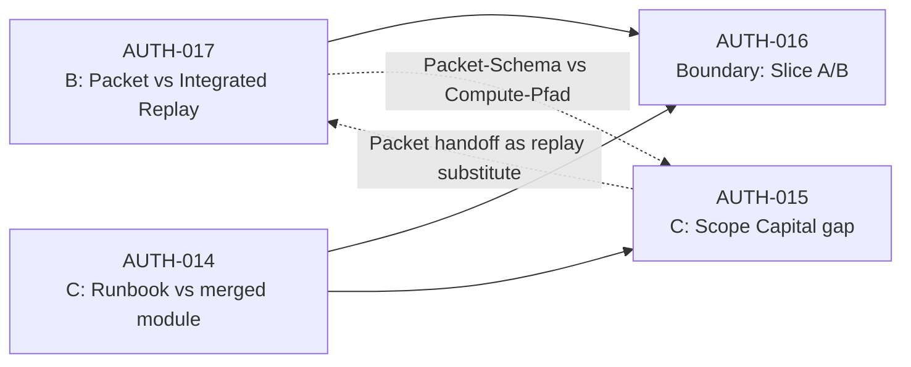
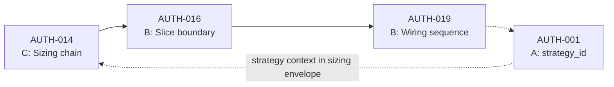
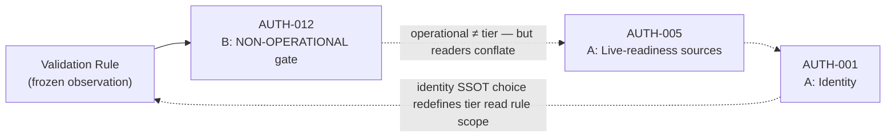
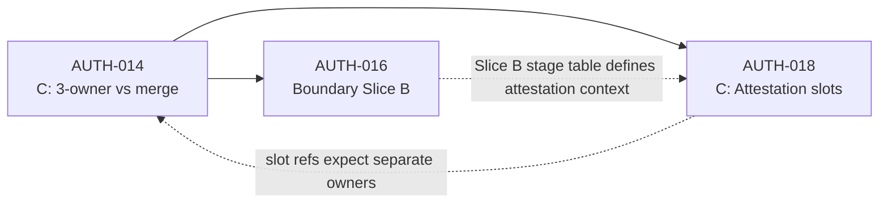
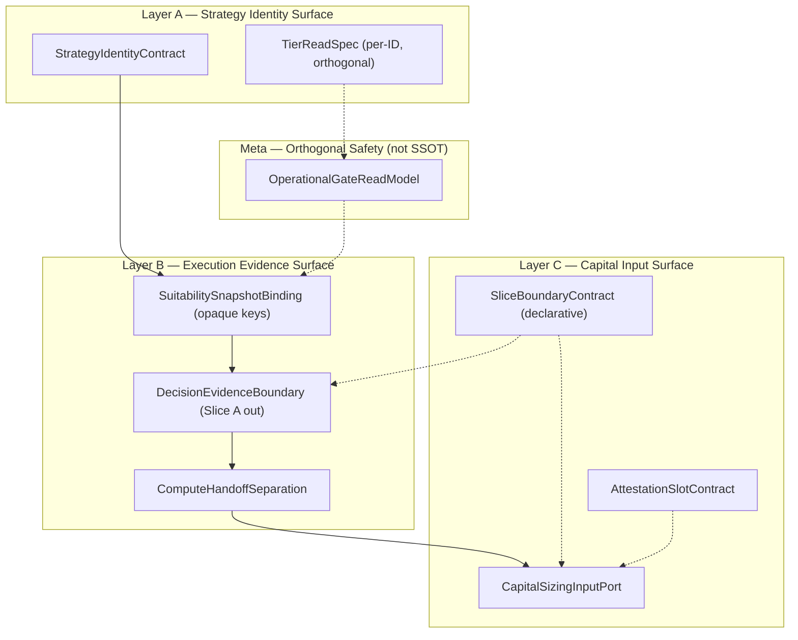
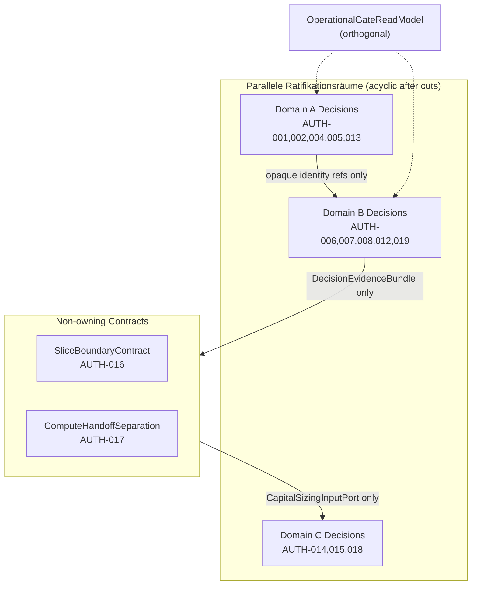

# SSOT System Decoupling Design v1

**Status:** READ-ONLY GRAPH-BREAK ANALYSIS — keine SSOT-Auswahl, keine Konfliktauflösung, keine Ownership-Neuverteilung  
**Erzeugt:** 2026-07-05  
**Branch:** `main` @ `2f1672bee8761f8d50def3f6ef31cc803824b2e9`  
**Scope:** Zyklische Authority-Struktur → DAG-ähnliche Entscheidungstopologie; Cut-Sets und Abstraktionsschichten

**Inputs (frozen):**

| Artefakt | Pfad |
|----------|------|
| SSOT Decision Surface — Neutral v1 | [`ssot_decision_surface_neutral_v1.md`](ssot_decision_surface_neutral_v1.md) |
| Authority Resolution Synthesis v1 | [`authority_resolution_synthesis_v1.md`](authority_resolution_synthesis_v1.md) |
| Authority Conflict Matrix v1 | [`authority_conflict_matrix_v1.md`](authority_conflict_matrix_v1.md) |
| SSOT Counterfactual Impact Simulation v1 | [`ssot_counterfactual_simulation_v1.md`](ssot_counterfactual_simulation_v1.md) |
| SSOT Decision Hygiene Report v1 | [`ssot_decision_hygiene_report_v1.md`](ssot_decision_hygiene_report_v1.md) |

**Domain-Labels (Referenz only — keine Rangfolge):**

| Label | Cluster | Original-Bezeichnung |
|-------|---------|----------------------|
| **A** | Candidate A | ECM / Strategy-Identity / Registry-Config |
| **B** | Candidate B | Decision / Execution / Runtime |
| **C** | Candidate C | Capital / Risk / Sizing |

**Validation Rule (frozen observation — nicht als Meta-SSOT ratifiziert):**

```text
NOT in Runtime Decision Core → NON-OPERATIONAL (even if implemented)
```

**Explizite Nicht-Ziele dieses Artefakts:**

- Keine SSOT-Ratifikation für A, B oder C
- Keine Konfliktauflösung (AUTH-001–023 bleiben offen)
- Keine Ownership-Neuverteilung oder Modul-Reassignment
- Keine Code-, Registry-, Config- oder Runtime-Mutation
- Keine Empfehlung, welcher Cut oder welche Abstraktion „zuerst“ umgesetzt werden soll

---

## Section 1: Cyclical Dependency Inventory

### 1.1 Modellierungsebene

Dieses Dokument modelliert **Authority-Kopplung** (wer darf welche Wahrheit definieren), nicht Import-/Call-Graph des Python-Codes. Kanten bedeuten: *„Authority in Domäne X referenziert oder überschreibt implizit Authority in Domäne Y“*.

Hub-Knoten mit Cross-Domain-Kanten (aus Neutral Surface §3.3):

| AUTH-ID | Cluster | Cross-Domain-Rolle |
|---------|---------|-------------------|
| AUTH-001 | A | Identity-Hub; speist B via Snapshot-Semantik |
| AUTH-005 | A (+B) | Live-Readiness-Dreieck; kollidiert mit B-Operational-Read-Model |
| AUTH-012 | B | Operational-Semantik; konsumiert Registry/Tier aus A |
| AUTH-014 | C | Capital-Architektur-Hub; bindet Slice-Grenze (B) |
| AUTH-016 | B + C | **Dual-parent Boundary** — beide Domänen beanspruchen Slice A/B-Semantik |
| AUTH-017 | B + C | **Dual-parent Boundary** — Compute vs Handoff für Capital-Pfad |
| AUTH-019 | B | Wiring-Hub; konsumiert A-Identity-Keys |
| AUTH-015 | C (+B) | Scope-Capital-Lücke; hängt an B-Pfad-Hierarchie |

### 1.2 Identifizierte Zyklen (A × B × C)

#### Cycle-1: Identity ↔ Wiring ↔ Operational Read (A ↔ B)


**Mechanismus:** ECM-Identität (A) definiert `strategy_id`-Keys, die das Suitability-Snapshot (B) trägt. Operational-Read-Model (B) liest Registry-Tier und kann Live-Readiness (A) implizit über AUTH-005 interpretieren. AUTH-005 wiederum beeinflusst, welche ID als „promotion-ready“ gilt — Rückkopplung zur Identity-Frage (AUTH-001).

**Betroffene AUTH-IDs:** AUTH-001, AUTH-002, AUTH-005, AUTH-012, AUTH-013, AUTH-019  
**Collapse-Referenz:** Chain A-max (Synthesis §4.1); Counterfactual §1.3 Hidden breakpoints

---

#### Cycle-2: MV2 Path ↔ Slice Boundary ↔ Capital Architecture (B ↔ C)



**Mechanismus:** Execution (B) definiert über AUTH-017, ob Compute (Integrated Replay) oder Handoff (Decision Packet) authoritative ist. Capital (C) definiert über AUTH-014, ob Scope Capital in Slice B merged oder separat ist. AUTH-016 ist dual-parent: B dokumentiert Slice A-Ende; C dokumentiert Slice-B-Sizing-Bindung — wechselseitige Vollständigkeitsansprüche. AUTH-015 schließt die Schleife: Packet-Scope-Capital ohne Replay-Step wirkt wie Compute-Ersatz (B←C).

**Betroffene AUTH-IDs:** AUTH-014, AUTH-015, AUTH-016, AUTH-017, AUTH-018, AUTH-007  
**Collapse-Referenz:** Chain B-max, Chain C-max (Synthesis §4.2, §4.3); Counterfactual §4.3 B×C edge

---

#### Cycle-3: Capital Sizing ↔ Execution Evidence ↔ Strategy Context (C → B → A → C)



**Mechanismus:** Capital (C) konsumiert Strategy-Kontext aus Snapshot/Pipeline. Snapshot-Sequence (B) hängt an Wiring (AUTH-019), das Identity-Keys (A) voraussetzt. Falsche oder duale Identity (A) erzeugt falschen Sizing-Kontext (C) — Capital „korrekt intern“, aber extern inkonsistent. Kein C-SSOT allein bricht A; kein A-SSOT allein bricht B-Wiring.

**Betroffene AUTH-IDs:** AUTH-001, AUTH-014, AUTH-016, AUTH-019, AUTH-015  
**Collapse-Referenz:** Cross-Domain Collapse A×B×C (Synthesis §4.4); Counterfactual §4.4 Single-SSOT Insufficiency

---

#### Cycle-4: Validation Rule ↔ Identity/Tier Conflation (Meta-cycle A ↔ B)



**Mechanismus:** Die Validation Rule ist beabsichtigt als Safety-Gate (Hygiene §1.4), wird aber in Governance-Lesern mit Identity-/Tier-SSOT vermischt. Jede ratifizierte Domänen-SSOT erzeugt eine „gewonnene“ Lesart neben der Rule (Counterfactual §4.1). Das ist ein **semantischer** Zyklus, kein Modul-Import — aber er blockiert unambiguous SSOT-Selection, weil Rule-Leser Identity-Entscheidungen vorwegnimmt.

**Betroffene AUTH-IDs:** AUTH-001, AUTH-005, AUTH-012, AUTH-020; Meta: Validation Rule  
**Collapse-Referenz:** Hygiene §4.4 Validation Rule ↔ Identity conflation; Counterfactual §4.1

---

#### Cycle-5: Attestation ↔ Merged Module ↔ Runbook Owners (C internal + B boundary)



**Mechanismus:** Attestation-Slots (C) referenzieren Runbook-Owner, die gegen merged Code (C) stehen. Slice-B-Dokumentation (B/C dual-parent) definiert, welche Stages attestierbar sind — Rückkopplung zu AUTH-014-Architekturwahl.

**Betroffene AUTH-IDs:** AUTH-014, AUTH-016, AUTH-018  
**Collapse-Referenz:** Chain C-max (Synthesis §4.3)

---

### 1.3 Zyklen-Zusammenfassung (Domain-Ebene)

| Zyklus-ID | Pfad (Domain) | Typ | Blockiert SSOT-Selection weil … |
|-----------|---------------|-----|--------------------------------|
| **CY-AB-1** | A → B → A | Identity ↔ Operational | Identity-SSOT und Wiring-SSOT gegenseitig prämissenreich |
| **CY-BC-1** | B → C → B | Path ↔ Capital boundary | Compute-Owner und Capital-Owner definieren Slice gemeinsam |
| **CY-ABC-1** | C → B → A → C | Full triangle | Kein Single-Domain-SSOT schließt End-to-End-Kette |
| **CY-META-1** | Rule ↔ B ↔ A | Semantic | Safety-Gate und Identity/Tier nicht orthogonal gelesen |
| **CY-CINT-1** | C → B → C (via AUTH-016/018) | Attestation boundary | Meta-Slots und Slice-Stages wechselseitig |

**Strukturelle Beobachtung (keine Empfehlung):** AUTH-016 und AUTH-017 sind **shared boundary nodes** — jeder Zyklus, der B und C verbindet, traversiert mindestens einen davon (Counterfactual §4.4; Neutral Surface §3.3).

---

## Section 2: Minimal Cut Sets

### 2.1 Definition (operationalisiert für SSOT-Selection)

Ein **Cut Set** ist eine Menge von **Authority-Kanten**, deren Entfernung (durch explizite Abstraktionsgrenze oder Leseregel-Trennung) den gerichteten Authority-Graphen **azyklisch** macht — sodass SSOT-Ratifikation in einer Domäne **nicht** zwingend vorab Ratifikation in einer anderen Domäne erfordert.

**Minimal** = keine echte Teilmenge derselben Cut Set erzeugt dieselbe Zyklus-Break-Wirkung für alle fünf Zyklen in §1.2.

**Hinweis:** Mehrere minimal gleich große Cut Sets können existieren (Alternative Cuts). Dieses Dokument listet **kanonische minimal Cut Sets** nach Cardinalität — **ohne** Auswahl eines bevorzugten Cuts.

### 2.2 Authority-Edge-Katalog (Cross-Domain)

| Edge-ID | Quelle | Senke | AUTH-IDs | Beschreibung |
|---------|--------|-------|----------|--------------|
| **E-AB-1** | A | B | AUTH-001 → AUTH-019 | Identity-Keys in Suitability-Snapshot-Semantik |
| **E-AB-2** | B | A | AUTH-012 → AUTH-005 | Operational gate beeinflusst Live-Readiness-Lesart |
| **E-BC-1** | B | C | AUTH-017 → AUTH-015 | Compute-Pfad vs Packet-Scope-Capital |
| **E-BC-2** | C | B | AUTH-014 → AUTH-016 | Capital-Architektur beansprucht Slice-A/B-Grenze |
| **E-BC-3** | B | C | AUTH-016 → AUTH-014 | Slice-Dokumentation präjudiziert Capital-Owner-Struktur |
| **E-CA-1** | A | C | AUTH-001 → AUTH-014 | Strategy-Kontext in Sizing-Envelope (indirekt via Snapshot) |
| **E-META-1** | Rule | A/B | Validation Rule ↔ AUTH-012/005 | Semantische Vermischung operational ↔ identity/tier |

### 2.3 Minimal Cut Set Cardinality-1 — **existiert nicht**

Keine einzelne Kante bricht alle Zyklen CY-AB-1, CY-BC-1, CY-ABC-1, CY-META-1 und CY-CINT-1 gleichzeitig:

| Einzelkanten-Cut | Gebrochene Zyklen | Verbleibende Zyklen |
|------------------|-------------------|---------------------|
| E-AB-1 only | CY-AB-1 (partial), CY-ABC-1 (partial) | CY-BC-1, CY-META-1, CY-CINT-1 |
| E-BC-1 only | CY-BC-1 (partial) | CY-AB-1, CY-ABC-1, CY-META-1 |
| E-BC-2 only | CY-BC-1, CY-CINT-1 (partial) | CY-AB-1, CY-ABC-1, CY-META-1 |
| E-META-1 only | CY-META-1 (semantic) | Alle strukturellen Zyklen |

**Folgerung:** SSOT-Selection-Unambiguousness erfordert **mindestens zwei** entkoppelte Schnittstellen — konsistent mit Counterfactual §4.4 (Single-SSOT Insufficiency).

### 2.4 Minimal Cut Sets — Cardinality 2

#### MCS-2α (Identity–Wiring / Path–Capital)

| Cut | Edge | Wirkung |
|-----|------|---------|
| **Cut-α1** | **E-AB-1** | Entkoppelt Identity-Authority von Wiring-Snapshot-Semantik |
| **Cut-α2** | **E-BC-1** | Entkoppelt Compute-Authority von Packet-Scope-Capital-Substitut |

**Gebrochene Zyklen:** CY-AB-1, CY-BC-1, CY-ABC-1 (Pfad A→B→C unterbrochen an beiden Enden)

**Residual:** CY-META-1, CY-CINT-1 (teilweise), E-BC-2/E-BC-3

---

#### MCS-2β (Operational–Tier / Slice-Boundary)

| Cut | Edge | Wirkung |
|-----|------|---------|
| **Cut-β1** | **E-AB-2** | Trennt Operational-Gate von Live-Readiness-Dreieck |
| **Cut-β2** | **E-BC-2** | Trennt Capital-Architektur-Anspruch auf Slice-Grenze von Execution-Dokumentation |

**Gebrochene Zyklen:** CY-AB-1, CY-BC-1, CY-CINT-1

**Residual:** CY-ABC-1 (E-AB-1 + E-CA-1), CY-META-1, E-BC-1

---

#### MCS-2γ (Wiring–Identity / Boundary-Dual-Parent)

| Cut | Edge | Wirkung |
|-----|------|---------|
| **Cut-γ1** | **E-AB-1** | Identity → Snapshot entkoppelt |
| **Cut-γ2** | **E-BC-2** | Dual-parent AUTH-016 neutralisiert (Capital-seitiger Anspruch) |

**Gebrochene Zyklen:** CY-AB-1, CY-BC-1, CY-ABC-1 (partial), CY-CINT-1 (partial)

**Residual:** CY-META-1, E-BC-1 (Packet substitute)

---

### 2.5 Minimal Cut Sets — Cardinality 3 (vollständige Zyklus-Break inkl. Meta)

#### MCS-3★ (strukturell vollständig — kleinste bekannte Menge für alle §1.2-Zyklen)

| Cut | Edge | AUTH-Bezug |
|-----|------|------------|
| **Cut-★1** | **E-AB-1** | AUTH-001 ↮ AUTH-019 Identity-in-Snapshot |
| **Cut-★2** | **E-BC-1** | AUTH-017 ↮ AUTH-015 Compute ↮ Packet-Substitute |
| **Cut-★3** | **E-AB-2** | AUTH-012 ↮ AUTH-005 Operational ↮ Tier-Triangle |

**Gebrochene Zyklen:** CY-AB-1, CY-BC-1, CY-ABC-1, CY-META-1 (semantic separation), CY-CINT-1 (partial via BC break)

**Nicht gebrochen ohne weiteren Cut:** E-BC-2 (AUTH-014 → AUTH-016 dual-parent) — erfordert **zusätzlich** Boundary-Abstraktion (§3.2), nicht nur Kanten-Cut.

---

#### MCS-3δ (Boundary-centric)

| Cut | Edge | Wirkung |
|-----|------|---------|
| **Cut-δ1** | **E-BC-2** | Capital → Slice boundary |
| **Cut-δ2** | **E-BC-3** | Slice docs → Capital architecture |
| **Cut-δ3** | **E-AB-1** | Identity → Wiring |

**Gebrochene Zyklen:** CY-BC-1, CY-CINT-1, CY-ABC-1 (partial)

**Residual:** CY-META-1; E-BC-1 ohne Cut-δ4

---

### 2.6 Boundary Nodes — Cut-Set-Ergänzung (AUTH-016 / AUTH-017)

AUTH-016 und AUTH-017 sind **keine Kanten**, sondern **shared nodes** mit dual-parent Authority. Zyklus-Break allein durch Kanten-Cut ist **ohne** Node-Neutralisierung unvollständig.

| Boundary Node | Minimale Neutralisierung (Abstraktion, §3) | Ohne Neutralisierung verbleibender Zyklus |
|---------------|--------------------------------------------|------------------------------------------|
| **AUTH-016** | SliceBoundaryContract — deklarative Grenze ohne Owner-Anspruch | CY-BC-1, CY-CINT-1 |
| **AUTH-017** | ComputeHandoffSeparation — unidirektionale Evidence-Richtung | CY-BC-1, E-BC-1 |

**Kombinierte minimale strukturelle Entkopplung (Beobachtung, keine Auswahl):**

```text
|MCS-3★| + Boundary-Neutralisierung(AUTH-016, AUTH-017)
  → vollständige Break von CY-AB-1, CY-BC-1, CY-ABC-1, CY-META-1, CY-CINT-1
  → SSOT pro Domäne ratifizierbar ohne zyklische Prämissen-Kette
```

### 2.7 Cut-Set ↔ AUTH-ID Mapping

| Cut-Set | Gebrochene AUTH-Kopplungen | Offene AUTH-IDs (unverändert — keine Auflösung) |
|---------|---------------------------|--------------------------------------------------|
| MCS-2α | 001↔019, 017↔015 | AUTH-014, AUTH-016, AUTH-018, AUTH-005↔012 |
| MCS-2β | 012↔005, 014↔016 | AUTH-001, AUTH-017, AUTH-015 |
| MCS-2γ | 001↔019, 014↔016 | AUTH-017↔015, AUTH-005↔012 |
| MCS-3★ | 001↔019, 017↔015, 012↔005 | AUTH-014, AUTH-016, AUTH-018 (Boundary) |
| MCS-3★ + Boundary | + 016, 017 neutralisiert | Intra-domain AUTH (002,004,006,008,…) — separat pro Cluster |

---

## Section 3: Proposed Abstraction Layers

> **Scope:** Interface-**Entwurfsebenen** zur Verhinderung von Cross-Domain-Recursion. Keine Implementierung, keine Modul-Umbenennung, keine Ownership-Zuweisung.

### 3.1 Abstraktionsprinzipien

1. **Unidirectional evidence flow** — Compute erzeugt Evidence; Handoff transportiert; Capital konsumiert typisierte Inputs — keine Rückwärts-Authority.
2. **Opaque cross-domain references** — Domäne B referenziert `strategy_id` als opaque key, definiert sie nicht.
3. **Orthogonal gates** — Validation Rule, Promotion-Metadata und Identity-SSOT sind getrennte Lesesphären.
4. **Boundary nodes as contracts, not owners** — AUTH-016/017 werden zu Contract-Surfaces, nicht zu SSOT-Kandidaten.

### 3.2 Layer Map (Cut-Point → Abstraction)



### 3.3 Abstraktion pro Cut-Edge

#### AL-1: StrategyIdentityContract (Cut E-AB-1)

| Eigenschaft | Spezifikation (design only) |
|-------------|----------------------------|
| **Zweck** | AUTH-001/002/013 Authority bleibt in A; B erhält nur validierte opaque `StrategyIdentityRef` |
| **Cut** | E-AB-1 |
| **Verhindert** | CY-AB-1, CY-ABC-1 (A→B→…→A) |
| **AUTH-IDs entkoppelt** | AUTH-001 ↮ AUTH-019 |
| **Recursion guard** | B darf Identity nicht inferieren aus Registry-Tier, Config-Section oder Modul-Pfad |

**Contract-Felder (konzeptionell):** `identity_ref`, `identity_epoch`, `alias_resolution_status: UNRESOLVED \| RESOLVED` — ohne Semantik in B.

---

#### AL-2: SuitabilitySnapshotBinding (Cut E-AB-1 downstream)

| Eigenschaft | Spezifikation |
|-------------|---------------|
| **Zweck** | AUTH-019 Wiring-Sequence ohne Identity-Definition |
| **Cut** | Ergänzt AL-1; trennt Sequence-Semantik von Key-Semantik |
| **Verhindert** | Implizites `registry.py` = Core |
| **AUTH-IDs** | AUTH-019 isoliert von AUTH-001/010/011 Policy |

**Regel:** Snapshot listet `StrategyIdentityRef[]` — Reihenfolge ist B-SSOT-Kandidat; Key-Bedeutung ist A-SSOT-Kandidat — **keine gemischte Spalte**.

---

#### AL-3: OperationalGateReadModel (Cut E-AB-2, E-META-1)

| Eigenschaft | Spezifikation |
|-------------|---------------|
| **Zweck** | Validation Rule als **eigenständige Lesesphäre** — nicht Identity-, nicht Tier-SSOT |
| **Cut** | E-AB-2, E-META-1 |
| **Verhindert** | CY-META-1 |
| **AUTH-IDs** | AUTH-012 isoliert von AUTH-005/001 |

**Regel:** `operational_status` wird **nur** aus Core-Wiring + Activation abgeleitet. `promotion_metadata` (Tier, live-ready flags) ist **separate** Lesesphäre — kein Rückschluss operational → identity.

---

#### AL-4: TierReadSpec (Cut E-AB-2, A-intern)

| Eigenschaft | Spezifikation |
|-------------|---------------|
| **Zweck** | AUTH-005/020 Dual-Source Contract als **per-ID Read Spec** — nicht Operational-Gate |
| **Cut** | Ergänzt AL-3 |
| **Verhindert** | Tier-Triangle → Wiring → false operational |
| **AUTH-IDs** | AUTH-005, AUTH-020, AUTH-013 |

**Regel:** Pro `strategy_id` genau ein dokumentierter `tier_source` — unabhängig von B-Operational-Read-Model.

---

#### AL-5: ComputeHandoffSeparation (Cut E-BC-1)

| Eigenschaft | Spezifikation |
|-------------|---------------|
| **Zweck** | AUTH-017 Richtungsregel: Integrated Replay = compute; Decision Packet = evidence transport |
| **Cut** | E-BC-1 |
| **Verhindert** | CY-BC-1 (Packet-as-compute), AUTH-007 mirror |
| **AUTH-IDs** | AUTH-017, AUTH-007, AUTH-006 (Legacy-Ops subordinate) |

**Regel:** Handoff-Schema **darf nicht** Compute-Outputs spiegeln ohne expliziten `evidence_provenance: COMPUTE \| FIXTURE \| DECLARATIVE` Tag — verhindert AUTH-015 Substitute.

---

#### AL-6: DecisionEvidenceBoundary (Cut E-BC-2/E-BC-3, Slice A output)

| Eigenschaft | Spezifikation |
|-------------|---------------|
| **Zweck** | Slice A endet an typisierter Evidence-Grenze — Capital definiert nicht, was „complete decision“ bedeutet |
| **Cut** | E-BC-3 |
| **Verhindert** | Capital-Architektur präjudiziert Slice-A-Vollständigkeit |
| **AUTH-IDs** | AUTH-016 (B-side), AUTH-008 subordination |

**Output-Typ (konzeptionell):** `DecisionEvidenceBundle` — entry/exit signals, keine Sizing-Owner-Reihenfolge.

---

#### AL-7: SliceBoundaryContract (Cut E-BC-2, dual-parent neutralization)

| Eigenschaft | Spezifikation |
|-------------|---------------|
| **Zweck** | AUTH-016 als **deklarative Grenze** — weder B noch C „besitzt“ die Boundary |
| **Cut** | E-BC-2; Boundary-Node-Neutralisierung |
| **Verhindert** | CY-BC-1, CY-CINT-1 dual-parent recursion |
| **AUTH-IDs** | AUTH-016, AUTH-017 (partial) |

**Regel:** Contract definiert `slice_a_terminus`, `slice_b_terminus` als **Orte**, nicht als **Owner**. Owner-Ratifikation bleibt in A/B/C separat.

---

#### AL-8: CapitalSizingInputPort (Cut E-CA-1, C←A indirect)

| Eigenschaft | Spezifikation |
|-------------|---------------|
| **Zweck** | Capital konsumiert `StrategyContextRef` + `DecisionEvidenceBundle` — definiert keine Identity |
| **Cut** | E-CA-1 |
| **Verhindert** | CY-ABC-1 (C→A Rückkopplung) |
| **AUTH-IDs** | AUTH-014 input side; AUTH-015 input typing |

**Regel:** Sizing-Module validiert Input-Schema, nicht Identity-SSOT. Fehlende Identity-Resolution → `FAIL_CLOSED_INPUT`, nicht Alias-Inference.

---

#### AL-9: AttestationSlotContract (Cut CY-CINT-1)

| Eigenschaft | Spezifikation |
|-------------|---------------|
| **Zweck** | AUTH-018 Slots referenzieren **Contract-Stages**, nicht Runbook-Prosa oder merged docstring |
| **Cut** | CY-CINT-1 internal |
| **Verhindert** | Attestation ↔ Architecture mutual definition |
| **AUTH-IDs** | AUTH-018, AUTH-014 output side |

**Regel:** Slot = `(stage_id, owner_domain_tag)` — `owner_domain_tag ∈ {A,B,C,UNASSIGNED}` — keine Enforcement, nur Typisierung für Ratifikation.

---

### 3.4 Abstraktions-Stack (DAG-Zieltopologie)

Nach Einführung der Abstraktionsschichten (design-only) ergibt sich folgende **acyklische** Authority-Richtung:

```text
[A] StrategyIdentityContract + TierReadSpec
         ↓ (opaque ref)
[B] SuitabilitySnapshotBinding → Integrated Replay / ComputeHandoffSeparation
         ↓ DecisionEvidenceBoundary
[Boundary] SliceBoundaryContract (declarative, non-owning)
         ↓ typed inputs
[C] CapitalSizingInputPort → capital_risk_sizing_v1 chain → AttestationSlotContract
         ↑
[Meta] OperationalGateReadModel (orthogonal read — not upstream SSOT)
```

**Keine Rückkante:** C → A, B → A (tier), C → B (packet substitute), Rule → Identity.

### 3.5 Abstraktion ↔ Minimal Cut Set Alignment

| Abstraktion | Realisiert Cut(s) | Minimale Cut-Set-Deckung |
|-------------|-------------------|--------------------------|
| AL-1 + AL-2 | E-AB-1 | MCS-2α, MCS-2γ, MCS-3★ |
| AL-3 + AL-4 | E-AB-2, E-META-1 | MCS-2β, MCS-3★ |
| AL-5 | E-BC-1 | MCS-2α, MCS-3★ |
| AL-6 + AL-7 | E-BC-2, E-BC-3 | MCS-2β, MCS-2γ, MCS-3δ + Boundary |
| AL-8 | E-CA-1 | MCS-3★ (ABC complete) |
| AL-9 | CY-CINT-1 | MCS-3★ + Boundary |

**Deckungsbeobachtung:** MCS-3★ + AL-7 (Boundary) + AL-9 deckt alle §1.2-Zyklen ab — **ohne** SSOT-Wahl in A, B oder C.

---

## Section 4: Post-Decoupling Decision Topology

### 4.1 DAG-ähnlicher Entscheidungsgraph (Authority-Ratifikation)



**Leseregel:** Kanten zwischen Ratifikationsräumen transportieren **nur Contract-Typen** — keine Authority-Delegation. Boundaries sind **kein** vierter SSOT-Kandidat.

### 4.2 Was „unambiguous SSOT selection“ nach Decoupling bedeutet

| Vor Decoupling | Nach Decoupling (design intent) |
|----------------|--------------------------------|
| A-SSOT erfordert implizit B-Wiring-Prämisse (AUTH-019) | A ratifiziert Identity; B konsumiert opaque ref |
| B-SSOT erfordert implizit C-Sizing-Vollständigkeit (AUTH-016) | B ratifiziert Compute/Handoff; C konsumiert Evidence |
| C-SSOT erfordert implizit B-Compute-Hierarchie (AUTH-017) | C ratifiziert Sizing chain; B liefert provenance-tagged inputs |
| Validation Rule kollidiert mit Tier/Identity | Rule = orthogonal gate; Tier = A; Operational = B |

**Nicht garantiert durch Decoupling allein:** Schließung der 23 AUTH-Konflikte — nur Entfernung zyklischer **Ratifikations-Abhängigkeit** (Counterfactual §4.4 bleibt gültig für in-domain conflicts).

### 4.3 Residual Intra-Domain Cycles (out of scope)

Nach Cross-Domain-Decoupling verbleiben **intra-domain** Abhängigkeiten (keine A↔B↔C Rekursion):

| Cluster | Intra-domain Kette | Decoupling behandelt? |
|---------|-------------------|----------------------|
| A | AUTH-001 → AUTH-002 → AUTH-013 → AUTH-004 | Nein — A-interne Ratifikationsreihenfolge |
| B | AUTH-017 → AUTH-008; AUTH-019 → AUTH-012; AUTH-006 → AUTH-007 | Nein — B-intern |
| C | AUTH-014 → AUTH-015 → AUTH-018 | Nein — C-intern |

Diese sind **DAGs innerhalb** des Clusters — kein Cross-Domain-Rekursionsrisiko.

---

## Section 5: Explicit Non-Actions

| Kategorie | Verboten |
|-----------|----------|
| SSOT-Auswahl | Keine Ratifikation von A, B oder C als Primary |
| Konfliktauflösung | Keine AUTH-001–023 Entscheidung |
| Ownership | Keine Modul-, Runbook- oder Registry-Reassignment |
| Implementierung | Keine Code-, Config-, Bridge- oder Alias-Mutation |
| Cut-Auswahl | Keine Empfehlung MCS-2α vs MCS-3★ vs andere |
| Sequenzierung | Keine Wave-/Phase-Reihenfolge für Abstraktions-Einführung |

---

## Section 6: Cross-References

| Artefakt | Rolle in diesem Design |
|----------|------------------------|
| [`ssot_decision_surface_neutral_v1.md`](ssot_decision_surface_neutral_v1.md) | Neutraler Cross-Cluster-Graph §3.3 |
| [`authority_resolution_synthesis_v1.md`](authority_resolution_synthesis_v1.md) | Collapse chains §4, Cross-domain edges §3.4 |
| [`authority_conflict_matrix_v1.md`](authority_conflict_matrix_v1.md) | 23 Konflikte, Runtime Core surfaces |
| [`ssot_counterfactual_simulation_v1.md`](ssot_counterfactual_simulation_v1.md) | Single-SSOT insufficiency §4.4 |
| [`ssot_decision_hygiene_report_v1.md`](ssot_decision_hygiene_report_v1.md) | Meta-cycle Rule↔Identity §1.4, §4.4 |

**Artefakt-Kette (strukturell, nicht prioritär):**

```text
ssot_decision_surface_neutral_v1
  → ssot_counterfactual_simulation_v1
    → ssot_decoupling_design_v1   ← dieses Dokument
      → [SSOT Decision — NOT YET]
```

---

## Appendix A: Cycle → Cut → Abstraction Quick Index

| Zyklus | Minimal Cut (Referenz) | Abstraktion |
|--------|------------------------|-------------|
| CY-AB-1 | E-AB-1 (+ E-AB-2 für Meta) | AL-1, AL-2, AL-3, AL-4 |
| CY-BC-1 | E-BC-1 + E-BC-2 | AL-5, AL-6, AL-7 |
| CY-ABC-1 | E-AB-1 + E-BC-1 + E-CA-1 | AL-1, AL-5, AL-8 |
| CY-META-1 | E-AB-2 + E-META-1 | AL-3, AL-4 |
| CY-CINT-1 | E-BC-2 + Boundary | AL-7, AL-9 |

## Appendix B: Methodik

1. Extraktion aller Cross-Cluster-Kanten aus Neutral Surface §3.3 und Synthesis §3.4
2. Zyklus-Enumeration via Domain-level und AUTH-level Traversierung
3. Minimal Cut Set Berechnung durch Einzelkanten-Analyse → Cardinality-2/3 Enumerierung
4. Abstraktions-Mapping: ein Cut-Edge → mindestens ein unidirektionales Contract-Interface
5. Validierung gegen Counterfactual Single-SSOT-Insufficiency und Collapse Chains — Konsistenzcheck, keine SSOT-Wahl

**Kein Code gelesen.** **Keine** Runtime-Inspection. **Keine** SSOT-Ratifikation.

---

**Design-Owner:** SSOT System Decoupling Design v1  
**Evidence frozen at:** `2f1672bee8761f8d50def3f6ef31cc803824b2e9`
