# AI Autonomy Control Center (v0.1)

**Status:** Active v0.1  
**Scope:** Docs-only Control Center for AI Autonomy Operations  
**Last Updated:** 2026-01-10  
**Guardrails:** 🚨 NO-LIVE | 📋 Evidence-First | 🔒 Determinism | ⚖️ SoD

---

## 1. Purpose

This page is the **single "Start Here" entry point** for AI Autonomy operations:
- Current operational posture and guardrails
- Layer status matrix and model assignments
- Where to find runbooks, evidence, and CI gates
- Operator quick actions and drills
- What to do next (and what is explicitly out-of-scope)

---

## 2. At a Glance

| Metric | Value | Notes |
|--------|-------|-------|
| **Operating Mode** | Governance-Locked &#47; No-Live | No trading execution permitted |
| **Layer Coverage** | 7&#47;7 Layers Defined | L0-L6 (L6 EXEC forbidden) |
| **Latest Milestone** | Phase 4B (L1 + L4 Integration) | L1 Runner + L4 Critic implemented |
| **Authoritative Matrix** | [AI_AUTONOMY_LAYER_MAP_MODEL_MATRIX.md](..&#47;..&#47;governance&#47;matrix&#47;AI_AUTONOMY_LAYER_MAP_MODEL_MATRIX.md) | v1.0 (2026-01-08) |
| **Evidence Infrastructure** | ✅ Active | Templates, Schema, Validator, Index |
| **CI Health** | ✅ Required Checks Active | 7 primary gates enforced |

---

## 3. Layer Status Matrix

**Source of Truth:** [AI Autonomy Layer Map & Model Assignment Matrix](..&#47;..&#47;governance&#47;matrix&#47;AI_AUTONOMY_LAYER_MAP_MODEL_MATRIX.md)

| Layer ID | Layer Name | Autonomy | Primary Model | Critic Model | Capability Scope | Status |
|----------|------------|----------|---------------|--------------|------------------|--------|
| **L0** | Ops&#47;Docs | REC | gpt-5.2 | deepseek-r1 | `L0_ops_docs.toml` | ✅ Defined |
| **L1** | DeepResearch | PROP | o3-deep-research | o3-pro | `L1_deep_research.toml` | ✅ Defined |
| **L2** | Market Outlook | PROP | gpt-5.2-pro | deepseek-r1 | `L2_market_outlook.toml` | ✅ Defined |
| **L3** | Trade Plan Advisory | REC&#47;PROP | gpt-5.2-pro | o3 | (pending) | 🟡 Partial |
| **L4** | Governance &#47; Policy Critic | RO&#47;REC | o3-pro | gpt-5.2-pro | `L4_governance_critic.toml` | ✅ Defined |
| **L5** | Risk Gate (Hard) | RO | (no LLM) | — | Deterministic Code | ✅ Defined |
| **L6** | Execution | EXEC | — | — | FORBIDDEN | 🚫 Blocked |

**Legend:**
- ✅ Defined: Capability scope exists, model assigned
- 🟡 Partial: Layer defined, capability scope pending
- 🚫 Blocked: Execution forbidden by governance

---

## 4. AI Autonomy Layer Pipeline (Visual)

```mermaid
graph LR
    L0[L0: Ops/Docs<br/>REC]
    L1[L1: DeepResearch<br/>PROP]
    L2[L2: Market Outlook<br/>PROP]
    L3[L3: Trade Plan Advisory<br/>REC/PROP]
    L4[L4: Governance/Policy Critic<br/>RO/REC]
    L5[L5: Risk Gate<br/>RO - Deterministic]
    L6[L6: Execution<br/>EXEC - FORBIDDEN]

    L0 -.Docs/Runbooks.-> L1
    L1 -.Research.-> L2
    L2 -.Outlook.-> L3
    L3 -.Trade Hypotheses.-> L4
    L4 -.Evidence Pack.-> L5
    L5 -.Hard Gate.-> L6
    L6 -.BLOCKED.-> X[❌ No Execution]

    style L6 fill:#f88,stroke:#f00,stroke-width:3px
    style X fill:#f88,stroke:#f00,stroke-width:3px
    style L5 fill:#ffc,stroke:#fa0,stroke-width:2px
```



**Key Principles:**
1. **Separation of Duties (SoD):** Proposer ≠ Critic (different models)
2. **Safety-First:** No model can execute trades or trigger execution pipeline
3. **Evidence-First:** Every layer run produces Evidence Pack with audit trail
4. **Fail-Closed:** Fallback policy cascades, final fallback = BLOCK

---

## 5. Operator Quick Actions

### 5.1 Quick Commands

**Evidence Validation:**
```bash
# Validate Evidence Index structure
python3 scripts/ops/validate_evidence_index.py

# Check Evidence Pack Schema
python3 -m src.ai_orchestration.evidence_pack
```

**CI Health Checks:**
```bash
# Repository health check
scripts/ops/ops_center.sh doctor

# Docs reference targets validation
scripts&#47;ops&#47;verify_docs_reference_targets.sh --changed --base origin&#47;main

# View CI health dashboard (if WebUI running)
open http://127.0.0.1:8000/ops/ci-health
```

**Docs Gates Quick Actions:**
```bash
# One-stop snapshot: All 3 docs gates (Token Policy + Reference Targets + Diff Guard)
./scripts/ops/pt_docs_gates_snapshot.sh --changed

# Full repo audit
./scripts/ops/pt_docs_gates_snapshot.sh --all

# Individual gates (if needed)
python3 scripts/ops/validate_docs_token_policy.py --changed
bash scripts/ops/verify_docs_reference_targets.sh --changed
python3 scripts/ci/check_docs_diff_guard_section.py
```

**Docs Gates Runbooks:**
- [Token Policy Gate Operator Runbook](..&#47;runbooks&#47;RUNBOOK_DOCS_TOKEN_POLICY_GATE_OPERATOR.md)
- [Reference Targets Gate Operator Runbook](..&#47;runbooks&#47;RUNBOOK_DOCS_REFERENCE_TARGETS_GATE_OPERATOR.md)
- [Diff Guard Policy Gate Operator Runbook](..&#47;runbooks&#47;RUNBOOK_DOCS_DIFF_GUARD_POLICY_GATE_OPERATOR.md)

**Layer Runner Commands (Offline&#47;Replay - CI-Safe):**
```bash
# L1 DeepResearch (Phase 4A)
python3 scripts/aiops/run_l1_deepresearch.py \
    --question "Your research question here" \
    --mode replay \
    --fixture l1_deepresearch_sample \
    --out evidence_packs/L1_research

# L2 Market Outlook (Phase 3) — PYTHONPATH=. required (src.* imports)
PYTHONPATH=. python3 scripts/aiops/run_l2_market_outlook.py \
    --mode replay \
    --fixture l2_market_outlook_sample \
    --out evidence_packs/L2_outlook

# L4 Governance Critic (Phase 4B)
python3 scripts/aiops/run_l4_governance_critic.py \
    --evidence-pack tests/fixtures/evidence_packs/L1_sample_2026-01-10 \
    --mode replay \
    --fixture l4_critic_sample \
    --out evidence_packs/L4_review
```

**Reference:** [Phase 4A & 4B: L1&#47;L4 Integration](..&#47;..&#47;governance&#47;ai_autonomy&#47;PHASE4_L1_L4_INTEGRATION.md)

### 5.2 Navigation

**Quick Links:**
- [Control Center Navigation](CONTROL_CENTER_NAV.md) — All key paths in one page
- [Evidence Index](..&#47;EVIDENCE_INDEX.md) — Track all evidence items
- [Evidence Schema](..&#47;EVIDENCE_SCHEMA.md) — Required fields for evidence packs
- [Ops README](..&#47;README.md) — Ops tools, scripts, and runbooks overview

---

### 6.1 Primary Runbooks

- **🎯 Control Center Operations (v0.1):**  
  [RUNBOOK_AI_AUTONOMY_4B_M3_CONTROL_CENTER_OPERATIONS.md](..&#47;runbooks&#47;RUNBOOK_AI_AUTONOMY_4B_M3_CONTROL_CENTER_OPERATIONS.md)  
  *Daily routine, layer triage, CI gates verification, evidence handling, troubleshooting guide*

- **Phase 4B M2 (Cursor Multi-Agent — Evidence-First Operator Loop):**  
  [RUNBOOK_AI_AUTONOMY_4B_M2_CURSOR_MULTI_AGENT.md](..&#47;runbooks&#47;RUNBOOK_AI_AUTONOMY_4B_M2_CURSOR_MULTI_AGENT.md)  
  *Multi-agent orchestration, evidence pack workflow, operator review*

- **Phase 4B M3 (Control Center Dashboard&#47;Visual):**  
  [RUNBOOK_AI_AUTONOMY_4B_M3_CURSOR_CONTROL_CENTER.md](..&#47;runbooks&#47;RUNBOOK_AI_AUTONOMY_4B_M3_CURSOR_CONTROL_CENTER.md)  
  *This control center development, extended orchestration, dashboard modes*

### 6.2 Related Governance Runbooks

- **Phase 5 NO-LIVE Drill Pack:**  
  [WP5A_PHASE5_NO_LIVE_DRILL_PACK.md](..&#47;WP5A_PHASE5_NO_LIVE_DRILL_PACK.md)  
  *Governance-safe manual drills, no live trading, evidence chain*

- **Cursor Multi-Agent Workflow (General):**  
  [CURSOR_MULTI_AGENT_WORKFLOW.md](..&#47;CURSOR_MULTI_AGENT_WORKFLOW.md)  
  *Canonical workflow, roles, protocol, recovery*

---

### 7.1 Evidence Infrastructure

| Component | Location | Purpose |
|-----------|----------|---------|
| **Evidence Index** | [EVIDENCE_INDEX.md](..&#47;EVIDENCE_INDEX.md) | Master index of all evidence items |
| **Evidence Schema** | [EVIDENCE_SCHEMA.md](..&#47;EVIDENCE_SCHEMA.md) | Required fields for evidence packs |
| **Evidence Entry Template** | [EVIDENCE_ENTRY_TEMPLATE.md](..&#47;EVIDENCE_ENTRY_TEMPLATE.md) | Template for new evidence entries |
| **Evidence Pack Template v2** | [AI_AUTONOMY_EVIDENCE_PACK_TEMPLATE_V2.md](..&#47;..&#47;governance&#47;templates&#47;AI_AUTONOMY_EVIDENCE_PACK_TEMPLATE_V2.md) | Layer-aware evidence pack template |
| **Evidence Pack Validator** | `src&#47;ai_orchestration&#47;evidence_pack.py` | Python validator for schema compliance |
| **Evidence Index Validator** | `scripts&#47;ops&#47;validate_evidence_index.py` | CLI validator for evidence index |

### 7.2 Evidence Pack Workflow

1. **Create Evidence Pack** (from template)
2. **Layer Run** (with logging: run_id, model_id, prompt_hash, artifact_hash)
3. **SoD Check** (Proposer ≠ Critic, different models)
4. **Validate Evidence Pack** (schema validation)
5. **Add to Evidence Index** (unique Evidence ID)
6. **CI Validation** (gates check evidence references)

**Reference:** Phase 4B M2 Runbook, Section 3 (Artefakte & Outputs)

---

### 8.1 Authoritative Gate References

This control center does not redefine gates; it points to the authoritative sources:

| Reference | Location | Purpose |
|-----------|----------|---------|
| **Branch Protection Required Checks** | [BRANCH_PROTECTION_REQUIRED_CHECKS.md](..&#47;BRANCH_PROTECTION_REQUIRED_CHECKS.md) | Snapshot of required CI checks |
| **CI Policy Enforcement** | [CI_POLICY_ENFORCEMENT.md](..&#47;..&#47;ci&#47;CI_POLICY_ENFORCEMENT.md) | Policy enforcement rules |
| **P0 Guardrails Milestone** | [P0_GUARDRAILS_MILESTONE.md](..&#47;..&#47;P0_GUARDRAILS_MILESTONE.md) | P0 safety gates |

### 8.2 Primary Gates (7 Required Checks)

| Gate | Workflow File | Purpose | Docs-Only Behavior |
|------|---------------|---------|-------------------|
| **Lint Gate** | `lint_gate.yml` | Code formatting & linting | Skips gracefully |
| **Audit Gate** | `audit.yml` | Dependency security scan | Skips gracefully |
| **Policy Critic Gate** | `policy_critic_gate.yml` | Governance policy checks | Runs always |
| **Docs Reference Targets** | `docs_reference_targets_gate.yml` | Validates docs references | **MUST PASS** |
| **Tests (3.11)** | `ci.yml` | Test suite (Python 3.11) | Skips gracefully |
| **Strategy Smoke** | `ci.yml` | Strategy smoke tests | Skips gracefully |
| **CI Contract** | `ci.yml` | CI contract validation | Skips gracefully |

**Key Rules:**
- ✅ **Docs-only changes:** Most gates skip gracefully (no code → no lint&#47;test&#47;audit needed)
- 🚨 **Docs Reference Targets gate:** MUST PASS always (prevents broken links)
- 🛡️ **Policy Critic gate:** Runs on all PRs (governance enforcement)

---

## 9. Standard Operator Workflow (Minimal)

**For routine AI Autonomy operations:**

1. **Choose Runbook:** M2 (general layer runs) or M3 (control center&#47;dashboard work)
2. **Scope Freeze:** Define acceptance criteria, in&#47;out-of-scope
3. **Evidence Pack Setup:** Create from template, assign Evidence ID
4. **Layer Run(s):** Execute with logging (run_id, model_id, prompt_hash, artifact_hash)
5. **SoD Check:** Verify Proposer ≠ Critic (different models)
6. **Validation:** Run local checks (docs gates, evidence schema, lint if code)
7. **PR → CI:** Push to feature branch, create PR, wait for CI green
8. **Merge:** Squash & merge (after all gates pass)
9. **Post-Merge:** Update evidence index, create merge log (if required)

**Reference:** [Phase 4B M2 Runbook](..&#47;runbooks&#47;RUNBOOK_AI_AUTONOMY_4B_M2_CURSOR_MULTI_AGENT.md) for detailed steps

---

## 10. Out of Scope (Hard Guardrails)

**The following actions are EXPLICITLY FORBIDDEN without governance approval + evidence pack + CodeGate:**

🚫 **NO-LIVE Enforcement:**
- Any live trading enablement or strategy switching
- Any order execution pipeline activation
- Any real funds &#47; exchange connectivity (use Shadow&#47;Paper only)

🚫 **NO Runtime Changes (without gates):**
- Any changes to execution orchestration without explicit gates
- Any changes to risk limits &#47; kill-switch &#47; bounded-auto rules
- Any model API calls that bypass SoD or logging

🚫 **NO Non-Deterministic Outputs:**
- Any changes that introduce unstable IDs, random ordering, or time-dependent hashes
- Any evidence artifacts that cannot be reproduced from inputs

**Violation Response:** Evidence Pack rejected, PR blocked, governance review required

---

## 11. Capability Scopes (Layer-Specific Enforcement)

**Each layer has a formal Capability Scope TOML file:**

| Layer | Capability Scope File | Enforcement |
|-------|----------------------|-------------|
| L0 | `config&#47;capability_scopes&#47;L0_ops_docs.toml` | Inputs: docs, outputs: docs&#47;runbooks, tools: files only |
| L1 | `config&#47;capability_scopes&#47;L1_deep_research.toml` | Inputs: queries, outputs: research reports, tools: web + files |
| L2 | `config&#47;capability_scopes&#47;L2_market_outlook.toml` | Inputs: market data, outputs: scenarios, tools: web (optional) + files |
| L4 | `config&#47;capability_scopes&#47;L4_governance_critic.toml` | Inputs: evidence packs, outputs: decisions, tools: files only |

**Enforcement:**
- Runtime checks validate inputs&#47;outputs against capability scope
- Logging captures actual inputs&#47;outputs manifest (audit trail)
- Evidence Pack validator checks scope compliance

**Reference:** [AI Autonomy Layer Map](..&#47;..&#47;governance&#47;matrix&#47;AI_AUTONOMY_LAYER_MAP_MODEL_MATRIX.md), Section "CAPABILITY SCOPES"

---

## 12. Model Registry & Budget

**Authoritative Source:** `config&#47;model_registry.toml`

**Model Families in Use:**
- **OpenAI GPT-5:** gpt-5.2-pro, gpt-5.2, gpt-5-mini (L0, L2, L3)
- **OpenAI O3&#47;O4:** o3-deep-research, o3-pro, o3, o4-mini-deep-research (L1, L3 critic, L4)
- **DeepSeek:** deepseek-r1 (L0 critic, L2 critic, L4 fallback)

**Cost Monitoring:** Model registry includes cost per 1k tokens (input&#47;output), latency p50, and status

**Budget Enforcement:** (planned) Evidence Pack includes token counts + cost estimate

---

## 13. Troubleshooting & Support

### Common Issues

**Q: Evidence Pack validation fails with "missing layer_id"**
- **A:** Update Evidence Pack to include mandatory Layer Map fields (see [Evidence Pack Template v2](..&#47;..&#47;governance&#47;templates&#47;AI_AUTONOMY_EVIDENCE_PACK_TEMPLATE_V2.md))

**Q: Docs Reference Targets gate fails**
- **A:** Run local validation: `scripts&#47;ops&#47;verify_docs_reference_targets.sh --changed --base origin&#47;main`
- Fix broken links or missing files, re-push

**Q: SoD Check fails (Proposer == Critic)**
- **A:** Verify `primary_model_id` ≠ `critic_model_id` in Evidence Pack
- Check [Layer Map Matrix](..&#47;..&#47;governance&#47;matrix&#47;AI_AUTONOMY_LAYER_MAP_MODEL_MATRIX.md) for correct assignments

**Q: CI stuck on "mergeable: UNKNOWN"**
- **A:** See [GitHub Rulesets Runbook](..&#47;runbooks&#47;github_rulesets_pr_reviews_policy.md), Section "Quickflow: mergeable UNKNOWN"

### Escalation

**For governance violations or unclear scope:**
- Contact: Operator (Frank) &#47; Risk Officer
- Create Issue: Tag with `governance`, `ai-autonomy`
- Reference: [AI Autonomy Go&#47;No-Go Overview](..&#47;..&#47;governance&#47;AI_AUTONOMY_GO_NO_GO_OVERVIEW.md)

---

## 14. Change Log

| Version | Date | Changes | Author |
|---------|------|---------|--------|
| v0.1 | 2026-01-09 | Enhanced control center: Layer Status Matrix, KPI Dashboard, Operator Quick Actions, Mermaid Diagram, CI Gates Table, Capability Scopes, Troubleshooting | Cursor Multi-Agent (M3 Workflow) |
| v0 | 2026-01-09 | Initial docs-only control center skeleton (minimal links) | ops |

---

**END OF CONTROL CENTER v0.1**
