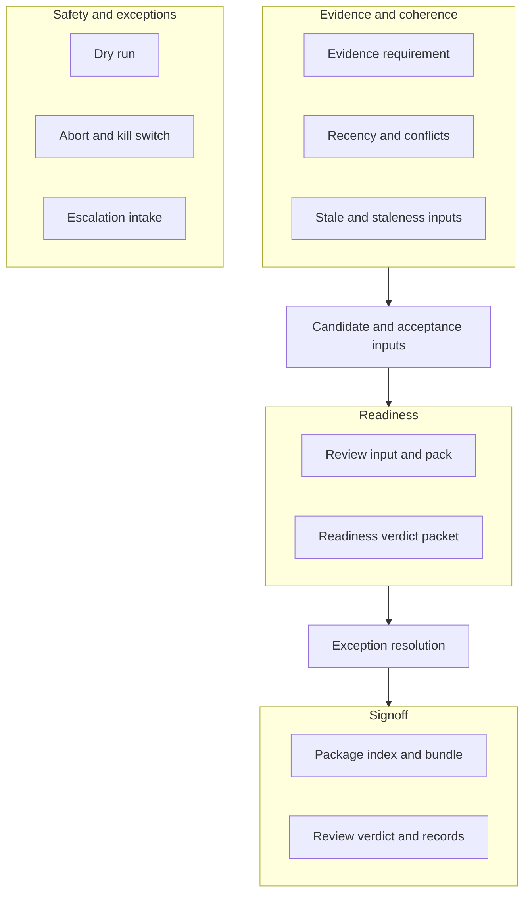

# Master V2 First Live PRE_LIVE Navigation Read Model v0

## 1) Title

This document is the **navigation and read-order read model** for the `MASTER_V2_FIRST_LIVE_PRE_LIVE_*_CONTRACT_V1` specification set. It is **not** a substitute for any contract’s text.

## 2) Purpose

The repository contains **many** adjacent [PRE_LIVE contracts](#9-explicit-non-scope) (filenames prefixed `MASTER_V2_FIRST_LIVE_PRE_LIVE_`, suffixed `_CONTRACT_V1.md`). Reviewers need a **compact map**: where to start, how clusters relate, and a **suggested** reading order that **reduces** lateral jumping. This file provides that **index only**.

This read model:

- **Does not** change, replace, or rank the legal/operational meaning of any existing contract.
- **Does not** assert completeness of a live program, green status, approval, signoff, or evidence.
- **Does not** invent dates, merge outcomes, or readiness states.

For **Master V2 / First Live enablement steering** (L0–L5 framing), use the canonical ladder and companions **first** when you need workstream sequence; this PRE_LIVE navigation note is a **peer** index into the PRE_LIVE contract filenames, not a gate schedule.

## 3) Non-authority boundary

This navigation read model is **docs-only**, **non-authorizing**, and **fail-closed by default** in spirit: if anything here appears to conflict with a contract, **the contract wins**.

This file does **not**:

- authorize live, testnet, paper, or shadow trading
- authorize Double Play selection, Master V2 handoff acceptance, or execution
- constitute evidence, a signoff, a gate closure, or an operator go
- replace [MASTER_V2_FIRST_LIVE_OPERATIONAL_SIGNOFF_PROCEDURE_V1.md](MASTER_V2_FIRST_LIVE_OPERATIONAL_SIGNOFF_PROCEDURE_V1.md) (when present) or any PRE_LIVE contract
- assert that all PRE_LIVE contracts are read, satisfied, or consistent for any candidate

## 4) Suggested read order table

Read **context** (optional but useful) **before** or **alongside** the PRE_LIVE pack:

| Step | Existing spec (link) | Role in review (reading aid) | What it does **not** authorize |
|------|----------------------|--------------------------------|---------------------------------|
| C0 | [STRATEGY_TO_MASTER_V2_INTEGRATION_CONTRACT_V0.md](STRATEGY_TO_MASTER_V2_INTEGRATION_CONTRACT_V0.md) | Strategy / MV2 **boundary** and vocabulary | Live go, Double Play, registry as sole authority |
| C0b | [MASTER_V2_DOUBLE_PLAY_TRADING_LOGIC_MANIFEST_V0.md](MASTER_V2_DOUBLE_PLAY_TRADING_LOGIC_MANIFEST_V0.md) | **Canonical** Master V2 / Double Play **trading-logic** target semantics (State-Switch vs Kill-All, dynamic scope envelope) | Order placement, execution, sessions, testnet/live authorization |
| C0c | [MASTER_V2_DOUBLE_PLAY_ARITHMETIC_SEQUENCE_SURVIVAL_CONTRACT_V0.md](MASTER_V2_DOUBLE_PLAY_ARITHMETIC_SEQUENCE_SURVIVAL_CONTRACT_V0.md) | Double Play **Futures arithmetic** and **path / sequence survival** **envelope** (pairs with C0b) | Live go, order permission, or proof that a candidate is arithmetic-true or survivable |
| C0d | [MASTER_V2_DOUBLE_PLAY_STRATEGY_SUITABILITY_PROJECTION_CONTRACT_V0.md](MASTER_V2_DOUBLE_PLAY_STRATEGY_SUITABILITY_PROJECTION_CONTRACT_V0.md) | Double Play **strategy suitability projection** (metadata and side-pool **labels** only) | Registry authority, Testnet/Live go, or strategy **activation** |
| C0e | [MASTER_V2_DOUBLE_PLAY_CAPITAL_SLOT_RATCHET_RELEASE_CONTRACT_V0.md](MASTER_V2_DOUBLE_PLAY_CAPITAL_SLOT_RATCHET_RELEASE_CONTRACT_V0.md) | **Capital slot** ratchet, release, and reallocation (per selected future) | Allocation, execution, rebalancing, or Live go |
| C0f | [MASTER_V2_DOUBLE_PLAY_FUTURES_INPUT_READ_MODEL_V0.md](MASTER_V2_DOUBLE_PLAY_FUTURES_INPUT_READ_MODEL_V0.md) | **Futures Input Snapshot** read model (precomputed data-only context for Double Play layers) | Scanner runs, market-data fetches, exchange calls, selector execution, or Live go |
| C0g | [MASTER_V2_DOUBLE_PLAY_PURE_STACK_READINESS_MAP_V0.md](MASTER_V2_DOUBLE_PLAY_PURE_STACK_READINESS_MAP_V0.md) | **Pure stack** readiness map (pure `master_v2` modules + contract tests vs runtime) | Runtime readiness, execution, sessions, Testnet/Live authorization |
| C0h | [MASTER_V2_DOUBLE_PLAY_PURE_STACK_DASHBOARD_DISPLAY_MAP_V0.md](MASTER_V2_DOUBLE_PLAY_PURE_STACK_DASHBOARD_DISPLAY_MAP_V0.md) | **Pure stack** read-only **dashboard display** map (WebUI placement guidance; docs-only) | Route implementation, market-data fetch, scanner, Live/Testnet go |
| C1 | [MASTER_V2_FIRST_LIVE_ENABLEMENT_READINESS_LADDER.md](MASTER_V2_FIRST_LIVE_ENABLEMENT_READINESS_LADDER.md) | **Canonical** L0–L5 enablement **steering** for the clarification workstream | A finished ladder state, green gates, or live enablement |
| C2 | [MASTER_V2_FIRST_LIVE_ENABLEMENT_READINESS_READ_MODEL_V1.md](MASTER_V2_FIRST_LIVE_ENABLEMENT_READINESS_READ_MODEL_V1.md) | Interpretation grammar for readiness claims (companion) | Evidence, signoff, or gate completion |
| C3 | [MASTER_V2_FIRST_LIVE_GATE_STATUS_INDEX_V1.md](MASTER_V2_FIRST_LIVE_GATE_STATUS_INDEX_V1.md) | **Compact** G1–G12 gate-status **mapping** index (read-only visibility) | Gate closure, live authorization, or operator signoff |
| C4 | [MASTER_V2_FIRST_LIVE_ENABLEMENT_GATE_STATUS_REPORT_SURFACE_V1.md](MASTER_V2_FIRST_LIVE_ENABLEMENT_GATE_STATUS_REPORT_SURFACE_V1.md) | Docs-only **report/table rendering** carrier aligned with the read model (companion) | A rendered status row as a governance decision, evidence, or go |

**Suggested first pass — PRE_LIVE contract cluster (order is a reading aid, not a mandate):**

| Step | Existing spec (link) | Role in review (reading aid) | What it does **not** authorize |
|------|----------------------|--------------------------------|---------------------------------|
| 1 | [MASTER_V2_FIRST_LIVE_PRE_LIVE_EVIDENCE_REQUIREMENT_CONTRACT_V1.md](MASTER_V2_FIRST_LIVE_PRE_LIVE_EVIDENCE_REQUIREMENT_CONTRACT_V1.md) | **Evidence** minimum surface | Evidence presence or adequacy for a candidate |
| 2 | [MASTER_V2_FIRST_LIVE_PRE_LIVE_DRY_RUN_ACCEPTANCE_CONTRACT_V1.md](MASTER_V2_FIRST_LIVE_PRE_LIVE_DRY_RUN_ACCEPTANCE_CONTRACT_V1.md) | **Dry run** acceptance shape | That a dry run passed or is sufficient |
| 3 | [MASTER_V2_FIRST_LIVE_PRE_LIVE_ABORT_ROLLBACK_KILL_SWITCH_READINESS_VERIFICATION_CONTRACT_V1.md](MASTER_V2_FIRST_LIVE_PRE_LIVE_ABORT_ROLLBACK_KILL_SWITCH_READINESS_VERIFICATION_CONTRACT_V1.md) | **Abort/rollback/kill-switch** verification | Operational readiness to trade |
| 4 | [MASTER_V2_FIRST_LIVE_PRE_LIVE_ESCALATION_EXCEPTION_INTAKE_CONTRACT_V1.md](MASTER_V2_FIRST_LIVE_PRE_LIVE_ESCALATION_EXCEPTION_INTAKE_CONTRACT_V1.md) | **Exception** intake | Resolution or waiver |
| 5 | [MASTER_V2_FIRST_LIVE_PRE_LIVE_EVIDENCE_RECENCY_SNAPSHOT_COHERENCE_CONTRACT_V1.md](MASTER_V2_FIRST_LIVE_PRE_LIVE_EVIDENCE_RECENCY_SNAPSHOT_COHERENCE_CONTRACT_V1.md) | **Recency** and snapshot coherence | Fresh or approved evidence |
| 6 | [MASTER_V2_FIRST_LIVE_PRE_LIVE_EVIDENCE_CONFLICT_ADJUDICATION_CONTRACT_V1.md](MASTER_V2_FIRST_LIVE_PRE_LIVE_EVIDENCE_CONFLICT_ADJUDICATION_CONTRACT_V1.md) | **Conflicting evidence** handling | A chosen winner or go |
| 7 | [MASTER_V2_FIRST_LIVE_PRE_LIVE_STALE_EVIDENCE_REVALIDATION_HANDLING_CONTRACT_V1.md](MASTER_V2_FIRST_LIVE_PRE_LIVE_STALE_EVIDENCE_REVALIDATION_HANDLING_CONTRACT_V1.md) | **Stale evidence** revalidation | Up-to-date signoff |
| 8 | [MASTER_V2_FIRST_LIVE_PRE_LIVE_EVIDENCE_STALENESS_DECISION_INPUT_CONTRACT_V1.md](MASTER_V2_FIRST_LIVE_PRE_LIVE_EVIDENCE_STALENESS_DECISION_INPUT_CONTRACT_V1.md) | **Staleness** decision **inputs** | A staleness decision |
| 9 | [MASTER_V2_FIRST_LIVE_PRE_LIVE_CANDIDATE_DECISION_INPUT_CONTRACT_V1.md](MASTER_V2_FIRST_LIVE_PRE_LIVE_CANDIDATE_DECISION_INPUT_CONTRACT_V1.md) | **Candidate** decision **inputs** | Candidate approval |
| 10 | [MASTER_V2_FIRST_LIVE_PRE_LIVE_ACCEPTANCE_VERDICT_INPUT_CONTRACT_V1.md](MASTER_V2_FIRST_LIVE_PRE_LIVE_ACCEPTANCE_VERDICT_INPUT_CONTRACT_V1.md) | **Acceptance verdict** **inputs** | An acceptance verdict |
| 11 | [MASTER_V2_FIRST_LIVE_PRE_LIVE_READINESS_REVIEW_INPUT_PACKET_CONTRACT_V1.md](MASTER_V2_FIRST_LIVE_PRE_LIVE_READINESS_REVIEW_INPUT_PACKET_CONTRACT_V1.md) | **Readiness review** input **packet** | Review completion |
| 12 | [MASTER_V2_FIRST_LIVE_PRE_LIVE_READINESS_REVIEW_PACK_CONTRACT_V1.md](MASTER_V2_FIRST_LIVE_PRE_LIVE_READINESS_REVIEW_PACK_CONTRACT_V1.md) | **Readiness review** **pack** | Readiness signoff |
| 13 | [MASTER_V2_FIRST_LIVE_PRE_LIVE_READINESS_VERDICT_PACKET_CONTRACT_V1.md](MASTER_V2_FIRST_LIVE_PRE_LIVE_READINESS_VERDICT_PACKET_CONTRACT_V1.md) | **Readiness verdict** **packet** | A readiness verdict or live go |
| 14 | [MASTER_V2_FIRST_LIVE_PRE_LIVE_EXCEPTION_RESOLUTION_ADJUDICATION_CONTRACT_V1.md](MASTER_V2_FIRST_LIVE_PRE_LIVE_EXCEPTION_RESOLUTION_ADJUDICATION_CONTRACT_V1.md) | **Exception resolution** adjudication | Exception clearance |
| 15 | [MASTER_V2_FIRST_LIVE_PRE_LIVE_SIGNOFF_PACKAGE_INDEX_CONTRACT_V1.md](MASTER_V2_FIRST_LIVE_PRE_LIVE_SIGNOFF_PACKAGE_INDEX_CONTRACT_V1.md) | **Signoff package index** — meta-index across adjacent surfaces | Assembled or complete signoff package |
| 16 | [MASTER_V2_FIRST_LIVE_PRE_LIVE_SIGNOFF_SUBMISSION_BUNDLE_CONTRACT_V1.md](MASTER_V2_FIRST_LIVE_PRE_LIVE_SIGNOFF_SUBMISSION_BUNDLE_CONTRACT_V1.md) | **Submission bundle** | Submission acceptance |
| 17 | [MASTER_V2_FIRST_LIVE_PRE_LIVE_SIGNOFF_DECISION_BRIEF_CONTRACT_V1.md](MASTER_V2_FIRST_LIVE_PRE_LIVE_SIGNOFF_DECISION_BRIEF_CONTRACT_V1.md) | **Decision brief** | Decision approval |
| 18 | [MASTER_V2_FIRST_LIVE_PRE_LIVE_SIGNOFF_REVIEW_PACKET_CONTRACT_V1.md](MASTER_V2_FIRST_LIVE_PRE_LIVE_SIGNOFF_REVIEW_PACKET_CONTRACT_V1.md) | **Signoff review** packet | Signoff review closure |
| 19 | [MASTER_V2_FIRST_LIVE_PRE_LIVE_SIGNOFF_VERDICT_PACKET_CONTRACT_V1.md](MASTER_V2_FIRST_LIVE_PRE_LIVE_SIGNOFF_VERDICT_PACKET_CONTRACT_V1.md) | **Signoff verdict** packet | Verdicted live enablement |
| 20 | [MASTER_V2_FIRST_LIVE_PRE_LIVE_SIGNOFF_READINESS_DECISION_RECORD_CONTRACT_V1.md](MASTER_V2_FIRST_LIVE_PRE_LIVE_SIGNOFF_READINESS_DECISION_RECORD_CONTRACT_V1.md) | **Readiness decision** record | A recorded go |
| 21 | [MASTER_V2_FIRST_LIVE_PRE_LIVE_SIGNOFF_DISPOSITION_RECORD_CONTRACT_V1.md](MASTER_V2_FIRST_LIVE_PRE_LIVE_SIGNOFF_DISPOSITION_RECORD_CONTRACT_V1.md) | **Disposition** record | Final disposition or authorization |
| 22 | [MASTER_V2_FIRST_LIVE_PRE_LIVE_SIGNOFF_OUTCOME_REGISTER_CONTRACT_V1.md](MASTER_V2_FIRST_LIVE_PRE_LIVE_SIGNOFF_OUTCOME_REGISTER_CONTRACT_V1.md) | **Outcome** register | Outcome correctness |
| 23 | [MASTER_V2_FIRST_LIVE_PRE_LIVE_SIGNOFF_TRACEABILITY_LEDGER_CONTRACT_V1.md](MASTER_V2_FIRST_LIVE_PRE_LIVE_SIGNOFF_TRACEABILITY_LEDGER_CONTRACT_V1.md) | **Traceability** ledger | Traceability completeness |
| 24 | [MASTER_V2_FIRST_LIVE_PRE_LIVE_SIGNOFF_EVIDENCE_INDEX_CONTRACT_V1.md](MASTER_V2_FIRST_LIVE_PRE_LIVE_SIGNOFF_EVIDENCE_INDEX_CONTRACT_V1.md) | **Signoff evidence** index | Indexed evidence = approved |
| 25 | [MASTER_V2_FIRST_LIVE_PRE_LIVE_SIGNOFF_DELIVERY_RECEIPT_CONTRACT_V1.md](MASTER_V2_FIRST_LIVE_PRE_LIVE_SIGNOFF_DELIVERY_RECEIPT_CONTRACT_V1.md) | **Delivery** receipt | Delivery = operational go |
| 26 | [MASTER_V2_FIRST_LIVE_PRE_LIVE_SIGNOFF_HANDOFF_PACKET_CONTRACT_V1.md](MASTER_V2_FIRST_LIVE_PRE_LIVE_SIGNOFF_HANDOFF_PACKET_CONTRACT_V1.md) | **Handoff** packet | Handoff = execution authority |

**Note:** The [SIGNOFF_PACKAGE_INDEX](MASTER_V2_FIRST_LIVE_PRE_LIVE_SIGNOFF_PACKAGE_INDEX_CONTRACT_V1.md) contract lists **required adjacent surfaces**; use it when you need the **authoritative** adjacency list for package assembly. This navigation note is **shorter** and **order-oriented**; it does not replace that contract.

## 5) PRE_LIVE cluster map

Markdown **cluster** view (no graph required). Membership is **thematic** for navigation, not a promise of independence between contracts.

| Cluster | Specs in this cluster (all under `docs/ops/specs/`, links above) |
|---------|--------|
| **A — Evidence & inputs** | `...EVIDENCE_REQUIREMENT...`, `...EVIDENCE_RECENCY...`, `...EVIDENCE_CONFLICT...`, `...STALE_EVIDENCE_REVALIDATION...`, `...EVIDENCE_STALENESS_DECISION_INPUT...` |
| **B — Safety & exception intake** | `...DRY_RUN_ACCEPTANCE...`, `...ABORT_ROLLBACK_KILL_SWITCH...`, `...ESCALATION_EXCEPTION_INTAKE...` |
| **C — Candidate & verdict inputs** | `...CANDIDATE_DECISION_INPUT...`, `...ACCEPTANCE_VERDICT_INPUT...` |
| **D — Readiness review chain** | `...READINESS_REVIEW_INPUT_PACKET...`, `...READINESS_REVIEW_PACK...`, `...READINESS_VERDICT_PACKET...` |
| **E — Exception resolution** | `...EXCEPTION_RESOLUTION_ADJUDICATION...` |
| **F — Signoff & package** | `...SIGNOFF_PACKAGE_INDEX...` through `...SIGNOFF_HANDOFF_PACKET...` (the remaining `...SIGNOFF_*` contracts in the table) |

**Optional (simple) Mermaid** — high-level flow only; **not** a workflow engine:



Labels are **illustrative**; filenames and binding text live in the linked contracts.

## 6) Master V2 / Double Play boundary

[STRATEGY_TO_MASTER_V2_INTEGRATION_CONTRACT_V0.md](STRATEGY_TO_MASTER_V2_INTEGRATION_CONTRACT_V0.md) and the [enablement ladder](MASTER_V2_FIRST_LIVE_ENABLEMENT_READINESS_LADDER.md) frame **governance and sequence** for the First Live workstream. **Double Play** and **execution** acceptance remain governed outside this navigation note. This file **does not** add selection authority, leverage approval, or Master V2 “done”.

## 7) Evidence / Signoff / Gate boundary

- **Evidence** is established only by the **evidence and signoff contracts** and operational procedures — not by this index.
- **Signoff** is established only by **authorized** procedures and records — not by having read this file.
- **Gates** are **not** opened by navigation order; missing steps remain **unresolved** until handled per the relevant contract.

## 8) Safe future audit path

1. When contracts change, refresh **links** in section 4 (and cluster membership in section 5 if filenames shift).
2. Prefer **adding** a short delta note in a **separate** docs commit rather than reinterpreting contracts here.
3. Keep this file **one screen longer** than necessary rather than **asserting** merge or readiness state.

## 9) Explicit non-scope

This read model does **not**:

- edit any existing PRE_LIVE or enablement spec
- edit `docs/INDEX.md` or other entry documents (unless a later slice explicitly does)
- change `src/`, tests, `config/`, registry, TOML, workflows, or runtime
- create evidence, out/ artifacts, or signoff records
- change Master V2 or Double Play trading logic

## 10) Validation note

From the repository root:

```bash
uv run python scripts/ops/validate_docs_token_policy.py --tracked-docs
bash scripts/ops/verify_docs_reference_targets.sh --docs-root docs
```

If `uv` is not available, use the project’s documented Python environment to run the same commands.

## Appendix: Alphabetical list of PRE_LIVE `*_CONTRACT_V1.md` files (navigation aid)

| File |
|------|
| [MASTER_V2_FIRST_LIVE_PRE_LIVE_ABORT_ROLLBACK_KILL_SWITCH_READINESS_VERIFICATION_CONTRACT_V1.md](MASTER_V2_FIRST_LIVE_PRE_LIVE_ABORT_ROLLBACK_KILL_SWITCH_READINESS_VERIFICATION_CONTRACT_V1.md) |
| [MASTER_V2_FIRST_LIVE_PRE_LIVE_ACCEPTANCE_VERDICT_INPUT_CONTRACT_V1.md](MASTER_V2_FIRST_LIVE_PRE_LIVE_ACCEPTANCE_VERDICT_INPUT_CONTRACT_V1.md) |
| [MASTER_V2_FIRST_LIVE_PRE_LIVE_CANDIDATE_DECISION_INPUT_CONTRACT_V1.md](MASTER_V2_FIRST_LIVE_PRE_LIVE_CANDIDATE_DECISION_INPUT_CONTRACT_V1.md) |
| [MASTER_V2_FIRST_LIVE_PRE_LIVE_DRY_RUN_ACCEPTANCE_CONTRACT_V1.md](MASTER_V2_FIRST_LIVE_PRE_LIVE_DRY_RUN_ACCEPTANCE_CONTRACT_V1.md) |
| [MASTER_V2_FIRST_LIVE_PRE_LIVE_ESCALATION_EXCEPTION_INTAKE_CONTRACT_V1.md](MASTER_V2_FIRST_LIVE_PRE_LIVE_ESCALATION_EXCEPTION_INTAKE_CONTRACT_V1.md) |
| [MASTER_V2_FIRST_LIVE_PRE_LIVE_EVIDENCE_CONFLICT_ADJUDICATION_CONTRACT_V1.md](MASTER_V2_FIRST_LIVE_PRE_LIVE_EVIDENCE_CONFLICT_ADJUDICATION_CONTRACT_V1.md) |
| [MASTER_V2_FIRST_LIVE_PRE_LIVE_EVIDENCE_RECENCY_SNAPSHOT_COHERENCE_CONTRACT_V1.md](MASTER_V2_FIRST_LIVE_PRE_LIVE_EVIDENCE_RECENCY_SNAPSHOT_COHERENCE_CONTRACT_V1.md) |
| [MASTER_V2_FIRST_LIVE_PRE_LIVE_EVIDENCE_REQUIREMENT_CONTRACT_V1.md](MASTER_V2_FIRST_LIVE_PRE_LIVE_EVIDENCE_REQUIREMENT_CONTRACT_V1.md) |
| [MASTER_V2_FIRST_LIVE_PRE_LIVE_EVIDENCE_STALENESS_DECISION_INPUT_CONTRACT_V1.md](MASTER_V2_FIRST_LIVE_PRE_LIVE_EVIDENCE_STALENESS_DECISION_INPUT_CONTRACT_V1.md) |
| [MASTER_V2_FIRST_LIVE_PRE_LIVE_EXCEPTION_RESOLUTION_ADJUDICATION_CONTRACT_V1.md](MASTER_V2_FIRST_LIVE_PRE_LIVE_EXCEPTION_RESOLUTION_ADJUDICATION_CONTRACT_V1.md) |
| [MASTER_V2_FIRST_LIVE_PRE_LIVE_READINESS_REVIEW_INPUT_PACKET_CONTRACT_V1.md](MASTER_V2_FIRST_LIVE_PRE_LIVE_READINESS_REVIEW_INPUT_PACKET_CONTRACT_V1.md) |
| [MASTER_V2_FIRST_LIVE_PRE_LIVE_READINESS_REVIEW_PACK_CONTRACT_V1.md](MASTER_V2_FIRST_LIVE_PRE_LIVE_READINESS_REVIEW_PACK_CONTRACT_V1.md) |
| [MASTER_V2_FIRST_LIVE_PRE_LIVE_READINESS_VERDICT_PACKET_CONTRACT_V1.md](MASTER_V2_FIRST_LIVE_PRE_LIVE_READINESS_VERDICT_PACKET_CONTRACT_V1.md) |
| [MASTER_V2_FIRST_LIVE_PRE_LIVE_SIGNOFF_DECISION_BRIEF_CONTRACT_V1.md](MASTER_V2_FIRST_LIVE_PRE_LIVE_SIGNOFF_DECISION_BRIEF_CONTRACT_V1.md) |
| [MASTER_V2_FIRST_LIVE_PRE_LIVE_SIGNOFF_DELIVERY_RECEIPT_CONTRACT_V1.md](MASTER_V2_FIRST_LIVE_PRE_LIVE_SIGNOFF_DELIVERY_RECEIPT_CONTRACT_V1.md) |
| [MASTER_V2_FIRST_LIVE_PRE_LIVE_SIGNOFF_DISPOSITION_RECORD_CONTRACT_V1.md](MASTER_V2_FIRST_LIVE_PRE_LIVE_SIGNOFF_DISPOSITION_RECORD_CONTRACT_V1.md) |
| [MASTER_V2_FIRST_LIVE_PRE_LIVE_SIGNOFF_EVIDENCE_INDEX_CONTRACT_V1.md](MASTER_V2_FIRST_LIVE_PRE_LIVE_SIGNOFF_EVIDENCE_INDEX_CONTRACT_V1.md) |
| [MASTER_V2_FIRST_LIVE_PRE_LIVE_SIGNOFF_HANDOFF_PACKET_CONTRACT_V1.md](MASTER_V2_FIRST_LIVE_PRE_LIVE_SIGNOFF_HANDOFF_PACKET_CONTRACT_V1.md) |
| [MASTER_V2_FIRST_LIVE_PRE_LIVE_SIGNOFF_OUTCOME_REGISTER_CONTRACT_V1.md](MASTER_V2_FIRST_LIVE_PRE_LIVE_SIGNOFF_OUTCOME_REGISTER_CONTRACT_V1.md) |
| [MASTER_V2_FIRST_LIVE_PRE_LIVE_SIGNOFF_PACKAGE_INDEX_CONTRACT_V1.md](MASTER_V2_FIRST_LIVE_PRE_LIVE_SIGNOFF_PACKAGE_INDEX_CONTRACT_V1.md) |
| [MASTER_V2_FIRST_LIVE_PRE_LIVE_SIGNOFF_READINESS_DECISION_RECORD_CONTRACT_V1.md](MASTER_V2_FIRST_LIVE_PRE_LIVE_SIGNOFF_READINESS_DECISION_RECORD_CONTRACT_V1.md) |
| [MASTER_V2_FIRST_LIVE_PRE_LIVE_SIGNOFF_REVIEW_PACKET_CONTRACT_V1.md](MASTER_V2_FIRST_LIVE_PRE_LIVE_SIGNOFF_REVIEW_PACKET_CONTRACT_V1.md) |
| [MASTER_V2_FIRST_LIVE_PRE_LIVE_SIGNOFF_SUBMISSION_BUNDLE_CONTRACT_V1.md](MASTER_V2_FIRST_LIVE_PRE_LIVE_SIGNOFF_SUBMISSION_BUNDLE_CONTRACT_V1.md) |
| [MASTER_V2_FIRST_LIVE_PRE_LIVE_SIGNOFF_TRACEABILITY_LEDGER_CONTRACT_V1.md](MASTER_V2_FIRST_LIVE_PRE_LIVE_SIGNOFF_TRACEABILITY_LEDGER_CONTRACT_V1.md) |
| [MASTER_V2_FIRST_LIVE_PRE_LIVE_SIGNOFF_VERDICT_PACKET_CONTRACT_V1.md](MASTER_V2_FIRST_LIVE_PRE_LIVE_SIGNOFF_VERDICT_PACKET_CONTRACT_V1.md) |
| [MASTER_V2_FIRST_LIVE_PRE_LIVE_STALE_EVIDENCE_REVALIDATION_HANDLING_CONTRACT_V1.md](MASTER_V2_FIRST_LIVE_PRE_LIVE_STALE_EVIDENCE_REVALIDATION_HANDLING_CONTRACT_V1.md) |

---

*This appendix lists the same 26 `PRE_LIVE` contracts as the glob `MASTER_V2_FIRST_LIVE_PRE_LIVE_*_CONTRACT_V1.md` at authoring time. If the set changes, update this list in a follow-up docs slice.*
