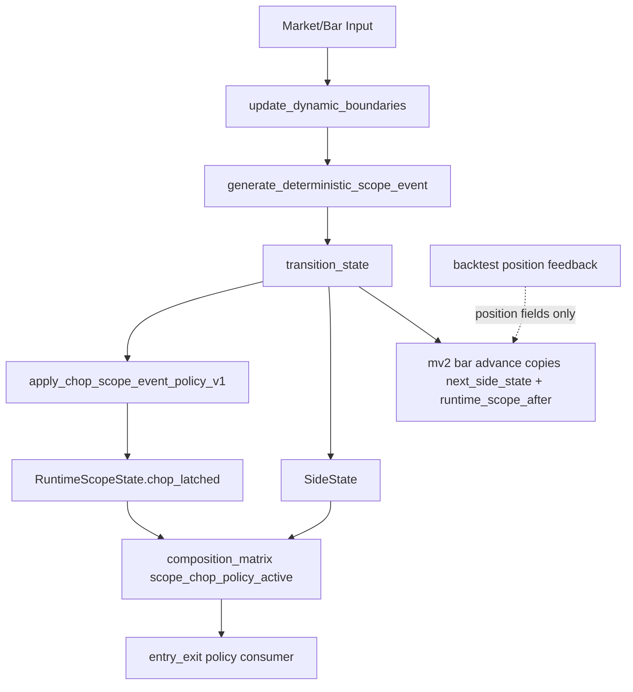
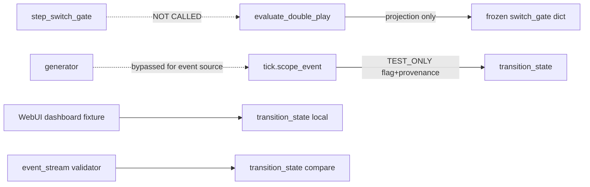

# Call Graph (post PR #5325 / quarantine)

## Productive offline / backtest

## Quarantined / non-authority

## Key edges verified

| Caller | Callee | Mutation of SideState/Scope SSOT? |
|--------|--------|-----------------------------------|
| `integrated_offline_trading_logic_replay_v1` | `transition_state` | yes (canonical) |
| `transition_state` | `apply_chop_scope_event_policy_v1` | scope latch only |
| `evaluate_double_play` | `step_switch_gate` | **no call** |
| `apply_backtest_engine_position_feedback_to_mv2_sequence_state_v1` | sequence `replace` | **no** side/direction/scope |
| scenario replay (flagged) | `transition_state` | yes but TEST_ONLY |
| WebUI / event_stream | `transition_state` | ephemeral non-SSOT |

## Persistence

No path persists Bull/Bear SideState or RuntimeScopeState into Live order submission. Runtime bridge status remains `BOUND_NOT_ACTIVATED`. `LIVE_AUTHORIZED=false`, `ORDERS_ENABLED=false`.
