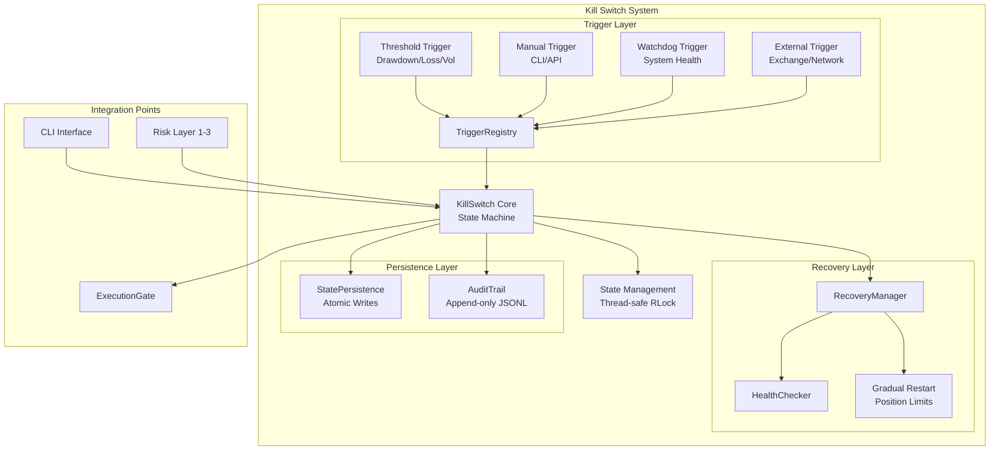
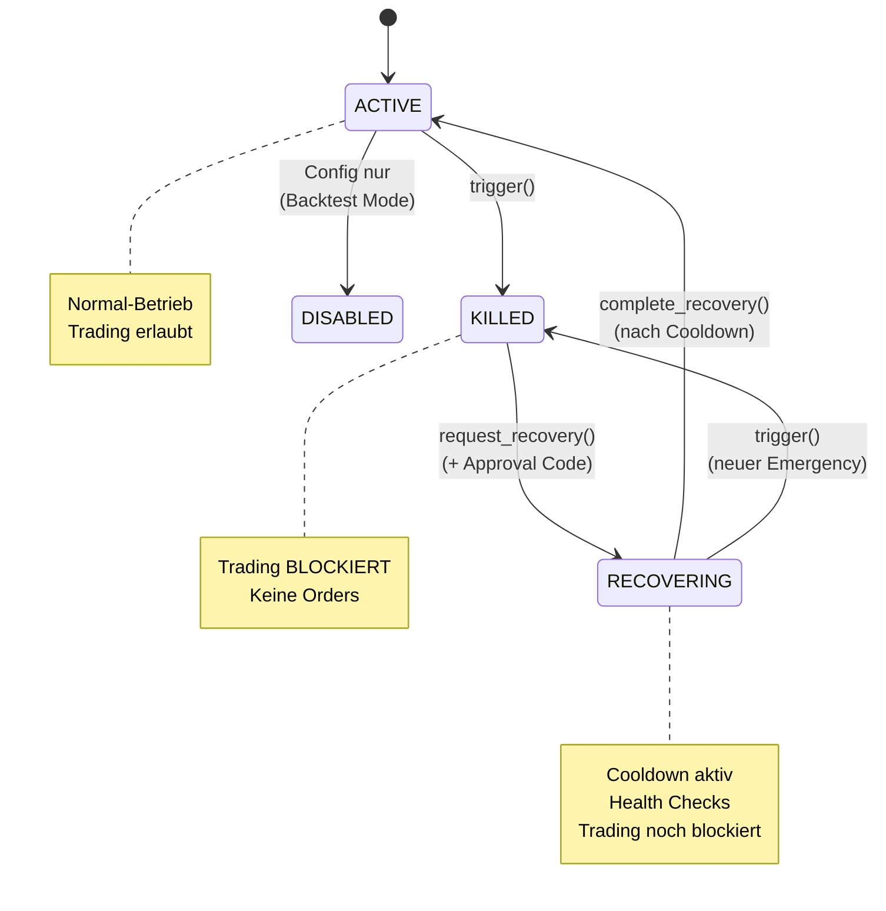

# Peak_Trade Emergency Kill Switch – Architektur

**Version:** 1.0  
**Datum:** 2025-12-28  
**Status:** ✅ IMPLEMENTIERT

---

## 🎯 Übersicht

Der Emergency Kill Switch ist **Layer 4** im Defense-in-Depth Risk Management System von Peak_Trade. Er ist die letzte Verteidigungslinie und muss **immer funktionieren**, unabhängig von allen anderen Systemkomponenten.

## 🏛️ Architektur-Diagramm



## 📦 Package-Struktur

```
src/risk_layer/kill_switch/
├── __init__.py              # Public API
├── state.py                 # State Machine & Events
├── core.py                  # KillSwitch Hauptklasse
├── config.py                # Config Schema & Defaults
│
├── triggers/
│   ├── __init__.py          # Trigger Registry
│   ├── base.py              # BaseTrigger ABC
│   ├── threshold.py         # Threshold-basierte Trigger
│   ├── manual.py            # Manuelle Trigger
│   ├── watchdog.py          # System Watchdog
│   └── external.py          # Externe Trigger
│
├── recovery.py              # RecoveryManager
├── health_check.py          # HealthChecker
├── gradual_restart.py       # Gradual Restart Logic
│
├── persistence.py           # State Persistence
├── audit.py                 # Audit Trail
│
├── integration.py           # Risk Layer Integration
├── execution_gate.py        # Execution Gate Contract
└── cli.py                   # CLI Commands
```

## 🔄 State Machine



## 🔌 Contracts & Interfaces

### ExecutionGate Contract

```python
class ExecutionGate(Protocol):
    """
    Contract für Trading Execution Gate.

    Jede Order-Execution MUSS durch dieses Gate.
    """

    def check_can_execute(self) -> bool:
        """
        Prüft ob Execution erlaubt ist.

        Returns:
            True wenn erlaubt

        Raises:
            TradingBlockedError wenn Kill Switch aktiv
        """
        ...
```

### Trigger Contract

```python
class BaseTrigger(ABC):
    """
    Abstract Base für alle Trigger.

    Jeder Trigger implementiert check() Methode.
    """

    @abstractmethod
    def check(self, context: dict) -> TriggerResult:
        """
        Prüft Trigger-Condition.

        Args:
            context: System-Kontext (Metriken, State)

        Returns:
            TriggerResult mit Entscheidung
        """
        pass
```

### Recovery Contract

```python
class RecoveryManager(Protocol):
    """
    Contract für Recovery Management.
    """

    def request_recovery(
        self,
        requested_by: str,
        approval_code: str,
        reason: str,
    ) -> RecoveryRequest:
        """Startet Recovery-Anfrage."""
        ...

    @property
    def position_limit_factor(self) -> float:
        """
        Aktueller Position Limit Factor (0.0 - 1.0).

        Wird von Gradual Restart gesteuert:
        - Initial: 0.5 (50%)
        - Nach 1h: 0.75 (75%)
        - Nach 2h: 1.0 (100%)
        """
        ...
```

## ⚙️ Configuration Schema

```toml
[kill_switch]
# Core Settings
enabled = true
mode = "active"  # "active" | "disabled" (backtest only)

# Recovery Settings
recovery_cooldown_seconds = 300  # 5 min
require_approval_code = true
approval_code_env = "KILL_SWITCH_APPROVAL_CODE"  # Env var name

# Persistence
persist_state = true
state_file = "data/kill_switch/state.json"
audit_dir = "data/kill_switch/audit"
audit_retention_days = 90

# Logging
log_level = "INFO"

[kill_switch.triggers.drawdown]
enabled = true
type = "threshold"
metric = "portfolio_drawdown"
threshold = -0.15  # -15%
operator = "lt"
cooldown_seconds = 0

[kill_switch.triggers.daily_loss]
enabled = true
type = "threshold"
metric = "daily_pnl"
threshold = -0.05  # -5%
operator = "lt"
cooldown_seconds = 0

[kill_switch.triggers.volatility_spike]
enabled = true
type = "threshold"
metric = "realized_volatility_1h"
threshold = 0.10  # 10%
operator = "gt"
cooldown_seconds = 3600  # 1h

[kill_switch.triggers.system_health]
enabled = true
type = "watchdog"
heartbeat_interval_seconds = 60
max_missed_heartbeats = 3
memory_threshold_percent = 90
cpu_threshold_percent = 95

[kill_switch.recovery]
cooldown_seconds = 300
require_approval_code = true
require_health_check = true
require_trigger_clear = true

# Gradual Restart
gradual_restart_enabled = true
initial_position_limit_factor = 0.5
escalation_intervals = [3600, 7200]  # Sekunden: 1h, 2h
escalation_factors = [0.75, 1.0]

# Health Checks
min_memory_available_mb = 512
max_cpu_percent = 80
require_exchange_connection = true
require_price_feed = true
```

## 🔒 Thread-Safety Garantien

1. **RLock für alle State-Änderungen**: Core.py verwendet `threading.RLock()`
2. **Immutable Events**: `KillSwitchEvent` ist frozen dataclass
3. **Atomic File Operations**: Persistence verwendet tmp → rename Pattern
4. **Lock-free Reads**: Properties wie `state` sind thread-safe reads

## 🎯 Integration Points

### 1. Execution Layer

```python
# In src/execution/pipeline.py
from src.risk_layer.kill_switch import KillSwitch
from src.risk_layer.kill_switch.execution_gate import ExecutionGate

gate = ExecutionGate(kill_switch)

def execute_order(order):
    gate.check_can_execute()  # Raises TradingBlockedError if killed
    # ... execute order
```

### 2. Risk Layer (Layer 1-3)

```python
# Kill Switch als Layer 4
risk_manager.register_layer4(kill_switch)

# Trigger bei Threshold-Überschreitung
if portfolio_drawdown < -0.15:
    kill_switch.trigger("Drawdown threshold", triggered_by="risk_manager")
```

### 3. CLI

```bash
python -m src.risk_layer.kill_switch.cli status
python -m src.risk_layer.kill_switch.cli trigger --reason "Wartung" --confirm
python -m src.risk_layer.kill_switch.cli recover --code "..." --reason "..."
python -m src.risk_layer.kill_switch.cli audit --limit 50
python -m src.risk_layer.kill_switch.cli health
```

## 📊 Monitoring & Observability

### Metriken (Optional: Prometheus)

```python
# Counter
kill_switch_triggers_total{reason="drawdown"}
kill_switch_recoveries_total{approved_by="operator"}

# Gauge
kill_switch_state{state="ACTIVE|KILLED|RECOVERING"}
kill_switch_position_limit_factor

# Histogram
kill_switch_trigger_latency_seconds
kill_switch_recovery_duration_seconds
```

### Logs

- **CRITICAL**: Trigger-Events
- **WARNING**: Recovery-Requests
- **INFO**: State-Transitions, Health Checks
- **DEBUG**: Trigger-Checks (nicht ausgelöst)

### Alerts

1. **Kill Switch Triggered** → Sofort Notification (Email/Slack)
2. **Recovery Requested** → Notification an Approver
3. **Failed Health Check** → Alert wenn Recovery blockiert
4. **Missed Heartbeats** → Watchdog Alert

## 🚀 Deployment Checklist

- [ ] Config-File existiert: `config/risk/kill_switch.toml`
- [ ] Approval Code in Env: `KILL_SWITCH_APPROVAL_CODE`
- [ ] Data Directories erstellt: `data/kill_switch/{state,audit}`
- [ ] Permissions: Operator kennt Approval Code
- [ ] Tests grün: `pytest tests/risk_layer/kill_switch/`
- [ ] Runbook bekannt: `docs/ops/KILL_SWITCH_RUNBOOK.md`

## 🔄 Dependencies

### Minimal (Core muss funktionieren)

```
python >= 3.10
threading (stdlib)
json (stdlib)
logging (stdlib)
```

### Optional (Degradiert graceful)

```
psutil  # für Watchdog Memory/CPU Checks
  → Falls nicht installiert: Watchdog Trigger disabled mit Warning
```

### Test Dependencies

```
pytest
pytest-timeout
pytest-asyncio (falls async Support)
```

## 📝 Design Decisions

### Warum JSON für State Persistence?

- **Pro**: Simple, portable, human-readable
- **Pro**: Atomic writes möglich (tmp → rename)
- **Con**: Nicht für high-frequency (ok, State ändert sich selten)

### Warum JSONL für Audit?

- **Pro**: Append-only (kein Risiko für Daten-Korruption)
- **Pro**: Easy to query (grep/jq)
- **Pro**: Rotation und Compression einfach

### Warum RLock statt Lock?

- **Pro**: Re-entrant (gleicher Thread kann mehrfach locken)
- **Pro**: Vermeidet Deadlocks bei verschachtelten Calls
- **Con**: Minimal mehr Overhead (vernachlässigbar)

### Warum Cooldown UND Approval Code?

- **Defense in Depth**: Doppelte Sicherung
- **Cooldown**: Technische Sicherheit (System stabilisiert sich)
- **Approval Code**: Menschliche Entscheidung (bewusster Akt)

---

**Erstellt von:** Agent1 (Architect)  
**Datum:** 2025-12-28  
**Review-Status:** ✅ Ready for Implementation
