<!-- GENERATED/DO_NOT_EDIT -->
<!-- generator: scripts/ops/generate_system_atlas_v1.py -->
<!-- atlas_authority: NONE -->
<!-- schema_version: system_atlas.v1 -->

# Peak_Trade System Atlas

`ATLAS_AUTHORITY=NONE`  
`ATLAS_ROLE=EVIDENCE_BOUND_SYSTEM_TOPOLOGY_AND_NAVIGATION`  
`CANONICAL_AUTHORITY_IS_EXTERNAL_TO_ATLAS=true`  
`ATLAS_MUST_CITE_AUTHORITY=true`  
`ATLAS_MUST_NOT_CREATE_AUTHORITY=true`

Primary human entrypoint. This is an evidence-bound topology overview, not a business SSOT and not runtime authorization.

```text
SYSTEM_ATLAS_PRIMARY_ENTRYPOINT=docs/system_atlas/generated/SYSTEM_ATLAS.md
SYSTEM_ATLAS_MASTER_VIEW_COMPLETE=true
GLOBAL_CENSUS_EXHAUSTED=false
SYSTEM_ATLAS_DRILLDOWN_LINKS_VALID=true
SYSTEM_ATLAS_ALL_MAJOR_DOMAINS_REPRESENTED=true
SYSTEM_ATLAS_CURRENT_HISTORICAL_SPLIT_VALID=true
SYSTEM_ATLAS_GRAPH_RELATIONS_BACKED_BY_MODEL=true
```

Navigation: `README.md` explains Atlas authority. This file is the complete overview. Specialized generated files are drill-down. YAML under `docs/system_atlas/` is the source model. Canonical authority remains the Master Runbook, external to the Atlas.

Census SHA: `afbae518b67eb1b789c835e219db37f5b15f308b`. Worktree dirty records are not origin/main truth.

## Integrated current topology (model-backed)

Every edge below is a stored Atlas relation whose source and target are hub entities. No inferred inverses. OPEN and CONTRADICTED edges keep that label.

```mermaid
flowchart TB
  n_ADAPTER_okx_public_md_client["ADAPTER:okx_public_md_client<br/>CURRENT_IMPLEMENTED_NONCANONICAL"]
  n_AUTH_PRIMITIVE_okx_hmac_sign["AUTH_PRIMITIVE:okx_hmac_sign<br/>CURRENT_IMPLEMENTED_NONCANONICAL"]
  n_BINDER_bound_instrument_v1["BINDER:bound_instrument_v1<br/>CURRENT_IMPLEMENTED_NONCANONICAL"]
  n_CAPABILITY_cap_11_13_5_live_canary["CAPABILITY:cap_11_13_5_live_canary<br/>CURRENT_CANONICAL"]
  n_CAPABILITY_cap_1_1_reconciliation["CAPABILITY:cap_1_1_reconciliation<br/>CURRENT_IMPLEMENTED_NONCANONICAL"]
  n_CAPABILITY_cap_2_1_gfu["CAPABILITY:cap_2_1_gfu<br/>CURRENT_CANONICAL"]
  n_CAPABILITY_cap_2_2_ranking["CAPABILITY:cap_2_2_ranking<br/>CURRENT_CANONICAL"]
  n_CAPABILITY_cap_2_3_single_selected_future["CAPABILITY:cap_2_3_single_selected_future<br/>CURRENT_CANONICAL"]
  n_CAPABILITY_cap_2_4_runtime_binding["CAPABILITY:cap_2_4_runtime_binding<br/>CURRENT_CANONICAL"]
  n_CAPABILITY_cap_3_1_futures_accounting["CAPABILITY:cap_3_1_futures_accounting<br/>CURRENT_IMPLEMENTED_NONCANONICAL"]
  n_CAPABILITY_cap_4_1_pre_activation_closure["CAPABILITY:cap_4_1_pre_activation_closure<br/>CURRENT_IMPLEMENTED_NONCANONICAL"]
  n_CAPABILITY_cap_7_2_stateful_no_order["CAPABILITY:cap_7_2_stateful_no_order<br/>CURRENT_CANONICAL"]
  n_FORENSIC_REFERENCE_information_corpus_persistence_base["FORENSIC_REFERENCE:information_corpus_persistence_base<br/>FORENSIC_ONLY"]
  n_FUNCTIONAL_CORE_double_play["FUNCTIONAL_CORE:double_play<br/>CURRENT_CANONICAL"]
  n_GATE_btc_exclusion["GATE:btc_exclusion<br/>CURRENT_CANONICAL"]
  n_GATE_flatten_execute_authority["GATE:flatten_execute_authority<br/>CURRENT_IMPLEMENTED_NONCANONICAL"]
  n_GATE_live_authorized_false["GATE:live_authorized_false<br/>CURRENT_CANONICAL"]
  n_HOST_cap72_stateful_host["HOST:cap72_stateful_host<br/>CURRENT_CANONICAL"]
  n_INVARIANT_missing_metadata_never_defaulted["INVARIANT:missing_metadata_never_defaulted<br/>CURRENT_CANONICAL"]
  n_NAVIGATION_INDEX_map_of_truth["NAVIGATION_INDEX:map_of_truth<br/>ADJUDICATED"]
  n_OBSERVER_post_action_canary["OBSERVER:post_action_canary<br/>OPEN"]
  n_OWNER_DECISION_btc_excluded["OWNER_DECISION:btc_excluded<br/>CURRENT_CANONICAL"]
  n_OWNER_DECISION_cap23_exclusive_selection["OWNER_DECISION:cap23_exclusive_selection<br/>CURRENT_CANONICAL"]
  n_RUNBOOK_canonical_master_runbook["RUNBOOK:canonical_master_runbook<br/>CURRENT_CANONICAL"]
  n_RUNBOOK_vollautonomie_v4_4_12["RUNBOOK:vollautonomie_v4_4_12<br/>SUPERSEDED"]
  n_RUNTIME_COMPONENT_dp_composition["RUNTIME_COMPONENT:dp_composition<br/>CURRENT_IMPLEMENTED_NONCANONICAL"]
  n_RUNTIME_COMPONENT_dp_core_wiring["RUNTIME_COMPONENT:dp_core_wiring<br/>CURRENT_IMPLEMENTED_NONCANONICAL"]
  n_RUNTIME_COMPONENT_dp_state["RUNTIME_COMPONENT:dp_state<br/>CURRENT_IMPLEMENTED_NONCANONICAL"]
  n_RUNTIME_COMPONENT_dp_suitability["RUNTIME_COMPONENT:dp_suitability<br/>CURRENT_IMPLEMENTED_NONCANONICAL"]
  n_RUNTIME_COMPONENT_dp_survival["RUNTIME_COMPONENT:dp_survival<br/>CURRENT_IMPLEMENTED_NONCANONICAL"]
  n_RUNTIME_COMPONENT_gfu_eligibility["RUNTIME_COMPONENT:gfu_eligibility<br/>CURRENT_IMPLEMENTED_NONCANONICAL"]
  n_RUNTIME_COMPONENT_mv2_decision_packet["RUNTIME_COMPONENT:mv2_decision_packet<br/>CURRENT_IMPLEMENTED_NONCANONICAL"]
  n_RUNTIME_COMPONENT_mv2_integrated_replay["RUNTIME_COMPONENT:mv2_integrated_replay<br/>CURRENT_IMPLEMENTED_NONCANONICAL"]
  n_SCRIPT_run_cap23_policy["SCRIPT:run_cap23_policy<br/>CURRENT_IMPLEMENTED_NONCANONICAL"]
  n_SCRIPT_run_gfu_producer["SCRIPT:run_gfu_producer<br/>CURRENT_IMPLEMENTED_NONCANONICAL"]
  n_SELECTOR_productive_futures_ranking["SELECTOR:productive_futures_ranking<br/>CURRENT_IMPLEMENTED_NONCANONICAL"]
  n_SELECTOR_single_selected_future_policy["SELECTOR:single_selected_future_policy<br/>CURRENT_IMPLEMENTED_NONCANONICAL"]
  n_SUBSYSTEM_master_v2["SUBSYSTEM:master_v2<br/>CURRENT_CANONICAL"]
  n_SYSTEM_peak_trade["SYSTEM:peak_trade<br/>CURRENT_CANONICAL"]
  n_TRANSPORT_bound_okx_testnet_http["TRANSPORT:bound_okx_testnet_http<br/>CURRENT_IMPLEMENTED_NONCANONICAL"]
  n_UNIVERSE_governed_futures_universe["UNIVERSE:governed_futures_universe<br/>CURRENT_IMPLEMENTED_NONCANONICAL"]
  n_VENUE_okx["VENUE:okx<br/>ADJUDICATED"]
  n_VENUE_okx_eea["VENUE:okx_eea<br/>CURRENT_IMPLEMENTED_NONCANONICAL"]
  n_VENUE_ENDPOINT_okx_public_instruments["VENUE_ENDPOINT:okx_public_instruments<br/>CURRENT_IMPLEMENTED_NONCANONICAL"]
  n_FORENSIC_REFERENCE_information_corpus_persistence_base -->|"DOES_NOT_AUTHORIZE"| n_SYSTEM_peak_trade
  n_NAVIGATION_INDEX_map_of_truth -->|"DOCUMENTS"| n_RUNBOOK_canonical_master_runbook
  n_OWNER_DECISION_btc_excluded -->|"BINDS"| n_GATE_btc_exclusion
  n_OWNER_DECISION_cap23_exclusive_selection -->|"BINDS"| n_CAPABILITY_cap_2_3_single_selected_future
  n_RUNBOOK_canonical_master_runbook -->|"DOES_NOT_AUTHORIZE"| n_GATE_live_authorized_false
  n_RUNBOOK_canonical_master_runbook -->|"GOVERNS"| n_SYSTEM_peak_trade
  n_CAPABILITY_cap_2_1_gfu -->|"CLAIMS_TO_IMPLEMENT (CONTRADICTED)"| n_INVARIANT_missing_metadata_never_defaulted
  n_CAPABILITY_cap_2_1_gfu -->|"PRODUCES (ADJUDICATED)"| n_UNIVERSE_governed_futures_universe
  n_SELECTOR_productive_futures_ranking -->|"RANKS (ADJUDICATED)"| n_UNIVERSE_governed_futures_universe
  n_SELECTOR_single_selected_future_policy -->|"SELECTS (ADJUDICATED)"| n_SELECTOR_productive_futures_ranking
  n_BINDER_bound_instrument_v1 -->|"BINDS (ADJUDICATED)"| n_SELECTOR_single_selected_future_policy
  n_RUNTIME_COMPONENT_dp_composition -->|"CONSUMES"| n_RUNTIME_COMPONENT_dp_suitability
  n_RUNTIME_COMPONENT_dp_composition -->|"CONSUMES"| n_RUNTIME_COMPONENT_dp_survival
  n_RUNTIME_COMPONENT_dp_core_wiring -->|"CALLS"| n_RUNTIME_COMPONENT_mv2_decision_packet
  n_RUNTIME_COMPONENT_dp_core_wiring -->|"CALLS"| n_RUNTIME_COMPONENT_mv2_integrated_replay
  n_RUNTIME_COMPONENT_dp_composition -->|"READS"| n_RUNTIME_COMPONENT_dp_state
  n_GATE_flatten_execute_authority -->|"GATES"| n_CAPABILITY_cap_11_13_5_live_canary
  n_RUNTIME_COMPONENT_gfu_eligibility -->|"FILTERS"| n_UNIVERSE_governed_futures_universe
  n_HOST_cap72_stateful_host -->|"CONSUMES (ADJUDICATED)"| n_BINDER_bound_instrument_v1
  n_GATE_live_authorized_false -->|"DENIES"| n_CAPABILITY_cap_11_13_5_live_canary
  n_ADAPTER_okx_public_md_client -->|"FETCHES"| n_VENUE_ENDPOINT_okx_public_instruments
  n_OBSERVER_post_action_canary -->|"OBSERVES (OPEN)"| n_GATE_flatten_execute_authority
  n_SCRIPT_run_cap23_policy -->|"CALLS"| n_CAPABILITY_cap_2_3_single_selected_future
  n_SCRIPT_run_gfu_producer -->|"CALLS"| n_CAPABILITY_cap_2_1_gfu
  n_TRANSPORT_bound_okx_testnet_http -->|"SIGNS"| n_AUTH_PRIMITIVE_okx_hmac_sign
  n_CAPABILITY_cap_2_1_gfu -->|"GOVERNED_BY"| n_GATE_btc_exclusion
  n_CAPABILITY_cap_2_1_gfu -->|"GOVERNED_BY"| n_INVARIANT_missing_metadata_never_defaulted
  n_CAPABILITY_cap_2_2_ranking -->|"DEPENDS_ON (ADJUDICATED)"| n_CAPABILITY_cap_2_1_gfu
  n_CAPABILITY_cap_2_3_single_selected_future -->|"DEPENDS_ON (ADJUDICATED)"| n_CAPABILITY_cap_2_2_ranking
  n_CAPABILITY_cap_2_3_single_selected_future -->|"GOVERNED_BY"| n_OWNER_DECISION_cap23_exclusive_selection
  n_CAPABILITY_cap_2_4_runtime_binding -->|"DEPENDS_ON (ADJUDICATED)"| n_CAPABILITY_cap_2_3_single_selected_future
  n_CAPABILITY_cap_3_1_futures_accounting -->|"DEPENDS_ON (ADJUDICATED)"| n_CAPABILITY_cap_2_4_runtime_binding
  n_CAPABILITY_cap_4_1_pre_activation_closure -->|"DEPENDS_ON (ADJUDICATED)"| n_CAPABILITY_cap_1_1_reconciliation
  n_CAPABILITY_cap_4_1_pre_activation_closure -->|"DEPENDS_ON (ADJUDICATED)"| n_CAPABILITY_cap_2_4_runtime_binding
  n_CAPABILITY_cap_4_1_pre_activation_closure -->|"DEPENDS_ON (ADJUDICATED)"| n_CAPABILITY_cap_3_1_futures_accounting
  n_CAPABILITY_cap_7_2_stateful_no_order -->|"DEPENDS_ON (ADJUDICATED)"| n_CAPABILITY_cap_2_4_runtime_binding
  n_FUNCTIONAL_CORE_double_play -->|"CONTAINS (ADJUDICATED)"| n_RUNTIME_COMPONENT_dp_composition
  n_FUNCTIONAL_CORE_double_play -->|"CONTAINS (ADJUDICATED)"| n_RUNTIME_COMPONENT_dp_core_wiring
  n_FUNCTIONAL_CORE_double_play -->|"CONTAINS (ADJUDICATED)"| n_RUNTIME_COMPONENT_dp_state
  n_FUNCTIONAL_CORE_double_play -->|"CONTAINS (ADJUDICATED)"| n_RUNTIME_COMPONENT_dp_suitability
  n_FUNCTIONAL_CORE_double_play -->|"CONTAINS (ADJUDICATED)"| n_RUNTIME_COMPONENT_dp_survival
  n_FORENSIC_REFERENCE_information_corpus_persistence_base -->|"REFERENCE_OF"| n_SYSTEM_peak_trade
  n_NAVIGATION_INDEX_map_of_truth -->|"NAVIGATES_TO"| n_RUNBOOK_canonical_master_runbook
  n_SUBSYSTEM_master_v2 -->|"HAS_FUNCTIONAL_CORE (ADJUDICATED)"| n_FUNCTIONAL_CORE_double_play
  n_SUBSYSTEM_master_v2 -->|"CONTAINS"| n_RUNTIME_COMPONENT_dp_composition
  n_SUBSYSTEM_master_v2 -->|"CONTAINS"| n_RUNTIME_COMPONENT_dp_core_wiring
  n_SUBSYSTEM_master_v2 -->|"CONTAINS"| n_RUNTIME_COMPONENT_dp_state
  n_SUBSYSTEM_master_v2 -->|"CONTAINS"| n_RUNTIME_COMPONENT_dp_suitability
  n_SUBSYSTEM_master_v2 -->|"CONTAINS"| n_RUNTIME_COMPONENT_dp_survival
  n_SUBSYSTEM_master_v2 -->|"CONTAINS"| n_RUNTIME_COMPONENT_mv2_decision_packet
  n_SUBSYSTEM_master_v2 -->|"CONTAINS"| n_RUNTIME_COMPONENT_mv2_integrated_replay
  n_RUNBOOK_canonical_master_runbook -->|"SUPERSEDES"| n_RUNBOOK_vollautonomie_v4_4_12
  n_SYSTEM_peak_trade -->|"CONTAINS"| n_SUBSYSTEM_master_v2
  n_SYSTEM_peak_trade -->|"HAS_CAPABILITY"| n_CAPABILITY_cap_1_1_reconciliation
  n_SYSTEM_peak_trade -->|"HAS_CAPABILITY"| n_CAPABILITY_cap_11_13_5_live_canary
  n_SYSTEM_peak_trade -->|"HAS_CAPABILITY"| n_CAPABILITY_cap_2_1_gfu
  n_SYSTEM_peak_trade -->|"HAS_CAPABILITY"| n_CAPABILITY_cap_2_2_ranking
  n_SYSTEM_peak_trade -->|"HAS_CAPABILITY"| n_CAPABILITY_cap_2_3_single_selected_future
  n_SYSTEM_peak_trade -->|"HAS_CAPABILITY"| n_CAPABILITY_cap_2_4_runtime_binding
  n_SYSTEM_peak_trade -->|"HAS_CAPABILITY"| n_CAPABILITY_cap_3_1_futures_accounting
  n_SYSTEM_peak_trade -->|"HAS_CAPABILITY"| n_CAPABILITY_cap_4_1_pre_activation_closure
  n_SYSTEM_peak_trade -->|"HAS_CAPABILITY"| n_CAPABILITY_cap_7_2_stateful_no_order
  n_VENUE_okx -->|"CONTAINS"| n_VENUE_okx_eea
```


Hub relations shown: `63`. Full graphs: [STRUCTURAL_GRAPH.md](STRUCTURAL_GRAPH.md), [RUNTIME_GRAPH.md](RUNTIME_GRAPH.md), [AUTHORITY_GRAPH.md](AUTHORITY_GRAPH.md), [FULL_DEPENDENCY_GRAPH.md](FULL_DEPENDENCY_GRAPH.md).

| id | source | type | target | epistemic |
| --- | --- | --- | --- | --- |
| REL:a_forensic_does_not_authorize | FORENSIC_REFERENCE:information_corpus_persistence_base | DOES_NOT_AUTHORIZE | SYSTEM:peak_trade | STATUS=FORENSIC_RAW |
| REL:a_map_documents_runbook | NAVIGATION_INDEX:map_of_truth | DOCUMENTS | RUNBOOK:canonical_master_runbook | STATUS=NAVIGATION_ONLY |
| REL:a_owner_binds_btc | OWNER_DECISION:btc_excluded | BINDS | GATE:btc_exclusion | STATUS=CANONICAL_AUTHORITY |
| REL:a_owner_binds_cap23 | OWNER_DECISION:cap23_exclusive_selection | BINDS | CAPABILITY:cap_2_3_single_selected_future | STATUS=CANONICAL_AUTHORITY |
| REL:a_runbook_does_not_authorize_live | RUNBOOK:canonical_master_runbook | DOES_NOT_AUTHORIZE | GATE:live_authorized_false | STATUS=CANONICAL_AUTHORITY |
| REL:a_runbook_governs_system | RUNBOOK:canonical_master_runbook | GOVERNS | SYSTEM:peak_trade | STATUS=CANONICAL_AUTHORITY |
| REL:a_spec_claims_cap21 | CAPABILITY:cap_2_1_gfu | CLAIMS_TO_IMPLEMENT | INVARIANT:missing_metadata_never_defaulted | STATUS=CONTRADICTED (both sides preserved) |
| REL:r_cap21_produces_universe | CAPABILITY:cap_2_1_gfu | PRODUCES | UNIVERSE:governed_futures_universe | STATUS=ADJUDICATED |
| REL:r_cap22_ranks_universe | SELECTOR:productive_futures_ranking | RANKS | UNIVERSE:governed_futures_universe | STATUS=ADJUDICATED |
| REL:r_cap23_selects | SELECTOR:single_selected_future_policy | SELECTS | SELECTOR:productive_futures_ranking | STATUS=ADJUDICATED |
| REL:r_cap24_binds | BINDER:bound_instrument_v1 | BINDS | SELECTOR:single_selected_future_policy | STATUS=ADJUDICATED |
| REL:r_dp_composition_consumes_suitability | RUNTIME_COMPONENT:dp_composition | CONSUMES | RUNTIME_COMPONENT:dp_suitability | STATUS=FORENSIC_RAW |
| REL:r_dp_composition_consumes_survival | RUNTIME_COMPONENT:dp_composition | CONSUMES | RUNTIME_COMPONENT:dp_survival | STATUS=FORENSIC_RAW |
| REL:r_dp_core_wiring_calls_decision_packet | RUNTIME_COMPONENT:dp_core_wiring | CALLS | RUNTIME_COMPONENT:mv2_decision_packet | STATUS=FORENSIC_RAW |
| REL:r_dp_core_wiring_calls_integrated_replay | RUNTIME_COMPONENT:dp_core_wiring | CALLS | RUNTIME_COMPONENT:mv2_integrated_replay | STATUS=FORENSIC_RAW |
| REL:r_dp_state_calls | RUNTIME_COMPONENT:dp_composition | READS | RUNTIME_COMPONENT:dp_state | STATUS=FORENSIC_RAW |
| REL:r_flatten_gates | GATE:flatten_execute_authority | GATES | CAPABILITY:cap_11_13_5_live_canary | STATUS=FORENSIC_RAW |
| REL:r_gfu_eligibility_filters | RUNTIME_COMPONENT:gfu_eligibility | FILTERS | UNIVERSE:governed_futures_universe | STATUS=FORENSIC_RAW |
| REL:r_host72_consumes_binding | HOST:cap72_stateful_host | CONSUMES | BINDER:bound_instrument_v1 | STATUS=ADJUDICATED |
| REL:r_live_auth_denies | GATE:live_authorized_false | DENIES | CAPABILITY:cap_11_13_5_live_canary | STATUS=CANONICAL_AUTHORITY |
| REL:r_md_client_fetches_instruments | ADAPTER:okx_public_md_client | FETCHES | VENUE_ENDPOINT:okx_public_instruments | STATUS=FORENSIC_RAW |
| REL:r_post_action_observes | OBSERVER:post_action_canary | OBSERVES | GATE:flatten_execute_authority | STATUS=OPEN (not proven) |
| REL:r_script_cap23_calls | SCRIPT:run_cap23_policy | CALLS | CAPABILITY:cap_2_3_single_selected_future | STATUS=FORENSIC_RAW |
| REL:r_script_gfu_calls_cap21 | SCRIPT:run_gfu_producer | CALLS | CAPABILITY:cap_2_1_gfu | STATUS=FORENSIC_RAW |
| REL:r_transport_signs | TRANSPORT:bound_okx_testnet_http | SIGNS | AUTH_PRIMITIVE:okx_hmac_sign | STATUS=FORENSIC_RAW |
| REL:s_cap21_governed_by_btc | CAPABILITY:cap_2_1_gfu | GOVERNED_BY | GATE:btc_exclusion | STATUS=CANONICAL_AUTHORITY |
| REL:s_cap21_governed_by_never_default | CAPABILITY:cap_2_1_gfu | GOVERNED_BY | INVARIANT:missing_metadata_never_defaulted | STATUS=CANONICAL_AUTHORITY |
| REL:s_cap22_depends_cap21 | CAPABILITY:cap_2_2_ranking | DEPENDS_ON | CAPABILITY:cap_2_1_gfu | STATUS=ADJUDICATED |
| REL:s_cap23_depends_cap22 | CAPABILITY:cap_2_3_single_selected_future | DEPENDS_ON | CAPABILITY:cap_2_2_ranking | STATUS=ADJUDICATED |
| REL:s_cap23_governed_by_owner | CAPABILITY:cap_2_3_single_selected_future | GOVERNED_BY | OWNER_DECISION:cap23_exclusive_selection | STATUS=CANONICAL_AUTHORITY |
| REL:s_cap24_depends_cap23 | CAPABILITY:cap_2_4_runtime_binding | DEPENDS_ON | CAPABILITY:cap_2_3_single_selected_future | STATUS=ADJUDICATED |
| REL:s_cap31_depends_cap24 | CAPABILITY:cap_3_1_futures_accounting | DEPENDS_ON | CAPABILITY:cap_2_4_runtime_binding | STATUS=ADJUDICATED |
| REL:s_cap41_depends_cap11 | CAPABILITY:cap_4_1_pre_activation_closure | DEPENDS_ON | CAPABILITY:cap_1_1_reconciliation | STATUS=ADJUDICATED |
| REL:s_cap41_depends_cap24 | CAPABILITY:cap_4_1_pre_activation_closure | DEPENDS_ON | CAPABILITY:cap_2_4_runtime_binding | STATUS=ADJUDICATED |
| REL:s_cap41_depends_cap31 | CAPABILITY:cap_4_1_pre_activation_closure | DEPENDS_ON | CAPABILITY:cap_3_1_futures_accounting | STATUS=ADJUDICATED |
| REL:s_cap72_depends_cap24 | CAPABILITY:cap_7_2_stateful_no_order | DEPENDS_ON | CAPABILITY:cap_2_4_runtime_binding | STATUS=ADJUDICATED |
| REL:s_dp_contains_dp_composition | FUNCTIONAL_CORE:double_play | CONTAINS | RUNTIME_COMPONENT:dp_composition | STATUS=ADJUDICATED |
| REL:s_dp_contains_dp_core_wiring | FUNCTIONAL_CORE:double_play | CONTAINS | RUNTIME_COMPONENT:dp_core_wiring | STATUS=ADJUDICATED |
| REL:s_dp_contains_dp_state | FUNCTIONAL_CORE:double_play | CONTAINS | RUNTIME_COMPONENT:dp_state | STATUS=ADJUDICATED |
| REL:s_dp_contains_dp_suitability | FUNCTIONAL_CORE:double_play | CONTAINS | RUNTIME_COMPONENT:dp_suitability | STATUS=ADJUDICATED |
| REL:s_dp_contains_dp_survival | FUNCTIONAL_CORE:double_play | CONTAINS | RUNTIME_COMPONENT:dp_survival | STATUS=ADJUDICATED |
| REL:s_forensic_reference_of_corpus | FORENSIC_REFERENCE:information_corpus_persistence_base | REFERENCE_OF | SYSTEM:peak_trade | STATUS=FORENSIC_RAW |
| REL:s_map_navigates_runbook | NAVIGATION_INDEX:map_of_truth | NAVIGATES_TO | RUNBOOK:canonical_master_runbook | STATUS=NAVIGATION_ONLY |
| REL:s_master_v2_has_dp | SUBSYSTEM:master_v2 | HAS_FUNCTIONAL_CORE | FUNCTIONAL_CORE:double_play | STATUS=ADJUDICATED |
| REL:s_mv2_contains_dp_composition | SUBSYSTEM:master_v2 | CONTAINS | RUNTIME_COMPONENT:dp_composition | STATUS=FORENSIC_RAW |
| REL:s_mv2_contains_dp_core_wiring | SUBSYSTEM:master_v2 | CONTAINS | RUNTIME_COMPONENT:dp_core_wiring | STATUS=FORENSIC_RAW |
| REL:s_mv2_contains_dp_state | SUBSYSTEM:master_v2 | CONTAINS | RUNTIME_COMPONENT:dp_state | STATUS=FORENSIC_RAW |
| REL:s_mv2_contains_dp_suitability | SUBSYSTEM:master_v2 | CONTAINS | RUNTIME_COMPONENT:dp_suitability | STATUS=FORENSIC_RAW |
| REL:s_mv2_contains_dp_survival | SUBSYSTEM:master_v2 | CONTAINS | RUNTIME_COMPONENT:dp_survival | STATUS=FORENSIC_RAW |
| REL:s_mv2_contains_mv2_decision_packet | SUBSYSTEM:master_v2 | CONTAINS | RUNTIME_COMPONENT:mv2_decision_packet | STATUS=FORENSIC_RAW |
| REL:s_mv2_contains_mv2_integrated_replay | SUBSYSTEM:master_v2 | CONTAINS | RUNTIME_COMPONENT:mv2_integrated_replay | STATUS=FORENSIC_RAW |
| REL:s_runbook_supersedes_vollautonomie | RUNBOOK:canonical_master_runbook | SUPERSEDES | RUNBOOK:vollautonomie_v4_4_12 | STATUS=CANONICAL_AUTHORITY |
| REL:s_system_contains_master_v2 | SYSTEM:peak_trade | CONTAINS | SUBSYSTEM:master_v2 | STATUS=CANONICAL_AUTHORITY |
| REL:s_system_has_cap11 | SYSTEM:peak_trade | HAS_CAPABILITY | CAPABILITY:cap_1_1_reconciliation | STATUS=CANONICAL_AUTHORITY |
| REL:s_system_has_cap11135 | SYSTEM:peak_trade | HAS_CAPABILITY | CAPABILITY:cap_11_13_5_live_canary | STATUS=CANONICAL_AUTHORITY |
| REL:s_system_has_cap21 | SYSTEM:peak_trade | HAS_CAPABILITY | CAPABILITY:cap_2_1_gfu | STATUS=CANONICAL_AUTHORITY |
| REL:s_system_has_cap22 | SYSTEM:peak_trade | HAS_CAPABILITY | CAPABILITY:cap_2_2_ranking | STATUS=CANONICAL_AUTHORITY |
| REL:s_system_has_cap23 | SYSTEM:peak_trade | HAS_CAPABILITY | CAPABILITY:cap_2_3_single_selected_future | STATUS=CANONICAL_AUTHORITY |
| REL:s_system_has_cap24 | SYSTEM:peak_trade | HAS_CAPABILITY | CAPABILITY:cap_2_4_runtime_binding | STATUS=CANONICAL_AUTHORITY |
| REL:s_system_has_cap31 | SYSTEM:peak_trade | HAS_CAPABILITY | CAPABILITY:cap_3_1_futures_accounting | STATUS=CANONICAL_AUTHORITY |
| REL:s_system_has_cap41 | SYSTEM:peak_trade | HAS_CAPABILITY | CAPABILITY:cap_4_1_pre_activation_closure | STATUS=CANONICAL_AUTHORITY |
| REL:s_system_has_cap72 | SYSTEM:peak_trade | HAS_CAPABILITY | CAPABILITY:cap_7_2_stateful_no_order | STATUS=CANONICAL_AUTHORITY |
| REL:s_venue_okx_contains_eea | VENUE:okx | CONTAINS | VENUE:okx_eea | STATUS=FORENSIC_RAW |

## 1. Authority model

Canonical semantic SSOT is `RUNBOOK:canonical_master_runbook` (`DOCUMENT_CLASS=CANONICAL_MASTER_RUNBOOK`, `RUNTIME_AUTHORIZATION_EFFECT=NONE`). The Map of Truth is `NAVIGATION_ONLY` and must not be read as a second SSOT. Derived-domain runbooks (cybersecurity, presentation, runtime-ops) are not trading SSOT. Forensic persistence declares `AUTHORITY=NONE`. Implementation and tests cannot confer authority upward.

Standing fail-closed: `LIVE_AUTHORIZED=false`, `TESTNET_AUTHORIZED=false` unless a scoped Owner-GO plus canonical evidence says otherwise. Drill-down: [AUTHORITY_GRAPH.md](AUTHORITY_GRAPH.md).

| id | kind | name | bucket | epistemic |
| --- | --- | --- | --- | --- |
| RUNBOOK:canonical_master_runbook | RUNBOOK | Peak_Trade Master Runbook | CURRENT_CANONICAL | STATUS=CANONICAL_AUTHORITY |
| NAVIGATION_INDEX:map_of_truth | NAVIGATION_INDEX | Map of Truth | ADJUDICATED | STATUS=NAVIGATION_ONLY |
| FORENSIC_REFERENCE:information_corpus_persistence_base | FORENSIC_REFERENCE | Information Corpus Persistence Base | FORENSIC_ONLY | STATUS=FORENSIC_RAW |
| OWNER_DECISION:cap23_exclusive_selection | OWNER_DECISION | CAP23 exclusive productive selection | CURRENT_CANONICAL | STATUS=CANONICAL_AUTHORITY |
| OWNER_DECISION:btc_excluded | OWNER_DECISION | BTC productively excluded | CURRENT_CANONICAL | STATUS=CANONICAL_AUTHORITY |

## 2. Master V2 / Double Play relation

Peak_Trade's trading core is named `Master V2 &#47; Double Play` on the Master Runbook SYSTEM header. They are Modul-Owner of **one** Trading Core (`SEPARATE_*_ALLOWED=false` in architecture text). They are not competing generations.

Atlas kind `FUNCTIONAL_CORE` and relation type `HAS_FUNCTIONAL_CORE` are census labels. Exact tokens `FUNCTIONAL_CORE` / `inner core` were **not** found on origin/main. The stored edge `REL:s_master_v2_has_dp` is `ADJUDICATED`, not a Master Runbook token. Historical Vollautonomie ordering vs current §4.2 chain is CONTRADICTED (`C-DP-ORDER-001`). `ops.double_play.evaluate_double_play` is quarantined projection-only.

Drill-down: [MASTER_V2_DOUBLE_PLAY_MAP.md](MASTER_V2_DOUBLE_PLAY_MAP.md).

## 3. System / subsystem hierarchy

`SYSTEM:peak_trade` `CONTAINS` `SUBSYSTEM:master_v2`. Recorded `HAS_CAPABILITY` edges from the system entity are Caps 1.1, 2.1–2.4, 3.1, 4.1, 7.2, and 11.13.5. The seven `MASTER_V2_CAPABILITY_*.md` spec files (1.1, 2.1–2.4, 3.1, 4.1) are inventoried; Caps 7.2 and 11.13.5 are Master-Runbook capabilities without a numbered MASTER_V2 spec file. Structural relation count: `80`. Drill-down: [STRUCTURAL_GRAPH.md](STRUCTURAL_GRAPH.md).

| id | kind | name | bucket | epistemic |
| --- | --- | --- | --- | --- |
| FUNCTIONAL_CORE:double_play | FUNCTIONAL_CORE | Double Play | CURRENT_CANONICAL | STATUS=CANONICAL_AUTHORITY |
| HOST:cap72_stateful_host | HOST | Cap 7.2 stateful no-order host | CURRENT_CANONICAL | STATUS=CANONICAL_AUTHORITY |
| SUBSYSTEM:master_v2 | SUBSYSTEM | Master V2 | CURRENT_CANONICAL | STATUS=CANONICAL_AUTHORITY |
| SUBSYSTEM:trading_decision_core | SUBSYSTEM | TRADING_DECISION_CORE | SUPERSEDED | STATUS=HISTORICAL |
| SYSTEM:peak_trade | SYSTEM | Peak_Trade | CURRENT_CANONICAL | STATUS=CANONICAL_AUTHORITY |

## 4. Family / Child / SSOT-CHILD / MMR model

**There is no single Families ontology.** The same spellings mean incompatible things. Do not collapse them. `SSOT_CHILD` is not a formal in-repo literal. `HISTORICAL_CHILD_LEDGER` (88 `SRC-*` children) is forensic source-region indexing with `ssot_role=HISTORICAL_FORENSIC_REGION_NOT_CURRENT_SSOT`, not SSOT_CHILD. MMR in the Master Runbook is Maintenance Margin Requirement (venue/margin); an architectural Master-V2 MMR kind was not found in scoped specs.

Observed Family senses include: projection-octet `family_id` (8 ids), OKX `instFamily`, `strategy_family`, confirm-token `FAMILY_*`, historical Gate-Familien F1–F6, obligation_families, and `NO_FAMILY_ONTOLOGY`. Drill-down: [FAMILY_CHILD_MMR_MAP.md](FAMILY_CHILD_MMR_MAP.md), [TERMINOLOGY_COLLISIONS.md](TERMINOLOGY_COLLISIONS.md).

| id | parent | type | child | meaning | epistemic |
| --- | --- | --- | --- | --- | --- |
| FCM:architectural_mmr | SUBSYSTEM:master_v2 | HAS_MMR | TERM:mmr_polyvalent | architectural_unproven | STATUS=OPEN (not proven) |
| FCM:dashboard_canonical_decision | SYSTEM:peak_trade | HAS_FAMILY | FAMILY:dashboard_canonical_decision | dashboard_family_id | STATUS=FORENSIC_RAW |
| FCM:dashboard_double_play | SYSTEM:peak_trade | HAS_FAMILY | FAMILY:dashboard_double_play | dashboard_family_id | STATUS=FORENSIC_RAW |
| FCM:dashboard_dynamic_scope | SYSTEM:peak_trade | HAS_FAMILY | FAMILY:dashboard_dynamic_scope | dashboard_family_id | STATUS=FORENSIC_RAW |
| FCM:dashboard_econ | SYSTEM:peak_trade | HAS_FAMILY | FAMILY:dashboard_economic_summary | dashboard_family_id | STATUS=FORENSIC_RAW |
| FCM:dashboard_exec_recon | SYSTEM:peak_trade | HAS_FAMILY | FAMILY:dashboard_execution_reconciliation | dashboard_family_id | STATUS=FORENSIC_RAW |
| FCM:dashboard_regime | SYSTEM:peak_trade | HAS_FAMILY | FAMILY:dashboard_regime_bull_bear | dashboard_family_id | STATUS=FORENSIC_RAW |
| FCM:dashboard_risk | SYSTEM:peak_trade | HAS_FAMILY | FAMILY:dashboard_risk_sizing_capital | dashboard_family_id | STATUS=FORENSIC_RAW |
| FCM:dashboard_safety | SYSTEM:peak_trade | HAS_FAMILY | FAMILY:dashboard_safety_authority | dashboard_family_id | STATUS=FORENSIC_RAW |
| FCM:falls_parent_child | FORENSIC_REFERENCE:information_corpus_persistence_base | HAS_CHILD | TERM:falls_parent_child | forensic_falls_coupling | STATUS=HISTORICAL |
| FCM:master_v2_functional_core | SUBSYSTEM:master_v2 | HAS_FUNCTIONAL_CORE | FUNCTIONAL_CORE:double_play | owner_bound_atlas_label | STATUS=ADJUDICATED |
| FCM:nested_structural_child | FORENSIC_REFERENCE:information_corpus_persistence_base | HAS_CHILD | CHILD:nested_structural_child | forensic_lossless_structure | STATUS=HISTORICAL |
| FCM:okx_instfamily | VENUE:okx | HAS_FAMILY | VENUE_FIELD:instFamily | okx_venue_field | STATUS=FORENSIC_RAW |
| FCM:okx_mmr_field | VENUE:okx | HAS_MMR | VENUE_FIELD:mmr | okx_venue_field | STATUS=FORENSIC_RAW |
| FCM:ssot_child | SYSTEM:peak_trade | HAS_SSOT_CHILD | TERM:ssot_child_unproven | unproven_kind | STATUS=OPEN (not proven) |

## 5. Capability map

Capabilities are numbered packages with specs under `docs&#47;ops&#47;specs&#47;MASTER_V2_CAPABILITY_*`. Presence of code is not activation.

| id | kind | name | bucket | epistemic |
| --- | --- | --- | --- | --- |
| CAPABILITY:cap_11_13_5_live_canary | CAPABILITY | LIVE_CANARY_MINIMUM_EXPOSURE | CURRENT_CANONICAL | STATUS=CANONICAL_AUTHORITY |
| CAPABILITY:cap_1_1_reconciliation | CAPABILITY | Productive Reconciliation Runtime Binding | CURRENT_IMPLEMENTED_NONCANONICAL | STATUS=CANONICAL_AUTHORITY |
| CAPABILITY:cap_2_1_gfu | CAPABILITY | Governed Futures Universe Producer | CURRENT_CANONICAL | STATUS=CANONICAL_AUTHORITY |
| CAPABILITY:cap_2_2_ranking | CAPABILITY | Productive Futures Ranking Producer | CURRENT_CANONICAL | STATUS=CANONICAL_AUTHORITY |
| CAPABILITY:cap_2_3_single_selected_future | CAPABILITY | Single Selected Future Policy | CURRENT_CANONICAL | STATUS=CANONICAL_AUTHORITY |
| CAPABILITY:cap_2_4_runtime_binding | CAPABILITY | Single Selected Future Runtime Binding | CURRENT_CANONICAL | STATUS=CANONICAL_AUTHORITY |
| CAPABILITY:cap_3_1_futures_accounting | CAPABILITY | Productive Futures Accounting Runtime Binding | CURRENT_IMPLEMENTED_NONCANONICAL | STATUS=CANONICAL_AUTHORITY |
| CAPABILITY:cap_4_1_pre_activation_closure | CAPABILITY | Single Future Canonical Runtime Pre-Activation Closure | CURRENT_IMPLEMENTED_NONCANONICAL | STATUS=CANONICAL_AUTHORITY |
| CAPABILITY:cap_7_2_stateful_no_order | CAPABILITY | Single-Future Canonical Stateful Runtime Activation | CURRENT_CANONICAL | STATUS=CANONICAL_AUTHORITY |

Drill-down: [BUILD_GUIDANCE.md](BUILD_GUIDANCE.md), [FULL_DEPENDENCY_GRAPH.md](FULL_DEPENDENCY_GRAPH.md).

## 6. Productive selection / binding flow

Canonical §4.5 chain (analytical host): Governed Futures Universe → Productive Ranking → Persisted Single Selected Future → Native Instrument Binding → Runtime Consumer.

Stored wiring: Cap 2.1 `PRODUCES` universe; Cap 2.2 `RANKS` universe; Cap 2.3 `SELECTS` ranking; Cap 2.4 `BINDS` selection; Cap 7.2 host `CONSUMES` BoundInstrumentV1. Cap 2.3 is exclusive **for that analytical chain**. Section 11.13.5 canary is a **parallel** hardcoded instrument authority (`SUI-USD_UM_XPERP-310404`) with no Cap 2.3 import on origin/main (`C-CAP23-VS-CANARY-INSTRUMENT-001`). BTC remains productively excluded in Cap 2.1; `BTC_PRODUCTIVE_PROOF=DO_NOT_RUN` is a distinct canary-era flag.

Drill-down: [RUNTIME_GRAPH.md](RUNTIME_GRAPH.md), [ENTRYPOINT_RUNTIME_TRACES.md](ENTRYPOINT_RUNTIME_TRACES.md), [DATA_LINEAGE_MAP.md](DATA_LINEAGE_MAP.md).

## 7. Runtime call / data flow

Runtime relation count: `20`. Entrypoints recorded: `3`. Double Play pure-stack composition `CONSUMES` survival and suitability in current code. Public MD client `FETCHES` `/api/v5/public/instruments`. Bound testnet transport `SIGNS` HMAC. Flatten `GATES` canary; post-action `OBSERVES` flatten is `OPEN` (not proven wired). Live standing gate `DENIES` canary execute.

Drill-down: [RUNTIME_GRAPH.md](RUNTIME_GRAPH.md), [ENTRYPOINT_RUNTIME_TRACES.md](ENTRYPOINT_RUNTIME_TRACES.md).

| id | name | class | network |
| --- | --- | --- | --- |
| EP:cap23_policy | Single selected future policy | PRODUCTIVE_OFFLINE_PRODUCER | none_in_policy_producer |
| EP:flatten_execute | Flatten execute authority | GATED_MUTATION_PATH | may_exist_downstream_NOT_activated |
| EP:gfu_producer | Governed Futures Universe producer | PRODUCTIVE_OFFLINE_PRODUCER | Discovery is offline/injected payload in GFU producer itself; public MD client i |

## 8. Safety / governance model

Fail-closed is the default. Live/Testnet/orders require scoped Owner-GO. Confirm-tokens are purpose-scoped (flatten execute token is not the generic live token). Flatten transport exists with `DEDICATED_FLATTEN_TRANSPORT_LIVE_WIRE_ENABLED=false`. Kill-switch, max-positions=1, and BTC exclusion are separate gates.

| id | kind | name | bucket | epistemic |
| --- | --- | --- | --- | --- |
| GATE:btc_exclusion | GATE | BTC_EXCLUDED | CURRENT_CANONICAL | STATUS=CANONICAL_AUTHORITY |
| GATE:flatten_execute_authority | GATE | Flatten execute confirm-token authority | CURRENT_IMPLEMENTED_NONCANONICAL | STATUS=FORENSIC_RAW |
| GATE:flatten_live_wire | GATE | DEDICATED_FLATTEN_TRANSPORT_LIVE_WIRE_ENABLED=false | CURRENT_IMPLEMENTED_NONCANONICAL | STATUS=FORENSIC_RAW |
| GATE:live_authorized_false | GATE | LIVE_AUTHORIZED=false standing | CURRENT_CANONICAL | STATUS=CANONICAL_AUTHORITY |
| GATE:max_positions_1 | GATE | CURRENT_MAX_POSITIONS=1 | CURRENT_CANONICAL | STATUS=CANONICAL_AUTHORITY |
| GATE:position_observation_freshness | GATE | POSITION_OBSERVATION_FRESHNESS | CURRENT_IMPLEMENTED_NONCANONICAL | STATUS=FORENSIC_RAW |
| GUARD:economic_diagnostic_optimization_boundary | GUARD | Economic diagnostic optimization boundary guard | CURRENT_IMPLEMENTED_NONCANONICAL | STATUS=FORENSIC_RAW |

Safety chains recorded: `3`. Drill-down: [SAFETY_GOVERNANCE_MAP.md](SAFETY_GOVERNANCE_MAP.md).

## 9. Configuration wiring

Configuration records: `4`. Config enablement does not confer `LIVE_AUTHORIZED`. Drill-down: [CONFIGURATION_WIRING.md](CONFIGURATION_WIRING.md).

| id | key | source | default | status |
| --- | --- | --- | --- | --- |
| CFG:exchange_okx_europe_eea | exchange.okx_europe_eea | config/config.toml | enabled=false validate_only=true (as historically observed on origin/main) | CURRENT_NONCANONICAL |
| CFG:live_authorized | LIVE_AUTHORIZED | docs/runbooks/canonical/PEAK_TRADE_MASTER_RUNBOOK.md | false | CURRENT_CANONICAL |
| CFG:max_positions | CURRENT_MAX_POSITIONS | docs/runbooks/canonical/PEAK_TRADE_MASTER_RUNBOOK.md | 1 | CURRENT_CANONICAL |
| CFG:testnet_authorized | TESTNET_AUTHORIZED | docs/runbooks/canonical/PEAK_TRADE_MASTER_RUNBOOK.md | false | CURRENT_CANONICAL |

## 10. Data contract / identity / unit model

SCHEMA is not automatically DATA_CONTRACT or dataclass. BoundInstrumentV1 carries identity/digests, not ctVal/base/quote/settle. Quote currency is derived in Cap 2.1 eligibility (`quoteCcy` else hyphen `instId`; `uly` fills BASE only). Fresh EEA rows often have empty `quoteCcy`; XPERP underscored ids fail the regex (`C-OKX-QUOTE-ULY-001`). Public XPERP `settleCcy=USD` vs account USDC must not be collapsed.

| id | kind | name | bucket | epistemic |
| --- | --- | --- | --- | --- |
| DATA_CONTRACT:bound_instrument_v1 | DATA_CONTRACT | BoundInstrumentV1 | CURRENT_IMPLEMENTED_NONCANONICAL | STATUS=FORENSIC_RAW |
| DATA_CONTRACT:governed_universe_instrument_v1 | DATA_CONTRACT | GovernedUniverseInstrumentV1 | CURRENT_IMPLEMENTED_NONCANONICAL | STATUS=FORENSIC_RAW |

Lineage records: `4`. Drill-down: [DATA_CONTRACT_MAP.md](DATA_CONTRACT_MAP.md), [DATA_LINEAGE_MAP.md](DATA_LINEAGE_MAP.md), [SCHEMA_MAP.md](SCHEMA_MAP.md).

## 11. Complete OKX domain overview

OKX is a first-class venue domain. XPERP is `instType=FUTURES` + `ruleType=xperp`, not a separate instType and not the census organizing center. Productive EEA REST host is `eea.okx.com`. Public MD client often uses `www.okx.com`. WebSocket hosts are configured; no proven live WS client. Signed private REST exists after the 2026-07-17 audit (supersession, not silent overwrite).

Product types below are Peak_Trade evidence, not generic OKX venue capability.

| product_type | status | canonical_support | runtime_reachability |
| --- | --- | --- | --- |
| SWAP | IMPLEMENTED | PRODUCTIVE_GFU_SUPPORTED_INST_TYPES | GFU_AND_PUBLIC_MD |
| FUTURES | IMPLEMENTED | PRODUCTIVE_GFU_SUPPORTED_INST_TYPES | GFU_SUPPORTED |
| SPOT | UNSUPPORTED |  | EXPLICIT_GFU_REJECT |
| MARGIN | SEARCHED_BUT_NO_EVIDENCE_FOUND |  | NONE_AS_OKX_INSTTYPE |
| OPTION | SEARCHED_BUT_NO_EVIDENCE_FOUND |  | NONE_AS_OKX_INSTTYPE |
| xperp | PARTIALLY_IMPLEMENTED | NOT_A_SEPARATE_INSTTYPE | CANARY_HARDCODED_NOT_GFU_MEMBERSHIP_PROVEN |

- hosts: `8`
- features: `32`
- endpoints: `49`
- fields: `40`
- `OKX_CENSUS_COMPLETE=true`
- `REPO_OKX_CENSUS_COMPLETE=true`

Drill-down: [OKX_INTEGRATION_MAP.md](OKX_INTEGRATION_MAP.md), [OKX_FEATURE_MATRIX.md](OKX_FEATURE_MATRIX.md), [OKX_CHRONOLOGY.md](OKX_CHRONOLOGY.md).

## 12. Current vs historical classification

Do not treat historical or forensic material as current runtime wiring. Implementation without proven canonical support is not activation. `IMPLEMENTED` is not `ACTIVATED`. `ADJUDICATED` is an Atlas census label, not a Master Runbook token. `FORENSIC_ONLY` is not canonical. `SUPERSEDED`/`REJECTED` remain historical records.

### CURRENT_CANONICAL

Architectural-kind count in this bucket: `19`.

| id | kind | name | bucket | epistemic |
| --- | --- | --- | --- | --- |
| CAPABILITY:cap_11_13_5_live_canary | CAPABILITY | LIVE_CANARY_MINIMUM_EXPOSURE | CURRENT_CANONICAL | STATUS=CANONICAL_AUTHORITY |
| CAPABILITY:cap_2_1_gfu | CAPABILITY | Governed Futures Universe Producer | CURRENT_CANONICAL | STATUS=CANONICAL_AUTHORITY |
| CAPABILITY:cap_2_2_ranking | CAPABILITY | Productive Futures Ranking Producer | CURRENT_CANONICAL | STATUS=CANONICAL_AUTHORITY |
| CAPABILITY:cap_2_3_single_selected_future | CAPABILITY | Single Selected Future Policy | CURRENT_CANONICAL | STATUS=CANONICAL_AUTHORITY |
| CAPABILITY:cap_2_4_runtime_binding | CAPABILITY | Single Selected Future Runtime Binding | CURRENT_CANONICAL | STATUS=CANONICAL_AUTHORITY |
| CAPABILITY:cap_7_2_stateful_no_order | CAPABILITY | Single-Future Canonical Stateful Runtime Activation | CURRENT_CANONICAL | STATUS=CANONICAL_AUTHORITY |
| DOD:capability_closure_standard | DOD | Mandatory Capability Closure Standard | CURRENT_CANONICAL | STATUS=CANONICAL_AUTHORITY |
| DOD:program_final | DOD | Program Definition of Done | CURRENT_CANONICAL | STATUS=CANONICAL_AUTHORITY |
| FUNCTIONAL_CORE:double_play | FUNCTIONAL_CORE | Double Play | CURRENT_CANONICAL | STATUS=CANONICAL_AUTHORITY |
| GATE:btc_exclusion | GATE | BTC_EXCLUDED | CURRENT_CANONICAL | STATUS=CANONICAL_AUTHORITY |
| GATE:live_authorized_false | GATE | LIVE_AUTHORIZED=false standing | CURRENT_CANONICAL | STATUS=CANONICAL_AUTHORITY |
| GATE:max_positions_1 | GATE | CURRENT_MAX_POSITIONS=1 | CURRENT_CANONICAL | STATUS=CANONICAL_AUTHORITY |
| HOST:cap72_stateful_host | HOST | Cap 7.2 stateful no-order host | CURRENT_CANONICAL | STATUS=CANONICAL_AUTHORITY |
| INVARIANT:missing_metadata_never_defaulted | INVARIANT | Cap 2.1 missing metadata never defaulted | CURRENT_CANONICAL | STATUS=CANONICAL_AUTHORITY |
| OWNER_DECISION:btc_excluded | OWNER_DECISION | BTC productively excluded | CURRENT_CANONICAL | STATUS=CANONICAL_AUTHORITY |
| OWNER_DECISION:cap23_exclusive_selection | OWNER_DECISION | CAP23 exclusive productive selection | CURRENT_CANONICAL | STATUS=CANONICAL_AUTHORITY |
| RUNBOOK:canonical_master_runbook | RUNBOOK | Peak_Trade Master Runbook | CURRENT_CANONICAL | STATUS=CANONICAL_AUTHORITY |
| SUBSYSTEM:master_v2 | SUBSYSTEM | Master V2 | CURRENT_CANONICAL | STATUS=CANONICAL_AUTHORITY |
| SYSTEM:peak_trade | SYSTEM | Peak_Trade | CURRENT_CANONICAL | STATUS=CANONICAL_AUTHORITY |

### CURRENT_IMPLEMENTED_NONCANONICAL

Architectural-kind count in this bucket: `44`.

| id | kind | name | bucket | epistemic |
| --- | --- | --- | --- | --- |
| ADAPTER:okx_europe_lifecycle_contract | ADAPTER | OKX Europe adapter lifecycle contract | CURRENT_IMPLEMENTED_NONCANONICAL | STATUS=FORENSIC_RAW |
| ADAPTER:okx_public_md_client | ADAPTER | OkxPublicMarketDataClientV1 | CURRENT_IMPLEMENTED_NONCANONICAL | STATUS=FORENSIC_RAW |
| BINDER:bound_instrument_v1 | BINDER | BoundInstrumentV1 | CURRENT_IMPLEMENTED_NONCANONICAL | STATUS=ADJUDICATED |
| CAPABILITY:cap_1_1_reconciliation | CAPABILITY | Productive Reconciliation Runtime Binding | CURRENT_IMPLEMENTED_NONCANONICAL | STATUS=CANONICAL_AUTHORITY |
| CAPABILITY:cap_3_1_futures_accounting | CAPABILITY | Productive Futures Accounting Runtime Binding | CURRENT_IMPLEMENTED_NONCANONICAL | STATUS=CANONICAL_AUTHORITY |
| CAPABILITY:cap_4_1_pre_activation_closure | CAPABILITY | Single Future Canonical Runtime Pre-Activation Closure | CURRENT_IMPLEMENTED_NONCANONICAL | STATUS=CANONICAL_AUTHORITY |
| DATA_CONTRACT:bound_instrument_v1 | DATA_CONTRACT | BoundInstrumentV1 | CURRENT_IMPLEMENTED_NONCANONICAL | STATUS=FORENSIC_RAW |
| DATA_CONTRACT:governed_universe_instrument_v1 | DATA_CONTRACT | GovernedUniverseInstrumentV1 | CURRENT_IMPLEMENTED_NONCANONICAL | STATUS=FORENSIC_RAW |
| FAMILY:dashboard_canonical_decision | FAMILY | dashboard family_id canonical_decision | CURRENT_IMPLEMENTED_NONCANONICAL | STATUS=FORENSIC_RAW |
| FAMILY:dashboard_double_play | FAMILY | dashboard family_id double_play | CURRENT_IMPLEMENTED_NONCANONICAL | STATUS=FORENSIC_RAW |
| FAMILY:dashboard_dynamic_scope | FAMILY | dashboard family_id dynamic_scope | CURRENT_IMPLEMENTED_NONCANONICAL | STATUS=FORENSIC_RAW |
| FAMILY:dashboard_economic_summary | FAMILY | dashboard family_id economic_summary | CURRENT_IMPLEMENTED_NONCANONICAL | STATUS=FORENSIC_RAW |
| FAMILY:dashboard_execution_reconciliation | FAMILY | dashboard family_id execution_reconciliation | CURRENT_IMPLEMENTED_NONCANONICAL | STATUS=FORENSIC_RAW |
| FAMILY:dashboard_regime_bull_bear | FAMILY | dashboard family_id regime_bull_bear_switch | CURRENT_IMPLEMENTED_NONCANONICAL | STATUS=FORENSIC_RAW |
| FAMILY:dashboard_risk_sizing_capital | FAMILY | dashboard family_id risk_sizing_capital | CURRENT_IMPLEMENTED_NONCANONICAL | STATUS=FORENSIC_RAW |
| FAMILY:dashboard_safety_authority | FAMILY | dashboard family_id safety_authority | CURRENT_IMPLEMENTED_NONCANONICAL | STATUS=FORENSIC_RAW |
| GATE:flatten_execute_authority | GATE | Flatten execute confirm-token authority | CURRENT_IMPLEMENTED_NONCANONICAL | STATUS=FORENSIC_RAW |
| GATE:flatten_live_wire | GATE | DEDICATED_FLATTEN_TRANSPORT_LIVE_WIRE_ENABLED=false | CURRENT_IMPLEMENTED_NONCANONICAL | STATUS=FORENSIC_RAW |
| GATE:position_observation_freshness | GATE | POSITION_OBSERVATION_FRESHNESS | CURRENT_IMPLEMENTED_NONCANONICAL | STATUS=FORENSIC_RAW |
| PHASE:z2cn | PHASE | 11.13.5.Z2CN | CURRENT_IMPLEMENTED_NONCANONICAL | STATUS=FORENSIC_RAW |
| PHASE:z2co | PHASE | 11.13.5.Z2CO | CURRENT_IMPLEMENTED_NONCANONICAL | STATUS=FORENSIC_RAW |
| PHASE:z2cp | PHASE | 11.13.5.Z2CP | CURRENT_IMPLEMENTED_NONCANONICAL | STATUS=FORENSIC_RAW |
| RUNBOOK:cybersecurity_v2_1 | RUNBOOK | Canonical Cybersecurity Runbook V2.1 | CURRENT_IMPLEMENTED_NONCANONICAL | STATUS=FORENSIC_RAW |
| RUNBOOK:presentation_implementation | RUNBOOK | Canonical Presentation Implementation Runbook | CURRENT_IMPLEMENTED_NONCANONICAL | STATUS=FORENSIC_RAW |
| SCHEMA:bound_instrument_dataclass_v1 | SCHEMA | BoundInstrumentV1 dataclass shape | CURRENT_IMPLEMENTED_NONCANONICAL | STATUS=FORENSIC_RAW |
| SCHEMA:gfu_snapshot_v1 | SCHEMA | governed_futures_universe_snapshot.v1 | CURRENT_IMPLEMENTED_NONCANONICAL | STATUS=FORENSIC_RAW |
| SCHEMA:pure_stack_numeric_policy_evidence_pack_v1 | SCHEMA | productive_pure_stack_numeric_policy_evidence_pack/v1 | CURRENT_IMPLEMENTED_NONCANONICAL | STATUS=FORENSIC_RAW |
| SCHEMA:pure_stack_stage2_surface_b_owner_sta_candle_mark_instrument_authority | SCHEMA | productive_pure_stack_stage2_surface_b_owner_sta_candle_mark | CURRENT_IMPLEMENTED_NONCANONICAL | STATUS=FORENSIC_RAW |
| SCHEMA:pure_stack_stage2_surface_b_owner_sta_okx_public_pt1m | SCHEMA | productive_pure_stack_stage2_surface_b_owner_sta_okx_public_ | CURRENT_IMPLEMENTED_NONCANONICAL | STATUS=FORENSIC_RAW |
| SCHEMA:pure_stack_stage2_surface_b_owner_sta_raw_input_pack_materialization_decisions | SCHEMA | productive_pure_stack_stage2_surface_b_owner_sta_raw_input_p | CURRENT_IMPLEMENTED_NONCANONICAL | STATUS=FORENSIC_RAW |
| SCHEMA:pure_stack_stage2_surface_b_owner_sta_raw_input_pack_materialization_execution | SCHEMA | productive_pure_stack_stage2_surface_b_owner_sta_raw_input_p | CURRENT_IMPLEMENTED_NONCANONICAL | STATUS=FORENSIC_RAW |
| SCHEMA:pure_stack_stage2_surface_b_owner_sta_raw_pt1m_observation | SCHEMA | productive_pure_stack_stage2_surface_b_owner_sta_raw_pt1m_ob | CURRENT_IMPLEMENTED_NONCANONICAL | STATUS=FORENSIC_RAW |
| SCHEMA:pure_stack_stage2_surface_b_owner_sta_regime_coverage_producer | SCHEMA | productive_pure_stack_stage2_surface_b_owner_sta_regime_cove | CURRENT_IMPLEMENTED_NONCANONICAL | STATUS=FORENSIC_RAW |
| SCHEMA:pure_stack_stage2_surface_b_owner_sta_regime_coverage_sta_open_inputs_closeout | SCHEMA | productive_pure_stack_stage2_surface_b_owner_sta_regime_cove | CURRENT_IMPLEMENTED_NONCANONICAL | STATUS=FORENSIC_RAW |
| SCHEMA:pure_stack_stage2_surface_b_raw_pt1m_input_pack | SCHEMA | productive_pure_stack_stage2_surface_b_raw_pt1m_input_pack_d | CURRENT_IMPLEMENTED_NONCANONICAL | STATUS=FORENSIC_RAW |
| SCHEMA:pure_stack_stage2_surface_b_regime_coverage_and_dashboard_input_gap_closeout | SCHEMA | productive_pure_stack_stage2_surface_b_regime_coverage_and_d | CURRENT_IMPLEMENTED_NONCANONICAL | STATUS=FORENSIC_RAW |
| SCHEMA:ranking_snapshot_v1 | SCHEMA | productive_futures_ranking_snapshot.v1 | CURRENT_IMPLEMENTED_NONCANONICAL | STATUS=FORENSIC_RAW |
| SCHEMA:runtime_binding_v1 | SCHEMA | single_selected_future_runtime_binding.v1 | CURRENT_IMPLEMENTED_NONCANONICAL | STATUS=FORENSIC_RAW |
| SCHEMA:single_selected_future_selection_v1 | SCHEMA | single_selected_future_selection.v1 | CURRENT_IMPLEMENTED_NONCANONICAL | STATUS=FORENSIC_RAW |
| SELECTOR:productive_futures_ranking | SELECTOR | Productive futures ranking | CURRENT_IMPLEMENTED_NONCANONICAL | STATUS=ADJUDICATED |

Truncated to 40 of `44` architectural-kind rows. Remaining kinds are in [COVERAGE_REPORT.md](COVERAGE_REPORT.md).

### ADJUDICATED

Architectural-kind count in this bucket: `4`.

| id | kind | name | bucket | epistemic |
| --- | --- | --- | --- | --- |
| DOD:cybersecurity_runbook | DOD | Cybersecurity Runbook Definition of Done | ADJUDICATED | STATUS=ADJUDICATED |
| NAVIGATION_INDEX:map_of_truth | NAVIGATION_INDEX | Map of Truth | ADJUDICATED | STATUS=NAVIGATION_ONLY |
| SCHEMA:atlas_v1 | SCHEMA | system_atlas.v1 | ADJUDICATED | STATUS=ADJUDICATED |
| VENUE:okx | VENUE | OKX | ADJUDICATED | STATUS=ADJUDICATED |

### HISTORICAL_REFERENCE_ONLY

Architectural-kind count in this bucket: `3`.

| id | kind | name | bucket | epistemic |
| --- | --- | --- | --- | --- |
| ADAPTER:kraken_live_client | ADAPTER | Historical Kraken live client | HISTORICAL_REFERENCE_ONLY | STATUS=HISTORICAL |
| ADAPTER:okx_execution_mock_v1 | ADAPTER | OKXExecutionAdapterV1 mocks-only | HISTORICAL_REFERENCE_ONLY | STATUS=HISTORICAL |
| DOD:pr_queue_per_pr | DOD | Definition of Done pro PR | HISTORICAL_REFERENCE_ONLY | STATUS=HISTORICAL |

### SUPERSEDED

Architectural-kind count in this bucket: `5`.

| id | kind | name | bucket | epistemic |
| --- | --- | --- | --- | --- |
| DOD:vollautonomie_economic_validity | DOD | Definition of Done — Economic Validity | SUPERSEDED | STATUS=HISTORICAL |
| DOD:vollautonomie_safety_runtime | DOD | Definition of Done — Safety and Runtime | SUPERSEDED | STATUS=HISTORICAL |
| DOD:vollautonomie_trading_logic | DOD | Definition of Done — Trading Logic | SUPERSEDED | STATUS=HISTORICAL |
| RUNBOOK:vollautonomie_v4_4_12 | RUNBOOK | Kanonisches Vollautonomie-Runbook v4.4.12 | SUPERSEDED | STATUS=HISTORICAL |
| SUBSYSTEM:trading_decision_core | SUBSYSTEM | TRADING_DECISION_CORE | SUPERSEDED | STATUS=HISTORICAL |

### REJECTED

Architectural-kind count in this bucket: `0`.

| id | kind | name | bucket | epistemic |
| --- | --- | --- | --- | --- |
| _(none)_ | _ | _ | _ | _ |

### FORENSIC_ONLY

Architectural-kind count in this bucket: `2`.

| id | kind | name | bucket | epistemic |
| --- | --- | --- | --- | --- |
| SCHEMA:forensic_document_class | SCHEMA | DOCUMENT_CLASS forensic header | FORENSIC_ONLY | STATUS=FORENSIC_RAW |
| SCHEMA:okx_public_get_envelope | SCHEMA | OKX public GET source envelope (forensic) | FORENSIC_ONLY | STATUS=FORENSIC_RAW |

### OPEN

Architectural-kind count in this bucket: `2`.

| id | kind | name | bucket | epistemic |
| --- | --- | --- | --- | --- |
| DOD:roadmap_phase_generic | DOD | Historical phase/roadmap Definition of Done headings | OPEN | STATUS=OPEN (not proven) |
| OBSERVER:post_action_canary | OBSERVER | Canary post-action evaluator | OPEN | STATUS=OPEN (not proven) |

### CONTRADICTED

Architectural-kind count in this bucket: `0`.

| id | kind | name | bucket | epistemic |
| --- | --- | --- | --- | --- |
| _(none)_ | _ | _ | _ | _ |

## 13. Provenance / timeline summary

Timeline events: `5`. Document-internal dates are not git-introduction proof. Drill-down: [PROVENANCE_TIMELINE.md](PROVENANCE_TIMELINE.md).

| id | when | what | epistemic |
| --- | --- | --- | --- |
| PROV:first_okx_named_adapter | 2026-02-16 | First OKX-named implementation (P108 mocks-only adapter | STATUS=ADJUDICATED |
| PROV:july17_audit_doc | 2026-07-17 git introduction | OKX read-only audit document merged (#5298) | STATUS=FORENSIC_RAW |
| PROV:origin_main_census_sha | census bound | Census baseline origin/main SHA afbae518b67eb1b789c835e219db37f5b15f308b | STATUS=ADJUDICATED |
| PROV:unshallow_historical_census | 2026-08-30 owner GO unshallow | git fetch --unshallow origin; earliest local commit becomes 78979ed413 (2025-12-02); HEAD unchanged | STATUS=ADJUDICATED |
| PROV:vollautonomie_superseded | OPEN | Vollautonomie v4.4.12 superseded as SSOT by Master Runbook | STATUS=CANONICAL_AUTHORITY |

## 14. Contradictions

Unresolved contradiction records: `9`. Both sides are preserved. Drill-down: [CONTRADICTION_REGISTER.md](CONTRADICTION_REGISTER.md).

| id | subject | resolved |
| --- | --- | --- |
| C-CAP23-VS-CANARY-INSTRUMENT-001 | Productive selection exclusivity versus live canary instrument authority | False |
| C-CYBER-GATE-PASS-VS-MANIFEST-001 | PRE_LIVE_CYBERSECURITY_GATE | False |
| C-DP-ORDER-001 | Double Play versus Survival/Suitability order | False |
| C-FAMILY-POLYVALENT-001 | Family | False |
| C-FUNCTIONAL-CORE-TOKEN-001 | FUNCTIONAL_CORE / HAS_FUNCTIONAL_CORE as Atlas labels | False |
| C-MMR-POLYVALENT-001 | MMR | False |
| C-OKX-AUDIT-SIGNED-REST-001 | Signed private OKX REST | False |
| C-OKX-QUOTE-ULY-001 | Cap 2.1 quote/base identity versus never-defaulted invariant | False |
| C-VERSION-V2.2-V2.3-001 | Master Runbook display version token | False |

## 15. Open gaps

Named census gaps (not a closed universe):

- Family usages enumerated; no unified Families ontology (C-FAMILY-POLYVALENT-001)
- Vollautonomie vs Master Runbook Double Play order CONTRADICTED
- quoteCcy empty on EEA public instruments; uly not used for quote
- Canary/Flatten post-action and productive GFU membership of SUI XPERP unproven
- origin/main OKX-named deletions are zero; in-repo fixture structures inspected (147/147); external corpus NOT_STARTED
- WebSocket hosts configured; no proven live WS client
- Acronym expansions OPEN (EEA, OKX, XPERP, C1, C2, C3, PRE, PENDING); terminology inventory is otherwise closed
- Remaining SCHEMA_VERSION tokens classified TYPE_ONLY/VERSION_TOKEN, not per-token SCHEMA entities
- Cap23 analytical exclusivity vs 11.13.5 canary hardcoded SUI (parallel authority)
- Master title V2.2 vs REVISION/Map V2.3 version-token mismatch
- Cyber header PRE_LIVE_GATE=PASS vs ratification JSON NOT_PASSED
- Exact token HAS_FUNCTIONAL_CORE / FUNCTIONAL_CORE not found; Modul-Owner of one Trading Core is proven
- Flatten transport implemented but LIVE_WIRE_DISABLED; LIVE_FLATTEN_PROVABILITY not PROVEN

Every remaining `*_COMPLETE=false` flag has exactly one primary incompleteness class (`GENUINELY_UNSEARCHED` | `SEARCHED_BUT_NO_EVIDENCE_FOUND` | `UNRESOLVED_CONTRADICTION` | `HISTORICAL_SOURCE_UNAVAILABLE` | `TERMINOLOGY_UNRESOLVED`). Closed file-inventory domains are not ontology-solved.

| id | flag | primary_class | additional | remaining |
| --- | --- | --- | --- | --- |
| acronym_census_complete | false | TERMINOLOGY_UNRESOLVED | SEARCHED_BUT_NO_EVIDENCE_FOUND | Inventory complete (acronym_census_inventory_complete=true). OPEN expansions searched on origin/main full history without inventing: EEA, OKX, XPERP, C1, C2, C3, PRE, PENDING. TERM_MEANING_KNOWN for venue/token usage; AC |
| current_tree_search_complete | true | SEARCHED_BUT_NO_EVIDENCE_FOUND |  | OKX-named files (381) and /api/v5 literals inventoried on origin/main. Not every src/ path is an Atlas entity. |
| git_history_search_complete | true | SEARCHED_BUT_NO_EVIDENCE_FOUND |  | origin/main full history searched for OKX/uly/auth/WS/deletions/OPEN expansions. Unmerged-only branches not treated as product SSOT. |
| forensic_corpus_search_complete | true | SEARCHED_BUT_NO_EVIDENCE_FOUND |  | In-repo OKX forensic inventories structure-inspected. EXTERNAL_FORENSIC_CORPUS_CENSUS_COMPLETE=NOT_STARTED. |
| docs_search_complete | true | SEARCHED_BUT_NO_EVIDENCE_FOUND |  | OKX-named docs (40) plus venue/audit/spec surfaces mapped. Unrelated prose mentions are reference-only, not new endpoints. |
| tests_search_complete | true | SEARCHED_BUT_NO_EVIDENCE_FOUND |  | OKX-named tests (73) plus fixture payloads inspected. Full tests/ universe is not every-file entity-mapped. |
| config_search_complete | true | SEARCHED_BUT_NO_EVIDENCE_FOUND |  | OKX-named config (48) plus config.toml exchange.okx_europe_eea mapped. Unrelated config keys remain out of OKX census. |
| raw_response_fixture_search_complete | true | SEARCHED_BUT_NO_EVIDENCE_FOUND |  | All 147 candidates classified; JSON structures inspected; payloads not copied. External corpus NOT_STARTED. |
| endpoint_inventory_complete | true | SEARCHED_BUT_NO_EVIDENCE_FOUND |  | 69 raw hits classified; 21 grep noise; 48 unique REST paths; 49 modeled rows (GET/POST /trade/order). finance/funding/system namespaces absent. |
| field_inventory_complete | true | SEARCHED_BUT_NO_EVIDENCE_FOUND |  | 42 seed+observed tokens classified; 40 VENUE_FIELD rows; availPos zero hits; envelope data not a scalar field. Not every undocumented OKX v5 packet field. |
| product_type_inventory_complete | true | SEARCHED_BUT_NO_EVIDENCE_FOUND |  | SWAP/FUTURES implemented; SPOT explicit GFU reject; MARGIN/OPTION no OKX instType evidence; xperp partial (not a separate instType). |
| auth_inventory_complete | true | SEARCHED_BUT_NO_EVIDENCE_FOUND |  | HMAC signer, OK-ACCESS-* headers, x-simulated-trading, REST/WS hosts, LIVE_AUTHORIZED gate recorded. Credential values never stored. Other undocumented auth surfaces not claimed. |
| historical_removal_search_complete | true | SEARCHED_BUT_NO_EVIDENCE_FOUND |  | origin/main OKX-named path deletions are zero. Non-okx-named historical API callers not every-file enumerated. |

Drill-down: [ORPHAN_AND_WIRING_GAPS.md](ORPHAN_AND_WIRING_GAPS.md), [COVERAGE_REPORT.md](COVERAGE_REPORT.md).

## 16. Orphan / missing-wiring findings

Declared gaps: `10`. Auto-detected `DEFINED_BUT_NO_CONSUMER` orphans: `46`. Auto-orphans are coverage notes, not proof of unused code. Drill-down: [ORPHAN_AND_WIRING_GAPS.md](ORPHAN_AND_WIRING_GAPS.md).

| id | class | entity | epistemic |
| --- | --- | --- | --- |
| GAP:architectural_mmr | TERM_WITHOUT_FORMAL_KIND | TERM:mmr_polyvalent | STATUS=OPEN (not proven) |
| GAP:cap23_not_wired_to_canary | PARALLEL_INSTRUMENT_AUTHORITY | CAPABILITY:cap_2_3_single_selected_future | STATUS=ADJUDICATED |
| GAP:flatten_live_wire_disabled | IMPLEMENTED_BUT_UNREACHABLE | GATE:flatten_live_wire | STATUS=FORENSIC_RAW |
| GAP:live_ws_client | CONFIGURED_BUT_NO_CLIENT | OKX_FEATURE:websocket_hosts_configured | STATUS=OPEN (not proven) |
| GAP:no_family_ontology_projection | TERM_WITHOUT_FORMAL_KIND | TERM:family_polyvalent | STATUS=OPEN (not proven) |
| GAP:okx_historical_removals | CENSUS_INCOMPLETE | VENUE:okx | STATUS=OPEN (not proven) |
| GAP:post_action_not_wired | DEFINED_BUT_NO_CONSUMER | OBSERVER:post_action_canary | STATUS=OPEN (not proven) |
| GAP:schema_field_enumeration | CENSUS_CLOSED_FOR_DECLARED_SCOPE | SCHEMA:pure_stack_numeric_policy_evidence_pack_v1 | STATUS=ADJUDICATED |
| GAP:ssot_child_undefined | TERM_WITHOUT_FORMAL_KIND | TERM:ssot_child_unproven | STATUS=OPEN (not proven) |
| GAP:sui_xperp_gfu_membership | PRODUCTIVE_MEMBERSHIP_UNPROVEN | UNIVERSE:governed_futures_universe | STATUS=OPEN (not proven) |

## 17. Build guidance / dependency closures

If you change a listed inspect target, also inspect its stored upstream/downstream. Closures do not authorize work. When wiring changes, update the matching YAML under `docs/system_atlas/` (relations, wiring, venue/okx, census), then run `./scripts/pt scripts/ops/generate_system_atlas_v1.py`. Do not hand-edit generated Markdown. Usage: `docs/system_atlas/ATLAS_AUTHORITY_AND_USAGE.md`.

| id | title | inspect |
| --- | --- | --- |
| CLOSURE:canary | CANARY | CAPABILITY:cap_11_13_5_live_canary, GATE:live_authorized_false |
| CLOSURE:flatten | FLATTEN | GATE:flatten_execute_authority, CAPABILITY:cap_11_13_5_live_canary |
| CLOSURE:live_readiness | LIVE_READINESS | GATE:live_authorized_false, DOD:program_final, RUNBOOK:canonical_master_runbook |
| CLOSURE:native_instrument_binding | NATIVE_INSTRUMENT_BINDING | CAPABILITY:cap_2_4_runtime_binding, BINDER:bound_instrument_v1, DATA_CONTRACT:bound_instrument_v1, SCHEMA:runtime_binding_v1 |
| CLOSURE:order_submit | ORDER_SUBMIT | TRANSPORT:bound_okx_testnet_http, VENUE_ENDPOINT:okx_trade_order, GATE:live_authorized_false |
| CLOSURE:position_observation | POSITION_OBSERVATION | TRANSPORT:bound_okx_testnet_http, VENUE_ENDPOINT:okx_account_positions |
| CLOSURE:post_action_success | POST_ACTION_SUCCESS | OBSERVER:post_action_canary, GATE:flatten_execute_authority |
| CLOSURE:productive_selection | PRODUCTIVE_SELECTION | CAPABILITY:cap_2_3_single_selected_future, SELECTOR:single_selected_future_policy, OWNER_DECISION:cap23_exclusive_selection, SCHEMA:single_selected_future_selection_v1 |
| CLOSURE:productive_universe | PRODUCTIVE_UNIVERSE | CAPABILITY:cap_2_1_gfu, UNIVERSE:governed_futures_universe, INVARIANT:missing_metadata_never_defaulted, GATE:btc_exclusion, SCHEMA:gfu_snapshot_v1 |

Drill-down: [BUILD_GUIDANCE.md](BUILD_GUIDANCE.md), [FULL_DEPENDENCY_GRAPH.md](FULL_DEPENDENCY_GRAPH.md).

## 18. Terminology / acronym summary

Acronyms: `16`. Terminology collisions: `9`. Never invent expansions; `OPEN` means unproven. Family/MMR/C1/DoD collisions are preserved. Drill-down: [PROJECT_TERMINOLOGY.md](PROJECT_TERMINOLOGY.md), [ACRONYM_REGISTER.md](ACRONYM_REGISTER.md), [TERMINOLOGY_COLLISIONS.md](TERMINOLOGY_COLLISIONS.md).

| acronym | expansion | status |
| --- | --- | --- |
| C1 | OPEN | OPEN |
| C2 | OPEN | OPEN |
| C3 | OPEN | OPEN |
| CAP | Capability | CURRENT_NONCANONICAL |
| CAP23 | Capability 2.3 Single Selected Future Policy | CURRENT_CANONICAL |
| DoD | Definition of Done | CURRENT_NONCANONICAL |
| EEA | OPEN | CURRENT_NONCANONICAL |
| FND | Finding | CURRENT_NONCANONICAL |
| GFU | Governed Futures Universe | CURRENT_NONCANONICAL |
| MMR | Maintenance Margin Requirement | CURRENT_NONCANONICAL |
| OKX | OPEN | CURRENT_NONCANONICAL |
| PENDING | OPEN | CURRENT_NONCANONICAL |
| PIT | point-in-time | CURRENT_NONCANONICAL |
| PRE | OPEN | OPEN |
| SSOT | Single Source of Truth | CURRENT_NONCANONICAL |
| XPERP | OPEN | CURRENT_NONCANONICAL |

## 19. Schema / DoD / contract summary

DoD is a completion contract, not a synonym for tests. Mandatory Capability Closure Standard (§11) is related but not named DoD. Program DoD is Master Runbook §21. Vollautonomie §§37–39 are historical/superseded.

| id | kind | name | bucket | epistemic |
| --- | --- | --- | --- | --- |
| DOD:capability_closure_standard | DOD | Mandatory Capability Closure Standard | CURRENT_CANONICAL | STATUS=CANONICAL_AUTHORITY |
| DOD:cybersecurity_runbook | DOD | Cybersecurity Runbook Definition of Done | ADJUDICATED | STATUS=ADJUDICATED |
| DOD:pr_queue_per_pr | DOD | Definition of Done pro PR | HISTORICAL_REFERENCE_ONLY | STATUS=HISTORICAL |
| DOD:program_final | DOD | Program Definition of Done | CURRENT_CANONICAL | STATUS=CANONICAL_AUTHORITY |
| DOD:roadmap_phase_generic | DOD | Historical phase/roadmap Definition of Done headings | OPEN | STATUS=OPEN (not proven) |
| DOD:vollautonomie_economic_validity | DOD | Definition of Done — Economic Validity | SUPERSEDED | STATUS=HISTORICAL |
| DOD:vollautonomie_safety_runtime | DOD | Definition of Done — Safety and Runtime | SUPERSEDED | STATUS=HISTORICAL |
| DOD:vollautonomie_trading_logic | DOD | Definition of Done — Trading Logic | SUPERSEDED | STATUS=HISTORICAL |

| id | kind | name | bucket | epistemic |
| --- | --- | --- | --- | --- |
| SCHEMA:atlas_v1 | SCHEMA | system_atlas.v1 | ADJUDICATED | STATUS=ADJUDICATED |
| SCHEMA:bound_instrument_dataclass_v1 | SCHEMA | BoundInstrumentV1 dataclass shape | CURRENT_IMPLEMENTED_NONCANONICAL | STATUS=FORENSIC_RAW |
| SCHEMA:forensic_document_class | SCHEMA | DOCUMENT_CLASS forensic header | FORENSIC_ONLY | STATUS=FORENSIC_RAW |
| SCHEMA:gfu_snapshot_v1 | SCHEMA | governed_futures_universe_snapshot.v1 | CURRENT_IMPLEMENTED_NONCANONICAL | STATUS=FORENSIC_RAW |
| SCHEMA:okx_public_get_envelope | SCHEMA | OKX public GET source envelope (forensic) | FORENSIC_ONLY | STATUS=FORENSIC_RAW |
| SCHEMA:pure_stack_numeric_policy_evidence_pack_v1 | SCHEMA | productive_pure_stack_numeric_policy_evidence_pack/v1 | CURRENT_IMPLEMENTED_NONCANONICAL | STATUS=FORENSIC_RAW |
| SCHEMA:pure_stack_stage2_surface_b_owner_sta_candle_mark_instrument_authority | SCHEMA | productive_pure_stack_stage2_surface_b_owner_sta_candle_mark | CURRENT_IMPLEMENTED_NONCANONICAL | STATUS=FORENSIC_RAW |
| SCHEMA:pure_stack_stage2_surface_b_owner_sta_okx_public_pt1m | SCHEMA | productive_pure_stack_stage2_surface_b_owner_sta_okx_public_ | CURRENT_IMPLEMENTED_NONCANONICAL | STATUS=FORENSIC_RAW |
| SCHEMA:pure_stack_stage2_surface_b_owner_sta_raw_input_pack_materialization_decisions | SCHEMA | productive_pure_stack_stage2_surface_b_owner_sta_raw_input_p | CURRENT_IMPLEMENTED_NONCANONICAL | STATUS=FORENSIC_RAW |
| SCHEMA:pure_stack_stage2_surface_b_owner_sta_raw_input_pack_materialization_execution | SCHEMA | productive_pure_stack_stage2_surface_b_owner_sta_raw_input_p | CURRENT_IMPLEMENTED_NONCANONICAL | STATUS=FORENSIC_RAW |
| SCHEMA:pure_stack_stage2_surface_b_owner_sta_raw_pt1m_observation | SCHEMA | productive_pure_stack_stage2_surface_b_owner_sta_raw_pt1m_ob | CURRENT_IMPLEMENTED_NONCANONICAL | STATUS=FORENSIC_RAW |
| SCHEMA:pure_stack_stage2_surface_b_owner_sta_regime_coverage_producer | SCHEMA | productive_pure_stack_stage2_surface_b_owner_sta_regime_cove | CURRENT_IMPLEMENTED_NONCANONICAL | STATUS=FORENSIC_RAW |
| SCHEMA:pure_stack_stage2_surface_b_owner_sta_regime_coverage_sta_open_inputs_closeout | SCHEMA | productive_pure_stack_stage2_surface_b_owner_sta_regime_cove | CURRENT_IMPLEMENTED_NONCANONICAL | STATUS=FORENSIC_RAW |
| SCHEMA:pure_stack_stage2_surface_b_raw_pt1m_input_pack | SCHEMA | productive_pure_stack_stage2_surface_b_raw_pt1m_input_pack_d | CURRENT_IMPLEMENTED_NONCANONICAL | STATUS=FORENSIC_RAW |
| SCHEMA:pure_stack_stage2_surface_b_regime_coverage_and_dashboard_input_gap_closeout | SCHEMA | productive_pure_stack_stage2_surface_b_regime_coverage_and_d | CURRENT_IMPLEMENTED_NONCANONICAL | STATUS=FORENSIC_RAW |
| SCHEMA:ranking_snapshot_v1 | SCHEMA | productive_futures_ranking_snapshot.v1 | CURRENT_IMPLEMENTED_NONCANONICAL | STATUS=FORENSIC_RAW |
| SCHEMA:runtime_binding_v1 | SCHEMA | single_selected_future_runtime_binding.v1 | CURRENT_IMPLEMENTED_NONCANONICAL | STATUS=FORENSIC_RAW |
| SCHEMA:single_selected_future_selection_v1 | SCHEMA | single_selected_future_selection.v1 | CURRENT_IMPLEMENTED_NONCANONICAL | STATUS=FORENSIC_RAW |

Drill-down: [DOD_MAP.md](DOD_MAP.md), [SCHEMA_MAP.md](SCHEMA_MAP.md), [DATA_CONTRACT_MAP.md](DATA_CONTRACT_MAP.md).

## 20. Coverage / completeness status

```text
CURRENT_ORIGIN_MAIN_SHA=afbae518b67eb1b789c835e219db37f5b15f308b
ENTITY_TOTAL=327
HUB_RELATION_COUNT=63
STRUCTURAL_RELATION_COUNT=80
RUNTIME_RELATION_COUNT=20
AUTHORITY_RELATION_COUNT=7
UNRESOLVED_CONTRADICTION_COUNT=9
OKX_CENSUS_COMPLETE=true
MASTER_V2_CENSUS_COMPLETE=true
DOUBLE_PLAY_CENSUS_COMPLETE=true
FAMILY_CENSUS_COMPLETE=true
CHILD_CENSUS_COMPLETE=true
SSOT_CHILD_CENSUS_COMPLETE=true
MMR_CENSUS_COMPLETE=true
SCHEMA_FILE_INVENTORY_COMPLETE=true
MASTER_V2_CAPABILITY_SPEC_INVENTORY_COMPLETE=true
MASTER_V2_MODULE_FILE_INVENTORY_COMPLETE=true
TERMINOLOGY_CENSUS_COMPLETE=true
ACRONYM_CENSUS_COMPLETE=false
DOD_CENSUS_COMPLETE=true
SCHEMA_CENSUS_COMPLETE=true
HISTORICAL_TERMINOLOGY_CENSUS_COMPLETE=true
OKX_CURRENT_TREE_CENSUS_COMPLETE=true
OKX_HISTORICAL_CENSUS_COMPLETE=true
SCHEMA_FIELD_ENUMERATION_COMPLETE=true
SYSTEM_ATLAS_MASTER_VIEW_COMPLETE=true
GLOBAL_CENSUS_EXHAUSTED=false
REPO_CURRENT_TREE_CENSUS_COMPLETE=true
REPO_GIT_HISTORY_CENSUS_COMPLETE=true
REPO_SCHEMA_CENSUS_COMPLETE=true
REPO_TERMINOLOGY_INVENTORY_COMPLETE=true
REPO_MASTER_V2_CENSUS_COMPLETE=true
REPO_DOUBLE_PLAY_CENSUS_COMPLETE=true
REPO_FAMILY_CHILD_CENSUS_COMPLETE=true
REPO_DOD_CENSUS_COMPLETE=true
REPO_OKX_CENSUS_COMPLETE=true
REPO_ATLAS_CENSUS_COMPLETE=true
EXTERNAL_FORENSIC_CORPUS_CENSUS_COMPLETE=NOT_STARTED
ACRONYM_CENSUS_INVENTORY_COMPLETE=true
ACRONYM_EXPANSIONS_RESOLVED=false
```

Closed census domains (scoped search or file inventory done; not ontology-solved):

| id | flag | primary_class | additional | remaining |
| --- | --- | --- | --- | --- |
| ssot_child_census_complete | true | SEARCHED_BUT_NO_EVIDENCE_FOUND |  | Literal absent. TERM:ssot_child_unproven and GAP:ssot_child_undefined remain as absence records, not missing search. |
| mmr_census_complete | true | SEARCHED_BUT_NO_EVIDENCE_FOUND | UNRESOLVED_CONTRADICTION | Venue/margin MMR proven. Architectural Master-V2 MMR kind not found (not invented). C-MMR-POLYVALENT-001 preserved. |
| schema_file_inventory_complete | true | SEARCHED_BUT_NO_EVIDENCE_FOUND |  | Field-level enumeration is in census/schema_field_inventory.yaml (schema_field_enumeration_complete=true). Remaining src SCHEMA_VERSION tokens classified VERSION_TOKEN/TYPE_ONLY in census/schema_like_src.yaml. |
| master_v2_capability_spec_inventory_complete | true | SEARCHED_BUT_NO_EVIDENCE_FOUND |  | Spec files inventoried and entity-mapped. Cap 7.2 and 11.13.5 have no MASTER_V2_CAPABILITY_* spec file. |
| master_v2_module_file_inventory_complete | true | SEARCHED_BUT_NO_EVIDENCE_FOUND |  | File list inventoried. Semantic clusters in census/master_v2_semantic_map.yaml. |
| master_v2_census_complete | true | SEARCHED_BUT_NO_EVIDENCE_FOUND |  | Adapter/Surface-P runtime reachability remains library/offline/bound-not-activated. Not live activation. |
| double_play_census_complete | true | SEARCHED_BUT_NO_EVIDENCE_FOUND | UNRESOLVED_CONTRADICTION | C-DP-ORDER-001 preserved. ops.double_play.evaluate_double_play remains quarantined projection. |
| family_census_complete | true | UNRESOLVED_CONTRADICTION | TERMINOLOGY_UNRESOLVED | C-FAMILY-POLYVALENT-001 preserved. NO_FAMILY_ONTOLOGY blocker remains. |
| child_census_complete | true | SEARCHED_BUT_NO_EVIDENCE_FOUND | TERMINOLOGY_UNRESOLVED | None of these is SSOT_CHILD. Literal SSOT_CHILD still absent. |
| schema_field_enumeration_complete | true | SEARCHED_BUT_NO_EVIDENCE_FOUND |  | Remaining SCHEMA_VERSION assignment lines are VERSION_TOKEN/TYPE_ONLY, not unadjudicated SCHEMA entities (schema_census_complete=true). |
| okx_current_tree_census_complete | true | SEARCHED_BUT_NO_EVIDENCE_FOUND |  | Grep path noise (trailing dots, prefix stubs) not promoted to VENUE_ENDPOINT rows. Historical archaeology is separate (okx_historical_census_complete=true). |
| dod_census_complete | true | SEARCHED_BUT_NO_EVIDENCE_FOUND |  | Individual PHASE_* heading criteria not copied verbatim. |
| okx_historical_census_complete | true | SEARCHED_BUT_NO_EVIDENCE_FOUND |  | Unmerged feature-branch-only blobs and fixture bytes not enumerated. Non-okx-named /api/v5 callers sampled. |
| historical_terminology_census_complete | true | SEARCHED_BUT_NO_EVIDENCE_FOUND | TERMINOLOGY_UNRESOLVED | Not an exhaustive all-caps vocabulary of every deleted Peak_Trade-native token. OPEN expansions remain OPEN. |
| system_atlas_master_view_complete | true | SEARCHED_BUT_NO_EVIDENCE_FOUND | UNRESOLVED_CONTRADICTION | GLOBAL_CENSUS_EXHAUSTED=false. OPEN acronym expansions and owner-decision/runtime facts remain visible. In-repo fixture inspection is closed. External corpus is NOT_STARTED. Contradictions stay represented. |
| terminology_census_complete | true | SEARCHED_BUT_NO_EVIDENCE_FOUND | TERMINOLOGY_UNRESOLVED | Inventory of material current-project tokens is closed. Unresolved acronym expansions remain OPEN (acronym_census_complete=false). Not an exhaustive all-caps blob-history of every Peak_Trade-native token. |
| schema_census_complete | true | SEARCHED_BUT_NO_EVIDENCE_FOUND |  | Per-field payloads of remaining SCHEMA_VERSION tokens are TYPE_ONLY/VERSION_TOKEN, not unadjudicated SCHEMA. |
| okx_census_complete | true | SEARCHED_BUT_NO_EVIDENCE_FOUND |  | In-repo OKX census closed. External/temp forensic corpus is NOT_STARTED and is not a remaining in-repo search. Unresolved quote/XPERP/canary facts are preserved system records, not missing census. |

Remaining census domains:

| id | flag | primary_class | additional | remaining |
| --- | --- | --- | --- | --- |
| acronym_census_complete | false | TERMINOLOGY_UNRESOLVED | SEARCHED_BUT_NO_EVIDENCE_FOUND | Inventory complete (acronym_census_inventory_complete=true). OPEN expansions searched on origin/main full history without inventing: EEA, OKX, XPERP, C1, C2, C3, PRE, PENDING. TERM_MEANING_KNOWN for venue/token usage; AC |

| kind | count |
| --- | --- |
| ACRONYM | 16 |
| ADAPTER | 4 |
| AUTH_PRIMITIVE | 1 |
| BINDER | 1 |
| CAPABILITY | 9 |
| CHILD | 1 |
| DATA_CONTRACT | 2 |
| DOD | 8 |
| EXECUTION_COMPONENT | 1 |
| FAMILY | 8 |
| FORENSIC_REFERENCE | 2 |
| FUNCTIONAL_CORE | 1 |
| GATE | 6 |
| GUARD | 1 |
| HOST | 1 |
| INVARIANT | 1 |
| NAVIGATION_INDEX | 1 |
| OBSERVER | 1 |
| OKX_FEATURE | 32 |
| OKX_HOST | 8 |
| OKX_RESPONSE_SHAPE | 6 |
| OWNER_DECISION | 2 |
| PHASE | 3 |
| REGISTRY | 1 |
| RUNBOOK | 4 |
| RUNTIME_COMPONENT | 40 |
| SCHEMA | 18 |
| SCRIPT | 3 |
| SELECTOR | 2 |
| SUBSYSTEM | 2 |
| SYSTEM | 1 |
| TERM | 46 |
| TEST | 1 |
| TRANSPORT | 1 |
| UNIVERSE | 1 |
| VENUE | 2 |
| VENUE_ENDPOINT | 49 |
| VENUE_FIELD | 40 |

One-question test: a new engineer can start here and see what exists, how hubs are wired, what Master V2/Double Play/Families/MMR mean (including polyvalence), where OKX/risk/safety live, which data crosses boundaries, current vs historical, and where to drill for proof. Remaining incompleteness is OPEN acronym expansions plus owner-decision/runtime facts that the Atlas faithfully records. External forensic corpus is `NOT_STARTED` and does not invalidate `REPO_ATLAS_CENSUS_COMPLETE`. Therefore `SYSTEM_ATLAS_MASTER_VIEW_COMPLETE=true` while `GLOBAL_CENSUS_EXHAUSTED=false`.

Full counters: [COVERAGE_REPORT.md](COVERAGE_REPORT.md).

## Drill-down views

- [STRUCTURAL_GRAPH.md](STRUCTURAL_GRAPH.md)
- [RUNTIME_GRAPH.md](RUNTIME_GRAPH.md)
- [AUTHORITY_GRAPH.md](AUTHORITY_GRAPH.md)
- [OKX_INTEGRATION_MAP.md](OKX_INTEGRATION_MAP.md)
- [OKX_FEATURE_MATRIX.md](OKX_FEATURE_MATRIX.md)
- [OKX_CHRONOLOGY.md](OKX_CHRONOLOGY.md)
- [MASTER_V2_DOUBLE_PLAY_MAP.md](MASTER_V2_DOUBLE_PLAY_MAP.md)
- [FAMILY_CHILD_MMR_MAP.md](FAMILY_CHILD_MMR_MAP.md)
- [FULL_DEPENDENCY_GRAPH.md](FULL_DEPENDENCY_GRAPH.md)
- [DATA_LINEAGE_MAP.md](DATA_LINEAGE_MAP.md)
- [CONFIGURATION_WIRING.md](CONFIGURATION_WIRING.md)
- [ENTRYPOINT_RUNTIME_TRACES.md](ENTRYPOINT_RUNTIME_TRACES.md)
- [ORPHAN_AND_WIRING_GAPS.md](ORPHAN_AND_WIRING_GAPS.md)
- [SAFETY_GOVERNANCE_MAP.md](SAFETY_GOVERNANCE_MAP.md)
- [DATA_CONTRACT_MAP.md](DATA_CONTRACT_MAP.md)
- [PROVENANCE_TIMELINE.md](PROVENANCE_TIMELINE.md)
- [BUILD_GUIDANCE.md](BUILD_GUIDANCE.md)
- [CONTRADICTION_REGISTER.md](CONTRADICTION_REGISTER.md)
- [PROJECT_TERMINOLOGY.md](PROJECT_TERMINOLOGY.md)
- [ACRONYM_REGISTER.md](ACRONYM_REGISTER.md)
- [DOD_MAP.md](DOD_MAP.md)
- [SCHEMA_MAP.md](SCHEMA_MAP.md)
- [TERMINOLOGY_COLLISIONS.md](TERMINOLOGY_COLLISIONS.md)
- [COVERAGE_REPORT.md](COVERAGE_REPORT.md)
- [ATLAS_CHANGE_IMPACT.md](ATLAS_CHANGE_IMPACT.md)
